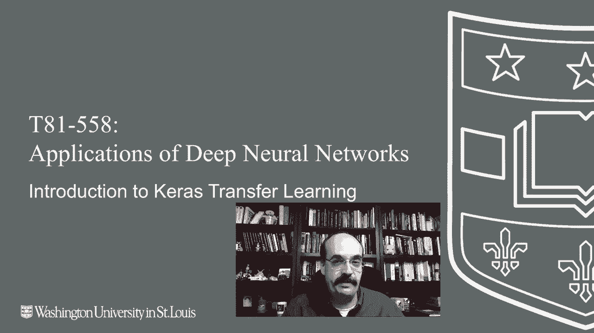

# T81-558 ｜ 深度神经网络应用-P47：L9.1- Keras迁移学习简介 

嗨，我是杰夫·希顿。欢迎来到华盛顿大学的深度神经网络应用课程。你知道吗，训练一个神经网络需要很多工作，而且可能需要大量的计算时间。大部分时间是你的计算机在工作，但仍然可能需要很长时间，尤其是如果你没有一块几千美元的GPU。

这就是迁移学习派上用场的地方。迁移学习让你可以使用那些由大公司或创业公司开发的神经网络，或其他在GPU上花了大量资金的人，利用这些训练来进行你自己的项目。想了解我的AI课程和项目的最新动态，请点击订阅旁边的铃铛，以便获得每个新视频的通知。

迁移学习是深度学习中一个非常重要的概念。这是因为它需要大量的时间、计算资源和金钱来训练先进的神经网络，特别是在计算机视觉和自然语言处理领域。

在表格数据中，你不会看到迁移学习，因为实际上没有很多已经为此类数据训练好的神经网络。这取决于你的表格数据集，表格数据集往往非常不同。相比之下，计算成像和计算机视觉之间往往有很多共同点。

你将看到的一些元素，如边缘、轮子、眼睛、鼻子和嘴巴，在许多计算机视觉任务中都是常见的。因此，你可以将谷歌、微软等大公司在训练这些先进神经网络时所积累的知识迁移到你的神经网络，以作为基础。

所以，如果你打算教一个神经网络识别几种非常特定的图像类型，你可能不想完全从头开始训练这个神经网络。如果你可以迁移一个已经在ImageNet或其他常见计算机视觉数据集上训练好的神经网络权重系统。其工作方式通常是找到一个预训练的神经网络，它会有多层。

这些层到底是什么其实并不重要。你可以确实展示它们，当我们在这里运行示例程序时你会看到，通常你会削减掉顶部部分。所以，ImageNet是一个非常常见的数据集，其他一些数据集通常会针对10个不同的图像类别进行训练。因此，我们可能希望为比这小得多的东西进行训练。

移动那个顶层，仅转移这些层。这些层的所有权重将转移到我们的神经网络中。我们将仅训练为我们的新神经网络添加的新层。所以这里我们添加一个稠密层，它将从这些较低层学习，而只有这两个顶层将实际被训练。

这些底层基本上成为特征工程，特别是用于计算机视觉任务。这些正在学习进入imagenet和其他数据集的所有构建块，这些数据集是神经网络训练的基础。首先，我们将看一个非常简单的迁移学习示例，这将是表格数据。这使你能够查看一个非常简单的例子，我们将使用鸢尾花数据集。

只是为了让我们看到这一切如何结合在一起。通常，你可能不会创建其他人会转移的迁移学习神经网络，除非你真的😊，承诺获取大量数据并建立一个高级训练设置，使用GPU和其他东西，并花费一些严肃的钱。不过，对于这个，我们将创建那个初始的神经网络，然后我们将其转移到其他地方。

我们基本上要尝试对比这三个原始鸢尾花数据集之外的其他花进行分类。我们希望原始鸢尾花数据集的一些学习能够转移到这个新的数据集上。

所以我们要做的第一件事就是加载训练数据并构建我们的神经网络。我们在这里构建的这个神经网络模拟了科技公司或研究人员使用高级计算技术来进行严肃训练的过程。

所以现在我们有一个鸢尾花数据集。我们可能会在此时保存它，以便我们能够转移它。我们快速检查一下准确性，大约为98%。所以这相当准确，并且。打印出摘要。我们经常使用摘要来分析我们转移的神经网络。这里我们可以看到我们基本上有一些稠密层，50，25和3，就像我们在神经网络中设置的那样。

所以5025和3的摘要在观察这些情况和了解发生了什么时非常有用。总参数就是我们在神经网络中的权重数量，在这种情况下可训练参数是相同的，因为所有内容都是可训练的。现在，当我们将这个简单的神经网络转移到其他东西时。

我们会标记一些不可训练的层，我们将看到这一点。所以现在我将向你展示，我们基本上可以重建这个神经网络。我们创建了model2 sequential。我将原始模型中的所有层添加到这里。当我们运行这个时，我们在上面看到一个完全的副本1603，就像我们之前看到的一样。作为 sanity check。

我们将评估模型2。请查看这里，看看准确率是多少。准确率应该与我们转移过来的原始准确率完全一致。因此，我们基本上完成了迁移学习。我们已经转移了一切。通常这不是你想要做的事情。我们会有一个重复的神经网络，可以分类与原始神经网络相同的三种花，但并不太有用。

它变得有用的地方在于，如果我们想添加这些假花。我称它们为假花，因为它们是假设的。这再次显示了，如果你想真正创建自己的神经网络供他人转移时，你会经历的机制。我们现在要做的是创建模型3。我将把前两层移入并去掉输出层。

这些将是新模型的特征工程。你会看到我们的参数更少，因为我们去掉了原本要做最终层的顶层，这取决于你的观点，但我们去掉的是输出层。现在我们要添加一个新的softmax层，带有四个输出神经元，以分类这四种假花。

我们运行它，基本上现在我们有5025，但我们还有一个4附加在上面。现在，我们也可以添加一些额外的密集层，也许可以提供一些额外的处理。但对于这样简单的网络，其实并不是特别必要。现在，当我们添加这些标记的新层时，将其可训练性设置为false。

对于我们转移进来的原始层，这里可训练性设置为false。这对于迁移学习非常重要，因为我们不想训练我们已经拥有的权重。这就是我们进行转移的原因。这是好处。因此，你会看到总参数为1629，但其中只有1525是前两层。

输入和5025是唯一可训练的层。所以这些数字在这里是不同的。我创造了一些人为的值，这些值将用于这四种花。我只给每种花两个训练样本。但这只是展示了你将要经历的机制。

这里是与X输入相对应的这四种花的独热编码。我们将仅通过训练最后的输出层来拟合神经网络，并试图看看它能多好地分类这四种新花型。我们运行它，看到上次运行时的准确率大约为88。我们来看看这是什么。

所以在这种情况下实际上是完美的准确率。这是神经网络的随机性质，你会得到不同的结果。因此，我们已经完成了整个过程。这就是你如何真正创建一个你想要转移的神经网络。接下来的课程中，我们将转移其他人的神经网络，而不是自己去制作那些网络。

所以我们将简单地成为消费者，这通常是情况的常态。感谢你观看这段视频，在下一个视频中，我们将看看如何。😊！

实际上要找到一些这样的开放神经网络，你可以将其应用于自己的学习以进行迁移学习。这个内容经常更新，所以请订阅频道以保持对本课程及其他人工智能主题的最新了解。
