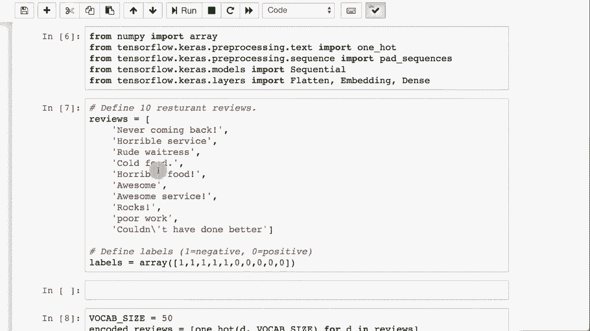

# T81-558 ｜ 深度神经网络应用-P59：L11.3- Keras中的嵌入层 

嗨，我是杰夫·希顿。欢迎来到华盛顿大学的深度神经网络应用课程。那么，Kira的嵌入层是什么？这是你可以在Keras中使用的另一种层类型。但是它们有什么用呢？它们用于自然语言处理，关于我最新的AI课程和项目，请点击旁边的小铃铛订阅，以便收到每个新视频的通知。

Keras提供了一种叫做嵌入层的东西。这些通常在Keras中用于自然语言处理。然而，它们并不一定只与NLP一起使用。实际上，我认为嵌入层几乎是单热编码的替代品，单热编码就是虚拟变量，或者你想称之为的，处理分类值。所以假设你有100种不同的可能性用于该分类值，现在你需要一种方法来对其进行编码。

说到虚拟变量，你将有100个虚拟变量。如果你处理的是极大的基数，这就变得不切实际。😊！

这些分类，特别是如果你处理的是英语单词。想想你如何对英语单词进行虚拟编码。你需要为每个英语单词准备一个虚拟变量。现在，spacey中的一些选项可能对你有用。

你可以将词转化为它们的词干，比如“could”可以被转化为“have”，这样你就可以处理许多动词，例如“bra”，你总是可以有一个“run”。这样你就不必处理“brought”，它总是可以是“bring”或“bringing”。

但这些都是你可以用来降低维度的一些方法。不过，嵌入层实际上可以学习你所需的单词或任何你想传递的词汇或分类。现在，这通常用于序列。我们会将其发送到LSTM或时序卷积神经网络中，但。

这并不一定是必要的。那么让我们看看一个简单的嵌入层。现在，我们将看到当我们像这里那样创建一个嵌入层时的情况。顺便提一下，你可以在我们的图像字幕示例中看到另一个例子，我们使用了嵌入，并直接加载了GloVe嵌入层。

但我们并没有详细讨论嵌入层实际上做了什么。一切都和你在这里看到的一样。所以现在我们要学习如何训练一个嵌入层。在这里，我们定义了这个嵌入层，我们的输入维度计数将是10。

输入维度。基本上是类别的数量或单词的数量。你的词汇量有多大。如果你使用独热编码，你将在这里得到10个虚拟变量。然而，我们将稍微减少这个维度，实际上并不是一个维度减少。

但我们将把这些编码成四个数字的向量，而不是通常的10个数字的虚拟变量。并且它不是零和一。所有这四个元素都将在那个向量中使用。现在，输入链接。这有点有趣。这基本上是你的序列链接。如果你在处理自然语言处理，那么在这种情况下。

我们只会有两个这样的，因为这是一个非常、非常简单的例子。你会注意到这个神经网络。我用这个术语是比较宽泛的，它只有一个嵌入层。因此，这个神经网络实际上将嵌入直接输出到输出层，你会看到它。我说的是原子和均方误差，但这其实并不重要。

我们不会训练这个非常简单的神经网络。我要继续运行这个，它实际上并不做任何事情，只是定义这个模型。现在你应该真正把嵌入层看作一个查找表。所以我们有这10个输入维度。而且你将传入的每一个这10个分类值。

这些将返回输出维度中的一组不同的唯一四个数字。所以这个查找表，你可以把它想象成有10行和四列。这是一个查找表。嵌入层就是一个查找表。我们现在将继续运行这个。我们将给它一些输入数据。输入数据只是这里的一小段序列。

2，1 和 2 都在输入范围内，它将改变这两个输入分类。这两个整数。输入总是整数。所以你在转换字符或单词。这通常用于单词，但也常常用于字符。因此这并不一定是这样。

你转换的内容总是提供整数。因为它们基本上是查找表。这些实际上是权重矩阵中的行，也就是嵌入层。然后我们将请求进行预测，并打印出输入数据的形状以及返回的预测结果。查找表。你可能会期待它全部为零。

因为我们从未定义查找表。我们从未训练这个神经网络。那么这些数字从哪里来，它们实际上是随机初始化的。所以它们就像神经网络所有层的随机权重。在你实际查看嵌入权重之前，这并没有太多意义。

所以如果我们查看嵌入权重，注意有10行和四列。这是10个词汇元素。然后我们要求有四个，这个四是任意的，我们可以设为六、八或十，这并不重要。

这有点像维度减少的概念，尽管不完全是。现在我们要做的，但再次强调我称之为维度减少是因为，代替有10个虚拟变量，你现在有这四个值。

现在让我们看看这些权重实际上意味着什么。所以第一个对应于这一列的权重，整个东西可以是一个列或维度向量，注意0.4763。它与这里的这个向量完全相同。第二个。这是行。假设你从0开始计数，0，1，这是1，2是下一个负2，70，2。

看看这个。这只是一个查找表。这就是嵌入层的全部。因此，我们在本课中使用的手套嵌入，实际上只是一个包含大量英语单词的表，我忘记有多少了。我认为它的向量大小为200，如果我没记错的话。别引用我。

但每个手套嵌入都有一些任意的向量长度。我们只需将该矩阵直接加载到权重中。我们称其为设置权重。这就是我们所做的。然后我们定义了这个嵌入层。现在，当你训练这个神经网络时，你想要将这些嵌入权重标记为非可训练的，*否则*。

它们将开始从原本的设置值中被拉离。如果你在进行迁移学习，你可能不希望这些权重被修改。我们稍后将看到更多关于如何训练这些权重的信息。现在，我将其与虚拟变量进行比较。通常，你想证明某物等同于其他事物时，可以看看能否在其他事物中模拟该东西。

所以我们将使用嵌入层基本上为我们提供虚拟变量。我在这里做的是创建一个输入维度3。这将是一个具有三个可能值的分类变量。虚拟变量看起来是这样的。基本上是你看到的虚拟变量的对角线，因为虚拟变量，简要回顾一下，本质上一个值是1或热编码。

这就是为什么它被称为“一热编码”。其他值都是0。这是你可以编码分类值的一种简单方法。输出维度也将是3，因为我们编码的内容有三列。如果你在做虚拟变量，这些值将始终保持不变。

这就是虚拟变量如此低效的原因，因为假设你的输入维度是 100。你有 100 个类别。你仍然可以将其压缩得非常小。你不想太小，但可以将其设置为 4 或 8 并进行训练。我们将很快看看如何做到这一点。然后输入长度就是你的序列长度。所以这就是你希望一次编码多少个。

然后我们将使用 atom 和 MSC 重新编译它，我们将不会训练这个神经网络。因此，这两个真的无关紧要。但我们会在嵌入层设置权重。现在，我们确实需要将这里的查找转换为列表，因为你可能不会真正深入研究这一点，但如果它朝多个方向发展，你可以有多个查找矩阵。

但那将是一个更高级的设置。如果你感兴趣，可以参考 Kira 的文档。没错，那是一个列表。让我们继续运行它。但现在，始终嵌入你的矩阵列表，你就可以顺利进行。接下来，我们实际上创建了一个作为嵌入层的虚拟模拟器。

我将继续在这里简要介绍一下，我们将对这两个类别进行编码，并查看它的运行情况。这里是虚拟变量。这样你可以将其中一个放在神经网络的前面，甚至不需要编码虚拟变量。

有更好的方法来处理这个，但这是你可以做到的一种方式。如果你想使你的神经网络真正能够输入这些值，并自动将其转换为虚拟变量。这很酷。你会经常做这样的事情，这就是你想要使用迁移学习来引入你的虚拟变量的时候。然而，真正的乐趣在于，也许这并不是最真实的乐趣。😊你可以自己训练这些。

这是处理神经网络需要输入高维类别的好方法，而这些类别没有简单的方法可以转换为虚拟变量。假设你有一个 20000 维的类别，你可以将其定义为嵌入，选择一些任意的维度数，比如 2040。这是一个超参数，你需要进行调整，实际上是 atom 更新规则或反向传播。

所有的变量。它将执行梯度下降，并为你训练嵌入。让我们看看如何做到这一点。这使用了一些自然语言处理的函数。这实际上展示了现在你可以多么轻松地构建这些 NLP 神经网络。所以这里有 10 条餐厅评论。前几条都是负面的。再也不来了。糟糕的服务。

无礼的女服务员，食物糟糕，这些其他人。Re喜欢它。很棒，超棒的服务。太棒了。糟糕的工作，做得不错。所以这些只是你可以选择的不同值。注意我放入了随机的感叹号。还有一个稍微随机的例子，更多是应用于评估承包商。

但噪声是好的。1表示负，0表示正。所以这些是标签。这是y。我们将在其上训练一个神经网络。因此我们将说我们的词汇大小为50。我们可以任意选择这个数字。我们不必真正计算其中的单词数量。

我们将使用汽车的一热编码。汽车的一热编码很酷。😊。这让我有点害怕，但对于示例来说很好。它基本上是在为你进行标记。因此，将这些词分解，将这些句子分解为单词。

然后将每个分配给一个索引。所以它在后台做了很多事情。通常，我喜欢对这些有更多的控制，我想知道它是如何被标记的，并且我想知道它是如何将这些索引分配给它的。但这对于示例来说是好的。当我们展示如何将这些连接到其他人在生产环境中使用的API时，我们会看到我们非常关心锁定这些索引值。

如果我在现实世界或企业环境中部署这个，我不希望某次变得索引为5，进行重训练，而现在为4。并且潜在的数据现在编码错误。所以你必须对所有这些小心。然后我将继续运行这部分。

我们将继续运行并编码这些。这些是你所有的序列。我们希望这些序列的长度一致，因为这就是序列的工作方式。我们将使用最大长度4。看看吧。它们都很好，并且进行了零填充。谢谢你。Kiras，我们将创建一个非常简单的顺序神经网络。

我们将在最后有一个稠密层。因此这里面有学习。这里有一个权重矩阵。但我们也在嵌入层中进行学习。神经网络实际上将学习如何创建这些嵌入，以便将这些词以有意义的方式分离并映射到欧几里得空间。这可以让你避免处理大量的虚拟变量，并创建一个非常复杂的神经网络。

嵌入对于NLP来说很棒。继续运行，我们将打印一个摘要。你看到了吗？继续拟合它。我只是运行它。😊，100个周期，非常非常快地训练。让我们看一下本质上的嵌入。每一行都是一个不同单词的嵌入。我甚至不会尝试解释其中的原因。

这里基本上就像是权重，这些权重的计算方式与实际层的权重是相同的。这里有一层也在学习。但是嵌入权重与神经网络中的其他权重一起学习。然后我们可以在最后评估这个神经网络。准确性实际上是完美的。

准确性完美的原因是我在这里没有放置任何重叠。负面评论中的所有单词都不在正面评论中。这只是一个玩具示例。感谢观看这个视频，在下一个视频中我们将研究端到端的自然语言处理。这个内容经常变化。所以请订阅频道以便及时了解该课程及其他人工智能主题。

