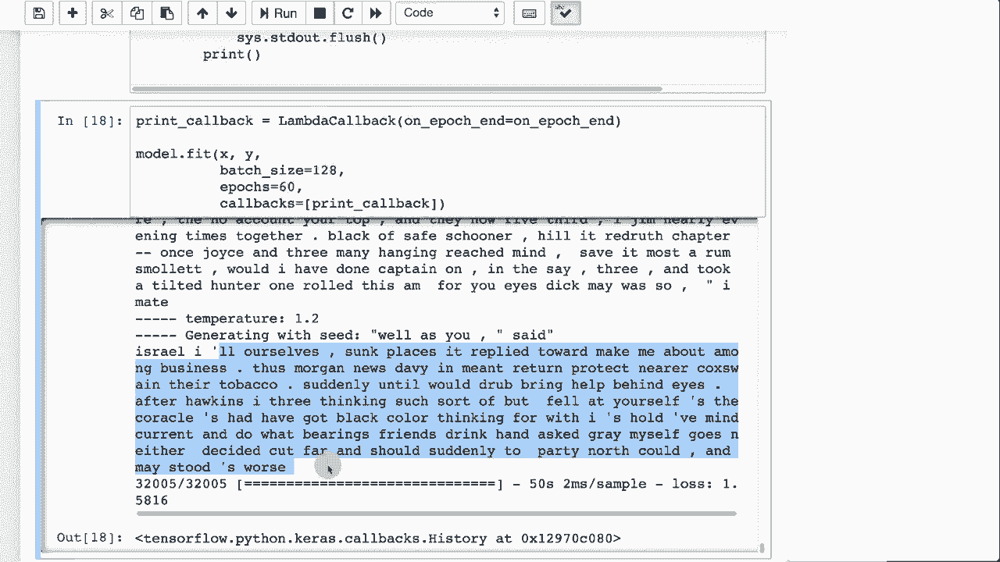

# T81-558 ｜ 深度神经网络应用-P60：L11.4- 使用Spacy和Keras进行自然语言处理 

嗨，我是杰夫。欢迎来到深度神经网络的应用。在这个视频中，我们将看看自然语言处理，特别是，我们将结合使用Spacey、Keras和word2vec，了解我的AI课程和项目的最新动态。点击订阅，并点击旁边的铃铛，以接收每个新视频的通知。之前我们进行了文本生成，查看了《金银岛》。

我们让神经网络生成自己的海盗故事。我们将继续这个项目，但这次我们将使用单词级文本生成。之前我们使用的是字符级文本生成。关于这两者，存在很多争论。我的倾向是生成字符级，并与神经网络真正实现端到端。

让它自己理清语法和句子结构，而不是在名词和动词等方面进行大量特征工程，但你当然可以进行单词级别的处理。如果你选择单词级别，那么提供额外的特征可能是有用的。😊

不论是名词、动词或其他东西，这个问题不算复杂。我们不会在这个例子中做得太复杂，但我会展示如何逐字生成文本，这是我们在生成字幕时所用的。尽管你确实可以在字符级别进行字幕生成。

在这里，我导入了需要的包和库，分别用于spacy和Keras。我获取了《金银岛》的文本，就像之前那样。现在我开始处理spacy，所以我将使用spacy进行分词，将《金银岛》的文本拆分为单个单词。当我们进行字符级编码时，不需要进行这种分词，因为分词由神经网络处理。

它学习了什么是空格，并学会了如何将单词拆分开。由于我们按单词进行处理，我们需要进行实际的分词，而spacy正是为我们完成这个任务。因此，我们实际上是遍历所有的token，即它找到的所有单词。这只是代码，这第一行是相当有用的一行。

这将字符减少到ASCII码0到127的字符。因此，这确保你仅处理这些单词中的ASCII字符。这会去掉很多额外的垃圾字符，比如这个奇怪的版权符号和奇怪的字母A，然后我们还会去掉任何空白字符，因为一旦你去掉一些字符，可能会出现嵌入在其中的空白。

我们确保标记不是数字，也不是网址、电子邮件或其他类似的东西。现在你可能想处理这些，但对于这个简单的例子，我们只是将它们剔除。现在在字符逐个处理时，我们只是让它们通过，有趣的是，神经网络会学习生成网址、电子邮件地址等。当我们这样做时，单词的总数是6421。

我们打印出一些这些内容。现在其中一些是数字，那是罗马数字。但我们会继续让它通过，这不会造成任何伤害。我们在这里创建两个查找表，一个是单词到索引。因此，这会将单词像“孤独”转换为一个索引。现在如果你想使这些更加一致，你可能想对这些进行排序，因为那样索引将始终保持相同。

所以在生产环境中，你需要考虑确保这些索引真的保持不变。否则，如果你训练你的神经网络并改变这些索引，它是不会工作的。然后我们对文本进行标记化，基本上是将原始《金银岛》文本中的每个单词替换为索引号。因此现在它更适合被输入到像嵌入层或其他文本翻译输入中。

现在我们将做的这项工作与我们在字符中所做的类似，只不过我们创建的是单词序列，而不是字符序列。因此，这实际上是相同的代码，我们处理最多六个单词的单词序列。“步进”意味着我们每次向前移动三个单词，否则我们在这里会有很多冗余，因为如果句子是“这是一个测试”。

第一个序列将是“这是”，下一个序列你将向前移动三个单词，因此你不会立即开始于第二个单词。你将这个数字做得越小，你就会有越多的重复，然后我们看看这些序列是什么样的。

至少前五个。这些是我们正在训练的序列，我们在训练神经网络。如果你有这个单词、这个单词、这个单词、这个单词、这个单词和这个单词，那么下一个单词是什么？然后我们将其向量化，这本质上只是将其转换为笨重的数组，以便我们实际能够用它来训练神经网络。

这与我们进行的字符级编码完全相同，但实际上就是逐个构建这些。同时也构建Y，以便我们有虚拟变量从Y端输出，以便我们可以进行预测。我们使用虚拟变量。这就是X的形状。这使得我们如何编码这一点非常明显。

所以X形状基本上是我们生成的32005个序列，最大序列大小是6。然后我们有这么多值，因为我们有虚拟变量进入。基本上，我们为这六个每个都有一个虚拟变量。所以这实际上是我们预生成的很多数据。这是使用嵌入层可以使其更高效的地方，但它适合内存。

所以我对此基本满意。y是相似的。我们这里没有六个，因为我们不预测序列。我们只是预测下一个字符。因此，我们有相同数量的行，但现在我们有这些虚拟变量，告诉我们6400个单词中实际会是哪个。你可以看到这些虚拟变量的样子，基本上我们在创建非常小的、简单的LSTM。

有128个神经元。它的层。我们将再次使用Rs prop进行优化，保持与我从字符编码中提取的示例类似。现在这不是Kira的正式示例，我只是修改了Kira的前一个示例以进行LSTM生成，我只是修改它以实际处理单词而不是字符。我们打印一个摘要，它大约有400万个权重，我们正在训练，这是样本函数，这与基于字符的完全相同。我们基本上在做一个softm函数，温度决定了它在句子方面的保守程度，愿意冒险的程度，因此数字越高，创造力越强，但数字越低则更容易出错。这基本上是一个softm，确保在试图预测下一个单词时，所有66400个词汇的概率。

这些概率的总和为1，因为它们是概率，因为我们将基本上取最高的那个。这就是我们将预测的下一个单词。这与之前的例子非常相似。我们在每个迭代结束时调用它，基本上在每次训练过程中生成一些文本。我们可以看到它生成的文本越来越好。

我们将为每个生成100个单词。我们将构建输入序列。因此，我们将随机抽样六个，或者无论那个输入向量为多少。我记得是六个单词。是的，确实是6。所以我们正在抽样六个单词的组，开始训练。现在我们将向下滚动，这很多。

这已经训练了一段时间。这就是为什么我没有为视频运行这些。它会花费相当长的时间。所以温度，这是一个相当保守的温度，而这也是训练。你可以看到它正在创造的海盗故事。我自己沉没了几段，它回复让我在商业中感到不安。因此摩根新闻。

Davy 在薄荷中回归。我没有看到任何语法错误，这真的很酷。还有一件我觉得很迷人的事是我的分词器。我可能没有花足够的时间在分词器上，但它将 I 和 ill 视为词汇中的两个不同词。这就是这里有空格的原因，因为我们添加了空格。

它不知道什么是空格，但它发现通常在 I 后面会是 ill，或者会是 S。它并不是像把这个撇号 S 附加在 fell 上那样，而是真正理解句子结构。这真的非常酷，自然语言处理在这一点上取得了巨大的进步。

深度学习技术的应用使得文本生成在单词层面上非常有效。我认为即使不做太多优化，也能产生非常真实的单词和句子结构，尤其是关于海盗故事的可信文本。感谢观看这个视频，期待下一个视频。

我们将深入探讨自然语言处理与光标，并查看嵌入层。😊。

这个内容经常变化，所以请订阅频道，以便及时了解该课程和其他人工智能主题的更新。
