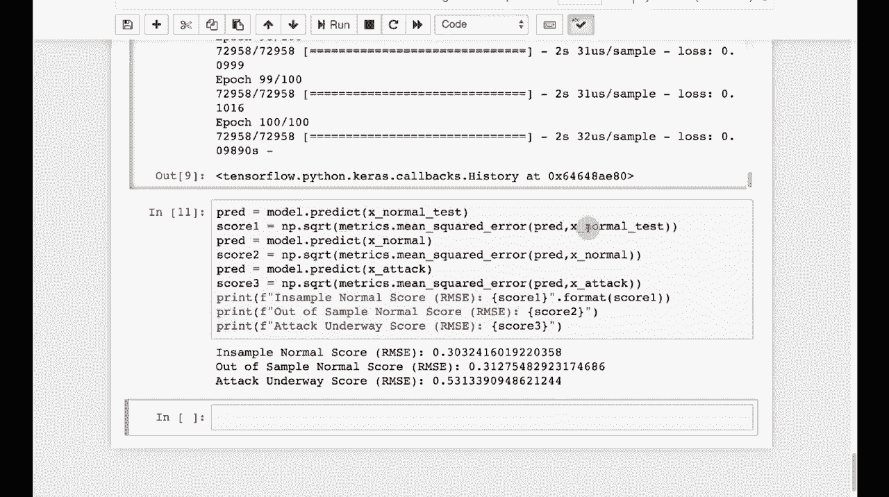

# T81-558 ｜ 深度神经网络应用-P74：L14.3- 使用自动编码器在Keras中进行异常检测 

嗨，我是杰夫·希顿。欢迎来到华盛顿大学的深度神经网络应用。在这个视频中，我们将讨论异常检测。你如何检测不符合预期的情况。这在计算机安全方面有很大的应用，但在其他领域也一样。

我们将在这个视频中查看它，获取我AI课程和项目的最新动态。点击订阅并点击旁边的铃铛，以便接收每个新视频的通知。所以现在让我们看看自动编码器的用法。我们将看到如何将自动编码器应用于异常检测。我有几个关于在Keras中进行异常检测的其他教程的链接。

其中一些可能对你有用。我在这里使用的方法是使用自动编码器，并查看自动编码器的误差，以确定数据与我们之前看到的数据相比是否异常。我们将利用一个叫做KDd99数据集的东西。

我们将在本课程的两个部分中使用它。我们将在下一部分创建一个入侵检测系统。这是2019年的一个旧数据集。😊。

这已经快20年了。所以这是一个较旧的安全数据。它有足够的列和其他内容，使其有用。我不知道我是否会基于当前的研究，意味着试图创建基于20年旧数据的当前入侵检测或异常检测系统。

但这对于安全来说是一个不错的“你好，世界”，而且它并不简单。这是相当可观的。绝对不是所谓的大数据，但它很有用。所以我们在这里会看到它。这对示例来说很好。我不会把它用于当前研究。话虽如此，我看到有论文频繁使用它，但质量各异。

我没有把它包含在Github仓库中，因为它相对较大。不过这个命令可以让你下载它，我会先运行这个。它让你知道下载到哪里，担心coab。你可能需要把它放在你的某个驱动器上。我会尽量在这里提供具体的coabab指令。所以现在我们得到了数据。

我展示了前五行。你可以看到这是什么样的。这是网络类型数据。这是在一个模拟环境中为一个比赛创建的K种早期标签，并没有显示所有数据。其实还有相当多。但我将要做的是将这些数据按结果分组。所以这些结果包括缓冲区溢出、FTP、正确猜测密码。

这些都是在这个过程中模拟的不同类型的攻击。其中一些在今天仍然是攻击类型。有些在20年后可能已经相当罕见。我们特别关注的正常数据意味着没有任何事情发生。因此，我们将训练它，将正常数据视为正常，将其他数据视为异常。

所以我们将训练一个神经网络来检测那些不像正常的数据。我们将完全通过自编码器来实现这一点。我创建了两个函数来帮助我们预处理，一个用于编码z分数，一个用于编码虚拟变量。这是我的预处理表单。你可以看到这里有很多列。

我基本上在编码z分数和虚拟变量。这是我仅进行的两种转换类型，所以我保持事情相对简单。我们去掉任何包含NaN的行。包含NaN的行并不多。你可以看到这些行。你可以清楚地看到z分数的影响。

我们要做的是创建一个包含正常和攻击的掩码。这样我们能够将这些数据隔离开来。我们将去掉结果，因为我们并不是真的在结果上训练。这本质上是无监督学习，一旦你将数据分成这两个组。这样的自编码器的性质。我们将继续运行它，你可以看到。

正常计数大约是97K，攻击在这个数据集中更为常见。我们将其分开，以便我们拥有攻击的x和正常的x，然后我们将把这分成训练测试集，我们将使用正常数据来评估它。

我们要看看正常数据在它看来是否像正常数据，接下来我们将使用自编码器来完成这一点，我们之前讨论过自编码器。但为了让这些视频能够相对独立，我给你快速概述一下。自编码器本质上是一个具有“瘦”隐藏层结构的神经网络。它的想法是你有多个输入，对于这个特定的自编码器，你将拥有所有KDD99的输入，像大多数网络一样，你有偏置神经元，输出数量等于输入数量。

我们要做的基本上是训练自编码器，使其能够生成相同的输入作为输出。现在这似乎没什么用，但这本质上是在教它进行特征减少和简化，因此它教会它将所有这些输入，这五个输入是100，因为我们将可能使用KDD99，将其表示为输出到隐藏层1和隐藏层2的两个数字。现在，所有进入这里的权重都是编码权重，这些是解码权重，因此这些是它所学习的。

在这里，我们将构建我们的自编码器。我们的自编码器将比这里更复杂。因此，我们将基本上有25，25，3。我们仍然有这个非常细的区域，但有点像沙漏的形状。所以这里几乎有三个隐藏层，实际上为我们提供压缩能力。

所以我将继续运行这个程序。它实际上会适应这个神经网络。所以它需要一点时间来适应。我会快进这部分。好的，它训练完了，主要是为了阐述这里发生的理论。我们只在正常数据上进行训练，并且是无监督训练。

所以我们甚至不提供结果。给出结果是没有意义的，因为它们都是正常的。因此，结果会是一样的。由于它正在学习压缩以减少维度。维度减少或压缩的工作方式就是通过使用模式来表示数据的常见部分。

所以它在简化，只有在输入数据与之非常相似的情况下才能工作。现在，我将给你一个意外的异常检测器的完美例子。现在，手机在这方面做得好多了，但早期的手机。它们压缩的方式是因为它们对人声的特性了解很多，因此使用了人声通常在的音域。

它们只是压缩了数据，并以一种不会让人类声音感到烦恼的方式降低了质量，你仍然可以识别声音，仍然能够理解。然而，如果你尝试通过手机播放音乐或其他压缩算法根本不适合的音调，那就不行了。

它们的重现效果不会很好。会有静电和其他失真。因为使用这些与压缩算法构建时不同的音调就是不同的。它们是异常。而手机则检测到了这种异常。并不是特别设计的。这只是一个例子，但它通过失真来检测异常。

这就是我们将在这里看到的内容。我们将数据输入，并查看输出数据与输入数据的相似程度。因为自编码器是为了直接传递而设计，但在过程中会进行压缩。所以它先压缩再扩展。我们希望确保在这个过程中没有太多的失真。如果有，那么输入的数据可能就是不同的。

这是最初训练数据的基础。我们在课程早些时候看到，你可以使用混沌统计和其他方法来确定数据是否发生了变化，以至于你的神经网络可能需要重新训练。这是另一种很好的方法。异常检测和识别。如果你的数据与训练数据足够相似，就能知道何时更新你的神经网络。

让我们继续运行它并进行测试。因此，现在运行这个单元，我们将看到结果。首先，我会让它在正常测试上进行预测，然后我会评分，基本上是查看这些预测与它训练过的正常测试的吻合程度。

所以我们字面上看到了这一点。如果你看看这里，样本中的两个现在的正常攻击。这本质上是它所训练的数据。因此，你必须对这些保持警惕。这些是正常的数据，不在训练集中。

但是你可以看到这两个的RMSse大约是0.3。注意到攻击的RMSE较高，因为它们是异常，这些都相对简单。我们在X正常测试上进行预测，然后根据相同的内容评估误差。所以我们在看这能否通过自动编码器以最小失真流动。

你看到的失真越多，越可能是异常。该内容经常变化，所以请订阅频道以保持对该课程和其他人工智能主题的最新了解。
