# T81-558 ｜ 深度神经网络应用-P8：[讲座] 使用 CONDA 安装 TensorFlow／Keras CPU／GPU版本 

嗨，我是杰夫·希顿。欢迎来到华盛顿大学的深度神经网络应用课程。为了在这门课中开始，你需要能够运行示例，完成作业并使其正常运行。它是在Python中工作。因此，你将使用Tensorflow与Keras在Python中。你可以将这些全部安装到自己的计算机上。

在这个视频中，我讲解如何做到这一点，查看我关于卷积神经网络和其他AI主题的所有视频。点击订阅按钮和旁边的铃铛，并选择所有，以接收每个新视频的通知。如果你不想在计算机上安装很多软件，也许你对命令行的处理不太熟悉。那么我推荐Google CoLab。

不管怎样，你都将能访问一个GPU，即图形处理单元。现在，你的实际计算机上可能没有兼容的GPU，需要是Nvidia。😊。

并且它需要是较新的版本。你可以在网上搜索你实际机器中GPU的能力并找出。GPU基本上是一个显卡。我在这台电脑上使用的是Titan，属于相当高端的产品。但我建议你在自己的电脑上尝试一下，试试CoLab，看看哪个最适合你。在这个视频中，我们将看到如何在计算机上安装Python与TensorFlow和Keras。

我将介绍如何在GPU和纯CPU上进行操作，得益于Anaconda Python的一些进展。这两个过程实际上非常相似。好吧，让我们开始安装过程。现在，我要向你展示如何安装所需的文件，以便实际使用TensorFlow，无论是CPU还是GPU，我都会覆盖这两个方面。

这将允许你运行我的深度神经网络应用课程的示例。即使你没有跟随我的课程，这也会为你设置一个Conda环境，使你能够在使用TensorFlow和Keras时处于良好状态。

现在我开始的是全新安装的Windows。所以这就是为什么它显示激活Windows。我确实为Windows付费。只是在我安装它用于短期用途时，通常不会激活。我不想混淆微软激活服务器。

这可能会很好地解决问题。所以这是一个干净的构建，我已经安装了Chrome。我对Chrome比较熟悉，对Edge不太熟悉。因此，我想避免在不熟悉的软件上绊倒。这实际上对安装没有太大影响。我们要做的是如果你搜索杰夫·希顿和Github。

你可以在这里查看我的Github，所需的文件和说明都在这里。如果你去查看深度学习的T 8到1应用。这就是，继续访问主页，点击代码并下载一个zip文件。你也可以使用。

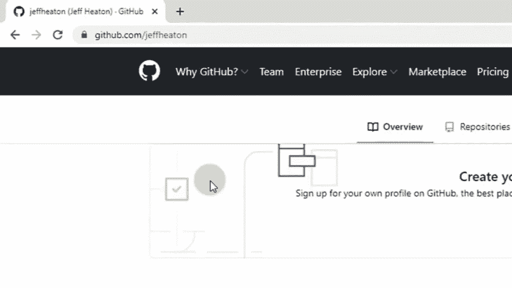

克隆，取决于你对git的熟悉程度。但这会很好用。所以在下载这个zip文件时，我将进入我在这里设置的安装文件夹。我这里有几个，如果这里有更新的版本。

可能要尝试找到相关的YouTube视频，因为这确实会发生变化。这是2020年7月的版本，我会尽量保持这个版本的存在。只有在它的变化如此之大，以至于这个视频不再相关时，我才会重新录制视频或创建新文件。

但我倾向于每年至少重新录制一次。Google总是会对这个过程进行某种更改，导致我需要重新录制。所以我们继续打开这个。基本上我告诉你的是安装minconda。如果你更喜欢，可以使用Anaconda，Anaconda包含所有已知的包和组件。安装时，我倾向于更简约，但这是个人选择。

你可以安装你想要的任何一个。但让我去Mincona的链接。我在另一个浏览器中打开，以便可以回到这里。我们将安装Python 3.74 Windows。Mac安装实际上与这个视频基本相同。稍后我可能会录制一个特定于Mac的视频。好吧。

我们将使用Python 3，7和64位。如果你恰好有32位机器，Tensorflow是无法工作的。使用Google colab。此外，如果你不太擅长软件安装，更多的是一个编码者，而不是命令行黑客，Google colab非常棒，我强烈推荐。

所以让我来下载这个。应该很快，但我会快进过去。好吧。一旦你下载好了，就去运行它。我只是双击了它。点击下一步。同意。我更倾向于只为自己安装。我一般不使用多用户计算机。但那个目录是可以的，位于我的用户目录下。始终记得它在哪里。

因为你可能会去那里调整一些设置。我在这方面会有些不同于默认设置。我更喜欢将其添加到我的路径环境中。你也可以使用Anaconda提示符。两者都应该在没有更改这些说明的情况下工作。唯一可能让你困惑的情况是，如果你的计算机上有其他依赖于之前安装的Python版本的软件，更改全局路径将强制它们使用你正在安装的新版本。

所以要注意这一点。我将点击安装。Anaconda的安装将比Miniconda的安装花费更长时间。所以这个应该很快就能完成。好的，我们差不多到了。点击下一步。我不需要教程，也不需要了解更多关于Anaconda的内容。好的，现在安装完成了。在我们继续之前，那个你下载的文件。

我这里有几个文件，是我在这个构建中实验时产生的不同内容。但你可以忽略它们。这个文件夹是你从我的Git仓库下载的。我现在就把它拖到桌面上，需要解压缩。然后我将进入我的用户目录。

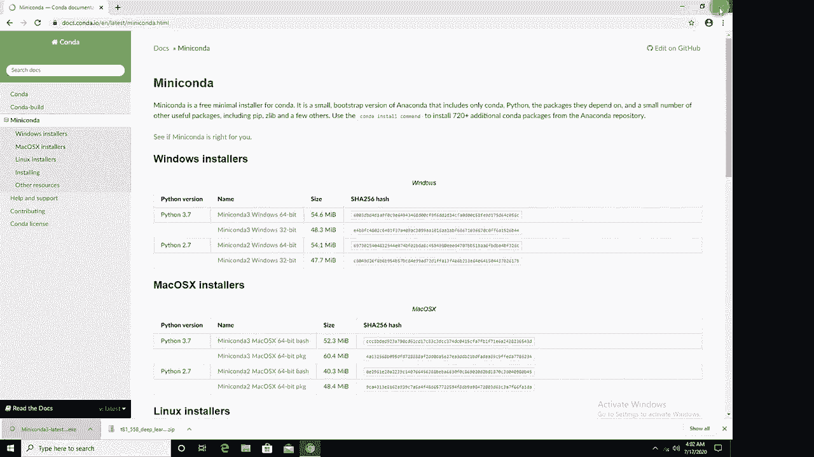

然后把它复制到这里。所以现在我已经准备好了。这些是所有的课堂示例，给你一些文件进行测试和其他内容。实际上你只需要两个文件。如果你不想下载整个文件，也可以单独下载它们。所以你已经成功地在Conda中安装了它们。

现在你需要打开一个命令提示符CD。这在PowerShell中也可能有效，我对PowerShell不太熟悉。我将执行Conda install -y jupyter。我们将快速前进。这可能会花一点时间。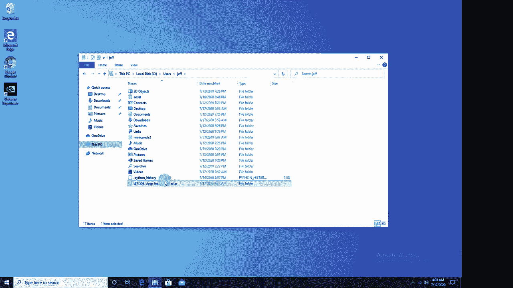

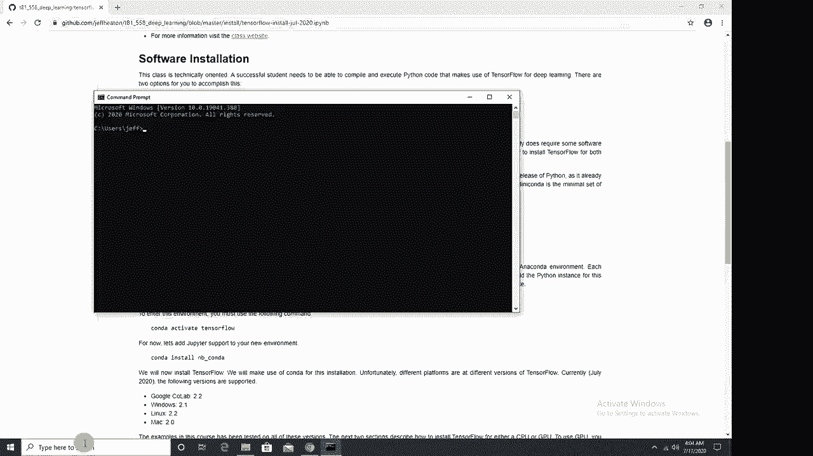

好的，Jupyter安装完成了。现在我们要做的是创建一个Conda环境。一个环境保存了所有Python库和你特定项目所需的一切。你从一个基本环境开始。我通常只是用它来运行Jupyter，并且使用底层环境来满足我在各种项目中所需的自定义配置。另一个很棒的地方是，你可以自动安装所需的GPU驱动程序。

这极大地简化了安装，并防止了冲突。你可能有一个旧环境在使用旧的驱动程序，一个新环境在使用更新的驱动程序，这确实节省了你安装的时间。所以我现在就创建一个新的Conda环境。

我将把这个复制并粘贴到这里。现在重要的事情是Tensorflow。😊。这是环境的名称。你可以随意命名。只要确保在后续命令中更改它，以便一切对齐。然后这是我们使用的Python版本3.7。

我在设置2020年秋季学期时使用的Tensorflow版本要求至少使用Python 3.7。我将在将来修改这些说明时更新此信息。但现在是Python 3.7。所以我正在安装它。说“是”，我们将快速前进。这非常快。好的，安装完成了。现在我们要做Conda。

激活我这里的命令是他们建议的命令。所以 conda activate Tensorflow。按下回车，注意你的提示符变化。你现在在 Tensorflow 环境中。现在我这里有很多命令需要你在这个你创建的 Tensorflow 环境中执行，不管你给它起了什么名字，如果不在这个环境中是无法工作的。

所以请确保如果你在几个步骤中完成这个，始终返回激活 Tensorflow。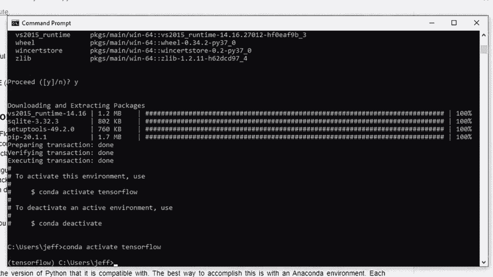

一个非常常见的错误是人们总是问我的 DLL 错误。如果你遇到这个，通常是因为你不在环境中。所以现在让我们运行这个 Conda install N Bconda。这只是给你一些必要的工具，以便将这个新环境链接到 Jupyter notebooks。Jupyter notebooks 基本上是我们在本课程中使用的编辑器。

我会快进到这里，然后就完成了。现在我们准备安装 Tensorflow。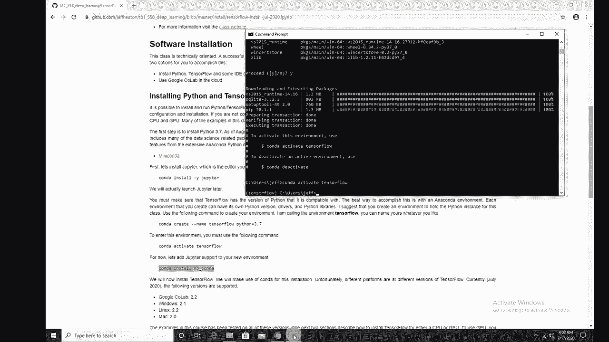

现在在录制这个视频时，我们正好处于 Tensorflow 2.0 到 2.2 版本之间。我们在本课程中处理的平台是 Google Coab 2.2，Windows 2.1，Linux 2.2 和 Mac 2.0。一般来说，我发现 Mac 在 Conda 发布的 Tensorflow 版本中落后最多。而 Linux 和 Google Coab 基本上是更当前的版本，现在几乎齐头并进。

如果你使用的是 Windows 10，实际上可以在 Windows 环境中安装 Linux 子系统，并安装相应的 couta 驱动程序。我会单独制作一个关于这个的教程。如果你是相对高级的安装用户。

不害怕命令提示符的用户，你可能会想这样做。我认为这在 Windows 中是最好的环境，但我很快会制作一个关于这个的视频，并在描述中链接它。但是我们正在做 Windows。所以在写这段话时，Windows 支持 Tensorflow 的版本是 2.1。现在你可以选择仅使用 CPU，或者使用 GPU 和 CPU，如果它能神奇地工作的话，GPU 是很棒的，如果它不能神奇地工作。

你可能需要安装驱动程序以及其他所有东西，安装 couda 和 co DN，确保这些各种东西都能正常工作，交叉你的手指，希望这能在你使用 GPU 时正常工作。如果不行，我有另一个更实用的视频，展示如何实际安装所有驱动程序。

这可能是一个选项，但老实说，安装所有的 GPU 驱动程序可能会让人感到头疼。而且还有其他使用 GPU 的选项，比如 Docker 镜像。我可能会在未来制作关于这些的教程。我在这台机器上有一个 GPU，我有一个 Titan RtX。所以我将继续使用这个命令，但如果只是为 CPU 安装这个。

使用这个命令。如果你想更高端，可以设置两个环境。这就是我在工作机器上所做的，一个用于CPU，一个用于GPU。然后你可以在它们之间切换。所以我就将其粘贴在这里。顺便说一下，快速粘贴的方法是右键点击。确保你在TensorFlow环境中并运行它。

如果事情出错，这里是一个潜在的好地方。所以如果你在这里遇到错误，可以复制、粘贴并在谷歌上搜索。你可能会在Stack Overflow上找到一些解决方案，希望这能指导你。你也可以在这里留言，也许有人会给出建议。

我将继续运行。😊。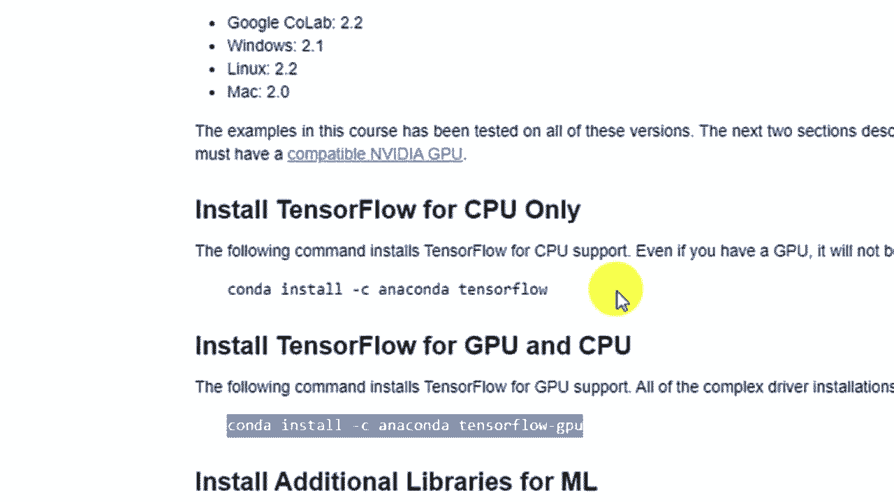

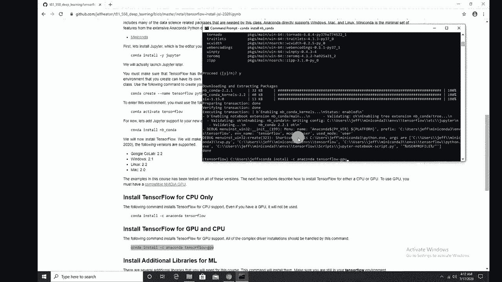

我可能没有见过所有可能出错的情况，所以我可能能帮你，也可能不能。但如果是我见过的事情，我会在评论中回复你，同时看看有没有其他人遇到同样的问题，并得到可能是我的回复。我们快进这一部分。这需要一点时间。

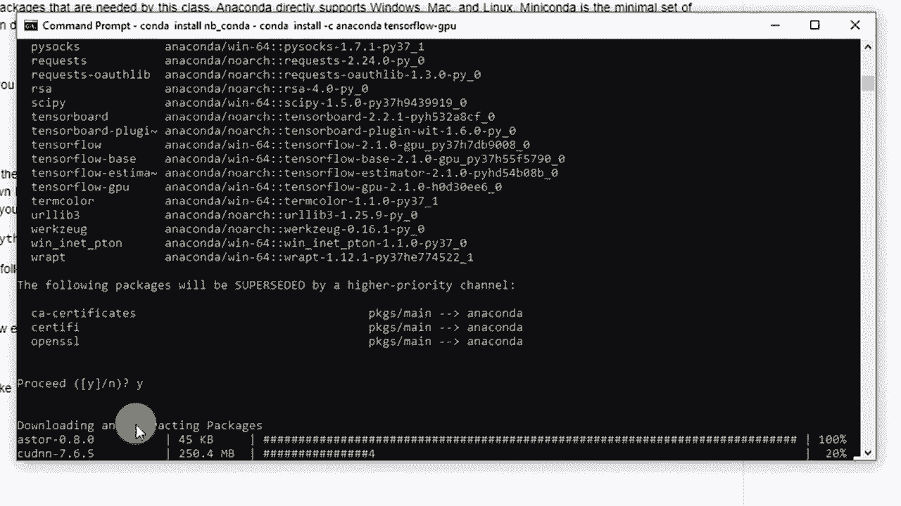

好的，没有错误。这很好。接下来我们要做的是安装一些我的课程所需的附加库，这些库都很常见。我建议把这个作为起点。它们位于这个工具的YAML文件中，文件在我们之前下载的压缩包里。

或者你可以直接下载那个文件，如果你不想下载所有内容。你可以看到它在那里。我将基本上复制这个命令。所以，然后将其粘贴到这里。再一次，确保你仍在你的TensorFlow目录中。如果你关闭了命令提示符并重新打开，可能就不在那了。

所以我们来运行这个。这需要一点时间来安装。这是在安装像`scikit-learn`等我们课堂需要的东西。我会快进这一部分。好的，我们完成了。你不需要重新激活它。只需忽略它发送的内容，只要你仍在TensorFlow或你命名的环境中就可以。

你没问题。现在，这里有一个非常重要的命令。如果你不这样做，你将在Jupyter中看不到你的新环境，也无法使用它。所以我们将运行这个命令。如果你运行这个命令时遇到错误，比如找不到`ipy`和`kernel`。

这意味着你可能忘记运行这个`conda install`命令。我时常会收到这个问题。所以你要知道这一点。将其粘贴到这里。这发生得很快，所以完成了。嗯。现在，我们要运行Jupyter Notebook。在Windows上，重要的是要在你计划使用的环境中启动Jupyter Notebook。

在Jupyter Notebook中选择这些环境有点愚蠢，但你必须先在那个环境中启动。因此，这在Windows上几乎是多余的。不过，这就是Windows的工作方式。关于此问题有一个GitHub问题正在开放中，也许他们会在某个时候修复它。

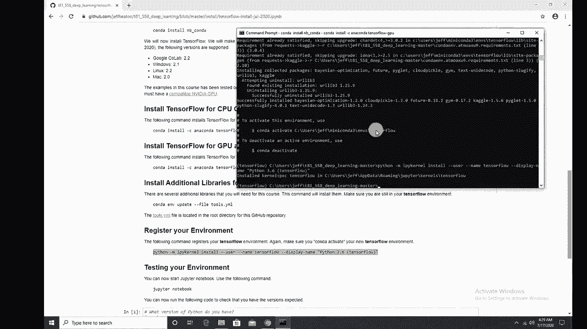

然后我要运行Jupyter Notebook。顺便说一句，如果你尝试从Tensorflow外部运行这个，不要进行Conda激活Tensorflow，你会遇到DLL错误。我将演示这一点，因为这是一个人们常见的错误。所以我将运行Jupyter Notebook，它将启动一个网页浏览器。

我将继续打开Class1概述。现在，如果你需要选择，我在这里称之为Tensorflowlow，如果你叫了别的名字，你需要更改内核并选择你有的那个，正是这个。我们将继续进行。

看起来我的指令将其命名为3.6，尽管我们正在使用3.7。所以我会更新这个，那只是一个标签，没关系。但我将进行内核重启并运行所有内容，它将运行这一部分，这很关键，它告诉你你正在运行的所有版本。因此Python 377。是的，我需要在这里更新我的标签，这很简单。

这里的关键是截至本视频，Tensorflow版本2.1是你在Windows上能获得的最新版本，除非你从头开始安装所有内容，这样做并不糟糕，但可行。注意GPU是可用的。所以我已经成功为GPU安装了这个，如果你是为CPU安装的。

它会显示GPU不可用。这就是你如何让它为GPU或不为CPU正常运行。现在让我给你展示一个非常。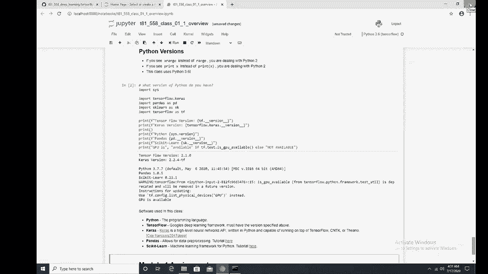

常见错误。希望你没有遇到这个错误，但我想给你展示一些最常见的问题。现在，如果没有任何问题，你就完成了，请订阅并希望这对你有帮助。现在，如果你遇到其他错误，这里是最常见的一个。我将进行Conda。

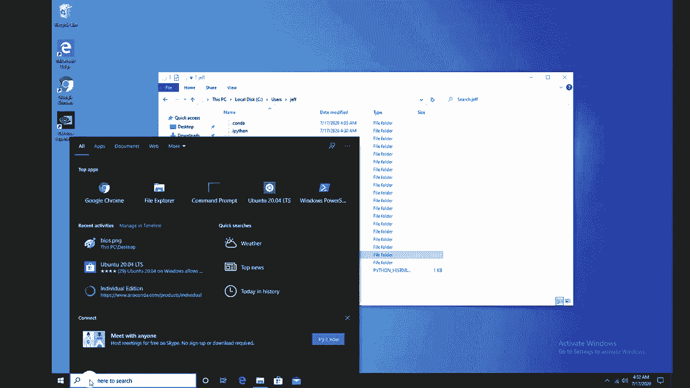

完全就像你刚开始一样，相信我，我总是犯这个错误。我进入课程文件但没有进行Conda激活。我只是去Jupyter Notebook。现在，在Mac和Linux中，这是没问题的，但在Windows中，这会造成问题。所以我将进入Class 1概述，就像我之前做的那样。

我将进行内核重启并运行所有内容，同时注意我在这里遇到的错误。顺便提一下，这是你可能想要复制粘贴并在谷歌上搜索的错误。但这是DLL加载错误。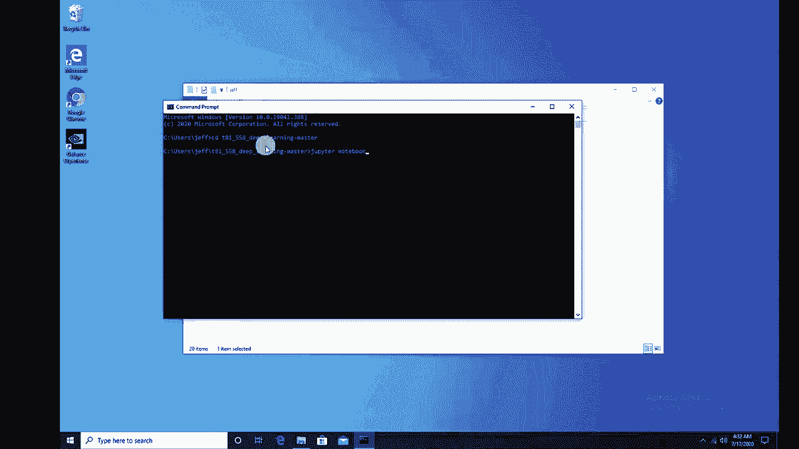

这只是意味着你在运行之前没有激活你的环境。所以，请注意这一点。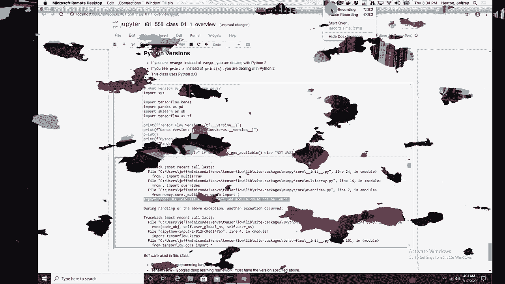

感谢观看这个视频。现在，这似乎是一个复杂的过程，也许你尝试过但效果不佳。欢迎使用 Google Colab 来完成课堂作业和示例。这真的效果很好。我用 Google Colab 测试所有内容。所以你应该没问题。如果你觉得这种内容有趣，请订阅我的 YouTube 频道，或者如果这个视频对你有帮助，请给我点赞。

非常感谢。😊。
