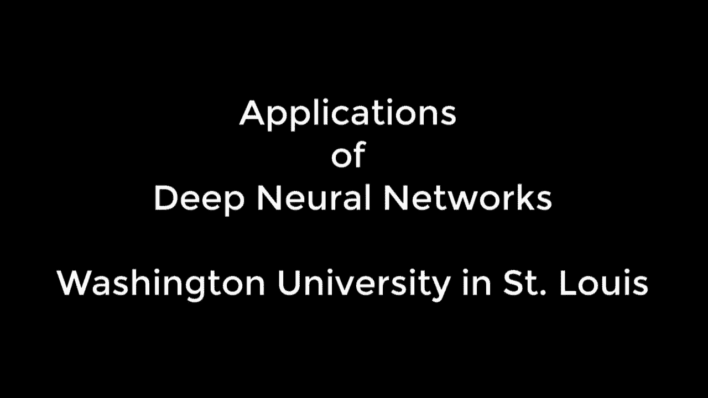
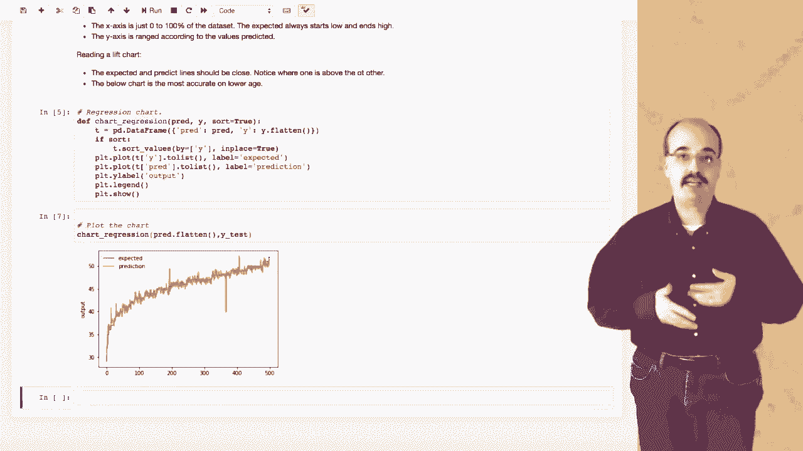
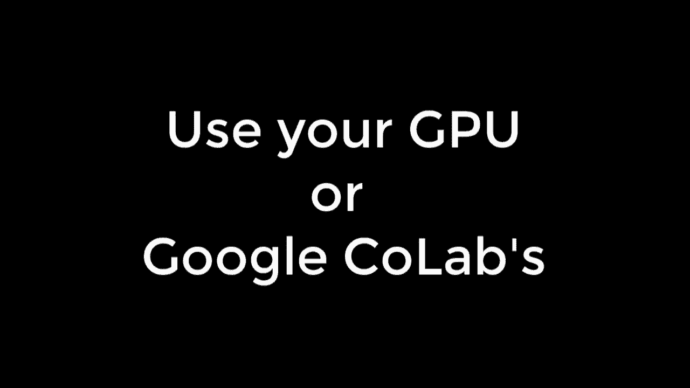
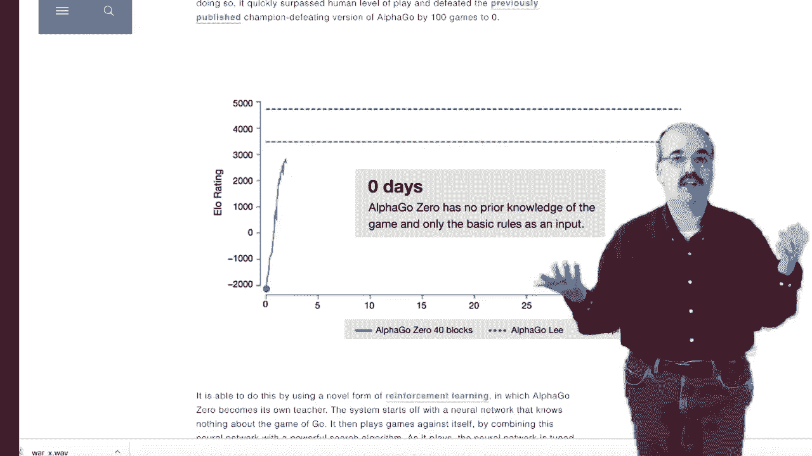
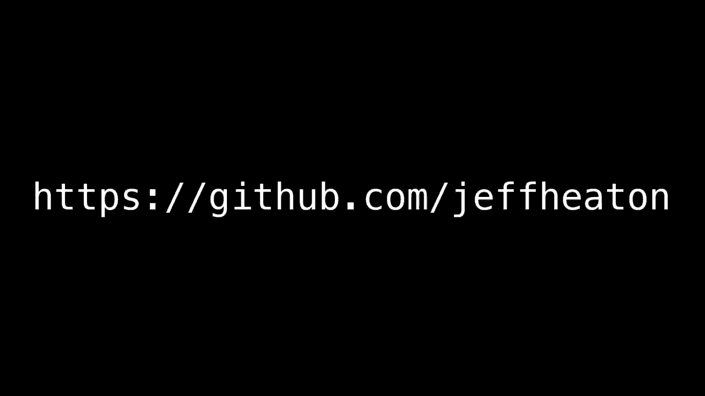

# T81-558 ｜ 深度神经网络应用-全案例实操系列(2021最新·完整版) - P1：[讲座] Python、Keras和TensorFlow深度学习课程以及深度神经网络的应用 

深度神经网络之所以成为令人惊叹的技术，是因为它们可以接受几乎任何格式的输入，包括表格数据、图像、文本，甚至音频。然后它们处理这些信息，进行各种数学魔法，然后输出决策或评分，但它们也可以输出与接收到的数据相同类型的数据。

它们可以输出表格数据、图像、文本或音频。😊，在我的课堂上，深度神经网络的应用，我会展示如何将这些神经网络应用于日常问题。这个课程中的一切都是通过 Python 的 Jupiter notebooks 教授的。如你所见，你可以看到你的代码与我课程中的信息交织在一起，并在运行程序时看到实际结果。

现在，一些创建我们视频游戏的应用将需要视频。因此，这些将实际在 Jupyter notebook 外部直接从 Python 运行。

一切都确保与 Google colab 兼容，这样你就可以使用免费的 GPU 运行它。如果需要的话，GPU，相信我，可以为你的训练时间节省数小时。这个视频中我会展示很多图形和其他酷炫的东西。一切都来自我们在课堂上的内容，所以没有视频魔法。现在，让我加入进去。

我确实需要一点绿幕魔法。但相信我，神经网络不需要任何处理就能看起来很棒。😊。

GN 是我们在这门课程中要研究的一种神经网络。GN 代表生成对抗神经网络。GN 通常用于生成面孔，尽管它们可以生成任何类型的假数据。一个 GN 通过两个神经网络工作。第一个神经网络是生成器。

它本质上是将随机数字生成面孔。第二个神经网络是判别器，它本质上告诉我们生成器是否在生成正确的面孔。这两个网络交替进行，进行对抗性战争。一旦它们完成，你就会得到一个能够接受许多不同随机数字并持续生成相当真实面孔的生成器。

强化学习，特别是当通过深度学习应用时，是一种非常强大的技术，使得 Google AlphaZero 能在短时间内击败 Stockfish，基本上掌握所有国际象棋。在这个课程中，我们将利用 AI gym 查看 Atari 视频游戏，并创建通过观察游戏中实际视频图像学习如何玩这些游戏的强化程序。

实际视频游戏的内存状态。

谁是乖孩子，希克里？就像训练宠物一样，当你使用强化学习时，你会为神经网络提供奖励，以便它们表现良好或做出有利的结果，神经网络在生成广告的潜在信息方面也非常擅长。

好吧，抱歉。我必须尝试。还记得我说神经网络可以接受任何类型的输入吗？好吧，猜猜看，它们实际上可以同时接受多种类型的输入。这就是图像捕捉的工作原理。为了创建一个能够为图像编写标题的神经网络，你需要创建一个接受两种不同类型输入的神经网络，一个是照片。

另一个是一个序列，而那个序列是一组不断增长的单词。首先，你用一个空数组和一个起始标记传入，然后它会添加描述那张图片的词汇。Yolo，你只需看一次。这是一项你可以在我周围看到的惊人技术。

它正在高效地对多个对象进行分类，因为它只需查看一次。我们将看到如何将这项技术转移到你的Python程序中，并获取实际坐标和类别。😊，你周围发生的事情。黄色在这里可能会被欺骗。它无法区分我的狗和一个填充玩具。

它在识别广告牌和带有人物的东西时也有困难，并且认为它们是人类。这个广告牌可能会让自驾车感到担忧，以为它即将遭遇侧撞。但是，等等，还有更多。这段视频只能向你展示这门课程的亮点。以下是我们将要覆盖的一些其他主题的完整列表。

感谢观看这段视频。如果你对这门课程有任何问题，请在评论中留言，欢迎订阅这个频道，以便在有新视频添加到此课程时获得更新。所有信息都可以在播放列表和GitHub中找到。

