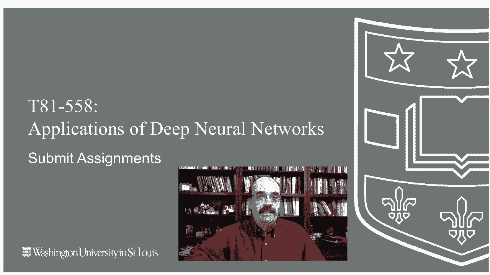
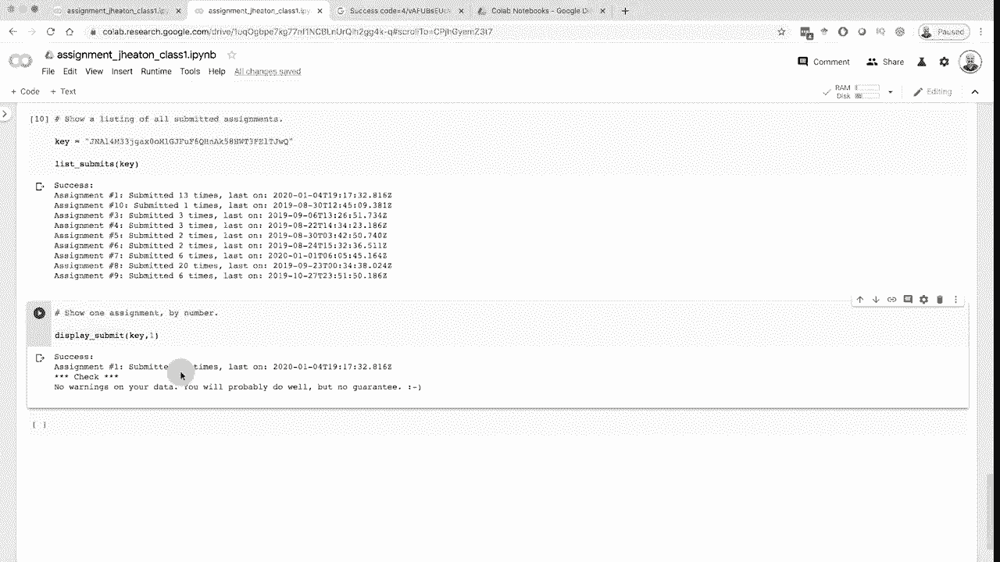
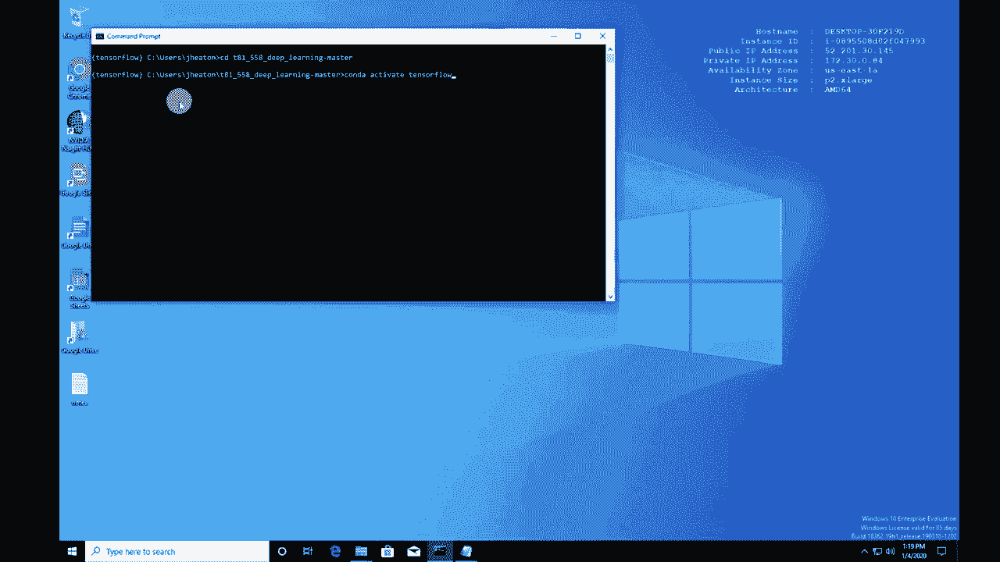
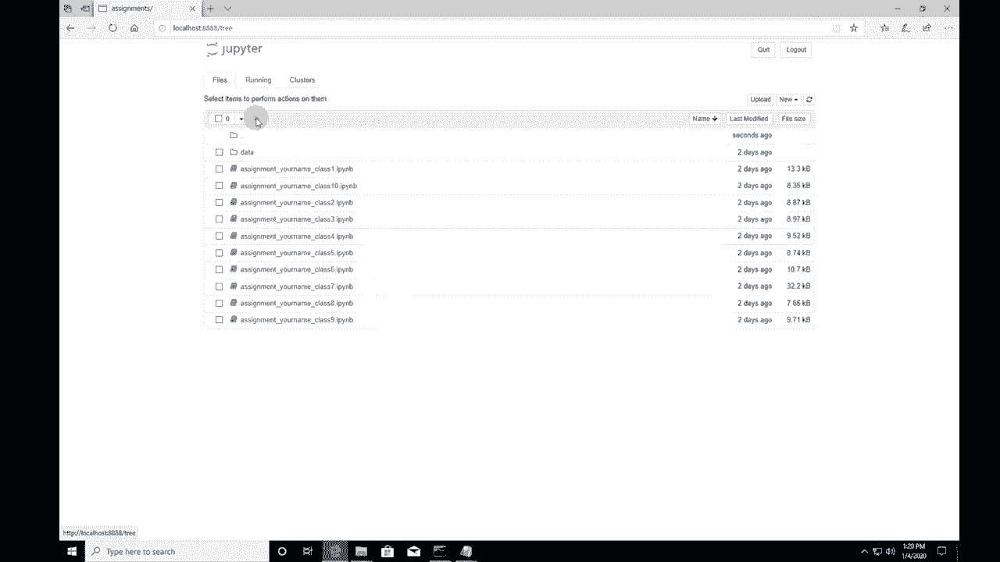
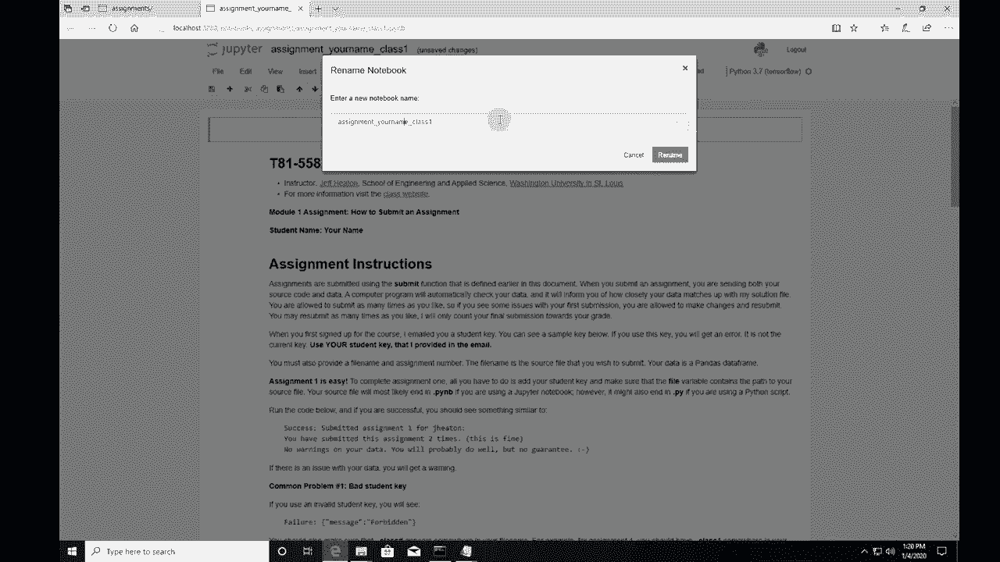
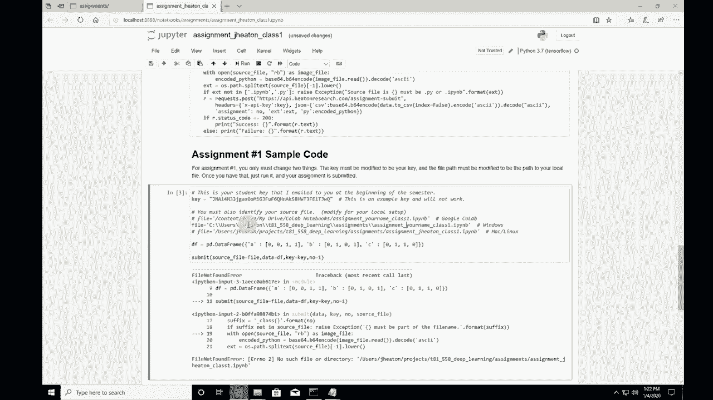
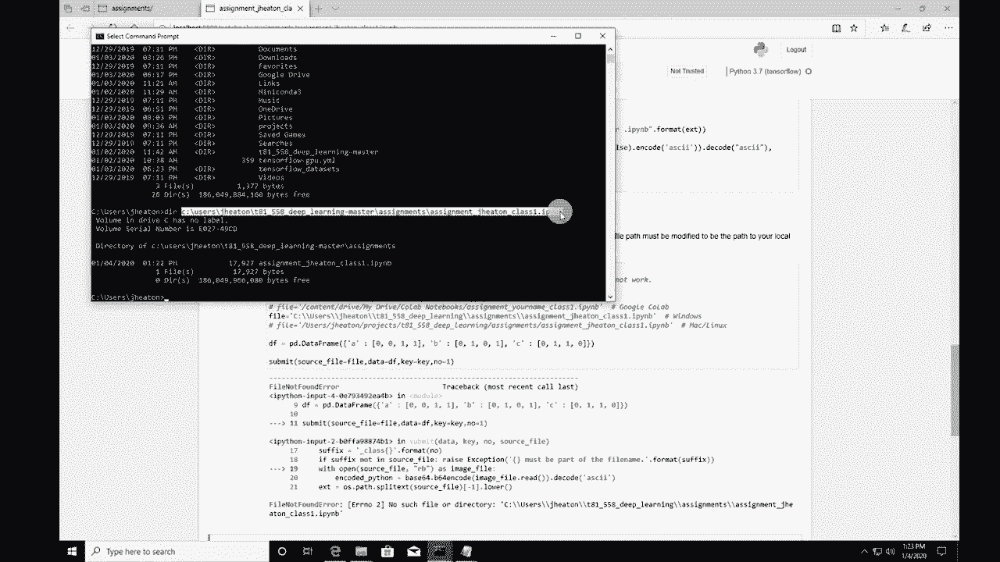
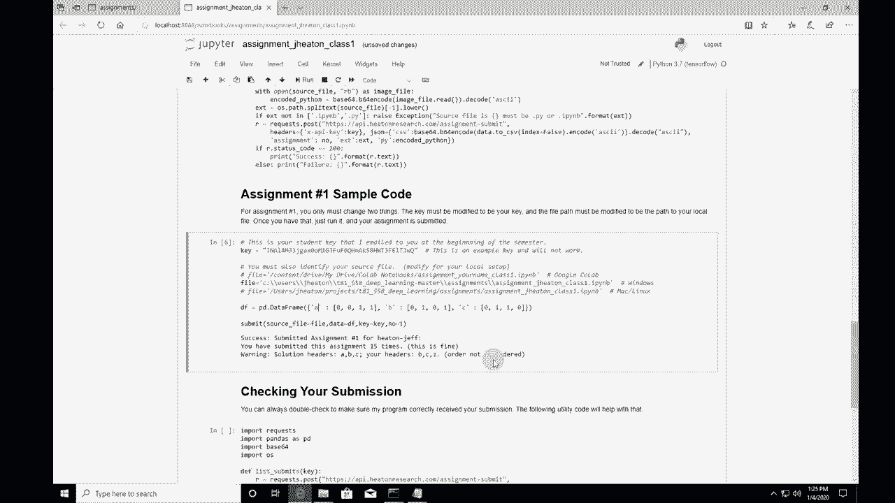

# T81-558 ｜ 深度神经网络应用-全案例实操系列(2021最新·完整版) - P11：[讲座] 如何提交深度学习应用的作业 

嗨，我是杰夫·海顿，欢迎来到华盛顿大学的深度神经网络应用课程。我的课程有10个模块作业，这些是短小的Python作业，你将完成这些作业来证明你对每个模块所涵盖内容的理解。

现在，当你提交作业到我正在运行的API时，会有一个自动检查程序运行，并在我实际评分之前，让你知道你在作业上做得如何。这给你一个机会来提交和重新提交，确保没有简单的错误。最终的成绩将会在我实际评分时录入到Canvas。

当截止日期过后，这也是一个半自动的过程。但是，这就是你的成绩实际进入Canvas的时间。现在，我会向华盛顿大学的学生发送这些API密钥，如果你在我的课程中注册，你应该已经从我这里收到了一份API密钥。如果没有，请联系我，我一定会给你发送一个。

通常，我会在课程实际开始前大约一周发送这些。如果你没有在华盛顿大学注册，只想使用自动检查功能，那么你可以点击我YouTube频道关于页面上的Patreon链接，我在某个级别提供这个服务。这是我为华盛顿大学以外的任何人提供的唯一评分服务。

你可以查看所有视频，看到所有作业。但我只实际评分那些积极注册我的课程的学生。

要查看我关于Cale、神经网络和其他AI主题的所有视频，请点击订阅按钮及其旁边的铃铛，并选择所有，以便接收到每个新视频的通知。好的，让我们开始使用Coab，看看我们如何仅用此提交作业。虽然有很多不同的方法，但这只是一个有效且相对简单的方法。如果你访问课程的Github仓库Jeff Heaton T81 558D学习，进入作业部分，实际上我们提交作业1。作业1非常简单，你只需将你的API密钥放入其中，这会识别你作为学生，并让我追踪是谁发送了什么。你应该从我这里收到过那封邮件，如果你没有收到，请给我发邮件让我知道，这样我可以重新发送给你。我只向华盛顿大学的学生发送这些邮件，如果你不是华盛顿大学的学生，但想使用这个课程内置的自动评分功能，那么有相关选项，如果你查看Patreon支持。

与我YouTube频道相关的网站。现在这是作业1。这是Python代码。你会注意到每个笔记本都有这个打开和coabab的链接。我们将点击它。这将在coab中打开，现在你可以实际运行代码，但你必须更进一步，你必须将其复制到你的Google Drive。它显示正在创建副本，现在在这里。现在我会说在这个时候让它属于你自己。所以作业的副本命名为Jayton，写上你的名字，我会保留Jayton，因为这是我。我已经重命名，如果你去你的Google Drive，在Google Drive使用coab时，你会得到这个coabab笔记本，如果你进去，你应该看到它似乎没有完全重命名。我们看看保存之后，你做了保存，现在它已重命名。现在这是一个问题，我见过一些学生卡在这里，Google Drive并不总是立即更新。

所以你需要像我那样进行保存。确保你能在Google Drive中真正看到它，并且名称正确。有时候在你保存之后，你可能需要等几分钟才能真正提交你的作业，通常情况下你不会立即下载，然后五分钟后提交，除非你真的。

这些我做得很快，但这是第一个作业。我列出了一些你可能会遇到的常见问题，以及你可能需要采取的解决措施。在这里的第一部分，你需要运行，这将使coab在线，并实际将你的Google Drive映射到coab，以便你可以访问它。我将继续运行这一部分，看看这里说的“注意：不使用Google Coab”，这应该在此通过后切换为使用coab。好的，你还需要做这个，这非常重要。

这是将coab连接到你的G Drive。不幸的是，在学期期间你会频繁这样做，他们会让你不断重复这个过程。相信我，我大概做过100次。点击那个。你点击允许。这不是你的API密钥。不要对此感到困惑。这并不是你用来提交的内容。这只是为了将coab连接到你的G Drive。

我们回到这里，我们必须回到你可能需要的那个副本。所以是的，就是这个。我会将其粘贴到那里，按回车，它正在进行身份验证。这只需要片刻，应该会显示这个“注意：使用Google coab和Tensorflow 2”。这是我给你的一个方便命令，我只在第一个作业中放了它。

但如果你愿意，可以将其复制并粘贴到其他地方，我要运行它。这个感叹号意味着要运行一个unx命令L，这是一个名为list的unx命令，有点像目录和dos。我们基本上只是列出我的笔记本目录的内容，这实际上与去Google Coab做的事情基本相同，抱歉。

这实际上和进入Google Drive查看它在这里是一样的，所以我们将回到这里以便查看。我们需要这个名称，所以我先复制它。但本质上就是上面那个。你也可以复制那个。这是我提供给你的提交功能。你并不需要真正了解它是如何工作的。它基本上是一个通过网络的API调用，它调用我主服务器上的一个网址，跟踪所有这些作业提交。所有的Https都是加密的，只需运行这个，如果你得到一个错误，显示找不到提交。

这意味着你可能忘记在这里运行这个，你需要放置你的密钥。这是我发给你的API密钥。我将神奇地将我的密钥移动到剪贴板中。你可能实际上会从你的电子邮件或你记录下来的地方复制并粘贴它，但我将选择这里的那个。顺便说一下，如果我只运行这里的那个。

我会得到一个错误。实际上我会得到几个错误。让我用这个来演示一下。让我们运行这个，不会运行得很好。没有目录用户J Heaton项目，等等。这是因为这里的文件名，即你尝试提交的文件名无效。那是因为我使用的是Mac Linux，但我想使用这个。

这是Google Colab的那个，你还需要更改它以便填上你的名字。好的，现在里面有我的名字了，现在让我们运行它。如果你收到另一个消息说找不到它，请查看并确保它完全和现在一样。

确保这与上面的内容匹配，确保你已经进行了文件保存，也许使用我之前给你的那个列表命令，以确保一切都正常。如果都没有问题，给它五分钟。有时候Google需要一点时间来同步。好的，这就是给Bennon的。让我在这里放入我的API密钥。这是我的密钥。

也不要使用那个。它将在课堂开始前被删除。这些只是我使用的临时密钥。而这一切只是提交这个硬编码的CSV文件，这基本上是异或运算符的真值表。但这就是这个作业所期望的。所以我会点击这个，运行需要一点时间。

这基本上是在将作业发送给我。你还没有得到你的成绩，但它会为你检查。这是一个相当高级的检查器，合理地说。如果你改变了一些东西，比如说这一列的名称是Z而不是A，现在它会生气，立即显示数据没有警告。你可能会……但是没有保证。最终成绩在Canvas中，你提交后在Canvas中没有成绩。

我会手动输入你的分数，或者我有一个每天早上运行的自动化过程，如果检查到你的代码没有问题，除了自动检查器检查的内容，它会给你满分，如果你没有迟交。

如果你在截止日期后提交，将会失去分数，所以不要这样做。如果你提交的时间超过一周，将会得零分，所以也不要这样做。现在我来运行一下，并重命名那个列。自动检查器会检测到问题，解决方案标题是AB，但你的标题是B和Z，这不好，所以你会收到警告，可以随时重新提交。

你可以提交直到完美。这十个作业的目的是让你尝试这一点，不用担心，你可以提交十次。我是说，不要做拒绝服务攻击或其他什么，但你可以提交十次。如果你的第101次完全正确，你将获得A分。这就是它的运作方式。继续运行，只要第101次不是迟交。

好的，它甚至会跟踪，我提交了13次，运气不好。如果你想稍后检查，可以使用下面的代码。我只在作业1中放了这个代码。如果你用那个相同的API密钥运行这个，嗯，那只是定义了它。

然后在这里运行。输入我的密钥，它会显示我在所有这些作业上的进展。那是我可能在测试提交。如果我想检查某个作业，可以点击这个，这样就能具体看到我在某个特定作业上收到的警告，这就是如何使用Google Colab，我想大多数人可能都会这样做。

如果我们从Windows电脑本地执行这一步，过程会与Mac非常相似，这里不单独展示Mac。首先更改为。

确保你已激活Tensorflow环境，以激活Tensorflow Jupyter Notebook并启动它。进入作业文件夹，如果你还没有在那的话。但这是作业，我们会进入作业1，把它放入Python 37 Tensorflow中，重命名，以免在Colab中打开。这部分是Colab的指令。

你可以运行这个，或者你可以完全根据自己的选择来运行。它不会像我们在Colab时那样提示你任何东西。它只会说没有使用Google Colab，这个命令在Windows上不起作用，所以不要运行它。我们会定义提交功能，现在准备提交了。我已经神奇地将我的密钥复制到了剪贴板。确保更改这个，使文件名与实际文件名匹配，路径正确，然后运行，这有助于将其格式化为正确的格式。

这是Windows、SeQL和用户，而这台机器上我实际上并没有使用项目目录。所以这必须与你自己的计算机匹配。所有的作业都匹配，然后Jheaton这是一个很好的例子。如果你遇到那个错误，去命令提示符或在用户Jheaton中检查，确保这些部分逐一都是正确的T81作业，作业Jheaton1，IPy和B。如果你能执行Dr并看到你的命令和文件，那么它确实存在。我将复制并粘贴，将其覆盖在这里，我们必须做这两个s，因为这就是如何正确编码一个backf。尽量不要像我刚才那样犯任何错误，结果是成功的。所以那里有一些小的错字，但这就是我验证路径的方式，因此这实际上是一个很好的例子。我希望我能说这是我故意做的，但显然不是。

就我而言。所以现在你已经提交，数据上没有警告。这会检查你的数据。我重复这一点是为了防止你快速跳过了这部分。如果我在这方面做错了，它将会告诉你你的头部有问题。这是一个自动检查。

你将在Canvas中看到你的实际成绩，通常在第二天。我有一个自动处理程序，每天早上运行，检查提交情况。如果它检测到你的提交没有问题，它看起来是完美的分数，那么它将会在Canvas中给你全额学分。

这是我需要更具体地检查的内容，如果你希望我查看你在代码中所做的事情，如果你搞错了，我会看它，因为自动更正器无法解决它，然后会将其发送给我。但如果你想让我提供关于你的编码技术或其他方面的任何意见，请告诉我。

我会很高兴。请查看这些内容，如果自动更正器将其标记为完美，并且如果截止日期已过一周，那么如果你没有提交，就意味着你得了零分。我会逐一发布我的解决方案文件，你将看到我实际是如何做的，并且在接下来的每周Zoom会议中会讨论这个问题。感谢你观看这个视频，如果你是WasU的学生并且在提交作业时遇到任何问题。

请联系我，所有成绩将会在只有WasU学生可以访问的Canvas系统中。

这就是提交作业的全部内容，祝你学期顺利。如果你有任何问题，请务必告诉我。如果你想及时了解我在这门课程和其他人工智能项目上的所有动态，请订阅我的YouTube频道。非常感谢。
