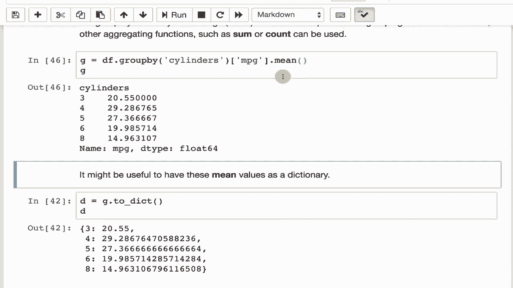

# T81-558 ｜ 深度神经网络应用-全案例实操系列(2021最新·完整版) - P14：L2.3- Python Pandas 中的数据分组、排序和改组 

嗨，我是杰夫·希顿，欢迎来到华盛顿大学的深度神经网络应用课程。在这个视频中，我们将讨论如何在pandas中对数据集进行分组、排序和打乱。这使你能够像在SQL中进行group by那样，对数据进行汇总和聚合，以便以其他方式处理数据，准备好输入神经网络。如需了解我最新的AI课程和项目，请点击订阅并点击旁边的铃铛，以便收到每个新视频的通知。Pandas数据框也可以进行分组、排序和打乱。

我们将讨论如何在数据中进行打乱，这是非常有用的。你要确保没有多个相同的目标靠得太近。我是说，最糟糕的情况就是按目标对你的数据集进行排序。

然后将其平均分配，以获得你的训练集和测试集，因为你的测试集可能有所有低值，而你的训练集可能有所有高值或类似的东西。因此，打乱是一个非常好的做法。我在这里运行的这个命令使用了autompg数据集。如果你想要一致的打乱，这也是不错的选择。

这通常是比较可取的，因为你可能需要重新打乱数据集以添加列或其他类似操作。你可能不希望顺序发生变化，因为你已经建立了一些基准。你确实希望它是随机的，但又希望它始终保持随机，因此你可以在这里选择一个种子数字。我选择42，这个数字来源于《银河系漫游指南》，这是一本虚构的书，你可以查阅。

但这基本上是将这行进行资源化。这一行使得这些数字在这个列表中有序。即使你省略第二行也没关系，注意如果我在这里运行它。这些数字现在没有被恢复到零到一之间或零，1，2，3等。

我喜欢将它们按这种方式排列。因此，我通常会这样做。如果你不读取，可能会导致一些其他奇怪的现象。我们设置了这些。你也可以对数据集进行排序，这里我们将使用汽车每加仑的行驶里程数据集，我们将对其进行排序。我们将按汽车名称以升序排序。

然后我们可以打印出第一辆车的名称，即AMC大使。布里汉姆，现在你有了一个排序的数据集，注意这些数字再次是无序的，因此你可以知道原始位置在哪里。你可以使用上面一样的重置索引命令将这些恢复。再次强调，你可能在打乱之前是否关心原始排序顺序，我通常不在乎。

我几乎总是会重置这个。你也可以分组数据集，分组与SQL中的group by命令非常相似。它通常使用一个分类值来对数据进行分组。然后你可以计算每个类别中有多少个值，基于第一个分组的类别对另一列进行平均。那么让我们来看这个。这是CARS数据库。

我们将按缸数分组并报告每加仑行驶里程的平均值，所以是均值。我们将运行这个。我们看到这是每加仑行驶里程的平均值。所以八缸车毫不意外地获得了最差的每加仑行驶里程，6。6缸更好。5缸甚至更好，4缸。然后是这三款三缸车。

因为我们的五缸车有点例外。它们非常罕见。所以这可能是那三款车每加仑行驶里程下降的原因。它们可能实际上是性能车。我不知道。我得研究数据并解释一下。但不管怎样。

这就是你如何快速遍历所有这些并获取平均值。你可能希望将这些作为字典。这样，你可以很快在字典中查找，并找到其中任何一个的均值。例如，如果你想知道六缸车的均值，你可以运行这个，它会告诉你19。这一点很重要，要意识到这是6。

那不是索引，而是键，所以这里的键。它返回值19.98。你还可以计算每个类别中有多少辆车，这一点相当重要。你可以看到为什么三缸车如此特殊。只有四辆，而四缸车则有2044辆。

至少在创建这个数据集时，这是最常见的。那时也有很多V8车型。我怀疑在今天，这种分布会有所不同。这就是你如何对数据进行排序和分组的，这种分组特别是在特征工程中你会非常常用。你通常想要将数据集分组，查看这些值如何根据这一点变化。

例如，假设你有缺失的MPG值。你可以直接插入MPG的中位数。或者你可以做。我怀疑这会与均值非常相似。大多数情况下，所以你可以使用中位数，假设你有一个缺失的MPG，而不是仅仅将整个数据集的整体中位数放入，你可以查看缸数，并插入该车的缸数对应的中位数的缺失值。

这给你提供了一种更智能的方式来填补缺失值。与简单地放入整体中位数不同，你可以使用与另一个字段强相关的中位数。在这种情况下，缸数和每加仑行驶里程是高度相关的。这将是一个非常好的技术，适用于我们在学期后期的Kaggle竞赛项目。

感谢观看这个关于在pandas中进行分组排序和其他技术的视频。在下一个视频中，我们将讨论如何使用apply和map。这使你可以使用Lambda函数对pandas数据框进行更复杂的修改。该内容经常更新，因此请订阅频道以便随时获取该课程和其他人工智能主题的最新信息。
