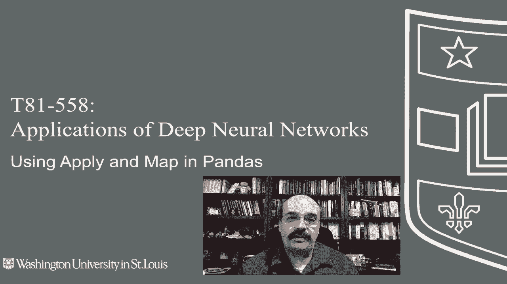
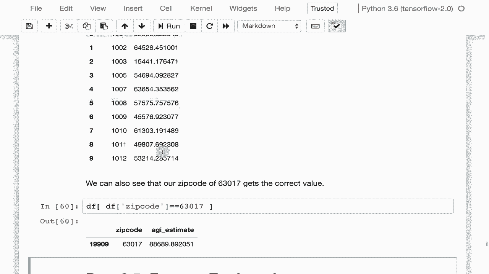

# T81-558 ｜ 深度神经网络应用-全案例实操系列(2021最新·完整版) - P15：L2.4- 在 Pandas 中为 Keras 使用 Apply 和 Map - ShowMeAI - BV15f4y1w7b8

嗨，我是Jeffine，欢迎来到华盛顿大学的深度神经网络应用课程。在这段视频中，我们将看看如何结合使用apply和map函数与pandas。这允许你编写将执行在整个数据框上的Lambda函数或其他函数。这使你能够对数据框进行相对复杂的转换，这对特征工程可能非常有用。

它允许你以能使你的神经网络更具预测能力的方式表示数据。有关我最新的AI课程和项目，请点击订阅并点击旁边的铃铛，以便在每个新视频发布时收到通知。apply和map是pandas数据框提供的两个函数，你可以直接在这些数据上使用。现在我们已经看到map在一般Python数据结构列表中的应用。😊

但是map可以与数据框一起使用，进行类似的转换，这对于你在本课程中的某些项目可能需要的更高级的特征工程非常有用。apply和map可以非常非常有用，我们将看一个具体的案例。

在后面的部分中，我们将讲解如何做到这一点。现在我们来加载autompg数据集。我们将对其进行非常简单的映射。这是你进行映射时最常见的操作之一。这类似于SQL中的解码。我们要做的是，您这里的原始值指定了汽车的来源地区。1是北美，2是欧洲，3是亚洲。因此，我们将对原始值进行处理。

我们将创建一个名为originig name的列，并在所有情况下填充它，这就是map所要做的。它将查找原始值，并将其替换为北美（1）、欧洲（2）和亚洲（3），那么我们来运行一下。如果我稍微滚动一下，你可以看到北美、北美，3是亚洲，2是欧洲，依此类推。

因此，如果你能够实际做到这一点，这可以是一个非常好的总结值的方法。我的意思是，假设你在这里有所有美国50个州的数字。你可以在这里放一堆值，它们指向同样的东西。你可以用1指向北美，用2指向北美，甚至是州名，密苏里州指向北美。

加利福尼亚到北美，纽约到北美，等等。如果你看到法国，它就属于欧洲。因此，你也可以用这个来进行总结。apply是另一个你可以使用的东西。对于这些数据集，apply基本上是将一个函数，通常是一个lambda，应用于数据中的每一行。所以这里。

让我们继续进行计算，这个我称之为效率的指标。它基本上是位移除以马力。你的发动机有多大，实际能获得多少马力？

这给你提供了汽车效率的一般指示。因此，我们可以将其添加到数据集中。这显示了你如何基于这个比率进行特征工程。这里我将展示一个更复杂的特征工程示例。

这实际上是前几个学期的一个作业。你可能会在这个学期看到类似的作业。这基本上使用了来自美国国税局的数据集，这是一个美国政府的税务机构。我们将会。

这里还有更多数据文档，如果你有兴趣阅读。但这基本上是一个数据集，提供了估计的调整后总收入以及美国邮政编码的其他信息，所以你关心的字段是州，举例来说是密苏里州。邮政编码是该州内的邮政编码。

AGI Stub 有六个不同的收入区间。所以一是最低收入，六是最高收入。每个邮政编码将有六行数据，然后它们会给你一个计数，即每个收入区间的人数。因此，这为特定邮政编码提供了一种财富分布的概念。

我们要尝试将这些区间组合在一起，以便你能估算该特定邮政编码的整体 AGI，因此这是一个简化。你有邮政编码，每个邮政编码有六行数据。你想将其缩减为每个邮政编码仅一行，并给出调整后总收入的整体估算。

这就是文件的样子。你看到的邮政编码是63017。这是我工作的邮政编码。AGI Stub，所以这是你为每个邮政编码拥有的六个值，然后是计数。因此，第二高的是最大的收入。这显示了这个特定收入，如果你做得最多。

在美国著名的邮政编码90210，可能会非常高，因为那是一个非常富裕的邮政编码。所以你在这里看到很多数字。我们将如何将其组合起来。这些是每个区间的带，1 是 1 到 25k，6 是 20万美元或更多。现在，将这些重新组合的一个问题是20万美元或更多。

这是一个相当大的类别，可能高达，我不知道，可能是几百万美元。不过，这些人赚了多少都不清楚。所以我们要做的是为每个区间建立一个中位数。125。由于我们不知道上限是什么，12500。这可能是我整理的估算中最大的缺陷。但你。

你可以看到这些大致在哪里。因此，我们可以估算6，3，0，17的平均AGI。基本上，我们将这些值相加。所以这就是我们的总计。我们会把这些全部加起来。我们将总计AGI，但按照中位数加权。因此，我们将考虑人数。4710乘以12500，因为这是乐队一的总人数。

这是乐队一的中位数。乐队二的中位数是2780和37500。因此，这实际上是一个加权和。然后我们将进行除法，这样我们得到的这个邮政编码的平均收入大约是88,000。这看起来是合理的。因为我们手动计算了这个，所以这也很好，因为它给了我们一个可以手动检查的值。

所以我们自动化的过程将计算每一个邮政编码应该得出相同的值。因此，我们将把这个数据集加载到内存中，它非常庞大，你可能想要进行流式处理。但是这是加载整个数据框，马上就会加载完成。这可能需要一段时间。我花了大约20秒。现在我们要做的事情是。

这将向你展示一个很好示例，展示如何将多种技术结合使用。现在这个数据集确实有一些垃圾数据。因此，我们有邮政编码是0和9999。不存在这样的邮政编码。它们在数据文件中确实有用途，但我们不打算使用它们。因此，我们将获取所有的行，这就是Lo为我们做的。

数据框不等于零邮政编码，且邮政编码不等于9999。我们还将仅拉取这些字段。因此，我们在横向和纵向上缩减这个数据，去掉了很多列和所有这些无效邮政编码的行。

你运行这个。这实际上是非常快速的，现在数据框已经被修改，如果你显示数据框，你会看到它实际上只剩下这四个。无效的也被去掉了。但我们不会去寻找它们。我们现在要做的是将所有这些AGI桩替换为中位数。那些我给你的中位数是1，36，所以这是一个出色的映射应用。我们运行它。

再一次，它非常非常快。如果我们查看一下，我们现在看到这些应该已经转化了，它们现在是AGI桩。那些实际的收入中位数。接下来，我们按邮政编码分组。对于每一个邮政编码，我们基本上可以执行一个lambda。因此，这是一个很好的应用场景。

我们将对其进行apply操作，基本上进行求和，因为我们想要对所有值进行求和。在每一个邮政编码中，但我们将进行加权求和。因此，我们将基本上按照n1进行加权。假设有30个，然后乘以AGI桩，最后将整个结果除以n1。

这是N1的总和，实际上，你可以在整个邮政编码的总和中看到。然后我们重置索引，使行号对齐，如我们之前所见。我们运行那个。那确实需要几秒钟。让我们看看这实际上做了什么。我们现在几乎拥有了我们想要的数据集。邮政编码。

这是每个的平均值。列标题有点杂乱，邮政编码。还不错，但零，零是什么，零应该是我们的平均AGI。我们的AGI估算。我们将重新命名这两列，然后显示顶部。现在我们可以看到有这个漂亮的输出。你可能想要一个两个CSsv。

这完全是我之前进行的作业的有效提交。上个学期。我们将查找我们手动计算的邮政编码，它与我们之前的88.689匹配。感谢观看这个视频。在下一个视频中，我们将继续使用pandas，并讨论特征工程，也就是如何你。😊

以有助于神经网络更具预测性的方式表示你的数据集。这个内容经常变化，所以请订阅频道以保持对本课程和其他人工智能主题的最新了解。
