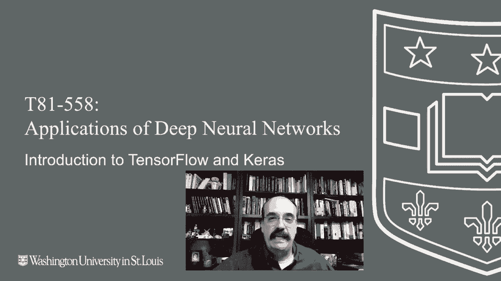
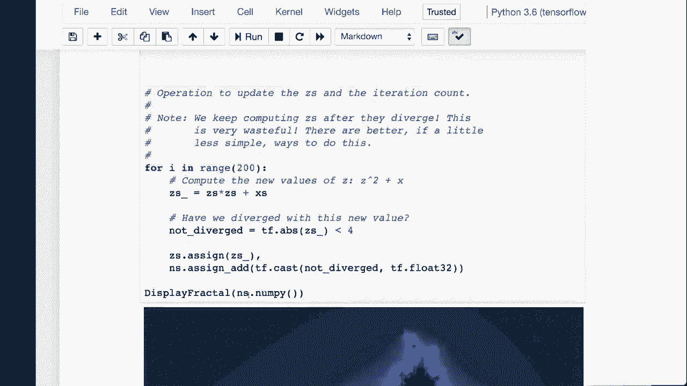
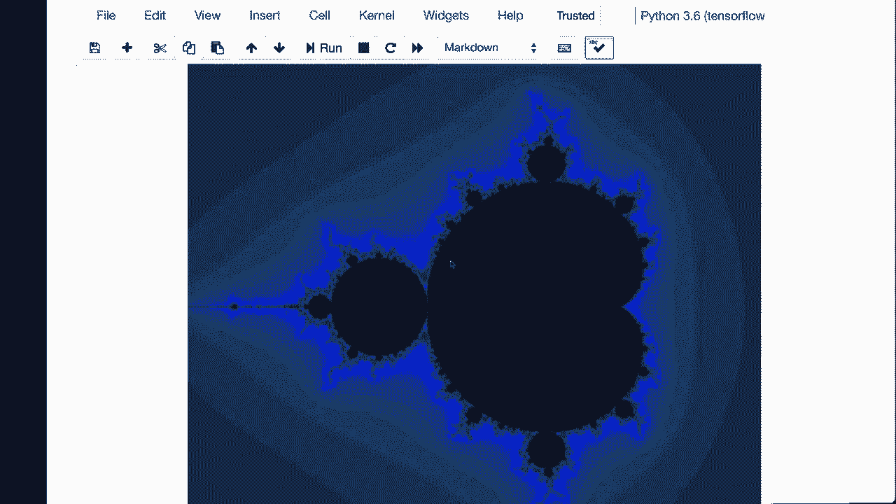
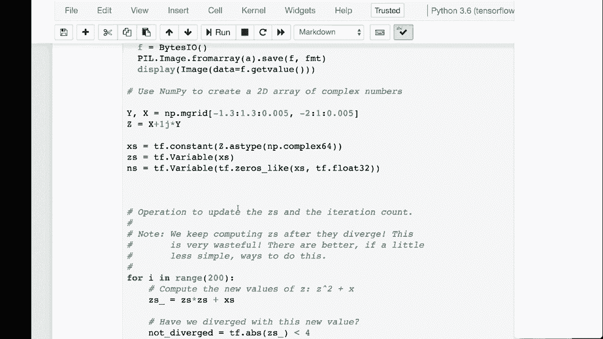
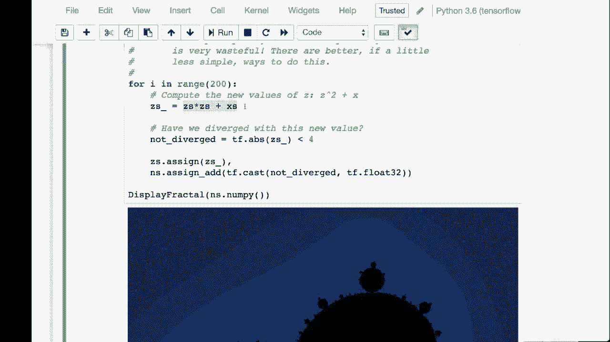
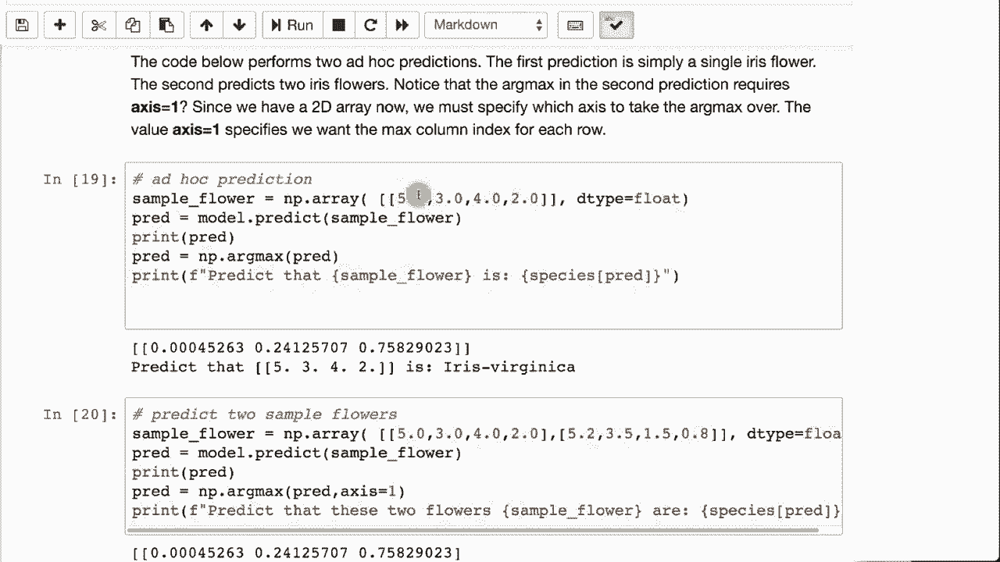

# T81-558 ｜ 深度神经网络应用-全案例实操系列(2021最新·完整版) - P18：L3.2- 深度学习工具库TensorFlow和Keras简介 

嗨，我是杰夫·希顿，欢迎来到华盛顿大学深度神经网络应用课程。在这个视频中，我们将介绍TensorFlow和Keras，并看看TensorFlow如何直接用于进行数学计算，而Keras则成为底层TensorFlow计算引擎之上的神经网络层。有关我AI课程和项目的最新信息，请点击订阅，旁边的铃铛可以通知你每个新视频的发布。

所以，TensorFlow是一个低级数学库，它让你能够访问CPU、GPU和网格计算能力，而Keras是一个高层抽象，它让你把这些数学结构视为神经网络。我这里给你一些链接，指向处理TensorFlow和Keras的各种有用资源。你需要处理的第一件事是，TensorFlow有很多不同的版本。

谷歌在重大变更方面可能非常出色或糟糕，视情况而定。很多聪明的人在TensorFlow上工作，他们对API应该如何设计有着非常明确的看法。随着不同派系的胜负，API会发生重大变化。重大变更意味着新版本会导致以前为旧版本编写的代码无法工作。

他们改变事物的名称。他们改变事物的大小写。有很多很多小的， 有时只是小的烦人事， 有时是大的结构性变化。因此，确保你正在使用本课程指定的Ten flow版本非常重要。这个视频是在TensorFlow 2.0开发阶段录制的。

但是只要你有20或更高版本，我会更新课程。如果由于更新的TensorFlow而导致某些内容出现问题，我会更新视频。因此，你只需运行这个，它会显示你拥有的版本。关于安装TensorFlow，我有一整部视频专门讲述如何在Windows上安装TensorFlow，还有一部关于Mac的视频。

这些涉及到使用CPU安装TensorFlow以获得良好性能。你需要使用GPU，并且你的GPU需要是合适的类型。在课堂上运行的一些作业和示例将需要在CPU上运行， 但这会很慢。而安装GPU并不是世界上最简单的事情。

我可能会做一个相关视频。我个人主要在云端运行GPU深度学习，这样我就不需要安装所有硬件和驱动程序等，但这确实是可行的。我建议这门课的作业和部分内容需要GPU的同学使用Google Colab。

Google Collabab是基于云的，你无需安装Python或其他任何东西。它完全准备就绪。我有一个视频在第一个模块中链接，介绍如何在这个课程中使用Google Coab，我们可能在第一次课堂会议中讨论过。因此，这可能是运行所有示例和完成作业的推荐方式。

这是一个强大的实例。它是一个双核，拥有12GB的内存和一块GPU。你无法超越它。因此，这就是我推荐的学习此课程的途径。至于我为什么为这个课程选择Tensorflowlow，嗯，Tensorflowlow得到谷歌的支持，在Google Cloud中有出色的支持。

它有很好的CPU和GPU支持，并且是用Python编写的。Python正在迅速成为机器学习和AI的高级语言。因此，学习Python和通过Ks以及Python学习深度学习是非常有利的。现在，你可以直接使用Tensorflow。

如果你正在编写非常自定义的机器学习模型，那可能是最佳选择。但总体而言，访问的方式是通过Ks。这使得深度学习变得更加简单。设置起来其实没有太多缺点，除非你确实需要对基础神经网络的计算拥有完全控制。

然后你需要Tensorflow，还有其他深度学习工具。我这里列出了几个。如果你特别喜欢Java，深度学习J绝对值得关注，H2O也是。Tensorflow在以前的版本中，至少是非常图形化的，所以它会后期计算。🤢

Tensorflow 2.0的一个重要特点是即时执行。现在，他们进行了很多更改。因此，如果你之前没有使用过Tensorflow，不用担心，它已经完全改变了。所以这将让你为最新版本做好准备。这只是展示了tensor board，它可以帮助你可视化你创建的神经网络。

我们将直接查看如何使用Tensorflow。我们只会在这个视频中进行这个部分，其他视频将完全使用Kira。所以这将做一个叫做Mandlebro图的东西，你可以在这里看到它。

如果你之前曾与Mandlebrots合作，你一定会认出那幅经典的图。实际上，这是一组非常简单的方程，生成了。

你可以继续放大这个区域，几乎在复杂的景观中是无限的，你可以深入探索。

在这里，我写了代码来基本上绘制曼德尔布罗特图。现在你可以看到这非常简单。那是生成曼德尔布罗特的代码。显示分形的函数在完全渲染后使用，我们在 Tensorflow 中做的实际上是定义。基本上就像是一个复数，它是一个复平面，你在整个平面上绘制曼德尔布罗特。

我不会深入曼德尔布罗特的实际数学，但有很多关于这一点的教程。

我们基本上是在这个平面上进行全面的扫描。我们进行了200次迭代。所以每次绘制时，它都会被画得越来越好。这是一个非常迭代的过程。所以每次通过它时，都会发送到 Tensorflow 进行处理。如果你愿意，可以使用 GPU。

速度快得令人难以置信，你真的不需要实际的 GPU。仅用 CPU 就可以做到。这是计算出来的方程，用于绘制曼德尔布罗特图像。

如果你运行这个，你会看到它实际上运行得非常快。现在为了更精确地观察发生了什么，这里也是直接使用 Tensorflow。我在这里创建了两个矩阵。所以这些实际上是向量。嗯，我想你可以称它为行矩阵，这个是列矩阵。因为这个是横着的。

这是两个值叠在一起，我们要对矩阵1和矩阵2进行矩阵乘法，然后打印出来。正如你所看到的，结果是12。现在我把它转换为浮点数，以便你不会看到所有的张量装饰。这是两个常量，所以是常量乘以常量。

你可以看出这一切都是非常线性代数导向的。现在我们在处理两个变量，我们要从一个常量中减去一个变量。我们这样做后，可以看到结果是负2，负1的行矩阵。我们现在可以重新赋值 X，因为 x 是一个变量，所以我们重新赋值，并能够基本上重新计算上面的计算，得到不同的值。

所以，这些是构建神经网络的基础块。现在让我们开始思考神经网络的层，就像之前那样。我们将使用一个经典的数据集，即每加仑多少英里数据集。这让我们能够。

该数据集为我们提供了各种汽车及其每加仑多少英里的统计数据或计算。所以想法是建立一个模型，利用气缸数、排量和其他汽车统计数据来实际得出每加仑多少英里，从而生成一个这样的模型。

在这里，我们将基本上读取每加仑的自动里程。我们将保留汽车的名称和汽车本身。汽车名称并没有预测能力，它们只是汽车名称。马力方面，我们确实有一些缺失值，因此我们将用中位数填充。

我们之前见过这个，所以我会很快地通过。然后我们创建我们的 x 和 y，x 是预测变量，因此我们在气缸、排量、马力、重量、加速度、年份和产地（即生产国家）上进行预测。我们正在计算这个。

我们试图预测每加仑的里程，这就是你的 x，用于预测的值，y 是你实际预测的内容。然后这就是 Keras 的实际样子，我们创建一个序列模型，这只是按顺序排列的层。我们创建我们的第一个密集层，密集层就是第一层的每个神经元都连接到下一层。

这是非常常见的。通常这就是层的工作方式，尤其对于像现在这样的表格数据。当我们进入图像时，这将有所不同。输入维度将是 x 的形状 1。因此这是我们拥有的列数，因为 x 是输入值。形状 0 是行数，形状 1 是列数。

Activ 是修正线性单元，我们有 25 个神经元。我们在下一个隐藏层有 10 个。我们不必告诉它我们有多少输入，实际上就是来自前一层的 25 个。激活也是如此。输出对于回归神经网络来说仅为一个，输出总是一个。

对于回归神经网络，重要的是你始终使用均方误差作为损失函数，优化器通常在这个类中使用 Adam，还有其他一些可以使用的，我们很快就会看到。然后我们进行拟合。我们将拟合 100 个周期，周期只是神经网络训练的时间。这可能足够，也可能不够。稍后我们将看到如何确定多少周期实际上是足够的。

详细模式意味着在进行过程中打印出数据。如果我们运行这个，可以看到损失在继续时缩小。因此，随着时间的推移，它变得越来越好，更有效。这就是上面详细值的作用。所以这让你可以控制输出到屏幕的数据量。现在，这里的表现并不好，这 100 可能不够。稍后我们将看到我们变得更加高级，这实际上会得到更好的预测。我们计算我们的均方根误差，24，信我。

在每加仑的里程上效果不是特别好，因为这是范围。所以在这种情况下，这并不罕见。你可以重新训练它。可能会给你更好的结果。是的，这确实是一个更好的结果。所以在这种情况下，重新训练就解决了问题。但稍后我们将看到如何自动控制所需的周期数。

你可以在这里看到这应该下降。是的，这好多了。这是尽可能好的表现。你有时会看到它降到3。然后我们可以打印出各种汽车的每加仑里程或预测的每加仑里程。现在你可以看到它们的差距更小了。你也可以进行分类。

我们将使用经典的IIS数据集，这里有四个测量值，可以给出三种不同类型的鸢尾花。你使用的是花萼长度、花萼宽度、花瓣长度和花瓣宽度。这就是鸢尾花分类神经网络的样子。它非常相似。你有输入，那将是四个输入。还有一个或多个隐藏层。

然而，对于分类，尤其是多类分类，这意味着你有两个以上的类别。你将使用softmax和类别交叉熵。如果这是一个二元分类，我们将在下一个模块中看到。那会有些不同。你会有一个二元ALo函数在这里。

但我们将在训练时看到这一点。训练这个模型时，它会训练并减少损失。你还可以打印出物种，这些是我们试图分类的鸢尾花类型。它的输出是这样的，采用科学记数法，这使得阅读有些困难。你可以告诉它不要使用。

你可以抑制科学记数法，但本质上，这三个值是三个鸢尾花中最大的那个，这个被分类为第一种鸢尾花，即山鸢尾。你也可以抑制科学记数法，然后你会看到那些值都是1。

或者至少非常接近1。这意味着它全部是第一类。现在，IIS文件按单个鸢尾花排序，这就是为什么文件顶部的它们都是相同的。你也可以将这些预测转换为数字值，0意味着第一类，1是第二类，2是第三类。这就是如果你只是想要一个字面上的数字，告诉你哪个类别实际上被预测。

你还可以使用这个数组表示法打印出鸢尾花类别的实际文本名称。你可以看到准确率为98%，所以这是非常的、非常好的。你还可以输入临时值并进行预测。这就是你如何输入一个值并预测这些测量值的鸢尾花种类。

你可以一次输入一组数据。这就是你如何输入两个。感谢观看这个视频。在下一个视频中，我们将看到如何加载和保存鸢尾花的神经网络。这个内容经常变化，所以请订阅频道，及时了解本课程及其他人工智能主题。

😊。
