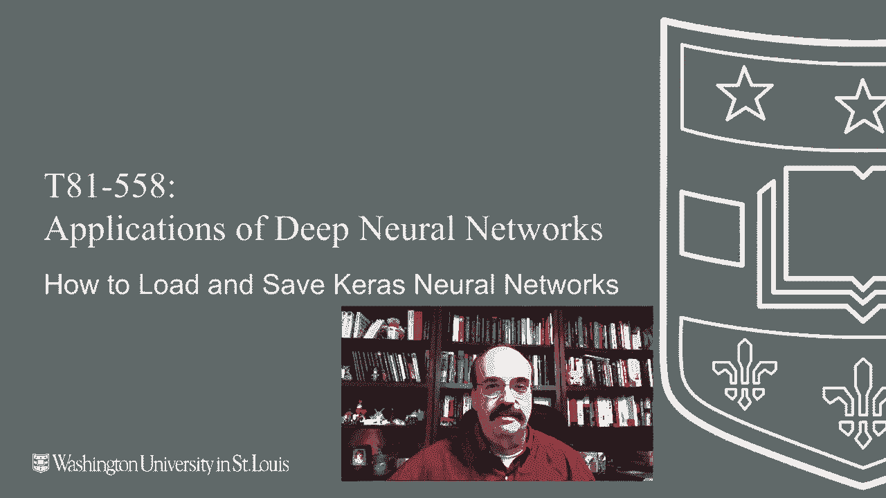
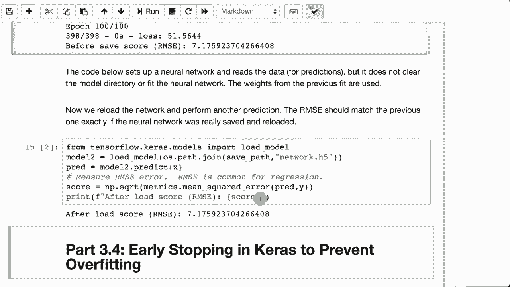

# T81-558 ｜ 深度神经网络应用-全案例实操系列(2021最新·完整版) - P19：L3.3- 保存和加载Keras神经网络模型 - ShowMeAI - BV15f4y1w7b8

嗨，我是杰夫·希顿，欢迎来到华盛顿大学深度神经网络应用的课程。在这个视频中，我们将看到如何从磁盘加载和保存 Keras 的神经网络。一旦你花了这么多时间训练一个神经网络，你希望能够保存一个副本。

这在你保存一个经过训练的神经网络副本并将其部署到网页应用或网络服务时也很有用。就像我们在本学期稍后会看到的那样。

有关我的 AI 课程和项目的最新信息，请点击订阅以及旁边的铃铛，以便收到每个新视频的通知。现在，当你保存和加载 Keras 的神经网络时，你可以选择几种不同的文件类型。其中两个是文本格式。

因此，你实际上可以打开文件并在文本编辑器中查看神经网络的组件。我通常不这样做，但如果你想的话，可以这样做。在 JSON 中，有很多工具可以读取和写入 JSON，所以你可以直接访问神经网络的保存状态。

所以 Yaml 是一种仅存储神经网络结构的格式，不存储权重。类似地，JSON 也不存储权重。这就是为什么我不常用前两个格式。不幸的是，这些是最容易阅读的文本格式。HDF5 不要与 HDFS 混淆，后者是 Spark 和 Hadoop 的格式。

这是我通常存储这些内容的格式。前两个选项，如果你不需要存储实际的权重，可以使用。这演示了你如何做到这一点。所以这里我们正在打开之前的数据集 auto MPG。我们将构建几乎完全相同的神经网络。

进行预测并计算均方根误差，并打印出来。我们将把这个神经网络保存到网络 JSON 文件中，它将与您的工作簿位于同一目录。我们将保存为 JSON，保存为 Yaml，保存为 H5。

我们可以继续运行这个。现在注意 RMSE 为 7.17。每次你运行这个，你都会得到一个稍微不同的 RMSC。这实际上是一个稍微差的结果，你绝对可以做得更好，但对于测试这个功能来说已经足够好了。现在我们将加载它。注意值完全相同。

这表明它确实是保存到了磁盘文件并被读取回来。因为如果你重新运行并重新训练，那些将是完全不同的值，而这样做效果不好。现在这个技术将在整个课程中使用。实际上，在接下来的部分“早期停止”中，我们将看到可以编程神经网络仅使用其实际需要的训练周期。

它实际上会在最佳点停止并保存神经网络，然后你可以稍后重新加载最佳权重。在本课程的后面，我们还将看到如何将神经网络部署到网络应用程序或类似的地方。能够保存你训练的神经网络非常有用，以便将其部署到云端或其他地方。

现在你已经看到如何保存和加载汽车的神经网络。我们将在下一个视频中讨论如何使用早停法在神经网络过拟合之前停止它，保存和加载在这里起作用，因为神经网络已被保存。

当它达到最佳值时，你需要稍后重新加载它。感谢观看本视频。该内容经常变化。因此，请订阅频道，以便及时了解本课程和其他人工智能主题的最新信息。
