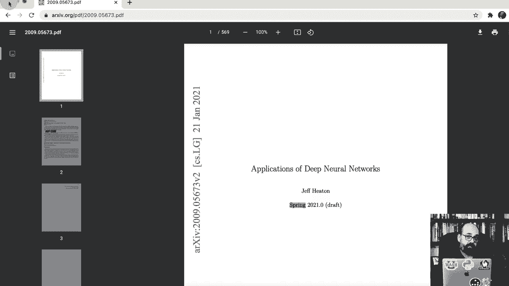

# T81-558 ｜ 深度神经网络应用-全案例实操系列(2021最新·完整版) - P2：L1.1- 深度神经网络课程概述的应用 - ShowMeAI - BV15f4y1w7b8

嗨，我是Jeff Han，欢迎来到华盛顿大学的深度神经网络应用课程，这是2021年秋季学期的开始。

🎼所以在这个视频中，我将开始课程，介绍它。如果你是通过华盛顿大学上这门课，我将讨论如何提交作业等内容。目前以在线和混合形式提供，在混合形式中，你会在校园上课一次，其他时间是远程的。如果你是纯在线版本，一切都是一样的，除了你观看的是预录视频，或者如果你希望，可以参加直播。如果你只是通过YouTube在网上收看，所有内容都对你开放，只是你不能提交作业或获得我像实际学生那样的个别帮助和指导。上学期我们以完全在线的形式教授这门课程，我一直在COVID期间这样做，而这一学期我们实际上…

我们将根据COVID的情况逐日安排，但目前的计划是这门课程将在丹佛大学校园举行，华盛顿大学的四次会议。我将通过Zoom进行直播，并且会有录制可用。所以这学期我不要求班级出席。我们将在第一次会议和Zoom中进一步讨论这些信息。关于这门课程的所有信息，你可以通过华盛顿大学的Canvas系统获得。

这些链接主要指向我的Github仓库，所有这些内容都存储在那里。这是我在华盛顿大学的页面，我可能需要更新我的照片，我认为COVID时期的胡须可能会留着，但网站链接在这里，这里有一些关于它的一般信息，你会想直接去Github上的课程会议。

如果你是通过华盛顿大学的Canvas系统访问这门课程，它的界面基本上是这样的。所有视频都可以通过YouTube或Kaltura获得。它们是完全相同的视频，你可以根据自己的喜好观看。其中一个很酷的地方是提供了字幕，你可以在视频中搜索主题，这在Kaltura中也可用，你还可以加快播放速度，以两倍于正常速度观看我。

我一直在做视频。这些视频每个都会包含一些内容，所以这是链接到Canvas上Calaltura的视频，然后会有阅读材料和每堂课的作业。如果你点击阅读材料，它会将你带到GitHub，并且如果你直接通过互联网访问，它的样子就是这样，实际上这个课程中的一切都可以在Jupyter Notebooks中获得，而Jupyter Notebooks是进行深度学习的一个很好的方式。

😊，虽然你不需要GPU，但我将在本课程中向你展示的一些内容实际上只用CPU是无法工作的。现在我身后这台电脑有一个相当高端的GPU。我正在使用的这台Mac也是，正是目前Mac的一个激动人心的时刻。如果你有新款的Mac，现在可以使用M1，以便能够使用GPU或加速器来利用深度学习所需的高速数学计算。

我有一个视频展示如何准确设置M1 Mac以满足本课程的需求，如果你使用Linux或Windows，也可以在其中使用GPU。你确实需要Nvidia类型的GPU，因为Keras是TensorFlow Keras所必需的。

这是我们在这节课中使用的。如果你的系统上没有GPU，我强烈推荐你这样做。实际上，如果你不想经历设置GPU的步骤，因为确实需要很多软件配置。

驱动程序和那类有趣的东西，我确实推荐Google Collab，所有我在本课程中提供的Jupyter Notebooks顶部都有一个“在Collab中打开”的链接，所以你只需点击它，它就会在Collab中启动，现在我们在Collab中。

我在使用Google Collab Pro，每月大约$10，这个课程并不需要它，但当我们进入Kaggle比赛时，它会给你带来不公平的优势，这里的“不公平”指的是它是允许的，你可以使用它，一些学生在Kaggle比赛期间确实使用Google Collab Pro，以获得更快的GPU，你在Kaggle内部也会有一个很好的GPU可用，但我们会在第一次课堂上进一步讨论Kaggle。

所以你可以看到所有内容都在这里可用。你可以运行这些不同的部分。第一个课程模块大部分只是介绍性的材料，直到最后才有很多代码。所以如果你运行这部分代码，这会检查你的GPU是否真的可用，你会看到那个小的旋转标志，它正在旋转，并会告诉你GPU是否可用，以及你正在使用的TensorFlow版本，所以这里是TensorFlow 2。

5是我这个学期测试所有代码的版本。由于GPU不可用，这意味着你需要在collab中向下更改运行时类型，启用你的GPU，它会重启你的虚拟机，这没问题。现在我们继续运行，它的GPU应该可用，是的，GPU可用了，这将大大提高所有处理的速度。

如果你想仅使用CPU，你可能可以完成大约90%的课程。我想说Mac M1的支持还是相当新的。我自己只有大约一个月的时间使用这台Mac M1，但我正在运行所有的课程材料，并在遇到不兼容的问题时进行修复，大约95%的课程都能在Mac M1上运行。

还有一个小地方是无法工作的，那就是我们进入stylegan的部分。在那里，你使用Gs生成计算机生成的面孔，因为那段代码是专门为NviDdia cuda创建的。如果你想在Mac上实际运行它，可以查看关于coabab的入门视频。

我有视频展示如何做到这一切。如果你不是那种配置驱动程序的人也没关系，机器学习工程师有时并不是这样。你可以直接使用coab，大约70%到80%的学生使用coab，所以我在这里给你提供说明。

这些是关于如何使用coab以及如何在Mac上设置的链接等等。我还有一段关于如何在Intel Mac上设置的的视频，虽然Intel Mac没有加速，但至少你可以运行一些东西。这些是课程的作业，我们会有一个冰breaker，你需要向其他学生发布一些关于你自己的信息。我会阅读每一个，因为我对你们的背景非常好奇。

如果你对AI机器学习等职业方向感兴趣，我会回复每一个冰breaker问题。如果你问我一些问题或给我一些评论，我一定会回复你，因为我会浏览所有的课堂作业，50%是每周到期的。

对于课程的第一部分，前1节课。这些是小程序，测试你对材料的理解。每个程序可能需要半小时到一个小时，甚至更长的时间完成。每个人在课程中的速度不同，有些部分比其他部分更复杂。第一个程序很简单，你只需运行它，不需要做任何更改，只是证明你可以运行Python代码，因为这门课程完全使用Python，并提交一个结果。我使用自动评分和反馈程序，所以当你提交时，它会自动使用我将发送给你的API密钥。

你必须是我的学生才能获取这个，因为我无法在没有Canvas的情况下给你打分，也没有时间给不是我学生的人评分，所以这是我写的一个项目，完全是我自己的创作。我实际上使用神经网络和正则表达式等工具来进行评分，它并不总能给你准确的分数，但会给你反馈，并告诉你，你可以在此之前提交多次。因此，如果你想一直提交，你应该能够在所有课堂作业中获得100%。它会告诉你哪里出错，并检查你的输出，让你知道它是如何匹配的。如果你不明白为什么你的输出与我的不匹配，可以通过Teams或电子邮件向我提问，这些是与我联系的主要方式。

你将有团队参与这个项目。你可以选择自己的团队，团队可以跨越两个部分。这里有一个完全在线的部分，还有一个在大学见面的部分，总共四次，所以你可以与其他人一起参与，你也可以与不在班级中的人一起合作，通常这是在课堂上的Kaggle中进行的，所以互联网上的其他人也会参与竞争。

我会对提交的内容进行排名，前五名提交者将会在接近期末课时进行展示，这样你们就不必每次见面时都听我讲。我们将在第四节课上见面，完全在线的学生不需要这样做，你们当然可以选择展示。

在Zoom上，如果你是前五名之一，我会联系你们。当我们达到那个真正的Kaggle时，会有可观的奖金可供争夺，这些Kaggle没有奖金，但我可以告诉你的是，前两名我完全愿意为你写一封很好的LinkedIn推荐信，谈论你在Kaggle比赛中获得顶尖位置的出色表现，之前学期的学生都非常喜欢Kaggle，我认为这是这门课中最有趣的部分，它让你可以与其他学生竞争，真正看到你能产生多好的模型，然后是期末项目，如果你是前五名之一，你不需要做期末项目，但期末项目基本上是你的演示。

这是深度学习的顶级会议之一，如ICLR或NIPS等。基本上是写一篇总结，我选择的一些论文是你可以从中选择的，因为我给你提供大约10篇，实际上是华盛顿大学的学者们写的，所以这挺有趣的。这些都是我们第一次在大学见面时的所有作业。

我会逐步讲解如何提交作业，如果你想和我一起进行操作，你就能提交你的第一份作业。再次提醒，如果你通过互联网连接，你当然可以看到作业，但实际上无法提交或评分等。我是你们的讲师Jeff Heaton，我拥有华盛顿大学的信息管理硕士学位，后来在Nova Southeastern University获得了计算机科学博士学位，我是在生活的后期完成的，二人制。

所以我并不是一个传统的博士生。我是IEEE的高级成员。我的电子邮件地址是JT Heaton，加上这个大学的域名。我还有一些其他的认证，你可以看到我社交媒体的一些链接。我从未计划成为YouTuber，但在你们有Calaltura之前我就开始把这些视频上传到网上，结果我发现我有超过50000个订阅者。所以YouTube很有趣，我继续在上面发布其他视频。作为学生，我非常鼓励你订阅我的频道，我不知道是否应该像YouTuber总是告诉你那样猛戳喜欢按钮，但如果你订阅了频道，你将会看到其他超出课程的高级主题，随着我发布额外视频，通常我每周发布一段视频，有时只是课程材料的更新。我每学期可能会重启5%到10%的课程。我有一个Discord服务器，你可以在上面进行讨论。

这是在Canva内部完全开放给互联网的，我有一个链接到Teams，Washoe Teams系统中有一个为学生设置的团队。我强烈建议你尝试一下，如果我有空的话，我经常和学生聊天，这是一个寻求帮助的好地方。你可以在Google Scholar上查看我以前的论文，当时我更多地专注于研究。多年来我没有写过论文，我在researchgate和ORCID上的资料也是我当时发表更多论文时的记录，实际上我就在这里。

如果你要在自己的电脑上安装，我们将使用Python Anaconda。我其实推荐Miniconda，它是Anaconda的精简版。我们将使用TensorFlow。目前，争夺的两个大竞争者是TensorFlow和Pytorch。我也非常喜欢Pytorch。这个课程始于2017年，当时TensorFlow确实是唯一可用的，Pytorch也不错，但这并不意味着它们之间有明显的领导者。

我看到越来越多来自Pytorch的支持，尤其是新论文的发布，特别是带有代码的论文。TensorFlow也得到了我在大型公司担任数据科学组副总裁的日常工作中使用的一些工具的支持。所以什么是机器学习？机器学习就是从数据中学习。

所以，你有传统的软件开发，你会获取输入数据并编写。

程序代码，你会在计算机上运行这些代码，并获得输出。机器学习，你从过去已知的案例中获取输出，所以你有标记数据。也许你有一堆猫和狗的图像，并将其标记为猫和狗，你把这些放入计算机，它给你程序代码。程序代码就是神经网络。所以这被称为数据驱动开发。

这减轻了你需要编写大量代码以区分猫和狗的负担，因为这对于传统编程来说是非常困难的。这是我看到深度学习被广泛应用的三个领域之一：预测建模。

这非常像你有一些输入。你在电子表格中有一个输出，但现在你有新的情况，没有标记。这是未标记的数据，你想形成那些预测，计算机视觉同样适用于自动驾驶汽车。

区分猫和狗，我给你在Caggle的任务将是一个计算机视觉问题，这学期将是一个相当具有挑战性的任务。我总是为Kle竞赛生成所有数据，所以这是全新的，是你无法在网上轻易找到潜在解决方案的，此外还有时间序列预测，比如股市。

想想比特币，想想任何东西。显然，我还没有破解如何预测比特币，因为我还有日常工作和夜间工作。回归、分类，这些都是回归，你是在预测一个数字。分类，你是在预测一个类别？

深度神经网络就是经典神经网络，但它们在卷积层、递归层、变换器、注意力等方面进行了多种扩展，使其超越了以往的能力。真正推动这一领域发展的个人有Jann LeCn、Jeffrey Henton、Yahua Bennjiio和Andrew Ning，为什么深度学习。

与其他机器学习方法相比，如支持向量机、随机森林、梯度提升机，神经网络在计算机视觉领域表现出色，因为神经网络能够自主创建特征。

以前处理计算机视觉的方法是引入额外图像并从中工程特征，查看最大颜色、扫描，尝试找出细节。Andrew Ning对此有很好的描述，旧算法如果你是学术研究人员，旧算法就是你不再研究的东西。

深度学习是他和大多数机器学习研究人员目前关注的重点。

如果你的数据不多，数据较小，旧算法通常会优于深度学习。我们将使用Python，使用TensorFlow，课程中会稍微涉及Pytorch，尤其是用于GNs，因为我们使用的Stata2 AD软件是完全在Jupyter笔记本中编写的。如果你需要课程教材，也可以获取。

我编写的教材基于你所拥有的所有材料，教材请点击这里打开，格式为PDF，超过500页，基本上与GitHub库中的材料相同，只是以可打印的教材形式呈现。最终，我会将其出版为实际书籍，你可以通过Kendall和纸质版购买。

我还没有更新。每个学期我都会更新，所以当你下载时，会有最终的更改，并会标明2021年秋季。就是这样，这门课程的快速概述。我们将在Zoom会议和本学期实际校园的面对面会议中具体讨论如何安装、提交作业。感谢观看此视频。如果你觉得有用，请订阅我的YouTube频道，并考虑点击点赞按钮。

如果你通过YouTube观看此视频。
