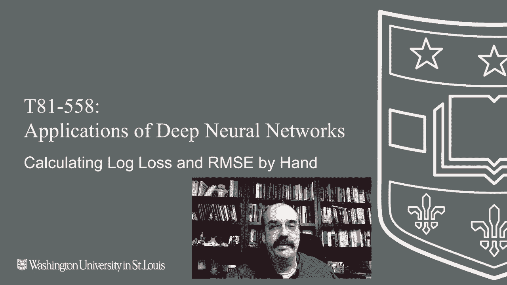
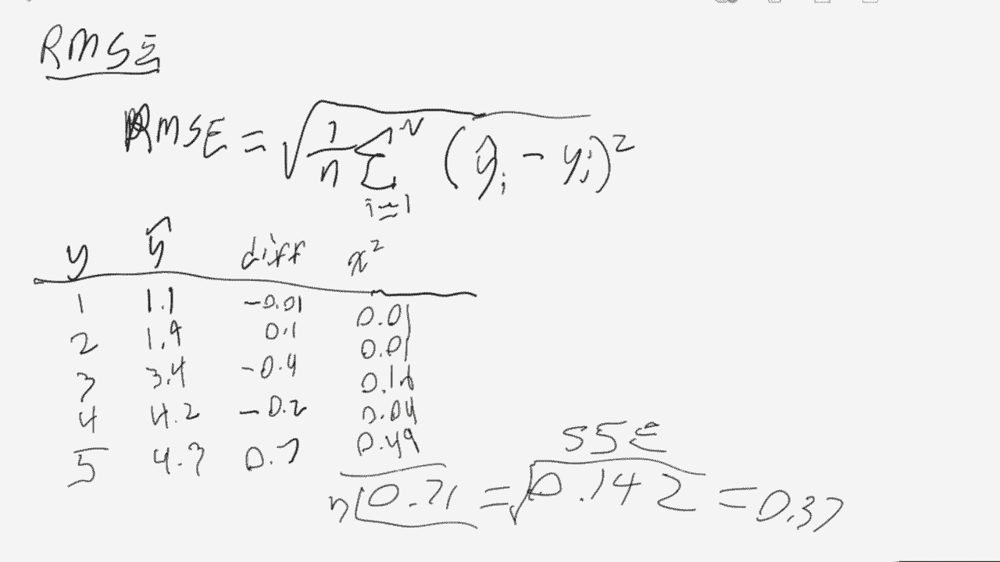

# T81-558 ｜ 深度神经网络应用-全案例实操系列(2021最新·完整版) - P26：L4.5- 从头开始计算神经网络RMSE和对数损失 

嗨，我是杰夫·希顿，欢迎来到华盛顿大学的深度神经网络应用课程。在这个视频中，我们将看到如何手动计算一些错误指标，这样你就可以真正看到这些数值是如何产生的。我们将特别关注对数损失和均方根误差，关于我最新的人工智能课程和项目，请点击订阅旁边的铃铛，以便收到每个新视频的通知。现在。

我们将看到如何从头开始计算均方根误差和对数损失。我们将从回归开始。😊。

你可以在这里看到代码，顶部的代码演示了如何使用内置函数计算均方误差和均方根误差。通常这就是你想要的，这是我们之前看到的。然而，如果你想看看如何实际计算这个，你会发现我们得到了完全相同的结果。

我们基本上是在计算平方和。这里你可以看到预测值减去期望值。我们将这些平方相加，最后将其除以预测值的长度。所以这有点像平均值，平方用于消除符号。此外，对于训练目的，平方项的导数比绝对值更容易处理。

对于分类，我们正在做类似的事情。只是我们使用对数损失。你可以在顶部看到预期值和预测值，以及你如何逐个计算每个对数损失的部分，并将它们相加，得到与你从内置函数获得的完全相同的值。现在。

我们将看到如何处理这些内容。现在，让我们手动计算这两个值。我们将从对数损失开始。这里是它的公式。好的，这个公式看起来可能有些复杂，但实际上有几个部分，让我分开讲解一下，给你展示一下到底发生了什么。首先。

让我们看看对数的图形，因为这有助于解释一些内容。因此，对于对数，有几个非常重要的点，对数零是本质上未定义或渐近于负无穷。对数1是0，当你绘制对数时，它在这里与0相交。现在。

我真的很糟糕于绘制方程，但你会明白大致的想法。有一点无穷大，在那里渐近。然后，它相对较小地增长。Logar，在我的研究中，这实际上出现了两次，我们关心它实际的样子。

它比那多得多，但就我特别处理的领域而言。如果你处理计算机科学，这个区域特别有趣。因为当你进行算法分析时，N阶的东西，对数规模实际上是相当不错的。与指数级增长相比，它并没有真的那么快增长。

这只是会非常非常非常快地上升。但对于数据科学或机器学习领域而言，日志图的这一部分并不是我们感兴趣的。数据科学和机器学习更关注的是它的这一段。这是我们用来分析错误的地方。所以这是数据科学区域。

这在数学上可能不是严格的，计算机科学和数据科学。我确信这两个领域会交叉到另外两个领域，但这只是一个很好的简化思维方式。所以在数据科学中，或者在我们计算的这个机器学习对数损失函数的区域。

如果你认为1是完全正确的，或者你猜对了。所以你在尝试分类某些东西。如果它是真的，你选择了真的。这意味着贡献给你的错误方程的错误将是0，这是好的。你完全猜对了。你不希望自信地错误。

所以在这些机器学习算法中，如果你想说“真”，你通常不会只是说“真”或“假”。你会说，我认为它有0.9%的概率是真的。你不希望在学校的真假题上也能这样，如果你不太确定，可以说0.5的概率。

意思是我不知道，它可能是真的，也可能是假的。你通常会损失半分。那么，或者你可以说0.75的概率。如果你答对了，你会得到三分之四的分数，但如果不对，只损失0.25分。所以，这就是它们的评估方式。你不希望的是自信地错误。因此如果你说它的概率是100%是真的。

然后如果它是假的，那你就在一个无限糟糕的分数上。我很高兴学校不是这样的。你不能得到无限糟糕的分数。你只能得到0分。但是，在这里你可以糟糕到无限糟糕，这就是为什么通常当你查看这些预测时，你很少会看到0或1的预测，它们会非常接近，因为优化算法通常会将其限制在那个范围。

所以注意，对于数据科学的那个区域，一切都是负数。你可以谈论负错误。你可以说我有负0.025的对数损失或类似的东西。但为了理解，我们习惯于将错误报告为正数。所以这就是为什么前面有这个负号。这本质上将其完全转移到。

对于正范围，那就是所有负值所达到的效果。这个一除以 n。那部分基本上就是平均值。所以 n 是你训练集中的元素数量。你不希望在非常大的训练集中出现极大的错误。

你需要像考试纸上的百分比一样对其进行归一化。这就是为什么你要除以问题的数量。如果你只处理分数。如果你说，我在考试中得了 30 分。好吧，如果满分是 30，那挺好的。如果满分是 3000，那就真的很糟糕。所以这就是负值和一除以 n 的含义。

正在完成。然后我们需要将所有这些日志损失错误进行汇总。这将给你所有日志损失的总和。然后你将它们除以 n。所有的日志损失，零。接近零的值并不是特别糟糕，你是接近真实或虚假的。

或者你所处的更高值。你在很大程度上是错误的。你尝试防止这种情况。你通常会限制这个，以便你不会有 Y hat 值，顺便说一下，Y hat 是你的预测。你在这里看到的两个 y hats，就是你的预测。为什么是真实的。那是你比较的值。我们在每一个值上都有下标 i，以便进行计算。

或者只是因为那是单个编号或单个训练集元素以及你的预测。它的第一部分，就在这里。这部分处理真实情况。然后另一部分处理虚假情况。所以你在分类，是对还是错？

这些被控制的方式有点像数学中的 if 语句。数学家喜欢使用系数，通常用于 if 语句。而你所处理的两个 F 语句基本上在这里。还有那里。如果 y sub I。这是绝对真实的，是你比较的训练集中的值。

如果是真的，那么这将是 1。绿色的 y sub I 将是 1。如果是假的，那么它将是 0。所以在处理真实值的所有情况下，第一个系数，绿色箭头将是 1。而在处理虚假值的所有情况下，红色箭头将是 0。

因为 1 减去。所以这本质上关闭了这两侧。所以其中一侧每次都会抵消，具体取决于它是真还是假。所以如果这确实是真的。则 sub1 y sub i 将是 1。这样就不会抵消，然后理想的日志。

如果真实答案是真的，你希望 y hat 也是真的或者是 1。如果情况是这样，你正好抓住这一点，那么 log 的一将会抵消。但这很好，因为你得到了一个完全正确的答案。而且现在，你不希望有任何错误被贡献。

如果你猜的是0.9，那么log 0.9将被加到你的错误中。但这并不算太糟，因为你仍然基本上越接近零，得分就会越糟。看看我在直角坐标平面上绘制的曲线。现在，从另一个角度来看。

如果是错误的，所以如果正确答案y下标i是错误的或0，那么第一个真值项将被抵消。然后假值将变为1。所以它将具有系数1，1-0是1，乘以1的对数。1减去y下标i。我们现在基本上在反向执行这个操作。

我们现在基本上要处理的情况是。如果在这种情况下你猜的是1。它是错误的，但你猜的是对的，你现在是无限错误，因为1-1是0。这将使你进入对数的无穷大。现在，如果你猜得比较接近，比如0.1，那么1-0.1是0.9。这并不算太糟，你大致在我刚才描述的相同位置。

所以你在对数计算上更接近于0。现在，当你实际实现这个方法时，这种方法在处理计算机科学或将其作为程序实现时会有几个问题。一方面，你依赖于你的编程语言如何聪明，以便消除零的东西。你可能会计算对数两次。你其实不需要这样做。

因为它会抵消。我至少被这个问题烧过几次，如果这两侧中的任何一侧变为负无穷。你实际上是在乘以，即使你希望在大多数编程语言中抵消它。

零乘以无穷实际上是零，或者实际上是无穷。从数学上讲，如果你使用我相信是海塔尔法则，你可以认为它是0，基本上是在一侧或另一侧观察无穷的速率。你乘以好的部分。即使你可能完全正确地回答了这个问题。

它不应该导致方程崩溃，但确实会导致方程崩溃，因为你在乘法的一侧或另一侧有无穷大。然后整个结果会变成无穷大，或者取决于实现可能是NA。现在让我们看看我们将如何实际计算它。所以我将向你展示的计算方式，我们实际上不会。

我们将更像计算机那样做。我们不会逐行取两个对数。我们来看看几个案例。我们将查看的情况就像我之前展示的代码，所以我知道我的数学是正确的。

我大致是在重复我在Python中做的事情。所以我们将有一个数据集，我们将有y。然后是y的帽子。

所以这就是为什么答案正确，为什么预测是这样的？

我们并不是在真正计算差异。在顶部部分，唯一的差别其实就是一个负号，但大体上，这就是我们要得到的。实质上，我们是在计算你与目标之间的偏差，并加上其对数。因此，我在这里计算的差异就是这个。

顺便提一下，这是差异的绝对值，而不是我们在RRC中会做的平方，而仅仅是绝对差异。现在我们需要计算这些值的对数。我们先进行求和，然后再除以n。这个绝对值就是我们在Python中得到的值。

所以这是你如何完全手动计算对数损失。L R在一个海上。铅笔电量低了。我需要赶快。这些天一切都需要充电，连铅笔也是。你有一个1/n，和之前一样。你不需要负号，因为这些数本质上会保持正值。这是平方和。你基本上是对每一个y hat减去Y，顺序并不重要。

因为你会对这些差异进行平方。但这些是我在Python中使用的数值。这让我可以检查我的数学计算，以确保我实际上是正确的。现在我们计算差异。接下来对每个值进行平方，并对其求和，最后除以n。这个值实际上被称为平方误差和。

这个数字，如果你只是编写一个算法并试图优化，也就是说你试图将一个数字推向零，停在这里，使用平方误差，因为在此基础上进行平方根只是为了使其与训练数据处于相同单位。如果你只是进行优化，使用平方就足够了。

但是如果你想将其报告给某人，以便他们实际查看你的偏差，那么你需要进行平方根运算来得到RNSC。

这就是罗门平方误差。感谢你观看这个视频。在下一个视频中，我们将开始研究正则化，这又是一种可以抵抗神经网络过拟合的方法。这个内容经常会变化，所以请订阅频道以保持对这个课程和其他人工智能主题的最新了解。😊
