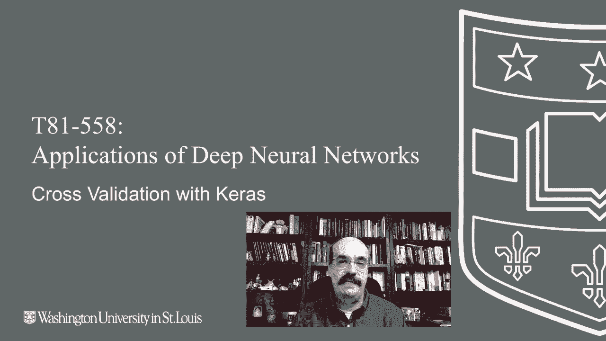
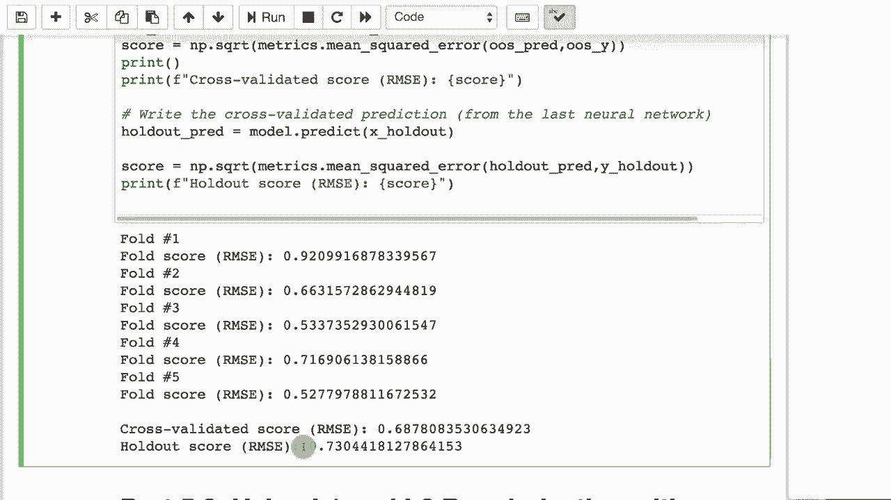

# T81-558 ｜ 深度神经网络应用-全案例实操系列(2021最新·完整版) - P28：L5.2- 在Keras中使用K折交叉验证 

嗨，我是杰夫·希顿，欢迎来到华盛顿大学的深度神经网络应用部分。在这一部分，我们将看看如何使用K折交叉验证来很好地估计我们的神经网络在训练集之外的数据上的表现。这将使我们能够产生样本外预测，即对于整个训练集的预测，仅需翻转训练集，让每一部分数据都有机会成为验证集和训练集。

这将让我们看到我们的正则化和其他技术在对抗过拟合方面的效果。有关我的AI课程和项目的最新信息，请点击订阅并点击旁边的铃铛，以便在每个新视频发布时获得通知。交叉验证通常有不同的目标，你实际上是在尝试完成的。k折交叉验证的整体思想是你会得到多个。😊

训练集和验证集，这样你就可以在数据的一部分上训练神经网络，而在另一部分上进行评估。这样做的最常见原因是从神经网络生成样本外预测。我们将看到如何做到这一点，但你基本上可以为整个训练集中的每一个元素生成样本外预测。当与早停结合使用时，你还可以用它来估计训练神经网络所需的合适训练轮次。

我们已经看到过。最后，你可以用它来评估某些超参数的有效性。也许你想要测试。😊，添加另一个隐藏层或其他对你的神经网络的调整是否真的有所帮助。然而，由于神经网络的随机性，通常你需要进行的不仅仅是一组交叉验证折叠，以真正评估你所做的是否产生了任何效果。我们将看看一个称为自助法的过程，以真正评估变化的有效性。

这就是交叉验证的工作原理。你基本上将数据集分成五个折叠，通常是10个折叠或其他数量的折叠。每个折叠中的元素数量应该相对均匀。由于你的数据集不会总是均匀地分成五个折叠，或其他数量的折叠，你将会在每个折叠中有一些额外的元素。

但在很大程度上，它们彼此之间相当。你有多少个折叠，你就要训练多少次。所以你实际上会为每一个折叠训练一个神经网络。这就是在这五个神经网络中你所做的复杂性之一。我们也会讨论这一点。但基本上，你会在每个折叠中选择。

因此，每次通过这五个相同的折叠，它们在每一个中都是相同的五个折叠。你选择其中一个折叠作为验证集，使用其余的，将折叠2、3、4和5连接在一起。这就是训练集，突出显示的部分就是验证集。因此你训练这个，并得到一个模型。

你训练这个，就得到了另一个模型。这让每个折叠都有机会作为验证集，你本质上是在验证集上生成预测。因此，如果你把所有这些黄色区域连接在一起，或者你有外样本预测，如果这是你的目标之一。你可以在这里看到，你基本上对每一个都进行了预测，并将这些预测连接在一起。

现在你有了一个外部预测。😊 在整个训练集上，这很好，因为你不必将部分训练集浪费用于训练，部分数据集用于验证，你能够对整个数据集进行预测。现在，如果你想将这些结合在一起，假设你已经训练了这个，现在你有五个神经网络。

有几种方法可以获得最终结果神经网络，用于处理所有这些新数据，因为你可能是因为想要持续训练某些东西而创建神经网络，比如说你是一家人寿保险公司。

你有历史数据，并且你已经创建了这个，你训练它以试图分类这些人因你的人寿保险政策而死亡的风险。你将会有新的人进来，而这正是你真正想要工作的内容。所以你需要弄清楚你在做什么，你是在选择这些模型中最好的一个，还是把它们全部平均，或者以某种方式组合在一起，这些都是常见的方法。

你可以选择验证分数最高的模型。不过，有一个警告信号，我倾向于关注的是这些模型之间的验证分数有多相似。如果其中一个模型的得分持续低于其他模型，那就意味着在这个验证集中有一些离群值，比如模型4。

因此，你看到这些模型之间的差异越多，意味着你仅仅有几个离群值落在了特别的验证折叠中，这可能是你需要在数据集中考虑的事情。也许你想要消除那些离群值，或者你，但至少你应该意识到它们，新的数据进来。

比如说你的新的人寿保险申请，你可以把这些呈现给这五个网络，然后进行投票或者取平均。所以投票的意思是，如果前面三个说不，不要给这个人投保，而第四和第五说是，那么多数派获胜，你就会说不。或者它给你某种评分或年龄，你认为这个人会活到。

然后你将它们全部平均。这是我可能最喜欢的一个。我更倾向于平均法或这个。所以你在每个上都进行提前停止。你要记录每个完整的训练需要多少个周期。也许这个训练到最优水平用了300个周期，这里提前停止到50。

320，这里，多少个周期。然后你将它们平均，或者取最大值，或者还有其他技术。但是你查看所有这些所需的训练周期数。然后在整个训练集上进行训练。你不使用验证，按照那个训练周期数进行训练。然后这就成为一个希望是最佳的单一神经网络。

在那些中最好，你仍然有神经网络的随机特性。所以你可能想多次训练这个。也许将它们平均在一起。现在，让我们看看一些如何进行交叉验证的例子。所以这里的目标将是样本外预测。

所以我们将进行样本外回归，因为对于每个这些，代码看起来稍微不同。所以你要做的是，分类和回归之间的交叉验证有一些差异，回归肯定是更简单的情况，因为你只需简单地将其划分为相等数量的折叠。

你完成了，但在分类中，你需要确保打破这些折叠不会影响你的类别平衡。如果你正在分类，比如说三种事物。你要确保这三种事物的比例在每个折叠中都是一样的。否则你会给神经网络引入偏差。这不是件好事。

所以这是用于回归的样本外 k-fold 交叉验证。在这里，我们设置了数据分配。我们使用之前相同的简单数据集，预测年龄。就像之前一样，因为这是一个回归问题。所有这些其他值都是为了帮助我们预测年龄。

现在我们假设500个训练周期。我们不打算使用提前停止，因为我们希望我们的验证折叠能真正给我们某种样本外预测。我们可以使用提前停止。所以也许我们会单独进行一次运行，弄清楚需要多少个训练周期，然后可以将其调整为更优的值。

但现在，我们只是假设500个周期，以便获得一个真正的样本外预测，了解500个周期的表现。在这里我们设置了交叉验证。我们使用的是随机状态42。那意味着每次的折叠都会是一样的。打乱总是个好主意。如果你在打乱。

你需要一个随机状态，以便你知道你的折叠是相同的，但每次运行时你的折叠都是不同的，因为你在尝试实验。这将使事情变得不一致，你不会注意到比如说折叠1一直在得到一个异常值。

更改这个值是可以的。但这至少给你一些一致性，以便在实验时使用。然后你得到训练集和测试集的分割。你传入X数据集，并且每次循环时你都在创建一个回归神经网络，因为这就是其中之一，而这就是均方误差。使用Adam进行训练。现在你正在与验证集进行拟合，以便可以报告验证错误。

当你进行样本外预测时，我们正在创建样本外Y值。这只是为了确保我们获得的Y值与我们的折叠顺序相同，以便我们可以进行最终评估，并且样本外预测只是简单地将它们连接在一起。

在进行每个操作时，你会生成样本外的预测，并将各个折叠连接在一起，以便最终得到一个统一的结果。你报告得分，以便得出整体得分。对于这个折叠，整体得分最后会在最后得到。你将把所有分组的样本外Y值连接在一起，样本外预测。然后你将比较这些Y值。

我们想要的价值观与预测值之间的差异。我们将报告一个最终的样本外评分，即这两者之间的差异。这就是你对你的神经网络的实际表现的估计。我们还可以列出样本外的预测。

如果我们想要进一步分析，可以将它们写成一个Cv文件。现在，当我们进行分类时，我们需要做一个叫做k折交叉验证的过程。这是因为我们不想说每一类物品的平衡。所以我们将使用相同的方式，继续运行并加载数据集。

现在我们正在尝试预测产品。因此，无论产品的平衡是什么。也许他们有20%的概率选择产品A。😊你不想改变这种平衡，因为那就是你的真实情况。如果神经网络根据你的数据非常不确定，它总是会说产品A的概率是20%。它会说，嗯，20%的概率。

如果它完全不清楚输入数据的情况。也许输入数据在这种情况下特别困难。所以如果你训练一个神经网络，而真实情况的百分比差异，类A在折叠1中大得多，而在折叠2中则小得多。

这会干扰真实情况，从而影响你的神经网络的准确性。所以我们使用分层 Kfold。我们在这里进行分层 Kfold 采样。我们将有五个折叠，我们将随机打乱并设置一个随机状态。这个看起来是一样的，和 Kfold 一样。

我们将继续在样本外进行预测，就像之前一样。但这一部分有点不同。我们正在进行分割。所以在之前的操作中，我们只传入了 X。但由于我们想要在 Y 上进行平衡，我们必须传入 y。我们必须传入类。

所以它需要知道我们要平衡的类是什么。我们从数据框中传入原始类。我们不想为此传入虚拟变量。这不是为了处理虚拟变量而设计的。它需要一个像 ABC 这样的类，或者其他产品。它使用这个确保每个折叠中的平衡是相同的。

所以这非常重要。你可以在这里直接使用 Kfold，就像在回归中一样，它会正常工作。😊但你会有不平衡的分割。而且通常这会正常工作，但可能会对你的神经网络的准确性产生一定影响。我们使用分类交叉熵和 softmax，以及与我们分类神经网络的类别数相等的输出神经元。

其他一切与回归相同。我们报告每个分数的个别准确性。我们使用准确性而不是我们的 MSA，因为我们在做分类。然后我们打印最终的准确性，这样我们基本上就完成了。现在你可以运行这个，它会遍历每个折叠，并报告折叠分数，最后给出最终的准确性。

所以第一个准确性大约是 66%（四舍五入）。现在你可以看到，我们基本上已经经过了所有五个折叠，并产生了一个最终的准确性得分为 66%，这与这些非常相似。最困难的折叠是第五个。

所以在那个折叠中可能有某种异常值或者其他什么因素使其更加困难。或者这可能仅仅是神经网络的随机特性。通常，你会想要再次运行这个，看看这个折叠是否始终很难。而这也是为什么你想使用随机种子，以确保折叠的一致性。最后，你可以使用交叉验证和保留集进行交易。

这是你在做五个折叠之前设置的保留数据集，这样你就可以做到这一点。这样你就能看到，这给你一个与五个折叠不同的保留集。如果我们运行这个，这也是回归。我们尝试预测年龄。然后我们可以运行它，我会让它运行，这样我们就能看到。

你设置五个折叠，就像之前一样，并且循环整个过程。1回归。你正在训练均方误差，使用原子更新规则。这其实非常相似。所有折叠都是一样的。只不过你保留了这个最终的保留集，以便进行预测，并将报告一个均方根。

所以你会看到两者之间的不同。我们会走过这一切。我们将得到最终的保留值，这就像以前的训练，只是保留集不在其中。这里是我们的最终保留，注意它比其他的更差。现在看来，我们似乎付出了额外的努力，只是为了得到一个更糟的分数。

但这是一个更准确的评分。这里的过拟合更少。感谢您观看这个视频。在下一个视频中，我们将看看如何实际使用L1和L2，以及它们的组合。这些内容经常变化，因此请订阅频道以随时了解本课程和其他主题及人工智能。

