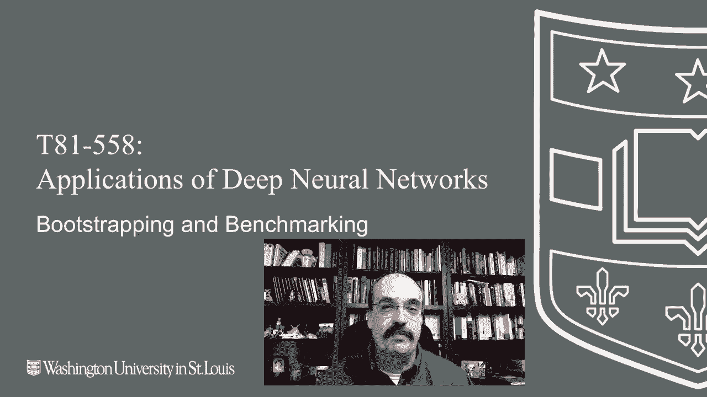
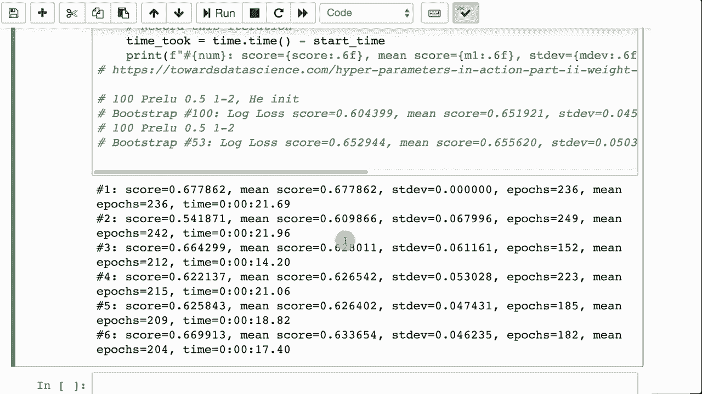

# T81-558 ｜ 深度神经网络应用-全案例实操系列(2021最新·完整版) - P31：L5.5- bootstrapping与基准超参数 - ShowMeAI - BV15f4y1w7b8

嗨，我是杰夫·希顿。欢迎来到华盛顿大学的深度神经网络应用课程。在这个视频中，我们将一起讨论L1、L2和dropout。你可能在想太好了。我得弄清楚神经网络应该有多少层，每一层应该放多少个神经元。现在。

我还得搞清楚这些正则化技巧。设计神经网络变得复杂了。在本课程后面的部分，我们将看到如何使用贝叶斯优化来帮助我们解决这个问题。但现在，我会在这个视频中给你一些关于我的AI课程和项目的实用提示。

点击旁边的铃铛订阅，以便在每个新视频发布时收到通知。到目前为止，我们在这门课程中已经审查了不少超参数。😊。

神经网络中的层数，调整这些超参数确实会影响你的神经网络的性能。每层的神经元数量，以及你在每层使用的激活函数。现在我们已经在每层添加了dropout比例和L1、L2正则化值。

而且你知道吗，我们还没有结束。随着我们继续进行课程，我们会添加更多内容。这些是很多超参数，确定应该如何设置它们可能会很困难。在这个视频中，我不会向你展示优化这些超参数的具体技巧，但我会告诉你如何评估你的变化实际上产生了什么影响。

正如你在这个模块之前的部分看到的，如果你重新运行神经网络几次，即使使用五折交叉验证，你最终的准确率RMSE也会有所不同，这取决于你是分类还是回归。

这可能会让事情变得非常困难，因为在你进行任何更改之前，神经网络的准确率或预测能力在自然波动。在这种情况下，可能很难知道你刚刚对其中一个超参数所做的更改是否真的产生了效果，还是只是看到了神经网络由于随机权重而导致的正常变异。

现在我们要看看一个叫做bootstrapping的东西。bootstrapping类似于交叉验证，因为它是一种可以用来获取训练集和验证集以便与你的神经网络一起工作的技术。但它的不同之处在于它不是固定的折叠数。

你只需不断从初始数据集中重新获取训练集和验证集。并且这是在有放回的情况下进行的。现在，当你说“有放回”时，这意味着你第一次从数据集中提取这些元素后，将它们全部放回，然后下一次你从同一组中提取。

所以你可能会在多次抽样中得到完全相同的训练集和验证集。但这没关系。我们将把所有的准确率或均方根误差平均在一起，以获得神经网络的平均性能，随着我们不断进行，我们将继续从数据集中抽取更多的运行，并查看我们进行了多少次运行。

你需要对数据进行多少次拆分，平均误差才会真正收敛到一个一致的值。我们还将使用提前停止，因此当验证集不再改善时，我们将停止训练神经网络。这还将允许我们报告所需的平均轮次，以便你可以开始了解应该训练多少轮。现在，由于我们在进行基准测试。我们需要报告某些操作所花费的时间，因为我们可能想在Google CoLab或其他允许我们获得更多计算能力的云资源上运行这个。

我只是定义那个函数。很简单。让我们看看如何进行回归的自举。所以我会先向你展示一个回归和一个分类的自举示例，然后我们再看看这个的实际基准测试程序，因为这是回归。我们试图预测年龄。这是我们在本课程中使用过多次的简单数据集。

我将继续运行它。它会简单地加载，加载完成了。现在我要进行自举。所以让我把这个勾选掉，因为它需要一点时间来运行，并开始解释。这里，我们定义拆分的数量。这是我们要进行的多少次运行。我选择了50。

50对交叉验证来说有点大，因为你会得到一个验证集。数据集中有1/50的样本，而在更小的数据集上，这可能会导致问题。但是在这里我们要做的，是进行洗牌拆分。就像交叉验证一样，当我们进行分类时，我们将使用分层拆分，因为我们不想意外改变类别平衡，因为那样会引入偏差，导致可能训练出一个不正确的模型。

至少会有一点偏差，因为它会在错误的平衡上进行训练。要分类的类别部分。0.1告诉我，我正在从数据集中抽取10%的样本作为验证集。我们使用42，这样可以确保从中采样得到的结果是一致随机的。

在引导时做随机状态并不是那么重要，因为每次运行时。我不知道你是否真的关心分割一在再次运行时会与分割一相同。但在交叉验证中，保持一致的折叠会比较好。我们将进行分割。使用这些训练和测试进行运行。我们将构建神经网络。

所以这些是你想要尝试的超参数。你需要将这些更改为不同的值并运行它，尝试了解这一特定超参数集的有效性。我们稍后在视频中会查看这个，我们将看到如何构建基准。我们将使用早期停止。所以，由于我们使用早期停止，而我们的验证数据也是来自早期停止。

我们不能将那个验证集作为神经网络实际有效性的真实指标，因为我们同时使用同一个验证集来停止神经网络和进行评估。但这无关紧要。我们更关注的是不同运行之间的相对值。

并不是这个神经网络的真实预测能力。我们只是想优化超参数，实际上在这里。所以我们会拟合需要的剩余步骤，然后进行预测。我们将跟踪平均误差和所需的平均纪元数。大约纪元，然而。

你想要发音那个词。我们还跟踪误差的标准差，因为标准差让我们了解特定超参数集给我们的方差有多大。神经网络的准确性或R messy在不同运行之间的变化。

现在你可以看到，我们做了相当多的分割。在开始时，我们得到了0.688的分数。显然，这仍然是均值分数，因为只有一个。第一个没有标准差，因为它没有偏离任何值。我们继续获取分数。你会注意到，分数相当波动，Sc等于0。

88，分数等于0.56等等。我们继续这个过程。当我们到达36时，也就是它达到的程度。我们可以看到标准差相当不错。因此，波动大约在±0.18之间。我们可以看到均分数，它有些收敛。大约在74左右，仍然在10的范围内波动。

但是你可以真正看到，在这些开始趋于相当之前，你想要平均多少个。这些纪元。看起来大约在113到130之间。这些值变化很大，但均值纪元已经收敛到1，1，8，11，7。因此均值纪元看起来是117到118。这就是你真正需要训练的纪元数。

然后，平均分数。它说那里，没有太多收敛。它大约在0.75到0.74之间。因此，我们处于相当高的7.4和低7.5之间。所以它大约在0.75左右。但是如果你仅查看这里的平均分数，可以看到随着它的进行，平均值有很多方差。这是回归。现在。

如果你想进行分类，这真的很相似，除了……好吧，你会加载我们将预测的产品数据集，因为它是分类形式。在这里，我们将使用分层洗牌拆分。这将确保这些类在分类中保持平衡。我们使用10%。

就像之前一样，随机状态为42。然后我们要进行拆分。但注意，我们需要除了X以外，还要传入产品，以便我们知道类是什么，以便能够均匀拆分，然后我们再进行相同的拆分，就像之前一样。其余部分实际上是相当相似的。

我们有分类交叉熵，并将最终输出神经元计数设置为类的数量。因此，这就是典型的分类方式。我们打印出之前的相同结果。因此，我们跟踪平均周期和平均分数，以便能够了解我们应该训练多长时间，以及……相对于其他超参数设置。

当前超参数集的有效性。现在，为了使用这个基准，我们将做一个回归问题。所以在这里，我正在设置数据集。为了基准测试，我们将做一个分类问题。因此，我基本上是在设置，以便在产品列上创建虚拟变量。我们将用对数损失评估它。我将运行这个，以便我们能够得到它。

我将开始基准测试，并在进行时解释。所以你会注意到这非常相似。我们正在进行分层洗牌拆分，就像之前一样。拆分次数。这次是100，因为这给了我更收敛的分数，以便实际使用10%的测试集大小进行评估。因此，我们像之前一样循环。这里最大的不同是。

我确实花了一些时间尝试调整这些。你会注意到我使用了不同的激活函数。我们将看到更多关于这个Prelu的内容。它像一个泄漏的relu，只是泄漏的程度是一个由神经网络优化的参数。当我们进入kagle模块并谈论如何真正自动调整这些超参数时，我们将看到一些更现代的激活函数。

所以我使用了那种激活函数。我在前两个隐藏层上有50%的丢弃，但第三个没有。这就是我尝试的主要内容。我尝试了几种不同的方式。这实际上给了我对数损失最低或最佳的结果，因为通常希望对数损失较低。这是我得到的一些其他尝试和各种平均分数。

我大约得到了这个结果，接近0.65，这大致是均值分数收敛的值。标准差稍微低一些。我将其归因于使用了dropout，并且你可以让这个过程持续进行。这需要一点时间。因此，这可能是一个非常漫长的过程，我通常会让我的常规计算机和我的Google Coab账户同时在特定问题的不同方面工作，因此这个过程会继续进行。你会看到这个分数收敛到大约0.65左右。

感谢你观看到目前为止的视频，在本课程中，我们主要处理的是表格数据，神经网络在这方面表现良好。然而，现在我们将开始进入一些使神经网络真正成为一种备受关注的模型类型的内容。

具体来说，我们将从图像开始，但我们也会进入时间序列。如何让图像实际成为神经网络的输出，以及其他相关内容？

这个内容经常更新，所以请订阅频道以保持对本课程和人工智能其他主题的最新了解。这个内容经常更新，所以请订阅频道以保持对本课程和人工智能其他主题的最新了解。
