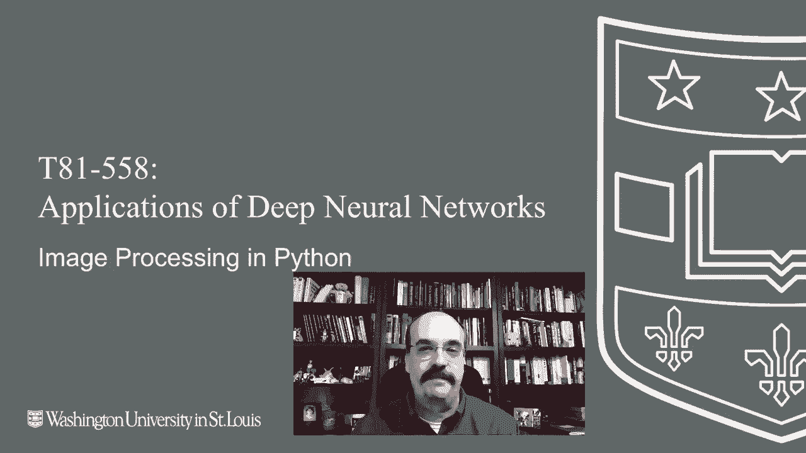
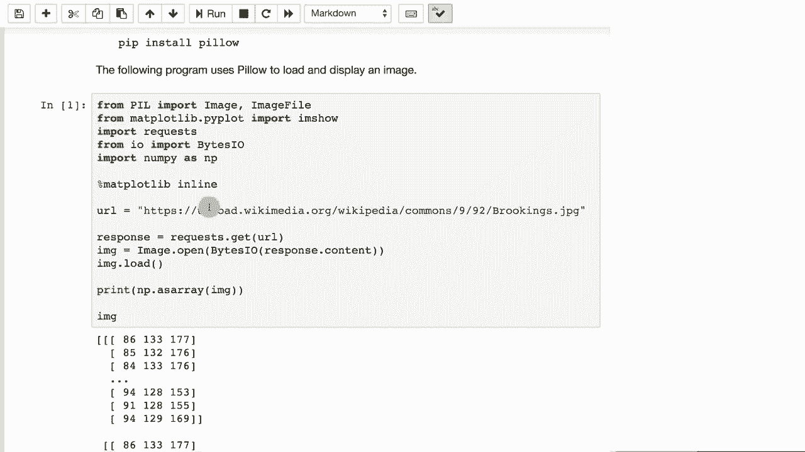
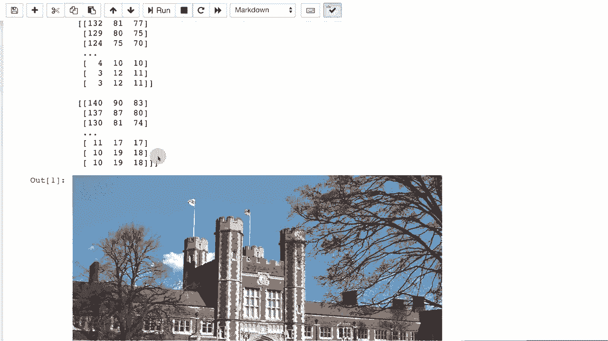
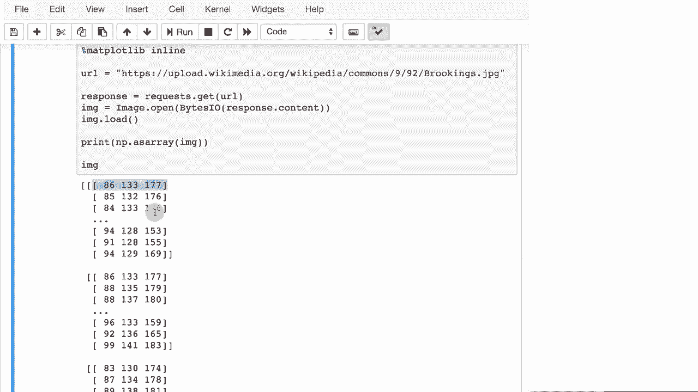
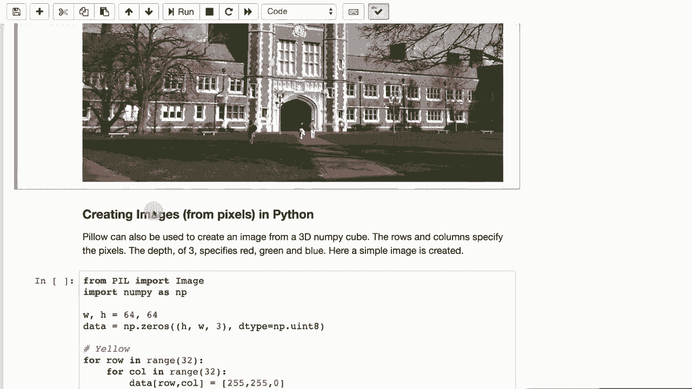
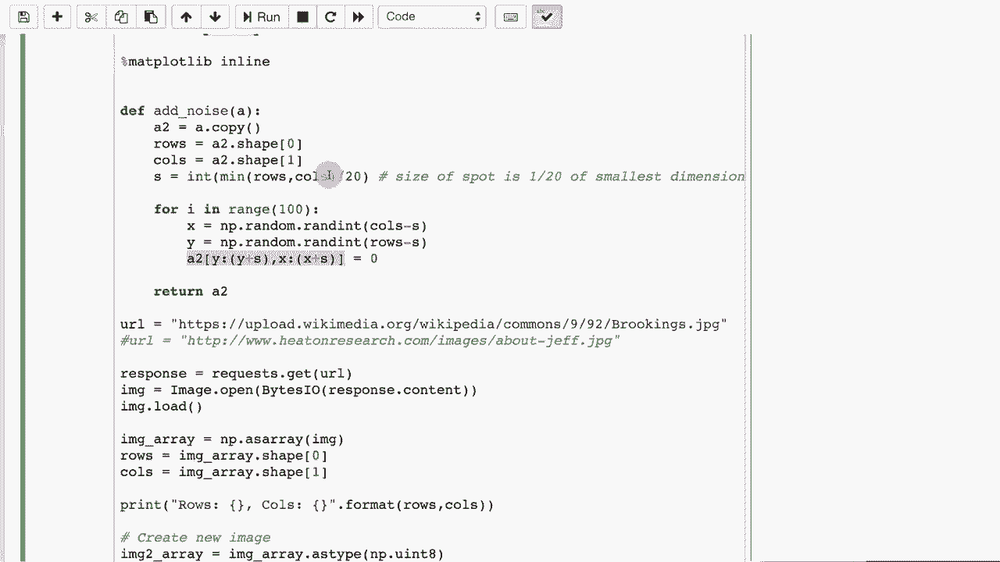

# T81-558 ｜ 深度神经网络应用-全案例实操系列(2021最新·完整版) - P32：L6.1- 基于Keras神经网络建模需要的图像处理 

嗨，我是Jeff Heaan，欢迎来到华盛顿大学的深度神经网络应用课程。在这个视频中，我们将开始研究计算机视觉中的图像。我们将从一些基本的Python图像处理能力开始。如果我们要查看图像，就需要知道如何将JPEG和PNG加载到Python中，以便调整分辨率。

控制它们是否是彩色的，或者将它们裁剪到特定边界。有关我AI课程和项目的最新信息，请点击订阅，并按旁边的铃铛以接收每个新视频的通知。在Python中有许多处理图像的包，我们将使用pillow包。

安装相对简单。你只需执行Pip install pillow。这个包在我们第一次上课时的安装列表中。因此，你可能已经安装了它。它也包含在Google Co Lab中。Python中还有其他图像处理包可用。

你常常会看到的一个是叫做open CV的东西。它的安装稍微复杂一点，而且我们并不需要它的一些高级视频功能，所以我们坚持使用pillow。现在，pillow允许你将图像直接加载到你的Python环境中。它来自PIL包，这就是你实际访问它的方式。

我们可以使用Maplotlib来实际查看我们对这些图像进行的一些变换的结果。我们将从网址加载一张图像，这就是我们获取大部分图像的地方。在下一个模块中，当我们进入GNs时，我们将需要大量图像，我们将直接从Cale获取。因此，我将向你展示如何做到这一点，这个过程会稍有不同。

但我们仍将使用一些相同的命令来处理这些内容。在这里，我们使用requests包和Python，这让我们可以直接从网址读取数据。我们基本上是获取这张图像，加载它，然后可以显示出来。所以，当我们加载这张图像时，由于它是实时从互联网获取的，因此需要一点时间。

你可以看到图像的数值形式，也可以看到图像的视觉形式。

在新的Eric表单中，你会注意到这些数字是以三组3 Bte的形式出现的。这是由于红、绿和蓝。因此是RGB。你可以看到许多颜色在彼此的范围内非常相似。你也可以在Python中创建图像，而不仅仅是简单地加载它们。

你可以从零开始创建一幅图像。你可以生成像素，Python实际上会为你将其转换为图像。

首先，让我们直接运行这个，以便你能看到它到底在做什么。它基本上是在创建一个红绿蓝的图标，几乎像一个微软Windows的标志。这个过程的工作原理是我们在创建高度和宽度。所以这是64像素乘以64像素，*并不大*。我们正在创建一个数据。

在NumPy中设置或矩阵来保存这个，高度和宽度。然后是3。所以这是3D的。*它更像是一个张量而不是矩阵*。这个立方体将保存高度和宽度，然后三个深度是红、绿、蓝这三种颜色。数据类型很重要，我们需要将其设置为无符号8位整数，基本上是字节。

因为一个像素的三个组件是现在有时会有第四个。颜色其实不是颜色，而是与红、绿和蓝值相关的*透明通道*。但在这一点上我们不使用透明通道，因为这是64乘64。我们将希望绘制每一个这些方块。

这形成了一种棋盘式的红绿蓝黄色。因此，对于黄色，我们将做行32列32。现在我们正在做所有这些，因为每个子方框都是32乘32。所以432乘32创建了64乘64，我们循环遍历所有这些，并在那个位置设置数据为255, 255, 0，这是黄色的RGB代码。所以由于我们只是指定行和列而没有添加任何东西。

这是我们正在处理的左上方的方块。因为是32乘32，所以我们简单地填充整个红色方块。我们在所有这些中以相同的方式开始循环。因此行现在被偏移了32。所以我们实际上在向下移动。列仍然在这里。

所以我们没有移动，这里绘制的是红色。如果我们在行和列上都移动，这里就是绿色。如果我们只在列上移动，这里就是蓝色。所以你可以看到我们基本上循环遍历并实际为整个图像中的每个像素分配颜色。然后我们从数组创建图像，表明它是红、绿、蓝。

还有其他编码方式，而不是RGB。但我们将主要使用RGB。所以这向你展示了我们从零开始真正创建了一幅图像。在下一个模块中查看生成对抗网络时，我们将真正从像素开始构建面孔。你也可以*转换图像*。这是一个常见的程序。

有时你可能需要裁剪图像或将其更改为灰度，或做其他事情，以便让它们准备好进入神经网络。这是在逐像素水平进行转换。所以我将继续运行这个，以便你可以看到最终输出，在我们查看如何实现之前。它告诉你有多少行和列。图像在这里。

现在确实花了一点时间来生成这个。这是因为我们实际上在遍历每个相对高分辨率图像的像素。这是我们之前的同一张图片，但我们将其转换为灰度图像。我们基本上像之前一样加载图像。这一切与前面的例子相同。我们获取行和列并打印出来。现在我们将创建第二张图像，这张图像与我们在前一个例子中创建的小棋盘非常相似。

我们将基本上渲染成那个图像，所以我们将遍历每一行，每一列。我们要计算每个像素的平均值，所以每三个三像素的红绿蓝值都要相加，然后取平均。这是一种非常原始的灰度化方法。还有更高级的灰度化方式使用加权和。

但这是一个很好的例子，展示如何逐个转换每个像素。这两个循环是占用一些时间的原因。当你运行这个时，你会注意到几秒的延迟。然后我们基本上通过使用数组从图像中获取图像。

现在我们准备展示我们的修改图像。你通常也会想要标准化图像。这是将不同尺寸的图像缩小到相同大小的过程。😊这是一个非常常见的程序。通常，这将在图像数据集中为你完成。但如果你真的在收集原始图像，你需要自己进行一些标准化。

我给它提供了一个来自维基百科的图像列表。这些只是华盛顿大学不同建筑的图片，维基百科有它们的所有图片。我在这里创建一个名为make square的函数，所以我们获取图像，获取行和列。我们检查一下行是否比列多。

这处理了图像不会具有相同宽高比的事实。让我实际展示一下这是什么样子。这样会更清楚，所以这基本上是在裁剪这些图像，使它们都变成完美的Instagram方形，然后逐个进行裁剪。

然后我们可以使用类似之前的代码逐个加载这些图像，使每个图像变为正方形。我们调整它们的大小。所以一旦它们被调整为正方形，我们就可以将它们调整为128乘128。这可能是增大，也可能是缩小。大多数情况下，这是缩小。我们还在将这些图像数组展平，以便得到一个列表。

组成该数组的值是你通常将数据输入神经网络的形式。你常常会看到这个命令，我们正在做的事情。我们实际上是将其转换为一个范围，范围在负1到1之间，以0为中心，因为图像有256个可能的值。这个值的一半是128。我们从中减去128，这实际上使其以0为中心。

然后我们将其除以128，以使其大致在负1和1之间。你会看到所有图像都完全加载并标准化为128乘128。我们有时也会想给图像添加噪声。当我们进入自编码器时，我们将看到这一点，因为我们将创建去噪自编码器。

或基本上是在教学。神经网络从图像中去除噪声。我们先运行这个，这样你就能看到它的样子。好的，这里是同一幅图像，里面加了一些随机的方块，这些基本上就是噪声。添加噪声实际上是创建了一幅图像的副本，我们正在提取行和列。

我们将遍历并放置100个方框。我们在这个范围内生成随机位置。这有点有趣。我们使用了nuy。看起来我们只给0分配了一个值，但实际上我们在一个范围内进行分配，一个在y和y加S之间的矩阵范围。所以S是每个方框的大小，加上x的那个大小。

所以S真正做的大小是这些方框相对于图片的大小。它们基本上是行和列的1/120。因此，如果行是较小的一个或者列中的任一个是较小的，我们就取它的1/120，这就成为这些方框的高度和宽度。感谢观看这个视频，在下一个视频中，我们将研究卷积神经网络，用于我们为深度学习引入的两个非常著名的数据集。这个内容经常变化，所以请订阅频道，以便随时了解本课程和其他人工智能主题。

