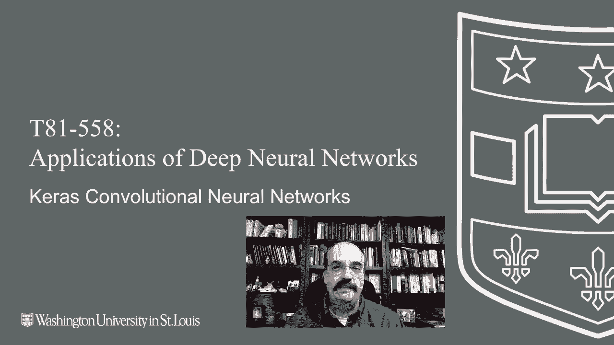
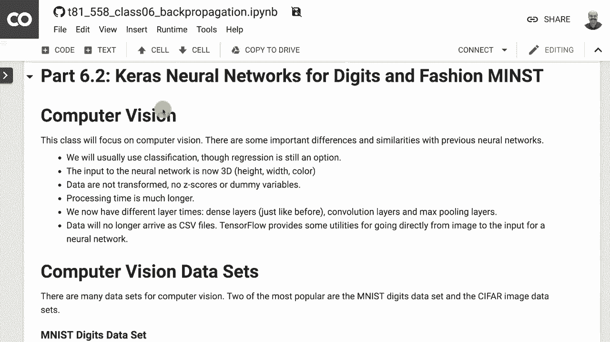
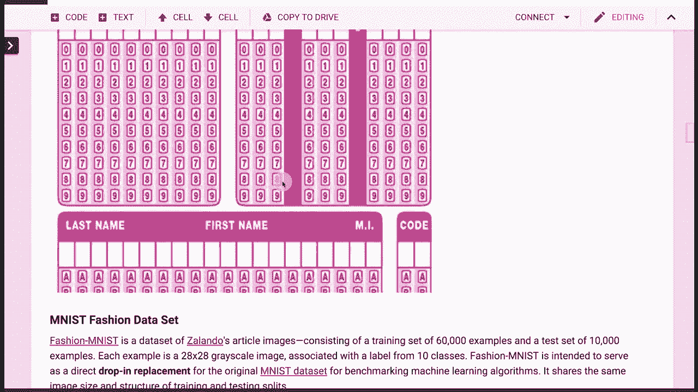
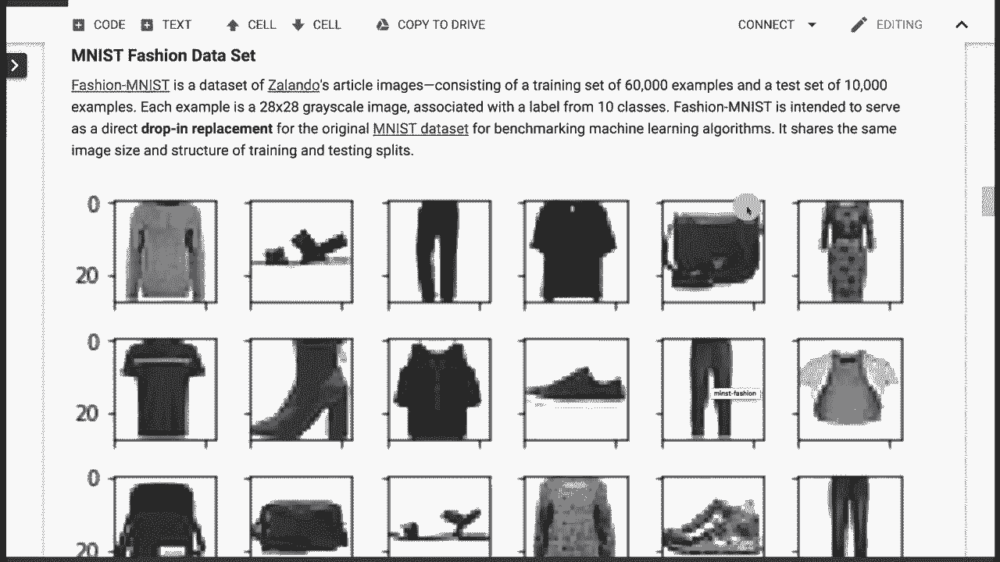

# T81-558 ｜ 深度神经网络应用-全案例实操系列(2021最新·完整版) - P33：L6.2- 用于MNIST和fashion-MNIST的Keras卷积神经网络 

嗨，我是Jeff Heaton。欢迎来到华盛顿大学的深度神经网络应用。在这个视频中，我们将看看如何使用卷积神经网络。我们将从一个经典的神经网络数据集开始，这个数据集在许多不同的模型中使用，除了神经网络之外，这就是MNS数字数据集。

接下来，我们将查看一个非常相似的新数据集。它被设计为MNS的替代品，这就是男性时尚数据集。在我们完成这些之后，我们将能够看到卷积神经网络的更高级主题。想了解我最新的AI课程和项目，请点击订阅，并点击旁边的铃铛以获得每个新视频的通知。

所以你会注意到，我使用Google Coab而不仅仅是简单地使用我的笔记本电脑，就像我在许多这些视频中所做的那样。

我们使用Google Coab是因为我们需要使用GPU。如果不使用GPU，这将运行得非常慢。实际上，有些事情在GPU上可能需要五分钟，而没有GPU可能需要两个小时。因此，拥有可用的GPU非常重要。

我有一个完整的视频，我会链接到这个。它与这个课程相关，展示了如何将Google Coab与此课程结合使用。基本上，如果你想运行我的任何课程材料，最好打开带有Google Coab的GitHub仓库，并将文件导入。

这正是我在这里所做的。你可以在这里看到。我已连接到GitHub，并导入了这个类6。现在，让我们看看如何将其与Kira和卷积神经网络一起使用。首先，让我们更改运行时类型。我们确实想要使用。

所以它在Python 3.6中说，华盛顿大学。这是一些本地内容。因此，当我尝试运行时，它会对此抱怨，因为Google Coab不知道那是什么。这是我拥有的本地Python环境。我将其切换到Python 3硬件加速器。我们想要GPU。我们稍后会进入TUus，让我们继续保存。现在。

每当我在这里运行东西时。它会用GPU运行。所以我们将查看计算机视觉数据集。在这个中，我们看到几个。😊。

课程模块，接下来我们将在本学期后面进入一些更高级的内容。经典的计算机视觉数据集是MNS数字。这些基本上是28x28像素的手写数字，它们在研究论文中被反复研究和使用。因此。

有一个与此非常相关的数据集被添加到这个名为**Minced fashion**的项目中。它看起来非常相似，只不过是手袋、鞋子和衬衫。所以你试图检测的是衣物，而不是数字。但我们需要通过这些**mins**数字。我们想看看这是如何运作的，因为它是。

这是你典型的**hello world**程序。对于机器学习和计算机视觉来说。这些数字来自哪里。标准化考试，越来越多地，这正在变得在线。但你们可能做过填泡的那种标准化测试。当我上小学、高中，并为ACT和SAT考试准备时，准备上大学。

这是唯一的方式，你可以字面理解这些学生正在创建完美的计算机视觉训练数据，因为学生们会在这里画个三，然后填空。所以你得到了X，即他们画的内容和Y。

他们填入小空白的期望标签。现在这个数据集中有噪声。一些学生，特别是我。在参加这些考试时字迹非常糟糕。有些学生会撒谎。他们会在这里画个三，然后在这里填个四。R是一个合法的错误。

所以这基本上就是它的工作原理。我还记得一些我在身份盗窃前的天真时代参加的考试。你会在考试纸上写上你的社会安全号码。可能会出什么问题呢。所以这就是被挖掘的数字。**Minced fashion**基本上是与**mins digits**完全相同格式的衣物。

所以这是一种可替代的解决方案。我们将查看这些数据，因为它非常出色，并且对于机器学习来说比**minst**更具挑战性。机器学习变得更聪明了。所以我们需要更聪明，而不是更聪明，而是更困难的数据集来挑战机器学习。

你可以看到有鞋子、裤子、衬衫、裙子。

时尚物品基本上是让神经网络去识别的。所以你有10种不同类型的时尚，而不是10个不同的数字。它也是CR数据集。C 10，我们会使用它，因为。

我们将在本课程稍后查看**resnets**，这是他们首次真正展示自己能力的数据集。所以我们将看到如何将**resnet**应用于这些全彩色的数据集，这里你有不同类型的飞机、汽车、猫、鸟。

顺便说一下，这些事情的共同抱怨是一些机器学习数据库后来的版本试图修复的问题，即这些数据中有多少百分比是动物。飞机不是鸟，猫，鹿，狗，青蛙，马。好的，所以大约60%是动物。

所以在学习的特征方面并不是完全平衡。我想向你展示其他资源。在斯坦福，有一整门课程专门讲卷积神经网络。就像这门课程一样，他们将所有材料都放在网上。

所以如果你特别对卷积神经网络感兴趣，想要查看一下。Andre Kpathy是一个我从他读研究生时就关注的研究者，他是一个非常有趣的人，做了很多计算机视觉的工作。他的论文是关于图像字幕的。你可能有一张猫骑滑板的图片，神经网络会真的以文本形式写出来：猫骑滑板。这是我认为他论文中的一个图像。

他最初在斯坦福教授这门课程。我想他现在在特斯拉工作，所以他可能不再教这门课程，斯坦福大学的所有信息都在线上。他还写了Convenet JS。这是一个完全用JavaScript编写的早期卷积神经网络库。现在你可能会使用Google的Tensorflow for JavaScript。

但值得一看，因此我们将研究卷积神经网络。卷积神经网络，很多深度学习和神经网络的一般应用，来源于Janang Laon，他是深度学习领域的Tring奖的共同获得者之一，获得者还包括Yshua Benjiio和Jeffrey Hinton。这个有什么？与之前的神经网络相比，真的很强大。

还有其他传统的机器学习模型，比如支持向量机，可以进行扫描。所以我们这里有数字A，注意这个小框与卷积层相连。卷积层是我们现在拥有的几种新类型层之一。我们有密集层，现在我们得到了卷积层和最大池化层。

我们在这门课程中之前也介绍了dropout层，但这两个是新的。卷积层使用这个正方形。用于扫描，所以你指定那个正方形的大小，扫描区域的大小。它会在整个图像区域内扫描，并在过程中学习。如果正方形就在这里。

它会学习顶部隆起的特征，呈现出一个角度。现在，其他字母可能也有这样的特征，这些通常被称为过滤器或神经元。它们大致相当于普通隐藏层中的神经元。会学习这些属性。也许其中一个会学习一条在这里停止的线。

也许其中一个学习了一个倾斜的线，另一个学习了与线垂直的连接。顶部的隆起。这些都会被特征图学习，而这些在卷积神经网络中。卷积层。特征图是卷积层的另一种说法。

然后在你学习完这个后，你可能想要进行下采样并降低到更低的分辨率。这就是最大池化层。我们稍后将看到所有这些层如何工作，确切地说。😊然后你有一些额外的卷积层，现在学习在这个大大缩小的图上找到特征。所以由于它的分辨率较小，你现在真正要寻找的是第一层学习到的构建块。

所以这个第一层可能学习的是垂直连接线和线的末端。现在仅仅使用这些构建块，这一层然后构建更高层次的抽象。所以也许它学习到，好的，凸起连接到两条线。然后我们通过一些全连接层，这些是稠密层。

这些上面有各种术语在流传。😊稠密层基本上就是我在过去五年文献中看到的称谓，然后高斯连接。基本上用于分类。所以输出有10。因此有10种不同类型的数字。有趣的是，他指定了10个输出。

但是在这里有个字母，如果他在教的时候，可能会期待26个字母。但这篇论文使用了挖掘的数字。你可以画一个“A”，它可能会认为这是一个“A9”，上面有奇怪的线条。尽管如此，这是来自La在1998年原始论文中的原始图表，为后来的很多内容奠定了框架。

卷积层。你需要在它们上面指定的是过滤器的数量。过滤器的大小。那是扫描的正方形的大小。侧边是那个正方形在扫描时跳跃的像素数，填充基本上是你放置在图像周围的边框，因为当那个正方形到达边缘时。你并不希望它就这样掉出图像的边缘，而没有完整的像素集，所以你可以在它周围放置填充，基本上是黑色背景的零，同时你还需要指定一些激活函数。

通常是ReLU或类似的变体，如PReLU或Leaky ReLU，那一类。通常卷积层基本上添加权重和参数，就像其他层一样。它添加的参数量将是过滤器大小乘以过滤器大小，因为扫描正方形总是正方形，因此过滤器大小被假定为水平和垂直相同，乘以过滤器的数量，这基本上就是卷积层内部的权重。

一旦它扫描整个图像区域。它们通常被称为共享权重，因为这意味着在图像上方检测到的东西也可以在图像下方被检测到。位置不变性。基本上，你可以让某个东西移动，而它仍然可以被检测到。这就是你可以考虑卷积层如何工作的本质。

你将有这个方形。现在，这是处理灰度图像。因此，每个像素上并没有红、绿、蓝三个独立元素。如果这是彩色图像，基本上只会有一个深度组件，每个像素将有三个数字。但这个蓝色区域基本上是扫描，它在扫描时横跨而过。

它必须在每次预测或训练的每一步中完全遍历整个图像。现在是最大池化层。这里是你减少分辨率的地方。所以说你想将分辨率减半。你将基本上取一个6乘6的区域，降到3乘3。所以它将分成这些区域。

你将取最大值，因此是最大池化层。这个单元中的最大值是8。所以你得到8。这个单元中的最大值是2。你得到2。依此类推，我这里有一个链接可以提供。如果你想了解更多关于卷积神经网络低层的信息。我们来看看如何处理数字数据集，我将继续运行这里的区域。

它显示了信息。所以我们的训练集有60000个，测试集有10000个。现在，注意我们并不需要自己拆分训练和测试。他们不希望你这样做，以应对庞大的数据集。这是因为这个数据集几乎以竞争的方式用于论文。所以他们希望每个人都使用相同的训练和测试集，以便能够进行合理的比较。因此，如果你说你在这个数据集上得到了某个结果。

这不仅仅是因为你在训练和测试之间选择了一个幸运的结果。如果我们想显示数字，我们可以简单地运行这个。这显示了这个数据集中实际包含的内容。现在，注意，我们确实是直接从Kis提取数据集的。Kis为常见的数据集提供了这个便利。

但如果你尝试使用自己的图像，这可能会非常麻烦。我们将在未来的视频中讨论如何提取你自己的原始JPEG和PNG图像。不过现在，我们将使用这里的便利方法。你可以看到其中一张图像。它非常大。你可能会看到某种螺旋形。如果你想实际显示它。

你可以运行这个。它以某种方式显示出来。这是第105个数字，如果你想选择下一个数字，它将显示出6。所以这本质上是Matplot Live提供的热图。它提供了一种方便的可视化方式。如果你想查看很多数据。

你只需做子图。在Mapllib中运行它。它会显示一堆数字。所以这是可视化这些数据集的一种好方法，显示它们确实只是为你提取的图像。你基本上需要将原始PNG和JPEG文件转换为张量，变成高宽度乘以颜色深度的立方体。现在，让我们构建一个神经网络来训练这个。

在这里我们会很高兴有GPU。😊 实际上构建这个并不需要太多时间。它显示了我们的一些超参数，我们选择的批处理大小是128。我们对数据集进行一些基本转换，以确保一切符合Tensorflow的要求。通常，我们需要一个高度乘以宽度乘以颜色深度。

我们将看到如何实际做到这一点。如何处理原始图像。当我们加载自己的图像时，这是重要的。这是在进行一些基本规范化。所以我说神经网络最好处理的数据总是在相同范围内。好吧，你的RGB每个颜色分量始终在0到255的相同范围内。但这里。

这将获取所有在0到1之间的值。因为正常范围是0到2.55，为了获得更好的结果，你甚至可以将其围绕0居中。所以你可能需要减去128并除以128。稍后我们将看到一个例子。我们打印出有多少训练样本。这里是我们构建神经网络的地方。

我们在层中添加了一些卷积。你实际上没有3D卷积，可能会有一个，但通常你处理的是2D，因为你在识别2D图像。如果有人找到了发送3D图像进行识别的方法，我不会感到惊讶。你可能需要两个相机来捕捉这些。

但我们只处理2D图像，而不是3D。然后我们加入最大池化层，添加一些dropout。在从这些2D层转换到我们之前提到的密集层时，总是需要扁平层。所以一定要加上这个扁平层，因为一旦扁平化，你就不能再回去，或者至少没有一些非常特殊的重塑。

永远不要说永远不。然后你使用一个密集层。这是分类。因此我们使用类的类别交叉熵和softmax，就像我们以前看到的那样。现在，当你想训练并适应它时，注意我这里的时间，这在CPU上需要近两个小时，而在GPU上只需13分钟。

在GPU上并不会花你太多时间。这个谷歌免费提供的GPU比我大约一年前运行时用的GPU要好。所以你免费获得的东西真是太棒了。让我们继续运行这个。我们将继续训练，这段代码与我们之前看到的训练代码一样。

我会计时，所以我们将确切看到这需要多少时间。现在你想运行它。启动时通常需要一点时间，但我们已经进入第一个纪元。它，真的很快。我们在第二个纪元，它，实际上只需要大约4秒每个纪元。所以我会继续快进，但它是。

这不会花费太多时间。想想看，这可能在一些 CPU 上需要两个小时。而我们只用了 53 秒。我喜欢 GPU。现在，你正在处理两种类型的 GPU。有 K80，我认为这是它的名称，Google 免费提供给你。那是更便宜的，可能在 $500 到 $700 的 GPU 范围内。这是 2019 年的情况。😊，好吧。

我会确保在这个视频发生重大变化时已经更新了它。还有一个更先进的 V100 企业级 GPU。我在亚马逊云上使用这个。它大概是 $6000 或 $7000 的 GPU。你可能会认为在那个上运行会更快，但并不会。这个神经网络并不复杂。

在这个 GPU 上的运行速度与另一个差不多。因此，当你在像亚马逊云这样的环境中运行时，你需要真正地进行平衡，避免过度使用高级 GPU，否则你只是在浪费金钱。你正在处理亚马逊云上更先进的 GPU，至少在今天的价格上。

每小时大约 $4，而 Google 提供给你的这个 GPU 每小时不到 $1。因此，肯定要使用 Google 的那个。在我给你的一些作业中，你将需要 GPU 级别的处理性能，否则你将花费数小时进行训练，并且将花费很长时间。因此，在讨论这些作业时，我会说明，因为每个作业都有单独的视频和解释。现在，让我们评估准确性。

让我们运行这个并看看准确率，99%。这就是为什么引入 Fashion MNIST 的原因，因为这是一个不错的 Hello World，如果你想对这个进行任何研究，你将会得到 99.9999 的结果。说你将准确率从 99% 提高到 99.9999% 是毫无意义的。现在，还有一件事在评分时也很有用。

这是在发送数据以获取预测值时，如果你在使用 GPU，你可能会遇到资源耗尽错误，这仅仅是因为你一次性向 GPU 投入了太多数据进行评分。因此，你有几个选择，这通常在训练期间不会出现，因为你使用的是小批量。但是如果你试图对像一百万行这样的大数据块进行评分，它可能无法适应 GPU。

这里有几个选择，评分通常非常快。你可以将其发送到 CPU，无论大小，只要在合理范围内都没关系。或者你可以将其分成几部分，一次将每部分发送到 GPU。你可以使用这样的代码来实现这一点，如果我只想评分前 100 个。

我给你举个例子。现在，让我们看看时尚数据集。我们正在使用便捷的方法加载数据，这样我们就不必拥有所有时尚项目的数据集。我们将继续运行，这正在下载。因此，当你第一次运行这些时，它会下载数据。

如果我们想像之前一样显示这些，这正是，顺便说一下。与数字的代码完全相同。因此我不打算重新解释这一切。只是稍微给你展示一下它的样子。让我们来运行一下。我不应该真的说是数字9。这是时尚服装的第九号，也就是一双鞋。

如果我们想像数字一样显示一整系列的物品，我们是可以的。因此，有一组时尚物品正试图展示出来。再次强调，这非常相似。训练时间。我将继续定义。神经网络就像之前那样。它已经定义好了。我们现在将进行训练。我们会发现训练时间确实非常相似。

与我们之前处理的情况相比。注意，准确率并没有直接上升到99%。大约在89%。90%。所以这显然更困难。你需要。你必须付出更多努力才能将其提升到更高的准确率水平。而且我没有查看。这并不是一个太真实的数据集。

我想它在研究中有一些使用，但我没有查看过具体在哪里。一些更先进的研究人员将其提升到哪里。但看起来我们大约在92%的验证准确率。并且看起来它是。

大致停在这里。感谢你观看这个视频。在下一个视频中。我们将继续讨论计算机视觉，并研究残差网络（resnets）。这部分内容经常更新。因此请订阅频道，以便随时了解本课程及其他人工智能主题。😊
