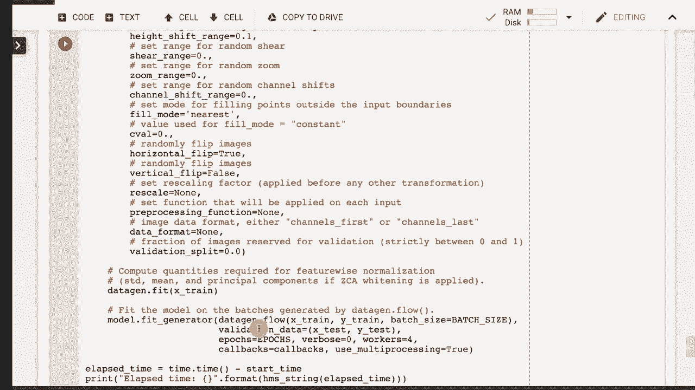

# T81-558 ｜ 深度神经网络应用-全案例实操系列(2021最新·完整版) - P34：L6.3- 在 Keras 中实现 ResNet 

嗨，我是杰夫·希顿。欢迎来到华盛顿大学的深度神经网络应用。在这个视频中，我们将看一下 ResNet，这是一种可以在 Keras 中实现的神经网络，它利用了残差，真正让这个神经网络独特的是它有跳跃连接，不仅仅是连接到下一层，关于我 AI 课程和项目的最新动态。

点击订阅并点击旁边的铃铛，以便接收到每个新视频的通知。ResNet 真的展示了 Keras 的灵活性。Keras 目前没有 ResNet 层。因此我们将字面上构建我们自己的 ResNet 层，这并不是特别困难。我在 Keras 网站上找到一个实现的函数。

我们将看看 Keras 可以做到什么。这在 I SVC 分类挑战中引起了很大的轰动。这。😊！

使用 C far 10 数据集并且仅仅取得第一名，击败了所有其他的。这是描述这一过程的论文。我从论文中提取了一些这些图像。首先，让我们谈谈什么是残差。那么什么是残差神经网络，或称为 ResNet，残差。如果你查看米里亚姆·韦伯斯特。

这是一种经验或活动的内部产物，影响后续行为。在这些神经网络中，它就是这样。它是一个跳跃层。我更喜欢称之为跳跃层，而不是残差，但无论如何，两个术语都同样有效。现在，同样重要的是要注意它跳过了两个层，两个正常加权的。😊 RellU 层。

现在，激活函数通常是在加权层之后应用的。所以这很正常。几乎就像我们注意到这一层的输入是什么。我们激活这个其他的加权层。但我们还不应用这个值或任何非线性。但我们把这个 X 输入直接加到这里。所以这里的输出会加到那儿。

在某种程度上，这个值有点像。这几乎是递归神经网络的反面。我们很快就会看到递归神经网络。与递归神经网络向后运行不同，它是向前的。

为什么你想这样做呢？简单的答案是，它提供了更大的预测能力，让你可以更深更深地训练。论文对此有更多讨论。但它显示出，当你训练更深的神经网络时，结果会越来越好，然后你会遇到一个瓶颈。

随着你添加更深的层数，你的结果会越来越差。这已经在100层、100个隐藏层及以上进行过实验。我认为甚至有过几次尝试达到1万层的情况，但这些并不一定显示出完全有前景的结果，不过这方面的研究变化很快。

这就是其中一个样子的，别担心VGG。神经网络，也就是说，更多的是传统的卷积神经网络，还有一些其他的调整。基本上是他们试图在这次比赛中超越的竞争对手。这是一个34层的简单网络，就像我们刚刚学习的卷积神经网络一样。

这一切都是基于卷积的。这是34层残差网络。 所以这实际上是它的样子。你可以看到这些跳跃层，跳跃层，跳跃层，等等。不同的颜色，64个滤波器，128个滤波器，256个滤波器，等等，然后它们最终进入一个平均池化，SC是完全连接的。这。

VGG使用了多个全连接层和类似的卷积。结合池化，这使用的是平均池而不是最大池，尤其是在最后阶段。让我们来看看运行这个的代码。这是使用Cf数据集。它需要下载，当前在谷歌上使用Google Coab。

你会发现自己经常需要重新下载这些。你要小心，因为谷歌只保留你存储在谷歌云盘中的内容。我关于如何使用Google Coab的介绍视频已经解释了这些内容。现在，我们要抓取数据。😊，这些数据以pickle格式存储，所以我们要。

提取我们刚下载的数据并准备进行训练，现在我们已经下载了它。让我们展示一下，这段代码的作用是展示这个数据集中的一些样本。汽车、狗，依然主要是动物，但这就是这个数据集。

这些是一些描述我们在实现中的参数。我们将使用200个训练周期，即使使用GPU，也需要一段时间来训练，这个过程持续几个小时。批量大小为32，类别数直接从数据中提取。它有10种颜色，我们直接从数据集中提取，包含红、绿、蓝三个通道。

像素减法的意思是这基本上是将其中心化到0。这有助于提高预测的准确性。ResNet有两个版本，ResNet版本1是原始版本，ResNet版本2有一些改进。我稍后会在这个视频中谈到。我们在选择深度时，基于图像的大小和颜色的数量进行计算。

我们根据版本和颜色选择深度。这是一个有用的函数。这是遵循论文的。这是学习率调度器。这基本上将在跨越多个训练周期时降低学习率。因此，每当我们更改学习率时，都会在这里报告。这可以非常有效。

我们在原子训练中使用这个。通常，你希望随着进展减少学习率。所以这展示了这一技术。你可能希望在Cagle比赛或其他事情中利用这个。你需要进行实验，以查看它的具体效果。顺便说一下。

我从Keras网站获得了所有这些数据或代码。所以这只是一些示例。我已将其更新到最新版本的Tensorflow和Keras，并稍作调整，使其更易读，并将其分段到一个Jupyter笔记本中。这基本上创建了一个Resnet层。因此包括两个普通层和跳跃连接。

它基本上在创建卷积2D层。它确实在其中放置了一个批量归一化层。批量归一化😊，是一个好的层，你可能想使用，它基本上帮助解决消失梯度问题，防止其过于严重。

这不是一个大问题。它在每个批次、每个小批次上进行归一化。我们还使用了一种特殊的权重初始化器，称为He正态分布。这又是，遵循了原始论文的做法。我们还使用了L2的核正则化，同样遵循了论文。这实现了Resnet版本1。

这主要是我们在这里处理的内容，但我包括了这两者。Resnet版本1和版本2。这指定了输入参数，指定形状。本质上是将那些层堆叠在一起，最终形成密集输出。它构建了那些单独的Resnet块。一个Resnet块是两个卷积层堆叠在一起。

所以它创建了两个Resnet层。现在，上面提到的Resnet层基本上是Resnet块的两个部分。我们在跟踪这些。所以我们在这里有Y。X作为输入。然后第二个是传入这里。这部分实现了跳跃层。

最后，我们进行一个平均池化。在最终的密集层中，我们也会这样做。我将继续运行这个，以便我们将其保存在内存中。我们也有Resnet的第二个版本，完整的V2变体与V1的主要区别是每一层之前使用批量归一化。这总体上带来了一些改进。我们主要处理版本一。

但两者都在这里，你可以尝试这两个。看看归一化之间的差异。在每个点还是仅在那些Resnet块的末尾。这里是我们实际运行的地方。因此我获取输入形状，获取训练和测试。如果我们想减去像素均值。

这正在进行中。它使其更有效地集中在0附近，输入一个好主意。我们运行resonnet V1或V2，具体取决于我们有什么，我们编译它并生成一个摘要。所以这只是构建神经网络，并没有实际运行。它已经准备好了。它再次向你展示网络的整个结构，试图与原始论文相匹配。

这是我们实际执行和训练它的地方。我将运行它，只是为了让它继续，因为这将需要很长时间。我们获得学习率调度器，这会使学习率降低，直到达到平稳状态。当我们达到平稳状态时，它会降低学习率。所以如果我们不使用图像增强，顺便提一下，我们确实使用了，我们就进行正常的拟合。

图像增强对于让模型学习不对训练数据过拟合非常有用。这允许它在图像中移动和变化。每一种变换都是你可以对图像进行的各种随机变换，基本上是在训练过程中以各种方式扭曲它。所以每次它都会获得全新的图像。

但它们都是基于训练集图像的。你可以随机水平和垂直翻转它。我们是水平翻转，但不再垂直翻转。我基本上遵循Kira示例的设置。所以你可以尝试一些其他的值。这可能会给你更好的结果。

你可能还想使用图像数据生成器，这在处理图像数据时会对你自己的神经网络进行这些变换。然后我们基本上拟合它并运行。我们重新报告时间间隔。这需要几个小时。通常情况下，你可能根本不想在CPU上尝试这个，除非是GPU。

我还没有尝试运行它，可能要等一天。我真的还没有在CPU上尝试过。感谢你观看这个视频，下一个视频中我们将看看openC。这个内容经常变化，所以请订阅频道，以便及时了解这个课程和其他主题。

还有人工智能。
