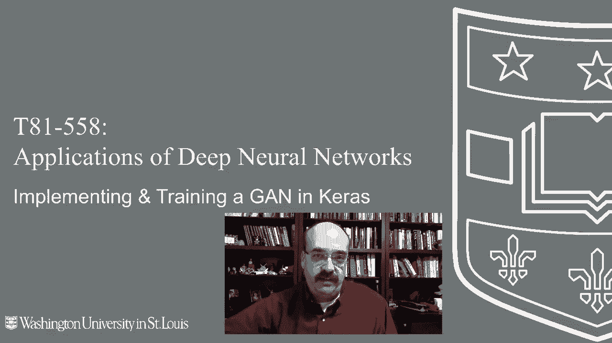
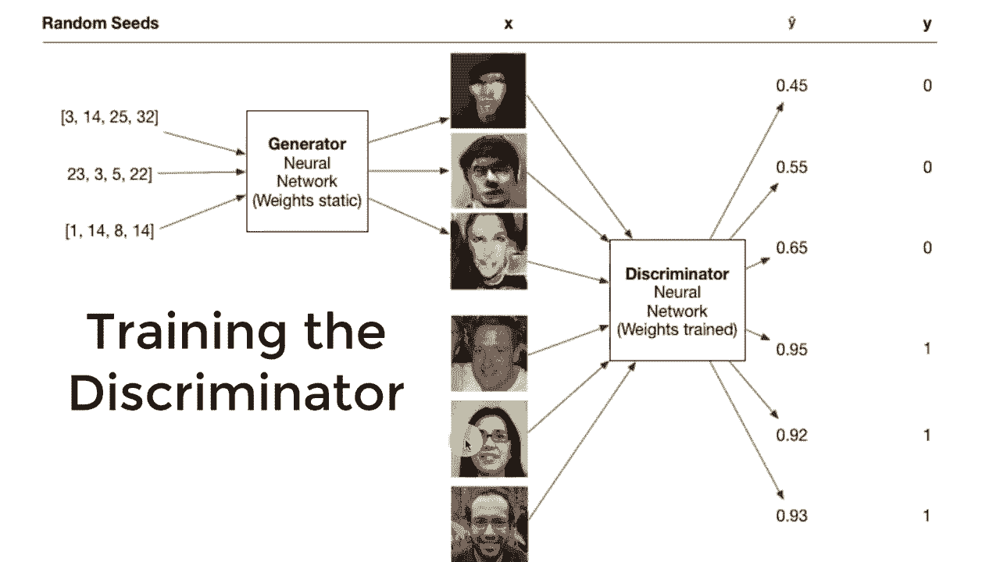
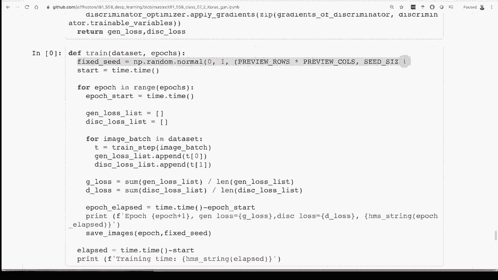

# T81-558 ｜ 深度神经网络应用-全案例实操系列(2021最新·完整版) - P38：L7.2- 在Keras／Tensorflow2.0中使用生成对抗网络(GAN)生成人脸 - ShowMeAI - BV15f4y1w7b8

生成对抗神经网络，这些你看到的面孔都不真实。它们是由一个G创建的。这种类型的神经网络可以用于创建不真实的数据。现在，我是真实的，至少我这么认为。但这些神经网络可以用来创建这种面孔。现在，我将开始，不向你展示如何创建这些由Nvidia软件为你生成的高分辨率面孔。

这是stylegan，我们将在下一个视频中看到。但在这个视频中，我们将实际从头开始构建这种东西。你将创建更像这样的面孔，但这只是个开始。这是你获得代码并运行以生成这种数据的垫脚石。嗨。

我叫Jeff Heaton。欢迎来到与华盛顿大学合作的深度神经网络应用，查看我关于Cagel神经网络和其他AI主题的所有视频。点击订阅按钮和旁边的铃铛，选择全部，以便接收到每个新视频的通知。

我确实提供了完整的源代码。我建议你像我在我的Github链接中那样在Google Coab中打开它。我这里有一个指向这个Github代码库的链接，里面包含我所有的代码。我刚刚将我的G代码升级到Tensorflow 2.0。因此，这应该能够很好地与最新版本的Tensorflow通过Ks配合使用。

在我们进入代码之前，先从概念上看一下我们想要做的事情。对于一个G，你有两个神经网络，而你以完全不同的方式训练这两个神经网络。理解这种区别很重要，如果你真的想理解这段代码是如何工作的。

这实际上是这个视频的目标，向你展示如何从头开始创建自己的GN。😊。

两个神经网络。其实并没有那么复杂。如果你逐步来看。你有两个神经网络，一个是鉴别器，另一个是生成器。这两个神经网络的输入和输出是完全不同的。这就是我在看到神经网络时，如何思考学习新技术的方式。

我想知道输入是什么。我想知道输出是什么，以便我能真正了解这个东西在鉴别器中实际上在做什么。这个神经网络在这个世界上只有一个工作。它用来判断输入是真实的还是不真实的。这里有一张图像进入它。我把这个当作真实的图像来使用，但实际上这是我用stylega创建的，以便我不在视频中使用任何随机的面孔。

所以图像进入神经网络。现在这就是神经网络与其他类型模型相比的精彩之处。输入几乎可以是任何东西，输出几乎可以是任何东西。所以这里输入是图像，这是一个3D张量。所以它是高度、宽度和颜色通道。输出是一个单一的数字。这是一个预测。所以0。

97意味着判别器在说，这实际上有97%的概率是一个真实的面孔。只要把它当作一个真实的面孔，而不是从我个人的矩阵中来的东西。好吧，现在生成器，这部分在你构建面孔生成神经网络或其他类型的生成神经网络时会非常有用。通常你在训练完成后会扔掉判别器。

但判别器确实是有用的，我们将在后面的后续视频中看到，当你处理半监督学习时，可能你并没有所有内容的标签。所以这两个都可以有用，但如果你只想要一个面孔生成器、汽车生成器、猫或牛油果生成器。

这就是你真正需要的，生成任何东西在这里基本上。😊，在随机种子中。所以随机种子。你可能在像Minecraft这样的电子游戏中见过这些，我知道这样做。你输入一个随机种子，基本上会为你创建一个完整的世界。这就是这个概念。因此，在Minecraft中，并不是说某些种子是坏的，而某些种子是好的。

它们都会给你随机的世界。每一个随机种子都会给你一个随机的面孔。由于神经网络被训练出来的。所以你要记住的就是，这不仅仅是一个数字。这是一个向量。所以它是一个数字的数组。通常是100或者更高维度的这些数字的数组。你也可以做一些非常有趣的实验，改变向量中的某个数字，看看向量的不同部分实际上是用于什么，在stylegan中你可以做一些这样的实验，你可以让头发变长。

你可以改变眼睛的颜色，而不改变其他所有东西，但这更多是针对下一个视频，我们讨论stylegan。这是从零开始创建自己的东西。所以你给它这个你生成的随机种子。😊然后你给它，它会给你一个输出图像。现在。

我在其他视频中收到的一个问题是这些数字应该在什么范围内。好吧。没关系，但它们必须在你训练时相同的范围内。所以当你训练它时，你给它一些随机的范围和分布。确保保持一致。不要在范围是0到100的数字上训练。

然后突然间放入一百万，这样做是不会好的。所以这就是这两个神经网络在其一般使用中的样子。诀窍是我们如何训练这些。这是对抗神经网络。所以它们是互相对抗的。这是一个生成式神经网络。

这只是意味着它在生成东西。它在生成面孔。首先，让我们看看我们如何训练生成器，因为这比训练判别器要简单一些。训练这两个的重要性在于，注意到我展示的权重是静态的。两个神经网络都需要到位，才能训练任意一个。

但是你不能同时更新这两个的权重，这样根本行不通，这里我们是在训练生成器。所以如果在训练生成器的同时允许修改判别器的权重，那就是作弊。生成器基本上是在不断优化它的权重，以便能够欺骗判别器。整体目标是在训练过程中欺骗生成器。

所以如果我们允许对这两个进行权重训练，那么反向传播会说，好的，让我们移动权重，使生成器变得更好。哦，让我们影响判别器，使得权重在欺骗判别器的结果上也更好，你不想修改判别器来进行欺骗。这就像是在跑道上训练一名运动员，让他变得越来越好。

但又看到其他运动员，有一天他会对抗那个人，并且会绊倒那家伙。所以这些运动员中只能有一个在训练，否则你最终会得到较弱的结果。你需要有竞争在进行。因此，当你进行训练时，像我们在本课程中看到的每个神经网络一样，你有X和Y。

X是输入到神经网络中以生成预期的Y。你的神经网络实际给你的被称为Y帽。它是带有小三角的Y。因此在这种情况下，X是随机种子。我们将创建一堆随机种子。在这个例子中，我只是展示三个。

但我们会将这些输入到生成器中。生成器会创建三个随机的面孔。现在生成器可能起初不太好，但它会越来越好。判别器也会越来越好，它会说，啊，这些面孔，它们不是真的。判别器会接受这些输入，并给出预测。它会说。

好的，这张脸45%。这张脸55%。最后那张，看起来好一点，65%。这些是y帽。这些是在训练过程中，判别器此时的实际预测。现在，y是我们真正想要的。这是预期的输出。这是通常来自你的训练数据的。但看看这里有趣的地方。

这是训练生成器。我们没有使用任何训练数据。我们的训练数据是一堆你下载的真实面孔。我给你一些示例网址，你可以去获取这些真实的面孔。但在训练生成器时，我们根本不使用任何真实面孔。

生成器从未见过真实面孔。它只是慢慢地学习，慢慢地生成更好的面孔，或者在欺骗鉴别器方面变得更好。所以这可能看起来有点奇怪。Ys。这些y通常来自训练数据。Ys始终为1。

这是完全不平衡的数据。这是最糟糕的不平衡数据。你没有任何零。因此你并没有在任何虚假案例上训练生成器。但它有这个鉴别器需要去欺骗。如果没有这个，生成器就会学习到“哦，你总是想要1”。好的，那我就总是给你1。

但是生成器的输出被直接输入到鉴别器进行训练循环。这是一个比我们之前遇到的更复杂的神经网络。你几乎可以将我用鼠标圈住的整个区域视为目标函数。目标是欺骗鉴别器。所以这并不重要，它是不平衡的。

这并不是真正的不平衡。这只是因为我们希望它总是尽可能接近1。生成器能做到这一点的唯一方法是生成更好更好的图像来欺骗鉴别器。因此你会在代码中看到，当我们稍后查看时，我们实际上是在为目标函数创建损失函数。

数据集我们选择无论批量大小，无论我们当前步骤训练什么。这些数量由配置参数设置。我们生成那么多随机种子，生成随机面孔。然后将这些发送给鉴别器。

获取Y帽，计算反向传播梯度，应用它，然后你应用链式法则。所以你对一步进行这样的操作。会有多个步骤。所以无论你的批量大小是什么，那就是一步。然后我们做足够多的这些，以覆盖整个训练集，直到整个周期。所以这里需要注意的事情可能看起来有点奇怪。😊

生成器从未见过训练集，Ys始终为1，因为我们渴望完美。1.0。实际上我们无法训练生成器，我们不希望生成器生成零。这就是为什么训练集看起来不平衡，但实际上这一整块在一起工作。

生成器是真正的损失函数。好的，让我们看看鉴别器是如何被训练的，这里有更多的内容，但不多。注意这里是平衡的。我们有零和一。这就是一点不同。我们会深入讨论这一点。还要注意，训练数据实际上在这里被使用。这三张图像。再次。

这些不是现实中的人，但假装它们是。我不想为了我的图表支付使用真实人物的许可权，Nvidia的StyleGAN已经足够了。这些是由我的生成器生成的。这就是X和Y在这里的样子。首先，我们需要生成足够的假图像以填充批处理大小。

然后我们需要从训练集中放入足够的真实图像，以填充该步骤大小。因此，对于批处理来说，真正的图像和假图像各占一半是完美的。现在我们有这些假图像和真实图像。这六个现在会更大，以适应小批处理，不会大很多。进入鉴别器，鉴别器为这些概率进行选择。

随着鉴别器变得更好，你会看到生成的概率越来越低，而另一个的概率越来越高。但这时你无法真正查看这两个损失。我编写的程序显示生成器和鉴别器的损失，这本质上是一场军备竞赛；一个变得更好，另一个也会变得更好。

你会看到这两个值都保持在大约0.5左右，如果它们确实是相互增长的。理想的情况是，如果生成器能够如此有效地生成这些，以至于鉴别器根本无法分辨，它的结果将是大约5050。

所以这将是理想的情况。在这种情况下，X是所有这些图像拼接在一起的真实和假图像。Y hat将是分配给每个图像的概率，而实际的y将是我们知道不是现实的图像的假值，以及对于那些实际上是现实的图像的真值，这就是该技术的训练方法，可以用于几乎任何事情。

你创建一个神经网络，输入种子并基于这些种子生成随机数据。如果处理图像，使用卷积神经网络是有帮助的；而对于时间序列，可能需要使用LSTM或CNN，具体取决于你想生成什么。

然后你使用你的训练数据，即真实数据的示例，与鉴别器进行共同训练，逐渐地，神经网络学会生成这些图像，更好的是，数据中某些东西的分布将与原始数据匹配。例如，它会学习到，如果某人的脸部有特定的肤色。

另一半可能不会有不同的肤色。就像，如果我们提供人口数据，它会学习到，随着人们变老，他们可能会有不同于年轻人的名字，因为不同的命名风格变化不同，或健康特征可能不同。

让我们看看代码，看看它是如何运行的。这些是损失函数，在这里我们可以看到我们使用交叉熵进行训练，因为主要是 logistic。这里的判别器损失我们创建了真实和虚假的样本，就像我在图表中展示的那样。现在，我们使用的是一和零。然后总损失将是这两个加在一起，因为你必须在真实样本上表现良好。

所以你必须在虚假样本上表现良好。这就是一切的要点。我们将真实和虚假的一与零相加，这将是你的损失。训练将尝试最小化这个损失。现在，生成器的损失更简单。它只是交叉熵。注意我们只在一上进行，因为正如我所说，这是不平衡的。

但没关系，效果很好。我们训练的是希望在虚假输出上得到一。这个过程是反向的。这些是虚假的，但这些是一，但这就是我们所要的。😊

我们的目标是欺骗判别器。我们在这两个网络上都使用 Adam 优化器。现在，我在之前的版本中得到了很多问题，人们试图提高分辨率。当你提高这些的分辨率或进行其他更改时，你将不得不重新调整。我主要针对我在代码中上方的符号常量所指示的不同分辨率进行了调整。

但如果你提高分辨率，特别是，你可能需要将这些学习率调整得更小。这是单个训练步骤的样子，我想向你展示我们在这里如何训练，因为这与我们之前训练的神经网络有很大不同。我们经过这些额外步骤并直接处理梯度，是因为我们不想修改错误神经网络的权重。

在这两个训练操作中，我们有两个神经网络在发挥作用。我们完全分开训练这两个网络，但我们不希望交叉。我们只希望一次修改一个神经网络的权重。为此我们使用梯度带。在课堂会议中我谈到过这个问题。

但这本质上就是 Tensorflow 如何进行自动微分。所以它为你的神经网络计算导数，这个过程复杂无比，最终你会使其变得如此。我还有其他视频讨论这个话题。比如，如何创建导数，以及我会在这个视频的描述中提供该视频的链接。

但这基本上展示了你如何做到这一点。所以我们正在创建两个梯度带。之所以称其为带，是因为它几乎像是在记录所有通过的数学函数，然后向后展开以找出导数是什么。

然后我们基本上创建，处理鉴别器。鉴别器有两个方面。所以它有真实输出和你提供的虚假输出。所以我们需要知道真实图像的输出是什么。我们需要知道虚假图像的输出是什么，然后这让我们能够为生成器计算损失。

生成器因为只处理虚假。生成器无法生成真实图像。它只能生成虚假图像。我们在此计算损失。我们为鉴别器的两种输出类型计算损失，因为它看到了这两种类型。我们计算生成器的梯度。我们计算鉴别器的梯度，以便不交叉这些，然后我们应用梯度。

这本质上是训练的一个步骤。我们变得更加手动。我们不让TensorFlow和Keras为我们应用梯度。实际上我们是在自己做这件事。这有点幕后揭秘，展示了如何根据这些应用梯度来修改权重。这就是正在发生的事情。

然后训练相对简单。我们创建了一些固定种子。这让我们能够跟踪相同的面孔。你可以看到这个视频在播放。这个视频展示了这些面孔在实际训练中是如何演变的。所以我创建了这些固定种子，以便你看到的这些演变图像是一致的。

否则，我们只会看到不同面孔的随机混乱。但这展示了个别种子是如何随时间演变的。我们经历了请求的epoch数量。我们记录了在一个epoch上花费的时间。确实使用GPU，使用Google Colab来做这件事。如果你在本地计算机上没有GPU。

它运行得更快。然后我们。😊。

对每个epoch进行循环。我们遍历之前划分的每个批次。我们将图像划分为批次，因为每个epoch是覆盖整个训练集的完整批次集合。我们计算生成器和鉴别器的损失，并在此过程中持续显示。

所以你可以看到这里的每个损失。这些不是准确率损失。我之前提到过，你可能希望在这些上达到50对50，这更多的是你看到的对数损失，但如果你想的话，也可以计算准确率损失。

但是你将优化日志损失，日志损失和交叉熵本质上是相同的范围。这个过程在这里进行。你实际上并不能让这两个完全一致，这就是我之前所说的。你最终会得到像这样的面孔，这实在是太令人惊讶了。训练一个从未见过训练集的神经网络，实际上能够创造出这种程度的逼真面孔。要真正调整并获得正确的面孔，这里面有很多步骤。我有一些相关论文链接，如果你真的非常想要微调并深入研究创建逼真GAN，肯定需要购买一些云计算时间，以便获得足够的处理能力，或者你可以简单地引入谷歌的StyleGAN权重，抱歉，是NVIDIA的StyleGAN权重，这样你就可以转移，并突然拥有一个经过高端训练的神经网络，能够生成非常逼真的面孔。未来我可能会做一个关于如何从零开始构建高分辨率GAN的视频，这将超出界限。

我们的课程将探讨什么。如果你对此感兴趣，可以将其视为一个附加视频。请一定点赞，我会关注这些，以了解你们的兴趣。感谢观看这个视频，在下一个视频中，我们将看看如何使用迁移学习，利用NVIDIA的StyleGAN软件，将这些权重立即转移到你的神经网络中，以便你能够创建如这些一样非常逼真的面孔。

😊感谢观看视频。如果你想看到更多内容，请订阅我的频道。非常感谢。
