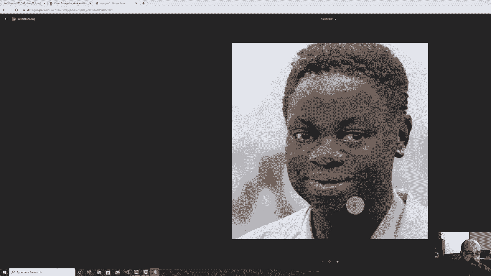
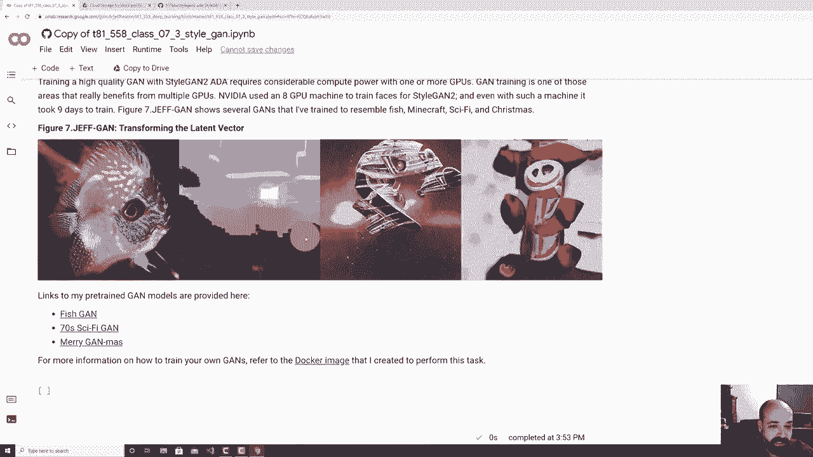

# T81-558 ｜ 深度神经网络应用-全案例实操系列(2021最新·完整版) - P39：L7.3- 使用NVIDIAStyleGAN2- ADAPyTorch和Python3生成人脸 

欢迎来到华盛顿大学的深度神经网络应用。在这个视频中，我们将看看如何使用NviDdia stylegan 2 AD for Ptorrch来获取一些非常高质量的G面孔图像。现在，以前我们看到可以使用我们自己定制的神经网络生成GN，但面孔看起来并不是特别好。要真正获得高质量的面孔，如stylegan所示，需要大量的计算能力和聪明的算法。

我们将要查看Stgan2 AD Ptorrch，这确实是该领域最新的技术。

🎼。好的，我们来看看代码。这是描述中有链接的模块。我在这里提到一下，这个模块需要pytorch。因此，我教你的这门课程大部分是在Tensorflow中进行的。至少在录制这个视频时，有两个部分我确实使用了pytorrch。

这是针对强化学习以及stylegan的。这主要是因为这两个非常重要的库，在强化学习的情况下是stylegan。稳定基线已经切换到Pytorch，实际上神经网络几乎在你所做的一切之下，因此你几乎不会注意到它。我在这门课程中添加了更多Pytorch组件作为可选方向，以便你能看到一些与Pytorch相同的技术，Pytorch正在获得很多势头，特别是在研究领域。

这是一种非常常用的技术，是实现深度学习的框架，所有的基本原理都是相同的，即使是我在NviIDdia切换到Pytorch之前用旧版本stylegan创建的pickle文件，这些pickle文件。

保存的神经网络可以直接加载到Pytorch中。因此，这些技术的基本原理在这些之间都是相同的。现在你会看到，使用stylegan2 AD可以生成所有这些非常高质量的面孔，这些都不是现实中的人，它们是通过stylegan to ADA生成的，顺便说一下。

结尾的AD代表增强，你在这里可以看到。可能在原始版本中只有一张猫的图片，但随着训练，他们提高了增强发生的概率，增强是计算机视觉领域的一项重大突破，它通过旋转和其他变形来扩增图像，以便在训练这些GS时拥有额外的训练数据，我会向你展示一些我在这门课上从头训练的ganNs，我们主要讨论的是从已经训练好的网络生成你的owngans。

你需要高端GPU，我的意思是你可以用Colab，但Colab Pro真的需要很多计算资源。我生成的大部分图像都是在我让其运行四天的高端GPU上生成的。但在这里你可以看到这些图像，它们看起来都非常逼真，不过有些东西会让你意识到你看到的不是现实的图像。

起初，这些看起来非常非常逼真。但如果你看背景，通常是一个明显的迹象，表明你看到的是生成的图像。背景有点异想天开，有点神秘。你不太确定自己在看什么。还有。

非脸部的东西看起来不会那么好，比如耳环。耳环的表现很差。注意她的耳环，很少会出现对称的耳环。此外，衣服，我的意思是，那里可能有一个按钮，我承认。我不是总能让我的衣服整洁得体，如果你看过我的视频的话。

但领子对我来说通常会有点凌乱。那看起来完全正常。我想它无法分辨一个脸和两个脸之间的区别。因此，尽管NVIDIA在策划训练数据和支付人们去去除某些东西方面做得很好，但其中一些却有多个面孔。你可以看到，这个家伙在这里有一个双胞胎。

而且它极度扭曲。类似地，手。她把手移到了画面中，看起来并不好。很难判断她的帽子。我是说，帽子可能会非常奇怪，尤其是在高端时尚中。但通常帽子会和头发融为一体，就像你在这里看到的那样，不真实。而她的脖子真的，真的很细。看看这些，你可以看到另一件事。

如果我要制作一个视频，展示各种随机面孔。你会注意到他们的眼睛总是在完全相同的位置。我的意思是，两个眼睛。现在，他们的脸和头可以稍微移动，但眼睛却固定在这里。这是因为NVIDIA训练这些模型的方式的一个特性，他们使用特征检测器来检测眼睛的位置进行裁剪，因此他们围绕眼睛居中每张图片，因为你知道人们会处于各种奇怪的位置，这些图片都来自Flickr的训练数据。所以这是你在处理这些类型的图像时会注意到的一些事情。现在，我想向你展示如何生成一些这样的图像，所以我将去Colab打开这个，因为你需要有GPU才能运行这个。

现在，你可能可以在没有GPU的情况下很好地运行这个训练，但生成时可能会很快。但这是NVIDdia的软件，所以他们假设你有一个GPU，这就是它的工作方式，尤其是Pytorrch，你需要为GPU和非GPU以不同方式编程，因此你看到的很多Pytorrch代码。

仅仅因为原始研究人员以那种方式编程，所以需要一个GPU。实际上我需要更新一下，我会去掉这一点。我们实际上并没有使用Tensorflowlow 1。x。这是NviIDdia升级之前旧版本的一个问题，他们使用了非常旧的Tensorflowlow版本。但现在他们使用的是最新的hightorrch，至少在录制这段视频时是这样。

所以我会继续运行这个，我相信我自己，我创建了这个笔记本。我将这样做，以便我可以访问我的G驱动器。你可能也想这样做，因为如果你生成了一些图像，你可能想保存它们。所以我把它放到那里，这并不是安全漏洞，我让你看到那段代码。

你只需要这样做就可以真正安装它。你需要克隆它。Piytorrch在collab中默认安装。你还需要ninja。Ninja是NviDIdia为此使用的Pytorrch添加功能。如果你查看stug into8A Ptorch，你会看到这里的最新版本。

我们刚刚将其克隆到我们的内容中，coabab是你存储所有临时内容的地方。一旦你退出coab，这些内容就会被清除。所以要注意这一点，这就是为什么我们每次都需要重新获取它。现在我将生成一些图像。我们将使用NviDdia的预训练人脸代码生成6600到25的种子。我稍后会解释这一点。现在让我们继续运行这个。

这些种子只是随机数种子，会使随机数生成一致的随机数字。再次说明，实际工作方式是你是从一个512数字向量生成图像，而那个512数字向量中的每一个数字都生成图像的一部分。所以如果你稍微改变其中一个数字，它会稍微改变图像。

这就是如何制作这种过渡图像和视频的方法，实际上你在这里观看的这些视频，在我进行这个部分时，我将向你展示如何创建你自己的那种视频。现在，这需要一些时间来安装所需的一切。

现在有两个Nvi使用的内核来加速这个过程。实际上，由于他们有自定义内核，这在CPU上是无法工作的。所以我收回之前说的话，你必须重新编码这些内核，那样可不有趣。所以这里有生成的图像，它们现在保存在我的内容结果中，如果我想的话，我可以基本上将它们复制到我的G驱动器。

我会向你展示另一种获取这些图像的方法。所以如果你查看，可以看到它们在那里。现在如果我们运行这个部分，如果你在这里得到这个错误，你会看到基本上是stylegan 2。不是一个目录，这仅仅意味着你没有在你的G驱动器上创建文件夹。我刚刚纠正了这个。所以如果我运行这个。现在它们被复制过来了。所以如果我去我的G驱动器。

你会看到我有一个项目stylegan 2，稍微刷新一下。你应该能看到生成的图像，它们都在这里。所以你可以点击这些，单独下载它们。这些是stylegan生成的图像。现在，我将运行这段代码，它基本上只是设置一些代码，以便我们可以将这些种子转换为实际的向量，因为我们想修改那512个数字向量。

做我们将在这里做的一些事情。这只是一个快速的函数来显示图像，这是我写的一个函数，它使用NviDdia的代码来实际生成图像。现在，你会看到的一些事情。😊。

在这里你还会看到我们也在处理标签。我在这个视频中不会真正深入标签。我当然可以做一个关于这个的视频，通常你会有你使用的GN，而我们在这里使用的是所有预训练的ganNs，必须已经为标签进行过训练。所以例如，假设你在小狗和小猫的图片上训练了你的gan。

如果你不在那里放标签，它会表现得相当不错，它会给你猫，会给你狗，也会给你看起来有点像狗的猫，反之亦然。你可以给它打标签，这样你就告诉它是什么类别，然后你可以在生成时请求生成更像猫或狗的东西。

实际上，他们在NviDdia的stylegan页面上有一个为此训练的模型，它从C图像集中生成非常低分辨率的图像，如果我没记错的话。是的，CR 10的那个，如果你用过这些，它们是10个。这些是32乘32的图像，早期在机器学习中使用的10种不同类型的图像数据集。所以如果你查看CR，我忘了CR的10个类别是什么。飞机，汽车。

鸟、猫、鹿、狗，这个数据集混合了这10个类别，为了获得最佳结果。你创建了一个标记的G，然后可以选择想要生成的类别。否则，Gans在没有区分不同事物的标记时效果不佳。我会给你展示一个广泛训练的GN示例，等我们讲到那时。

你可以传入一个截断的Pi变体，这将改变你所得到的质量。你也可以引入噪声。我保持它恒定。如果你引入噪声，你会看到头发和其他小东西会改变一些小细节，所以它不会变成完全不同的人，但看起来几乎就像头发在风中飘动。如果你将这个设置为随机而不是恒定，然后再调整类索引。

我实际上并不在这个课程中使用它，所以我不会有这个。你运行这个，然后在这里选择哪个预训练的模型。我将使用fishgan。这是我自己的一个。我训练了这个模型，使用Flicker获取了一堆鱼的图像，这基本上就是向你展示如何加载一个预训练的gan。这只是一个pickle文件。我实际上是在旧的Tensorflow版本上训练的。

所以它展示了这些模型的兼容性，我将从1000到1003生成随机鱼。这里有三条随机鱼。你可以看到它们看起来真的很不错。如果你查看不同的样本，有些确实不如其他的好。这条鱼这里有一个眼睛，还有一个很长的嘴巴，而这条没有眼睛。

这个鱼有一个眼睛，但有一种不寻常的鼻子，不过它们看起来，真的很像鱼。😊 如果你再放入更多的种子，你可以生成更多的鱼。你会发现这些鱼看起来真的很不错。这条鱼看起来相当不错。

那有点抽象，现在你可以改变潜在向量。那个512数字的潜在向量实际上创建了这些图像。所以我。😊 我将使用F F HQ，所以我将使用真实的面孔。我将运行我写的这段代码。这段代码的作用是加载。

面孔，所以我现在可以使用它。我将进行1000、1003和1001之间的过渡。让我运行这个，以便它可以进行。这样做是我使用100步在1000、1003和1001之间进行过渡，所以这些单独的种子。如果你从种子1000过渡到1001，那将会是一个完全不同样子的人。

如果你拿到那个由512个数字组成的种子生成的大向量，那么你将会得到更渐进的结果。现在我正在为这些人生成图像。我正在从1000过渡到1003，再回到1001。你可以看到生成这些图像需要一些时间。

这段话生成了一整堆帧，当我逐渐从一个向量偏移到另一个向量时。你可以看到我基本上得到了我的 vector1 和 vector2。我采用这两个向量的差异，按线性代数的方式，将差值除以步数。

这是我每次使用的值，作为我的步数。所以我添加了那个步向量。它慢慢地加到原始向量上，最终到达第二个向量，差不多完成了。让我们快进一下。好了，这部分完成了。然后我使用一个叫做 FF Mpeg 的工具将所有这些帧转换回视频，现在我们可以下载这个视频。

它正在准备视频，我会打开视频，你可以看到过渡。我基本上是在过渡这些我选择的关键图像，你能实时看到那些人的转换。现在你可以训练你自己的 GAN。这些是我训练的一些 GAN，其中有一个是鱼 GAN。我也训练了一个关于 Minecraft 的，科学幻想图片。

然后我想尝试一些非常疯狂的事情。我拿了一些随机的圣诞假期视频。我的意思是，那里有灯光，有圣诞树，还有各种各样的圣诞老人。因为没有什么特别的，所以 GNs 在这方面做得不是很好，这导致了一些非常狂野的、类似于《圣诞前夜》的图像。如果你想生成自己的 Minecraft 图像或其他东西，我给你所有的预训练模型的链接。

