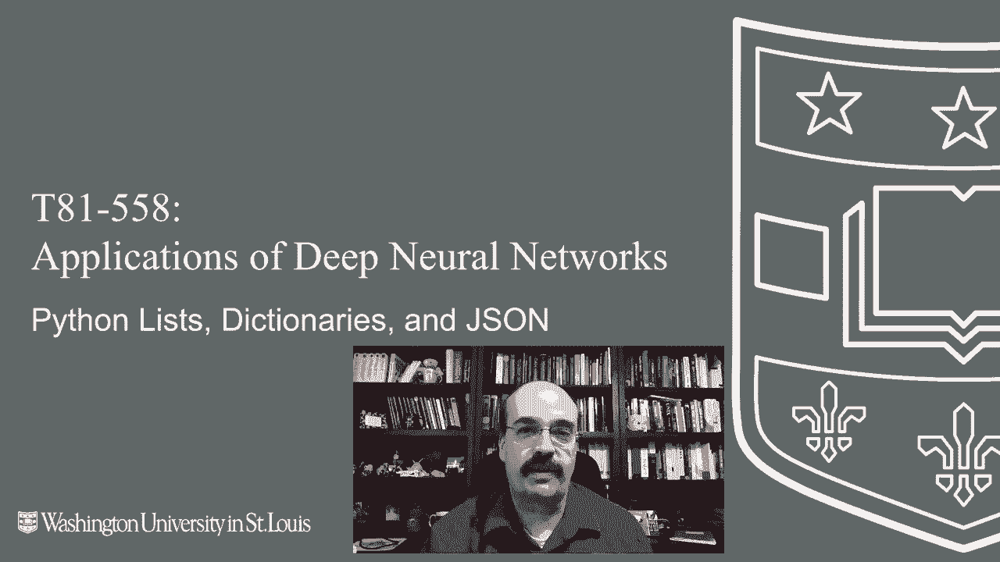
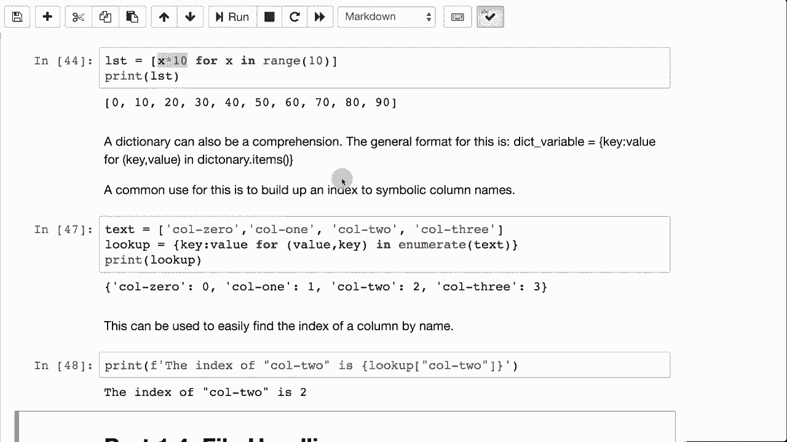

# T81-558 ｜ 深度神经网络应用-全案例实操系列(2021最新·完整版) - P4：L1.3- Python 列表、字典、集合和 JSON - ShowMeAI - BV15f4y1w7b8

嗨，我是 Jeff Heaton，欢迎来到华盛顿大学的深度神经网络应用。在这个视频中，我们将更深入地研究 Python 编程语言，并了解如何使用列表和字典。这使得可以在 Python 编程语言中创建复杂的数据结构。

它非常类似于 JO，你可以字面上在 Python 代码中模拟 JsonN 语法。就像你在 JavaScript 中那样构建这些复杂结构一样。有关我最新的 AI 课程和项目的信息，请点击订阅，并点击旁边的铃铛，以便收到该部分每个新视频的通知。在这一部分，我们将深入研究 Python 列表、字典、集合和 JSON。因此，如果你已经在这些主题上工作过。

你可以安全地跳过这一部分，继续往下进行。像大多数编程语言一样，Python 确实有数组、列表、字典和集合的概念。Python 处理这些的方式很有趣。

这与 JavaScript 的处理方式非常相似。构成这些列表的代码通常在 Python 中是有效的 JSon，只要你正确书写，它始终是有效的 JSON。所以我们在 Python 中看到的是可以有一个值的列表。这是一个数组。这是一个预定义的数组。这里面有字符串，单引号，单引号。

当你在 Python 中打印列表时，我们可以将这些打印出来。它通常看起来是这样的。你会有一个打开的大括号，关闭的大括号，然后里面的内容。某些列表。如果你使用的是“lumpumpy”列表。我们稍后再讨论这个，那里会看起来更复杂，但基本上还是同样的东西。

你在这里有多个值，在许多编程语言中，数组是固定大小的，而在 Python 中则不是。你可以向它们添加内容。所以 C 做到的 Yi。将会在列表创建后放入其他内容。因此，这非常方便。你可以遍历一个列表。

这就像许多编程语言中的 for each 循环一样。因此这将循环遍历每个值并打印出来。所以你得到了那个集合或列表中的值。Python 还有一个很方便的功能，它允许你跟踪你在列表中的当前值，如果你想跟踪索引的话。

你需要做一些像这样 index 等于 0。打印，你会打印出你拥有的 S，然后也许是它所在的索引。然后你必须记得每次都增加这个值。现在你可以跟踪你在列表中的位置。否则你就不知道你在列表中的位置。

列表的每一次迭代都是完全相同的，知道你实际所处的位置。所以我们就这样保持不变，但在这里我们可以使用一种叫做枚举的东西，这样你就不需要有那个其他值。所以现在我们在循环i和C，i将是你的索引，C将是在那个特定索引处的值，所以现在你知道你在这个中的位置。

这将是有用的，因为也许你想要在那个特定值上修改集合，并将其更改为其他东西。我们不会这样做，但这就是它可能有用的地方，或者如果你只是想打印数字以配合这些内容。现在，Python中的所有内容都是零基的，列表和索引从零开始，你也可以通过添加值来定义你的列表。

这不是错字，确实要有两个C，因为这告诉你一个列表总是有方括号，可以有多个值，多个项目具有完全相同的值。如果你使用一种叫做集合的东西，这非常有用。你可以使用集合来消除重复项，随着你添加这些项。

第二个C不会被添加，因为它说，嘿，我已经有一个了。要定义一个集合，你只需做C等于set，然后关闭括号。现在。你会注意到它在打印时确实有大括号。所以它有点像一个字典。现在，列表可以添加和移除值。所以在这里我们有ABC。

我们现在插入A0，注意我们在位置零插入，因此它放在开始的位置。然后我们打印出来，看到它被放到了最前面。接着我们将从C中移除B的值，所以我们也可以在索引处移除C的集合，如果你想移除第一个，这就是你做到的方式。这就是你如何非常动态地向数组中添加和移除值，它不像某些编程语言那样要求定义固定长度的数组，只有这样。

现在这是有趣的部分。你可以定义字典和哈希表，并创建相当复杂的结构。所以在这里我创建了基本上是名称值对的东西，这本质上是字典和哈希表本身。

字典、映射、哈希表，这些名称都表示非常相似的东西，并且基本上可以互换使用。在大多数情况下。这里我创建了一个字典，一个字典就像一本书，你查找一个词并找到其定义。这基本上就是它在这里的作用，所以名称是杰夫，地址是123主街，如果我打印出D，当我运行这个时。

你首先看到的是字典的打印输出。如果我打印出来。这是如何查找的，如果我打印出 name。并使用方括号，它会找到 Jeff，并打印出 Jeff。这是你检查某个东西是否在字典中存在的方法。如果你尝试访问字典中不存在的东西，比如如果我试图打印出 name2，它会给出一个错误，所以你想检查一下，如果 name 确实被定义了，实际上是的，而 age 是未定义的。

使用字典时要注意这一点，这是 Python 的一个非常常见的特性，我们在本课程中肯定会使用。你也可以访问其中的单个键和值。所以如果你运行这个，它会显示键是 name 和 address，现在注意到它说这是一个字典的键。

这基本上是一个列表，你可以把它当作列表来处理，或者你可以通过将其传递给 list 来轻松地将其转换为列表。值，这些就是值。所以你使用 keys 函数和 values 函数来获取字典中所有内容的访问权限。

你也可以组合它们，所以这里非常常见，你会看到一个列表。然后这里的每个映射或字典本质上是一个记录。所以在第一个记录中，它说明了这个人的名字或者名字，我和我的妻子。Jeff 和 Tracy Heaton，我们有三只宠物，两只鸟和一只名叫 Hickory 的狗。还有宠物。

由于我们有多只宠物，你必须在其中放一个列表。如果只是 Winton，我们可以直接用冒号和 Winton，只要你定义格式为那样。约翰·史密斯这里有一只叫 Rover 的宠物，由于我们定义的格式为列表。我们期待一个列表，即使他只有 Rover，显然是一只狗。我们不。

需要真的有列表，但这使得它方便，因为我们可以期待一切都是列表，保持一致性总是好事。约翰·多没有宠物，所以我不知道他的问题是什么。这就是客户的完整列表。我们可以将其打印出来，或者我们可以逐一遍历它。所以这将整个内容打印出来，直接输出到你的屏幕上，或者在这里我们可以循环遍历它们。

或许你可以处理每一个，你可以计算每个人拥有的宠物数量。顺便说一下，这对客户有点方便。所以如果你确实获取而不是仅仅是大括号。然后你可以提供一个默认值。所以这里的默认值是没有宠物。如果这个人没有宠物，正是 J Doe 的情况，它会简单地说没有宠物。

顺便说一下，这段代码开始看起来非常像 JSON。在这里。使代码不再是 JSON 的原因是 JSON 要求在这里加上引号，如果你把它改成那样，你就不再是有效的 JSON，更复杂的列表，这种做法相对整洁。你可以将两个列表合并，所以这里我们有 1，2，3，4，5，5，432，1 对于 B。

我们将打印出A和B的zip，它会将这两个连接在一起。现在，这给你一个对象来实际查看。你这样做。这些是元组。在Python中，元组和列表非常相似，我们实际上不会深入讨论它们之间的区别。在神经网络的研究中，但你可以看到第一个是这里的1、2、3、4、5，然后是5。

4、3、21是另一个，所以现在创建了一系列的元组在列表中。因此，你有一个包含这些元组的列表，然后这些元组是那两个列表的并集。或者是那两个列表的连接。你也可以像这样使用它。所以现在你正在使用每个列表中的X和Y。

我们已经看到了枚举，但这基本上是为了让你跟踪每个值所在的位置。所以你知道1在位置0，依此类推。这在你想打印出每个索引所持有的内容时是很有用的。这在Python中是一个列表推导式。我们会使用这些一些。🤢，基本上，这就是它为你动态构建一个列表。

所以这表示对于10中的所有x，以及你在这里放入的任何内容，如果你在这里仅仅放入X，它会重复列表。但是因为是10，这就创建了一个第二个列表，其中每个值都乘以10。这是一种动态构建列表的非常方便的方法。

你也可以动态构建一个字典。我在处理CSV文件时经常使用这个。因此，当你处理CSV文件时，你会得到它们的标题列表。😊，所以你可能会有列零、列一、列二和列三，你可能想要一个查找表，以便现在可以查找call2的文本，这可能是一个地址或其他什么。你可以将该字符串传入，然后如果它的位置发生变化，它会移动到正确的索引。

你创建这个查找值。查找字典表示列零是零，列一是一个，列二是二。现在，如果你在这里添加一些东西，比如，我不知道，就那样。那么现在它将跟踪这些。因此，列三被推到了右边。所以它仍然是4。这就是你如何在代码中进行更改时保持代码不崩溃的方法。

所以这非常方便，因为现在你可以查找该列的索引并发现它实际上是两个。感谢观看此视频。在下一个视频中，我们将研究如何利用文件，无论是图像还是文本，以便在导入数据到深度神经网络时使用。这些内容经常变化，所以请订阅频道以保持对本课程和其他人工智能主题的最新了解。

😊。
