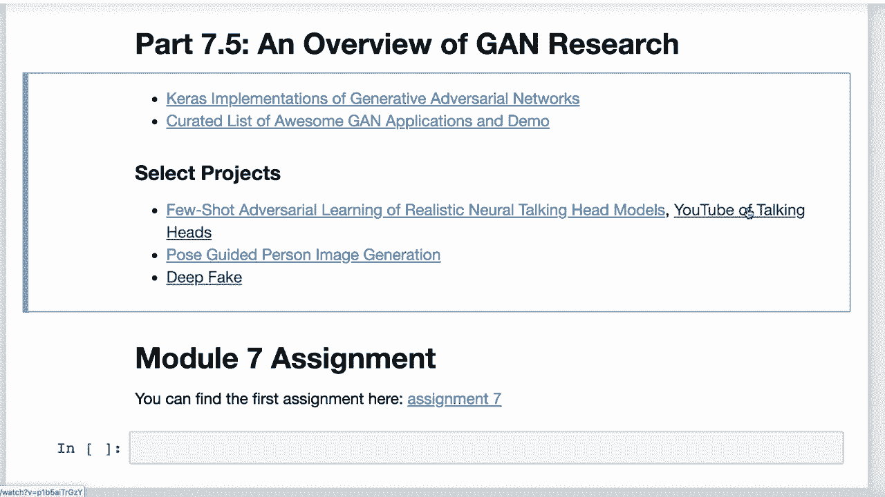
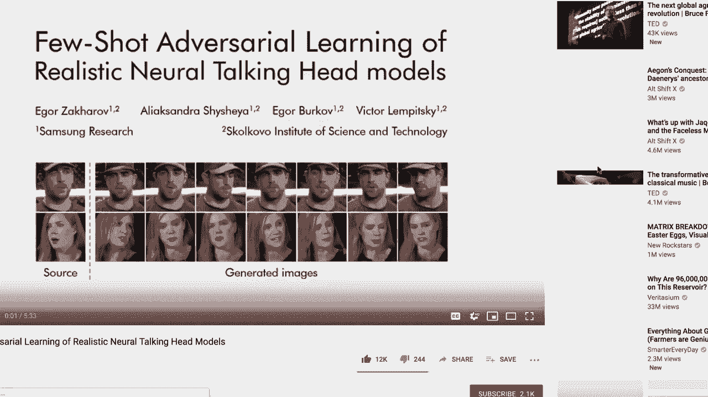
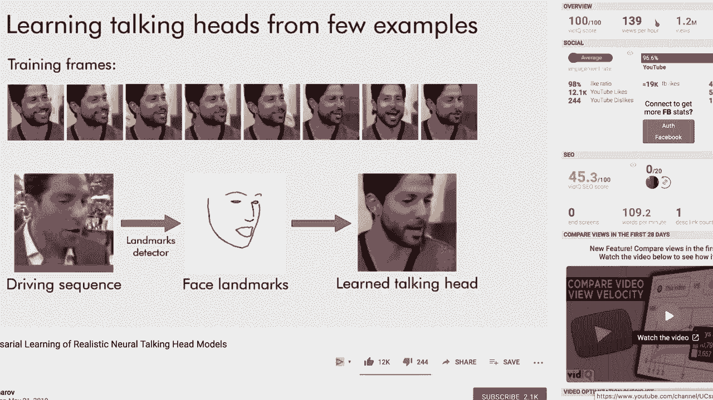
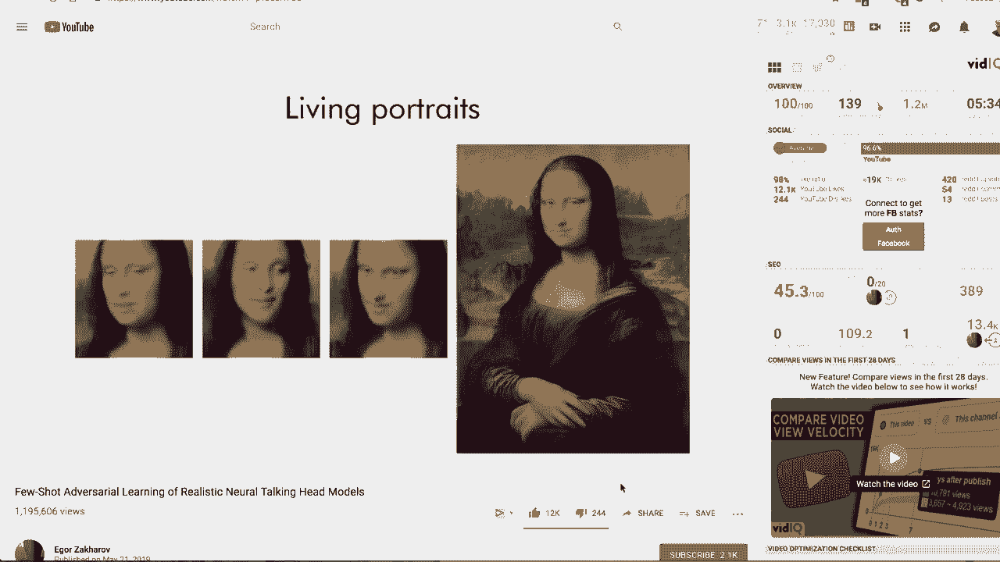
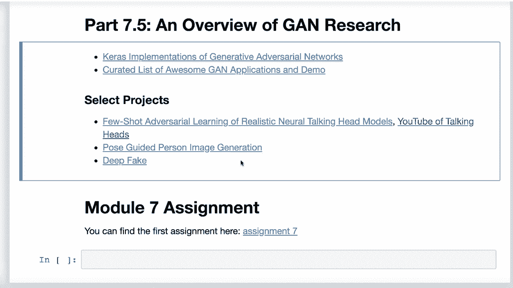

# T81-558 ｜ 深度神经网络应用-全案例实操系列(2021最新·完整版) - P41：L7.5- 生成对抗网络(GAN)研究领域的一些新主题 - ShowMeAI - BV15f4y1w7b8

嗨，我是Jeff E，欢迎来到华盛顿大学的深度神经网络应用。在这个视频中，我们将看看GANs中一些最新的研究领域，并了解这种令人兴奋的神经网络类型可以做的一些有趣事情。要获取我AI课程和项目的最新信息，请点击订阅和旁边的铃铛，以便在每个新视频发布时收到通知。现在，让我们看看一些我觉得特别有趣的GAN项目，其中一些是纯GAN，有些则是与GAN结合使用其他技术。

在这里，我给你一个链接到GitHub的网站，基本上有Kra对许多G项目的实现，你可以在论文中找到。这是一个非常有用的网站，我用它获取了我在这堂课中给你的一些例子的资料。

所以一定要查看这个。这也是一个很棒的Dethub库。这是一个精心策划的精彩G应用和演示列表。这个项目能够使用G生成中文书法字体。😊这个项目能够生成动漫角色作为面孔。

这就像我们见过的常规面部生成对抗网络，只不过它是在生成动漫角色。老化效果很有趣，它能够逐渐使面部老化，并让你对一个面孔在更年长时的样子有个概念。超分辨率也很有趣，这是将相对低分辨率的图像提升到更高分辨率的过程。

这在大屏电视的升级上非常受欢迎，也适用于老视频游戏。😊，以非常高的分辨率输出，我发现一些特别有趣的项目，仅仅是想看看深度伪造，媒体对此非常感兴趣。

特别是2020年美国大选即将到来，我们正进入一个时代，在这个时代，我们的敌人可以让任何人看起来在任何时间说任何话。即使他们永远不会说那些话，其他人也会。像乔丹·皮尔这样的人。这是一个危险的时期。现在，深度伪造通过获取源视频图像并将其结合在一起，以便你可以创建一个图像，创建一个说话的人，基本上可以让他们用自己的声音说你想让他们说的话，正在出现一种新的方法，即少量对抗学习的真实说话头。

🎼这个你最近在媒体上见过。他们对蒙娜丽莎做了很多事情。

🎼Paint我们呈现一个可以学习真实说话头模型的系统。🎼值得注意的是，学习新的头部模型只需要少量图像。在这里，我们可以看到，在某些情况下，模型可能对标志的几何形状非常敏感。

而你看到的大多数扫描实际上只是处理面部，但。

他们正在进行全身引导生成。

这是一篇论文，他们能够生成整个身体，并根据你这里的这些点来摆姿势，所以你现在可以。我不知道，我觉得神经网络可能是在试图让人类模型失业，也许我不知道。

但他们现在可以基于Gs智能生成全身图像。
