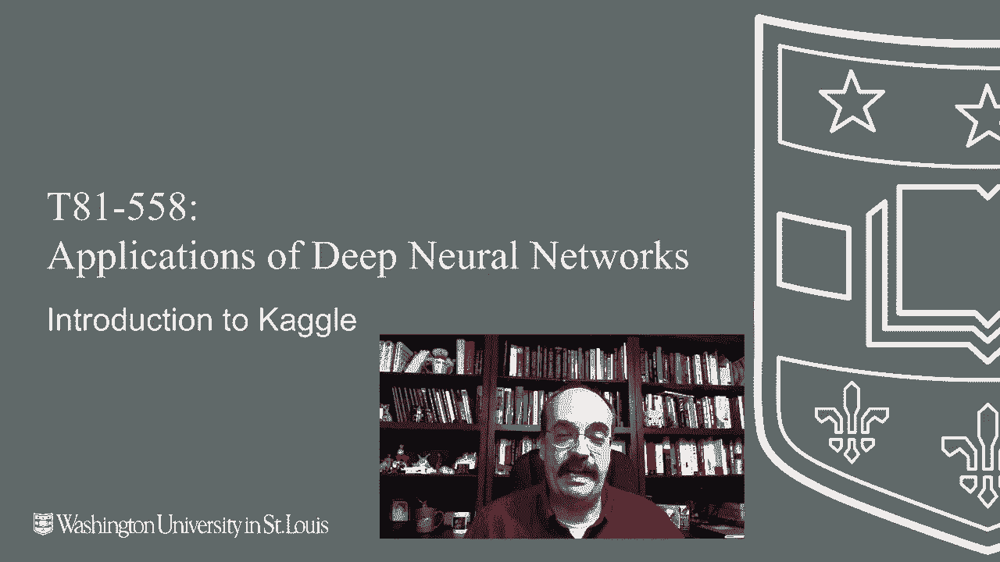
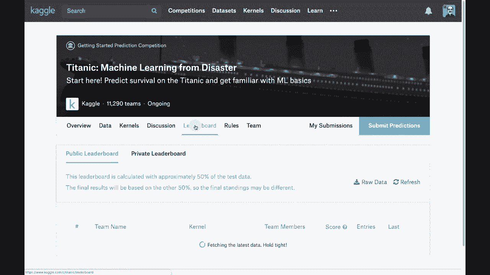
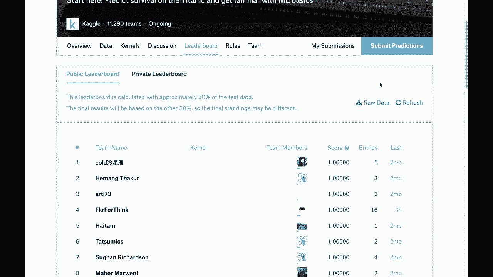
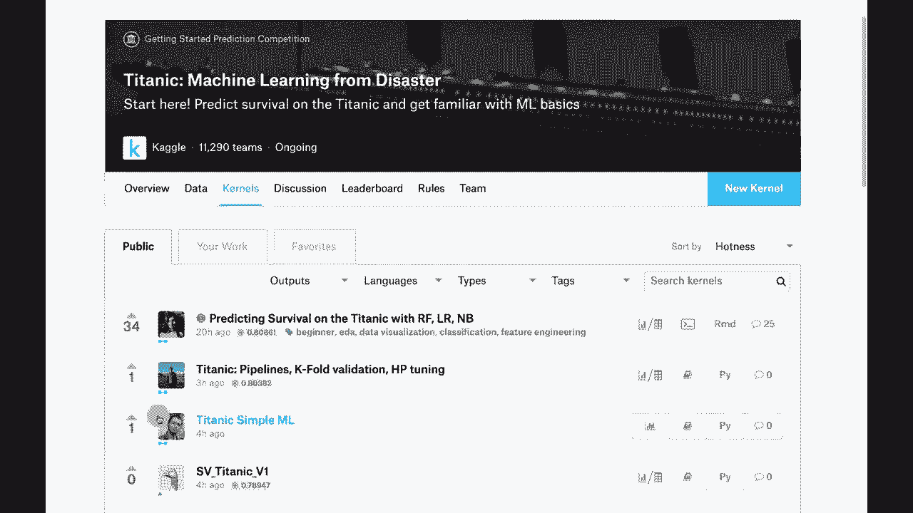
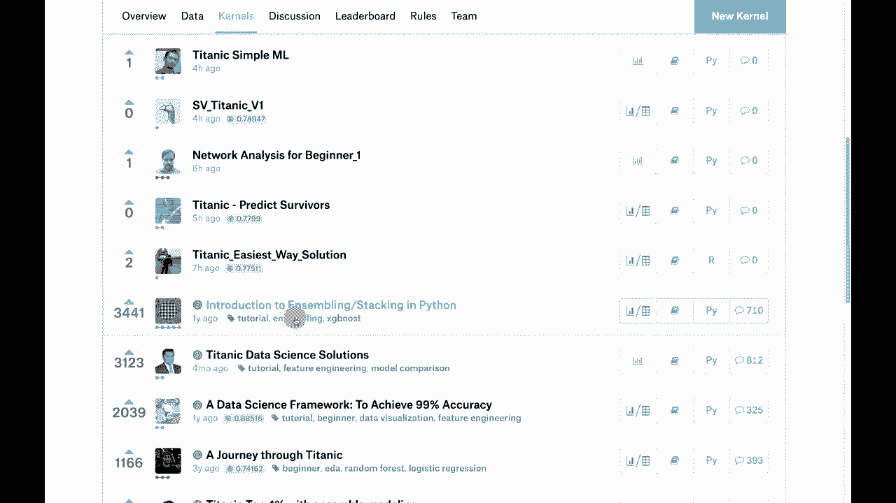
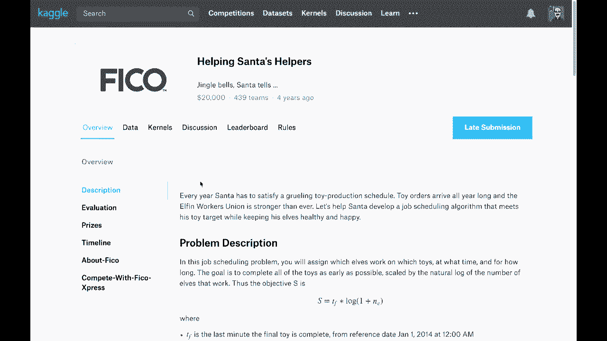

# T81-558 ｜ 深度神经网络应用-全案例实操系列(2021最新·完整版) - P42：L8.1- Kaggle简介 

嗨，我是Jeff Heaton。我们在华盛顿大学研究深度神经网络的应用。在这个视频中，我们将概述Cagel。Cagel是竞争性数据科学，课程中的一个项目涉及到Cagggel竞赛，最新的AI课程和项目可以点击旁边的订阅铃铛以接收每个新视频的通知。

Kagel在数据科学界非常重要。它就像美国的世界杯或超级碗。在这里，数据科学家们互相竞争。他们这样做是为了获得kgel排名。不同的kgel排名有很多种。稍后我们会谈论这个。但你最感兴趣的将是我将给你一个kgel课堂。

这是kgggel的一个特别区域。它并不是一个真正的完整kgel竞赛，你并不是在与成千上万的其他数据科学家竞争，但它使用的界面与Kagel完全相同。这让你熟悉kle竞赛并进行学习。😊

如何处理这些类型的数据集。我将给你一个关于Kagggel的概述，我们将看看如何提交内容到Cagel，因为这个课程的一个主要项目是一个向当前学期的学生以及互联网开放的kaggel竞赛，通常还有一些不在华盛顿大学实际课堂上的人也参加Cagel竞赛。

这非常有趣。我有时甚至会看到之前的学生回来参加随后的kgel竞赛学期。有些在课堂kgel竞赛中竞争的学生也参加了其他kgel竞赛。一个学生甚至在实际的kle竞赛中进入了前5%，比我在Kaggel的成绩还要好，这真是太酷了。稍后我们会详细讨论这些百分比排名的含义。所以Cagel，看看这个，你可以看到顶级的kgel用户。这只是一个指向Kaggle网站的链接。

现在这确实把我放在了顶部，但这只是因为我是我，我绝对不是Cagel的零号位置。这些是一些来自Cagggel的最高排名数据科学家。你可以点击一些个人资料，进入一个描述他们更多信息的小页面。有时他们会有Github和LinkedIn的链接，有时则没有，就像这个当前排名第一的家伙一样，Kagggel上确实有时会与这些人进行采访，以便你可以了解更多。

我还有一个链接到顶级Kaggle个人资料，但我们没去过。这是我的Kaggle个人资料页面，让你看到我在这方面做了什么。这显示了你当前的排名，我被称为比赛专家，这意味着我完成了两场比赛并获得了铜牌，这是成为比赛专家的最低要求。对我来说，下一个级别是Kaggle大师，甚至是Kaggle大宗师，这需要获得一些这些。

黄金级别的完成标准是如何获得铜牌，实际上是Kaggle的前10%胜利。我们前10%的完成。对于Kaggle，我大概在这两场比赛中表现最好。一场是前10%，另一场是前7%的完成。所以这足以让我成为比赛专家。现在我大约有两年没参加Kaggle比赛了。希望能再次参与其中。

不过，这确实需要相当多的时间，和我的日常工作一样。所以我们看看未来会如何。大多数Kaggle比赛。我们来看看一个典型的Kaggle比赛。我们会查看Titanic比赛。Kaggle将其网站分成多个比赛。因此，如果你去Titanic的比赛摘要页面。这是一个教程比赛。

你当然可以参与其中。 从参与的团队数量就可以看出，几乎有12000个。 大多数大型比赛会有1000或2个，可能还有三个。所以这无疑是一个非常大的比赛，赢得Kaggle的比赛。没有。

赢得Titanic Kaggle比赛的概念，因为它是持续进行的。实际上没有真正的截止日期。他们通常将Titanic的当前截止日期设定为当年年底。你会发现，他们通常会将截止日期推迟到明年的年底。Titanic数据集是那艘在大西洋中遭遇了非常灾难性命运的邮轮。

它沉没了。有些人幸存了下来，有些人没有。你可以去维基百科查找谁幸存，谁没有。因此，你可以在此获得完美的排行榜得分。排行榜显示了参与者中，谁在前列，谁不在。现在。

看，这里有很多完美的得分。这些是准确率。因此1.0意味着在这样的教程比赛中100%的准确率，结果公布在维基百科上。事实上，这些人有100%的得分，意味着他们在复制和粘贴方面非常擅长。在Titanic上获得0%得分是不可能的。

重新考虑过拟合。我会非常惊讶地看到“过拟合泰坦尼克号”是一个完美的例子。有几个相对年轻的个体，本应该是女性，也应该成功逃离这艘船，但并没有。没有人确切知道他们为什么没有，可能是在灾难的最后时刻与父母走散了。所以这就是排行榜。数据页面对你也非常重要。

在这个模块结束时，我会带你了解本学期的比赛。这是数据页面，展示了训练集和测试集的样子。你还会获得数据字典。例如，他们是否幸存。是或否，票类，第一、二、三舱，性别，年龄和年数，兄弟姐妹数量。

父母数量，票号，乘客票价，舱号和登船地点。基本上是从欧洲的三个不同城市接送的人，之后泰坦尼克号启航横渡大西洋。这些变量非常重要。票类。

可能这是第二重要的因素。性别在这种灾难中非常依赖“女性和儿童优先”。因此，最具预测性的变量是你是男性还是女性。如果你是女性，你生存的概率要大得多。第二重要的因素取决于你是男性还是女性，如果你是女性，你的票类与此关系密切。其次可能是年龄，男性的年龄也是第二重要的因素，因为那样你会归入儿童的类别。在一些比赛中，你会看到 kernels，但我不会要求你在我们班的比赛中提交 kernels。你可以看到这些在评价中排名相当高，这是你提交代码的地方。所以在Kaggle中你可以通过三种不同方式获得名声，可能最具声望的就是赢得比赛或在比赛中名列前茅。下一个可能最具声望的就是 kernels。

也许你并不一定赢得了比赛，但你提交了一段代码片段，得到了其他Kaggle用户的高度评价，比如这些关于集成、堆叠和Python的介绍。这可能是你本学期可以考虑的一个很好的项目，你也许可以将其改编成我将要给你的第三个作业和另一种方式。

我的意思是，这三者都能让你成为Kaggle大师、Kaggle专家、Kaggle大宗师，讨论和交流也非常重要。我从这些讨论中学到了很多东西，当我在Kaggle比赛中时。讨论点也可以被高度排名。如果你发布了很多 consistently high ranked 的讨论，这将为你在讨论中赢得Kaggle大师的地位，进而登上排行榜。

在Kaggle比赛中，你将被允许组队。在这里你可以看到三个图标，这意味着这是一个团队竞争。因此你可以创建最多五人的团队。😊。

但是请参考实际视频以获取本学期Kaggle比赛的说明。你可能还会注意到下面的小点，这些小点告诉你正在处理的Kaggle选手的水平。一个绿色的点意味着你在与一个全新、未参与过比赛的Kaggle选手打交道，两个点则意味着他们参加过Kaggle比赛，但尚未达到获得两枚铜牌的专家水平。

这是我目前所处的类别，那些是获得铜奖的选手，达到Kaggle专家的水平，而四等奖是Kaggle大师，五等奖是Kaggle奶奶。Kaggle比赛的评分方式很有趣，通常你不需要将你的代码提交给Kaggle进行评分。

他们只是想要你的数据，现在只有内核竞争。我可能在未来的学期参与其中，但目前不打算。所以这次竞争，我将给你一个正常的Kaggle数据竞争。我会提供一个完整的数据集。我知道结果，也知道我完整数据集中的每一行的原因。

我会将数据拆分，给你一个训练集和一个测试集，测试集可能占20%。但请参考当前学期的Kaggle比赛，看看我具体设定在哪里。训练集中，我会像惯例一样给你Y值，而测试集我不会给你Y值。这两个数据集都有ID列，告诉你每一行的ID。你得分的方法是提交你的预测结果。

你的测试数据集的Y值与每个ID编号对应。所以你提交的内容其实非常简短。只需包含ID和你的答案，像提交那些填空题的扫描测试一样，这种测试现在使用得越来越少，通常这些测试都是在电脑上完成的。在你提交的测试数据集中，有两个部分。

有公共排行榜和私人排行榜。你最初将在公共排行榜上得分，而你不知道哪个是哪个，我不透露，Kaggle也不会透露。你的答案将基于你在泰坦尼克Kaggle比赛中看到的公共排行榜分数。

所有这些都是公共排行榜的分数，直到比赛实际结束。一旦比赛结束，它会翻转，你的分数将来自私人排行榜。这防止了过拟合。如果你严重过拟合了训练数据集，你的公共排行榜分数将会很糟糕。然而，如果你通过不断调整来过拟合排行榜，提高公共排行榜分数。

你会在私人排行榜公布时感到惊讶，因为你已经过拟合了公共排行榜，而许多Caggle竞争者在这些比赛中也遭遇了严重的下滑。

它们在公共排行榜上可能会位列前五，但当比赛结束时，它们在私人排行榜上的分数会被严重压制。随着我们进入本学期的实际作业，你会看到一些例子，但你不会知道自己的私人排行榜排名，这才是关键，直到最后。

所以公共排行榜只是你可能的位置的估计。这是一个图形示例。你可以看到原始数据集。这是只有我或者其他运行Caggle比赛的人有的。我给你这个数据，你得到带有Y值的训练数据和没有Y值的测试数据，但测试数据实际上被秘密分为两部分，你会分别评分。

你不知道哪些行或者公共排行榜，但我有那些Y值。所以Kaaggel会在这方面对你进行评分，并将你放入适合你的公共排行榜分数的组别，然后在最后，Caggle会自动对你在私人排行榜上的表现进行评分。现在准备Caggle提交，你基本上会使用这个测试数据，并填写你所有的答案。对于泰坦尼克号的数据，它的样子是乘客的I，逝者标记为0，幸存者标记为1，这基本上是一个你需要上传的cv文件。我将带你了解一些我发现特别有趣的Caggle比赛。首先，自动组挑战是我参与的第一个比赛，幸运的是我能进入前10%。自动组挑战是一个需要在多个产品类别之间进行区分的比赛。我忘了确切有多少个类别，总共有93个特征，所以是93个X。

提供了200,000行数据，你需要在其中进行分类。这是一个非常困难的Kaggle竞赛，我最终使用了深度学习和其他一种叫XGBoost的方法。我强烈建议你了解一下XGBoost，这超出了本课程的范围，但XGBoost和一种叫LightGBM的技术在Kaggle中非常受欢迎。如果你想将它们与本学期的Kaggle作业结合使用，这可能会帮助你获得更好的分数。只需查看这个案例的排行榜，这显示了排名靠前的人员。现在注意，这些人的底部点数要高得多，因为他们是真正的Kaggle竞争者，而黄色的则是KaggleGrandmasters，橙色的是KaggleMasters。这个人真的很幸运，他只提交了一个案例就进入了前十名，虽然并不是完全。

当然，他可能只提交了这一个案例，之后再也没有参与Kaggle竞赛。因此，他甚至不算是专家级别，但我相信他可以做到。他或她。这是公共排行榜。如果我们看一下，这实际上是私人排行榜。如果你查看公共排行榜，可以看看排名靠前的人，因为这会有一些变化。

实际上并没有太多变化。大多数人的排名基本保持不变。因此，这个案例并没有发生太多过拟合。银河动物园也是一个相当有趣的案例。这是XGBoost真正走入公众视野的地方。这是一个试图分类你所观察到的星系类型的案例。

这是一个计算机视觉的案例。这是早期计算机视觉中的一个案例。Kaggle上有很多计算机视觉的案例，也有处理行和列的表格数据。我到目前为止在这个课程中参与的大多数Kaggle竞赛都是表格数据，但我很可能会在某个时候加入计算机视觉的案例。

所以当我们到达这个模块的最后部分并讨论本学期的竞赛时，你会听到相关信息。实践融合案例特别有趣，因为你会得到一个关系数据库。这是Kaggle早期的一个案例，只有1416个案例。这是医疗数据，因此这是我的行业，保险行业曾多次研究的案例。你还会得到ICD9代码，相信我，ICD10和ICD9在保险行业中是个大问题，涉及预测生物反应。

这是一个特别有趣的例子。我稍后会在模块中给你展示一个例子，以便我可以向你演示集成学习，集成学习是指将多个模型结合在一起。因此，异质集成学习是指将随机森林与深度神经网络结合使用，而同质集成学习则是。

在这里，你会使用随机森林进行完全独立的集成。如果你查看数据字典，会发现有大量的列。实际上，得不断加载，我想这里有几千列，而这一个数据集的行数并不多。所以这里有确切的统计数据，训练集有3700行和1777列，这实在有些疯狂，但这就是这个问题的关键，你要预测生物反应是否会发生。

这实际上是一个二分类问题。我发现特别有趣的计算机视觉应用是糖尿病视网膜病变。这是通过眼睛的照片（视网膜病变）来预测你是否患有糖尿病，另一个应用。

保险行业显然对此非常感兴趣。所以为100,000美元。这是潜在的，大额资金，猫和狗的对比。这纯粹是有趣。以前总是说，人工智能在区分猫和狗方面失败，但现在绝对不是这样了。这里有猫和狗的图片，尝试使用深度学习和其他技术来区分它们。

看一下排行榜。这是准确度，达到大约99%。神经网络和其他模型非常能够区分猫和狗。州立农场的分心驾驶检测，这是保险行业的应用，使用了计算机视觉。这非常有趣。这是将相机放置在测试对象的车里。

这些想法的核心是让保险公司在你身上放置某种监控设备。这完全是物联网（IoT）。所以这些车里有些东西在追踪这些人，并在他们开车时拍照。

我的意思是，如果你证明自己是安全驾驶者或健康个体，保险公司会给你更低的保费。这些是驾驶不太安全的人。可以看到，她在看手机，至少看起来是出车外，但手里却拿着手机。所以你需要检测他们是在进行安全活动还是不太安全的活动。还有时间序列，Kaggle的鲸鱼检测挑战非常有趣。

你基本上在处理声波。所以处理声音文件。这在处理时间序列数据时非常流行，比如LSTM和一些新的卷积时间序列技术。我们在讨论时间序列时会深入探讨，此外，Kaggle总是有帮助圣诞老人的活动，这是一个奇怪的比赛，通常在圣诞节期间。你实际上是在制定一个最佳的圣诞老人日程，以便他能在平安夜交付所有玩具。

结果变得相当离奇，因为这些竞争对圣诞老人而言，圣诞老人的日程将在圣诞节后持续很多很多年。因此他最终变得非常非常晚。但这其实是一个优化问题。稍微超出神经网络的范围，但其他机器学习技术可以用于解决这个问题。感谢观看这个视频。

在下一个视频中，我们将探讨集合以及如何将神经网络与其他*psyit learn*结合。😊。

类型模型可以构建更具预测性的结构。这在*kggles*中是一种非常常见的技术。这些内容经常变化，所以请订阅频道，以便及时了解本课程及其他人工智能主题。
