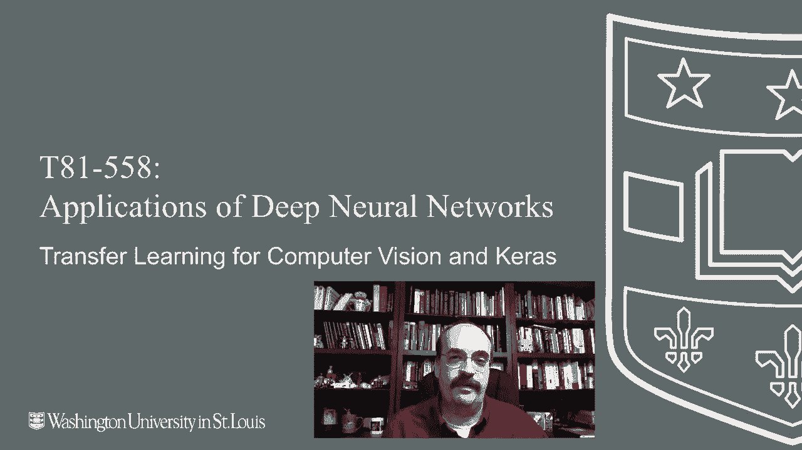
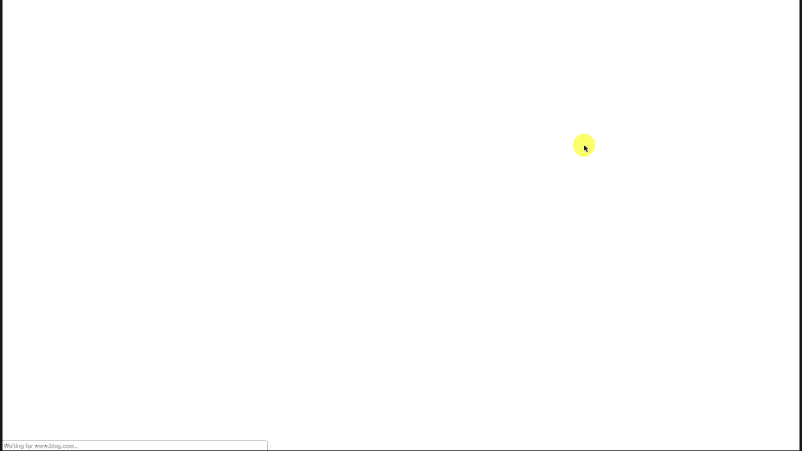
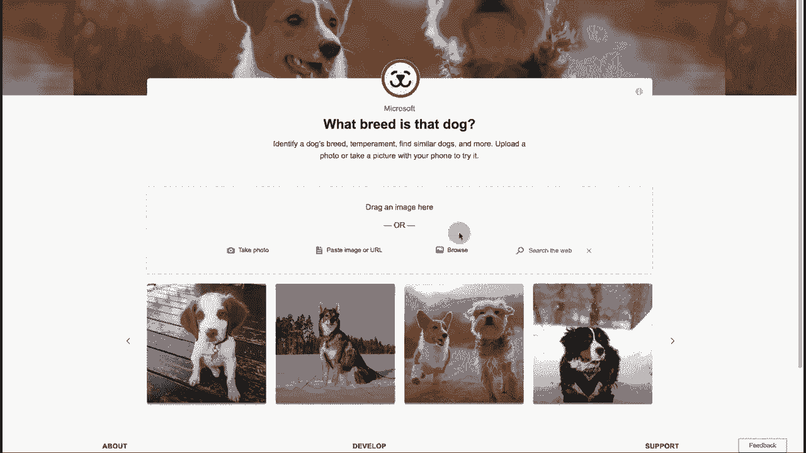
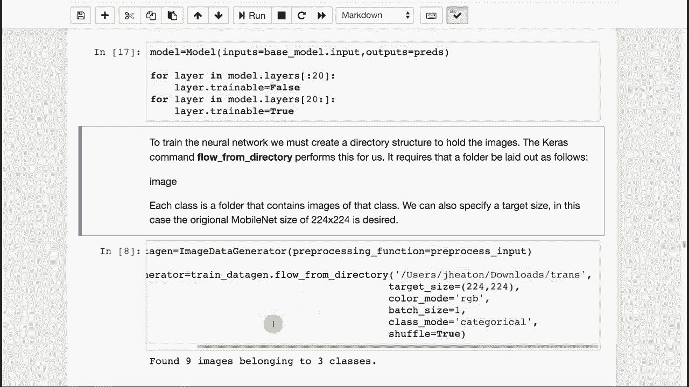
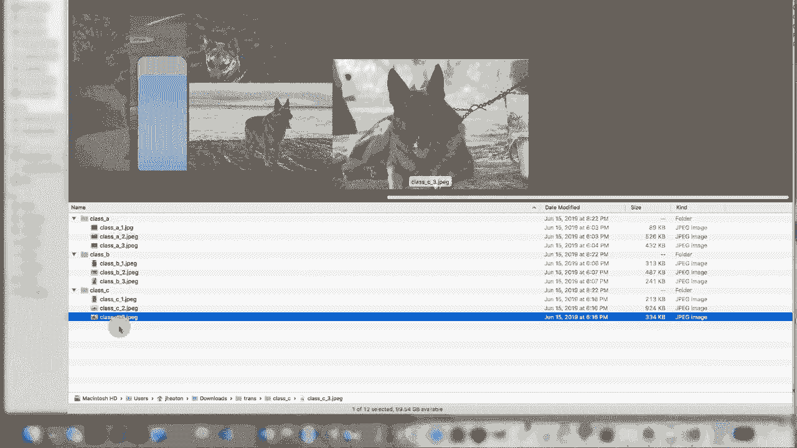
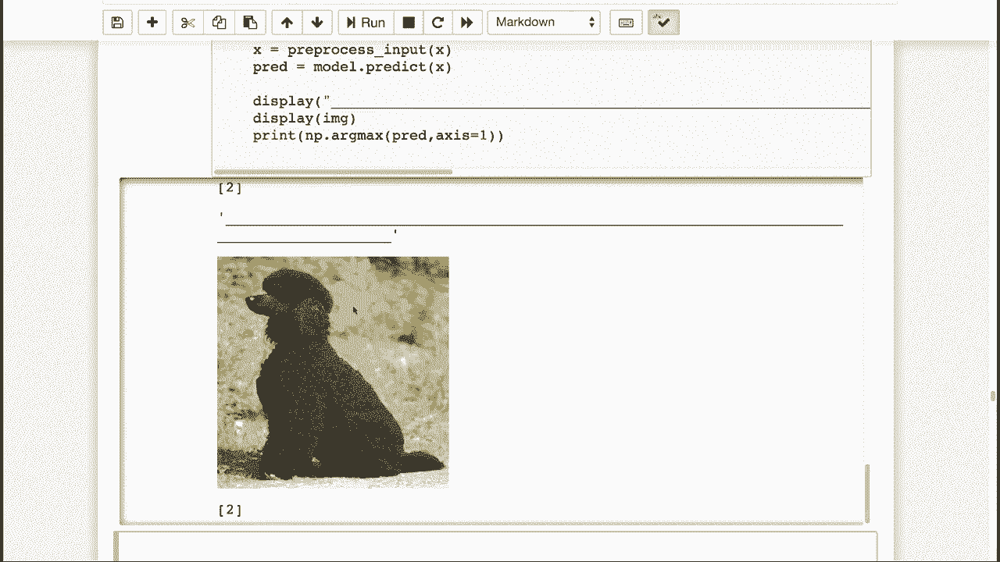

# T81-558 ｜ 深度神经网络应用-全案例实操系列(2021最新·完整版) - P49：L9.3- 计算机视觉和Keras的迁移学习 

嗨，我是Jeffheine，欢迎来到华盛顿大学深度神经网络应用的视频。在本视频中，我们将研究迁移学习，以及如何将为我们开发的计算机视觉神经网络迁移到汽车领域，以获取我AI课程和项目的最新消息。

点击铃铛旁边的订阅，以便收到每个新视频的通知。所以让我们为计算机视觉在汽车领域进行一些实际的迁移学习，以展示如何使用mobilenet。我们将把它完全转移到我们的Python代码中，并能够识别10种不同的图像类型。我们还将实现一个非常简单的例子，展示如何扩展这个学习。

我们真的在尝试看看是否可以仅仅添加几张图像，并实际教会它识别几种不同的犬种，我们会看到我们在这个真实项目中的成功程度。为了做到这一点，我们需要捕获相当多的额外图像。你将有机会尝试这个。

😊。

在作业中创建你自己的计算机视觉迁移学习。我们将尝试创建微软犬种图像搜索。这是一个微软可能花费了一段时间进行的项目。我们将尝试做一个非常简单的简易版，只识别几种犬种。

但你基本上可以输入狗的图片，它会通过卷积告诉你。可能是迁移。我不知道他们是从零开始训练的，还是使用现有神经网络的一些迁移。但无论如何，在我们甚至尝试迁移学习之前，先看看能否加载并实际运行mobilenet。

所以我要引入这些导入，这样我们就有了，这个命令基本上会从Kis加载imagenet，以便我们可以在mobilenet中使用它。让我来执行这个。😊。

现在，如果这是你第一次运行它，你会看到下载条在加载，并且会下载整个mobilenet imagenet。这可以是一个非常好的学习如何构建神经网络的方式。你可以查看这些的摘要，它会显示给你，顺便提一句。

这包括我这里的顶部，实际上这只是意味着加载整个内容，当我们进行迁移学习时，会说为false，意味着关闭输出层，就像我们在前一部分中所做的那样。但我们会取网络的底部部分用于特征工程，而顶部部分则用于网络。

我们将输入自己的图像，以便教它分类我们在原始imageNet中没有的图像。这看起来是这样的。你会注意到这里有一些有趣的事情。我们使用的滤波器数量相对较少，随着层级的增加，数量逐渐增多，如256、512等等。你可以看到它们在广泛使用批量归一化，因此观察这些是非常有趣的。

这些经过极为研究的权重库是如何转移的。它们是如何构建其深度神经网络的。当你最终到达这里时，你会看到成千上万的节点。这些是最终的输出层，将被移除，但这些是用于分类这1000种不同图像的部分。因此，让我们尝试看看它将如何分类图像。

现在我从谷歌图像搜索中抓取了一些网址。这些是各种不同的图像。我只是想看看imageNet分类的效果。欢迎你把自己的图像放进来，也进行分类。你也可以从文件中加载它们。让我们开始运行吧。它应该在加载那些网址，实际上已经完成了，你会看到我选择的第一张图像。这第一张图像是一个足球，确实来自Shopify。

所以我实际上是在做谷歌图像搜索。找到一张图像并右键点击，复制图像网址，然后放到这里。所以这实际上是一个我偶然发现的待售真实足球。但是你会注意到，imageNet的移动网络以99%的概率认为这是一只足球。所以它非常准确。它说下一个是蜂窝，但对此不太确定。

但我可以看到它对蜂窝的分类。这是相似的形状，哑铃、气球，或者墙壁时钟，谁知道呢？所以这些只是它完成的一些分类。现在你可以利用上面的Python代码，编写各种计算机视觉应用。你甚至不需要训练神经网络，只需使用移动网络。

你将拥有这个能力。我随便选择了一辆车。它实际上识别为赛车，绝对不是敞篷车，而是一种跑车，是一辆卡车。它确实将其识别为皮卡车。它绝对不是两栖车。如果你把它放在水里，它会沉到底部。非常有趣。

还显示了类编号，类别在0到999之间，这些是你拥有的类别，可能是1到1000，我不太确定索引是什么。你看，我希望它能把我分类为一个人，但它把我分类为西装，我想这是律师的同义词。

我可能会对此感到不快。它说我有一条温莎领带。其实我没有带领带。要让我穿上领带是非常困难的。我非常少穿。新郎。我曾经是新郎，当我和妻子结婚时，但那天并不是。我绝对没有穿风衣。而且我不知道为什么它认为我是一部手机。

我经常使用它，但我不是一部手机。这是我的狗 Hckory。他是一只英国斗牛犬。但这是非常特写的。所以我试图故意让它困惑，并且我成功了。图像网中有一些狗品种，所以它已经可以进行一些品种识别。但它说这是一个哈巴狗，或者也许是法国斗牛犬，完全是错误的国家和错误的品种。

绝对不是拳击手，绝对不是斗牛犬。这是最大的狗之一。我甚至不知道这是什么。所以使用这个，以及上面的代码。你基本上可以加载这个图像网。然后你可以开始对其进行分类，或者如果需要，可以使用 Yolo。如果你想查看我之前关于这一模块的内容，你可以学习实际创建需要在屏幕上识别多个事物的东西。

所以可能有一辆车和一个人，知道它们实际的 X 和 Y 坐标，但你可以做很多事情。你可能会写一个机器人狗门，只对你狗的分类开放，那将是一个有趣的项目，但这基本上展示了我们之前提到的制作方框，它只是做了一个 Instagram 类型的。

让它变成肖像。我们遍历所有的 URL，我基本上逐一加载 URL，将其转换为图像，加载后将其调整为 224 x 224 的高度，然后将图像转换为数组。必要时扩展维度，然后我预处理图像，使用 Ks 提供的预处理输入来帮助你预处理图像，然后我准备好进行下一步。

在这里的预测中，我基本上打印出这个数字，即 agm。我还使用了 Kis 提供的解码预测功能，这让我打印出这个漂亮的概率列表。因此，这可以成为你可能想要创建的各种应用程序的起点。

但让我们尝试进行实际的迁移学习。所以我将再次加载相同的内容，但将 top 设置为 false。我加载并打印出摘要。你会看到底部的那 1000 层不见了。我们直接停止在 1024 层。因此，这和我们之前在这一部分看到的很相似，但我们提早停止了。

现在一切仍然可以训练。我们稍后将其标记为不可训练，然后添加额外的层。所以我将添加两个 1024 的密集层，继续往下。这些将是可训练的。你在上面看到的所有内容都将是不可训练的。然后我放一个 softm。在这里，因为我们将基本上添加三种不同类型的狗，这里我实际上构建了模型。

在这里我把前20个标记为不可训练，最后一个标记为完全可训练。现在Kira有一些非常不错的功能，可以让你从文件夹中进行训练。我将根据这个文件夹进行训练。你放置这些的结构变得非常重要。所以这是用户Jheton下载的trans文件夹。这只是我恰好放置它的地方。

所以转移学习的文件夹。让我给你看看那个文件夹。这是我设置的文件夹。你会看到我有A、B和C类，这就是我三种狗。我这里没有一个庞大的训练集。所以A类，这些都是斗牛犬类型的动物，然后B类是贵宾犬，C类是德牧。

这就是你如何设置它。你只需标记这些。你在这里有图像。它们可以是JPEG或PNG格式，你命名为。

将常见类别分组在一起。这给你提供了文件夹名称的理由，然后实际的文件会放到每个文件夹中。你实际命名这些文件并不重要。我只是简单地指向这里。这告诉它目标大小，所以它会根据需要将所有文件缩放到224。我们尝试将其分类为类别，所以我们想要三个类别，我们继续运行，发现9张图像属于三个类别。

现在如果你想训练这个，你需要自己提取图像并创建那个目录结构。有些图像可能有版权，所以我不能真的创建这些的集合，但你也可能不想做犬种分类，并且你可能希望获取更多的图像。理想情况下，你可能想要每个类别50到100张，但这只是个尝试。现在我将开始训练它。

实际上这会很快，我只训练了五个epoch，我当然可以做更多，这可能会给我们更好的准确性。我将快进到完成的部分。现在我们完成了。所以让我们继续。我为不同的狗放入了不同的URL，这些狗不在训练集中。让我们看看它实际表现得如何。再次强调，这主要是走个过场。如果你真的要这样做，你需要更多的图像，对吧，那是一只德牧。

它说这是2类。这里还有一只德牧，也是2类。现在这里有一只斗牛犬。如果这也是2类，那就是个彻底的失败。所以它认为这只斗牛犬与这些德牧相似。可能是因为没有足够训练。这只斗牛犬，我的斗牛犬，它认为这完全是另一回事。

然后贵宾犬也被分类为两类。所以你可能需要更多的图像。但这只是让你了解这个过程，以便你可以为任何你想要的图像构建这个。感谢观看这个视频。在下一个视频中，我们将继续讨论迁移学习。😊

汉语言库或可以转移到我们的用途的神经网络，这个内容经常变化，所以请订阅频道，以便及时了解这门课程和其他人工智能主题。
