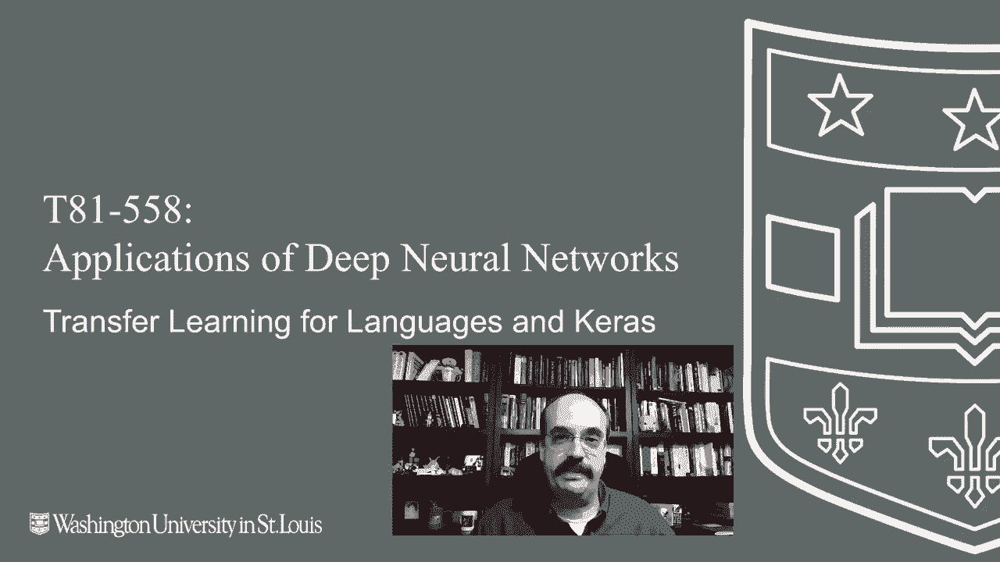
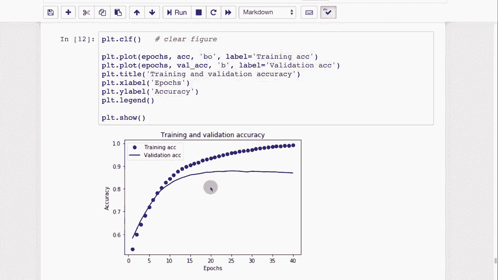

# T81-558 ｜ 深度神经网络应用-全案例实操系列(2021最新·完整版) - P50：L9.4- 自然语言处理和Keras的迁移学习 - ShowMeAI - BV15f4y1w7b8

嗨，我是杰夫·希顿。我们与华盛顿大学一起研究深度神经网络的应用。在这段视频中，我们将看看自然语言预训练神经网络，您可以将其迁移到您当前的项目中，了解我最新的人工智能课程和项目。

点击订阅和旁边的铃铛，以便接收每个新视频的通知。迁移学习也常用于自然语言处理。现在我们将有一个完整的自然语言处理模块即将上线。这只是给我们一个简要的介绍。通常，使用迁移学习时，您是在神经网络中添加一个嵌入层。

这基本上是将原始文本（例如句子）编码成某种向量，以便输入到神经网络中。这个向量可以被预测，因为它是一个固定长度的数值输入，而普通句子的单词数量可以变化很大。您还需要仔细考虑如何实际编码您的文本。😊

有多种不同的嵌入层或编码器，基本上是您将迁移的模型。我们将在几个模块后看到更多关于这一点的内容，一旦我们进入本课程的自然语言处理模块。我在这里列出了一些我用来组合这个简单示例的来源，展示我们如何分析互联网电影数据库并尝试预测评论是积极还是消极的。要使用这个示例，您需要安装Tensorflow hub和Tensorflow datas。

您可以运行这两个PP安装。如果您每次重新启动Google Coab，您都需要重新运行这些。我已经在我当前的本地环境中安装了这些。我要做的第一件事是加载互联网电影数据库的评论。这些评论涵盖了各种电影，有些是积极的，有些是消极的。

我们的想法是训练神经网络，通过阅读这些评论来判断它们是积极还是消极的。接下来我们将使用一个名为Google news swivel的预训练嵌入模块，维度为20。这是一个相对较低分辨率的编码器，只有20个维度，确实比我们在进入自然语言处理模块时看到的word'reve和其他编码器要低得多。

我将加载预训练的神经网络，它是内置于Curs中的。因此他们为我们提供了相当简单的使用方式。让我们看看前三条电影评论。这是前三条电影评论。您可以看到它们几乎都是自由格式的文本。这是非结构化数据，而结构化数据在神经网络中使用特别困难。

不用担心，我们可以处理那些非结构化数据。基本上，这里是我们之前用于打印的内容。我们将把它传递到中心层。中心层是我们刚刚从 Tensorflow Hub 转移过来的层，即谷歌训练的嵌入层。那么现在让我们看看这三条评论在这里的样子。现在你可以看到它们实际的向量，每个向量由 20 个数字组成。

在这方面训练和处理神经网络要容易得多。你基本上可以将原始文本输入到神经网络的开头，它将基于那些句子生成的向量进行处理。那么，单个数字意味着什么，这很难说，但向量之间的距离是有意义的。所以如果你计算两个不同句子的向量之间的距离，更相似的句子通常会更靠近。

我们将在谈论词向量到 V 的过程中更深入地了解如何对这些嵌入层创建的向量进行线性或代数运算。现在让我们继续向我们正在构建的神经网络中添加中心层以及其他一些层。使用 sigmoid 激活函数，并且只有一个输出神经元，因为这是一个二元分类器。它要么是正面评价，要么不是。我们将编译这个神经网络。

采用二元交叉熵损失函数，并且我们将使用 Adam 优化器进行训练。我们将数据拆分为训练集和测试集，这样我们可以在一个上进行训练，在另一个上进行验证，我们将使用相对较大的批量大小 512 来进行拟合。因此，这将经历若干个训练周期，我们将快进这个过程。好的，神经网络已完成训练。我们可以进行评估。

这是在测试集上运行的结果。可以看到其准确率约为 85%。让我们使用图表，看看训练的进展情况。你会注意到在我拟合时保存了历史记录，这对于查看训练的进展非常有用。我将运行这个图表，这很有趣，因为你可以看到这确实显示了过拟合的现象。你可以看到训练损失在不断下降。

并且验证损失持续下降，但最终开始平稳。这几乎是过拟合的教科书式描述，这也是你使用早停法的原因。因此，损失在下降。这基本上是那个图像的镜像。准确率在上升。你同样可以看到过拟合开始发生的地方。

验证集开始平稳，尽管训练集将不断变得更好。感谢观看这段关于迁移学习的视频。该内容经常变化。因此请订阅频道，以便随时了解该课程和其他人工智能主题的最新动态。

