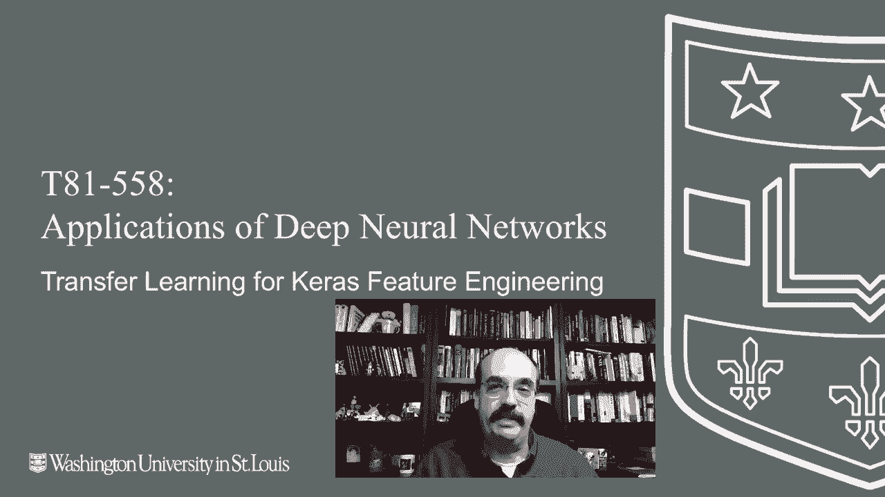
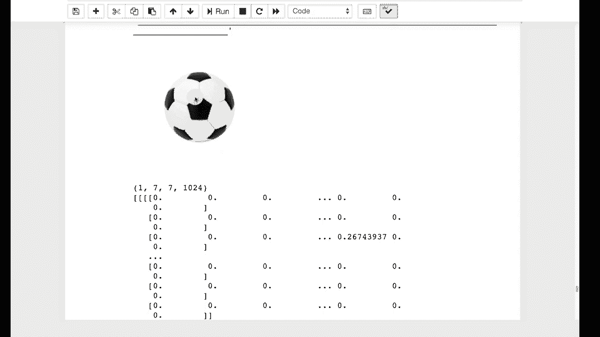

# T81-558 ｜ 深度神经网络应用-全案例实操系列(2021最新·完整版) - P51：L9.5- Keras特征工程的迁移学习 - ShowMeAI - BV15f4y1w7b8

嗨，我是Jeffeine，欢迎来到华盛顿大学的深度神经网络应用视频。在这个视频中，我们将继续讨论迁移学习，我们将看到如何使用你自己训练的神经网络。进行特征工程和降维，获取我最新的AI课程和项目。

点击订阅和旁边的铃铛，以便接收每个新视频的通知。迁移学习也可以用于特征工程。例如，你要分类图像，但不仅仅是图像。也许你想要某个人的图像。而且你还要把其他统计信息放进去，比如他们的年龄、性别。

以及其他东西，这样神经网络可能会给你一些健康评估。再次使用人寿保险行业的例子，这就是我日常工作的内容。在这里，我们将简单地看看如何撕掉。你通常迁移的这些神经网络的顶层，使用下面的部分进行特征工程。

我将继续运行这部分介绍，基本上这段代码和之前的一样，我正在抓取。实际上，这里有一张图像，是一个足球。我显示这个足球，并且我留下神经网络，没有输出层。

这就像我们要进行迁移学习一样。除了。我实际上要继续显示模型摘要。所以如果我运行这个。我现在可以看到对于224乘224的输入图像。经过所有这些，而不是将其分类到1000个。图像中。

这是这种类型的神经网络的分类类别。我们正在使用它训练的最终层，恰好是一个1024的向量。所以你可以看到基本上这里是那个1024的向量。它相对稀疏，这有点有趣。所以，这些基本上是最后稠密层学习识别和分类的特征类型。

你可以简单地将这些提取出来，作为工程特征的一部分。作为你的特征向量的一部分。所以你会有来自你分类的任何图像的1024个值。并且它并不是将其分类到足球，而是将其分类到你看到的所有这些独立特征，稠密层能够用来判断这是一个足球。

因此，你得到的是CNN为你生成的原始特征工程输入。这可以被用作编码的一种方式。图像，或者就像我们在最后一部分看到的那样。你可以做类似的事情，用嵌入层来编码自然语言处理的字符串值。

感谢观看这个视频。在接下来的模块中，我们将开始研究时间序列。这个内容经常变化，因此请订阅频道，以便及时了解本课程及其他人工智能主题。😊
