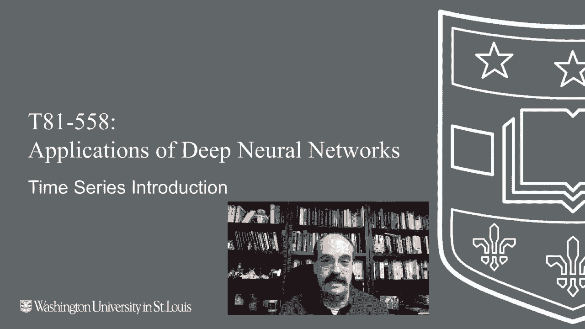
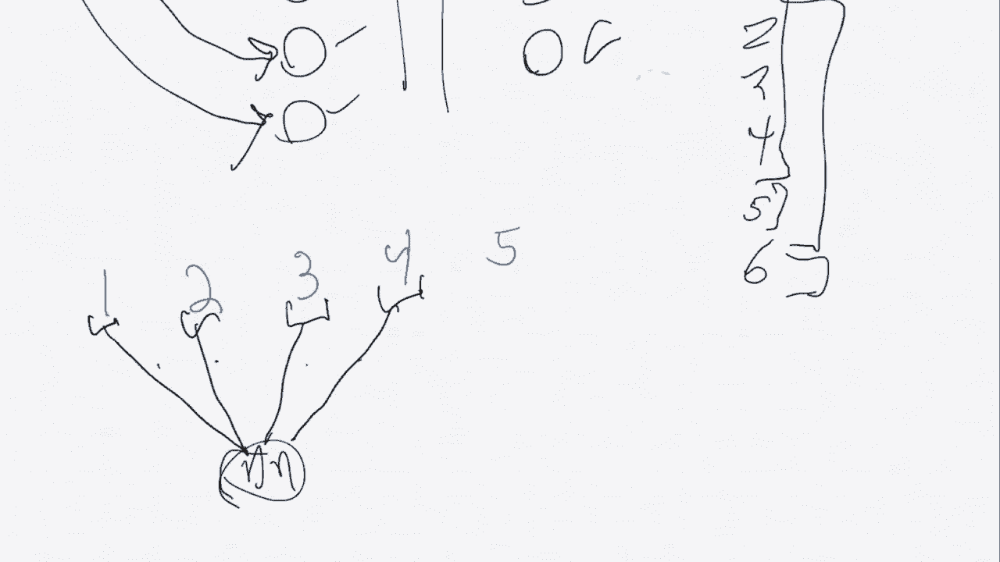
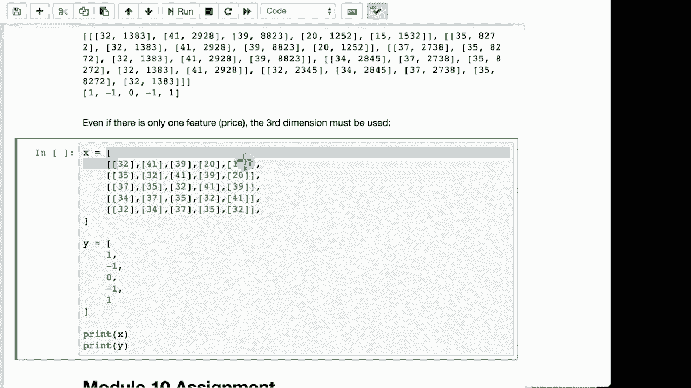

# T81-558 ｜ 深度神经网络应用-全案例实操系列(2021最新·完整版) - P52：L10.1- 深度学习、TensorFlow和Keras的时间序列数据编码 - ShowMeAI - BV15f4y1w7b8

嗨，我是杰夫·希顿，欢迎来到华盛顿大学的深度神经网络应用模块。在本模块中，我们将开始研究时间序列，特别是如何对时间序列数据进行编码。无论你是使用卷积神经网络还是LSTM，你都需要将数据以特定形式输入到时间序列中，以获取我最新的AI课程和项目的信息。

点击旁边的铃铛订阅，以便在每个新视频发布时收到通知。

首先，让我展示一下时间序列和序列的含义，因为这些将成为我们在本模块中实际创建的代码的重要概念，该代码使用LSTM和时序卷积神经网络。所以如果你考虑表格数据，我们可以从几次使用过的每加仑英里数据集开始。

这有汽车，能给你像汽车加速度、每加仑英里的数据，重量实际上并不重要，只是一系列这些数据，然后也许是一个类型。实际的每加仑英里数据集不太完整，但可能会有像汽车、卡车的加速度。我不知道这些都可以是归一化值0.8。

也许这数据很快，可能每加仑一英里，现在也许变得相当慢，重量将是中等范围，类型我们将只做汽车和卡车。所以零，我是说汽车。这是一行数据。我们将尝试预测一些东西。现在我们要预测的是汽车品牌，我们将用虚拟变量来实现，可能有三种不同类型的品牌，汽车可以是这些虚拟变量中的一种，而这是目标，对于这辆特定的汽车，可能是类型B。如果你创建这样的内容，你的神经网络传统上看起来将是这样的，你将有这四个输入，所以你将有一个四个神经网络，每个基本上连接到其中之一，这是一个神经网络，你将有多个层，里面会有各种东西，最后这一部分将成为你的输出神经元，所以A、B和C各一个。

所以这基本上是我们在整个课程中遇到的典型神经网络v表格数据。现在对于计算机视觉，序列变得非常相似。现在我们可能会有一系列汽车进入。因此，例如，我们不是在试图预测A、B或C，而是试图预测未来我们实际上将销售哪种类型的汽车。因此，实际上你要做的是向这个模型添加额外的输入神经元，你会在这里放四个，并且你基本上会进行时间序列处理，这样第一个就是插槽1，第二个就是2，随着你进行的过程中，不断添加四个神经元的组，你会说，好的，我有一个序列，我已经销售了这种类型的。

首先，我可能会再卖一辆车，我会在这里填入，并且它在第二个位置。我们接下来要卖什么类型的车？所以你基本上会随着数据的进入逐步构建这些序列。因此，你有你的数据，Y基本上就是下一个，确切来说就是下一个类型。这就是在我们拥有LSTM和时序卷积神经网络之前，传统上是如何做到的。你会进行时间序列编码，基本上就是做一个滑动窗口。

如果你销售了汽车1、2、3和4，你的第一个窗口可能就是这四辆车，然后你已经销售了汽车5，接下来汽车5将是你的输出，然后随着时间的推移，你可能会用这些来进行预测，所以它会不断滑动，你会利用你销售了汽车2的事实。

用3、4、5来预测2，这被称为序列，而序列中的每个元素不一定只是一个值，而是所有四个值的加速度、重量、类型等等，这些都是你输入到神经网络中以进行预测的。现在，卷积神经网络与LSTM之间的重要区别在于，随着你将更多值添加到序列中，你有多少个神经元。在这种情况下，我们有一个大小为4的序列，随着你添加越来越多的这些值。

将值纳入你的序列。你的输入神经元的数量在增加，这就是这些模型的一个限制，比如你有一个大小为100的序列。现在，使用越来越大的序列大小总是会增加额外的复杂性，无论你是在做传统神经网络还是LSTM，因为你必须在反向传播中展开它，这样才能开始实际训练。

但让我们看看LSTM是如何实际工作的。我们不会在底部添加这些额外的神经元，而是简单地传入这些汽车的每一行。因此，也许你连续售出了五辆车，那就是你的序列大小。当你将这五辆车的四个预测值（加速度、每加仑多少英里、重量和类型）传入时，这些值都会输入到你的四个输入神经元中。对于下一个，你将再次调用神经网络，并发送序列中的第二个。随着这一过程的进行，你在提供。

网络中有越来越多的汽车。现在，传统的非递归神经网络与此不同。如果你传入这些加速度、每加仑多少英里、重量和类型的值。如果你传入0、8、2、5和0，你将始终得到相同的类型。就像我们在IR数据集上做的那样，给定神经网络的相同四个输入总是会产生相同的输出，除非你重新训练它，而这些递归神经网络保持状态。

所以当你发送一组输入时，它会给你一个预测，它总是会给出一个预测。然后当你发送第二组时，前面的输入已经被看过。因此，这可以让你观察你的汽车经销商连续售出了这五辆车，基于此我预测下一辆车会是其他车型。你并不是在增加输入神经元，而是简单地发送更多的值。

神经网络和神经网络的内部状态在你每次预测时都会发生变化。这会影响后续的预测。现在，非常重要的一点是要理解这些，因为这涉及到序列到底是什么，比如说你正在做的事情就和我之前提到的一样。

你已经卖出了车1，然后车2，再然后车3。现在每辆车将作为四个值的输入向量，指示其类型，然后卖出了车4和车5。因此，当你依次将这些输入呈现给神经网络时，如果你的序列大小是5，每个输入都是这样，这里是你的神经网络。所以当你将这四辆车依次输入到神经网络中时，我的意思是这辆车是第一、第二、第三和第四。

该神经网络的内部状态正在变化。因此，你首先输入一个，然后是两个，再然后是三个，它预测接下来会是什么车。关于序列的问题在于，神经网络的内部状态何时重置？它在开始时重置。

序列的结束。所以如果我们定义了一个序列大小为四，就像我们这里所示的那样。它将在这里重置，然后再这里重置。当你向前滑动时，因为你不想只做一个预测，现在你想预测两个、三个、四个，你想使用两个来进行预测。

3、4 和 5 并预测接下来会发生什么，现在你将在这里重置它，并在这里重置它。那么现在让我们看看在 Python 中这实际上会是什么样的代码。假设你要预测未来的某些东西，比如股票价格，你现在将有实质上三个维度，而之前你只有两个。第一个轴将是你的训练集元素，这些就像我们在其他数据集中看到的行，它们是你提供给神经网络进行预测的单个训练元素。

不管 x 有多大，y 也必须相应地大，因为这决定了这个训练集实际会产生多少预测。你的第二个轴将是序列的成员，也就是你的时间步，比如第一天、第二天、第三天、第四天，这完全取决于你想如何在 CSV 文件中表示这些内容。通常情况下，第二个轴实际上会成为行，行会变成时间步，轴一则是训练集元素。你从 CSV 文件中无法真正判断这些，只能根据你设置的序列大小来了解。同时也重要的是，序列大小通常是以某种最大序列来设定的。所以如果你将序列大小设置为 10，那么你将有 10 个时间步进入其中。如果对于特定序列的训练没有 10 个元素，通常会将第二个轴上剩余的值置为零，因为这些神经网络足够聪明，可以学习何时收缩和扩展，数据中的特征像输入那些是你的第三个轴，所以它们在大多数数据集中就像你的列。

我们之前看到过像每加仑多少英里这样的数据，前面的例子中提到的每加仑多少英里、发动机大小、汽车类型都在你的第三个轴上。所以这三个轴都是你需要的，因此你现在基本上是在处理一个立方体。让我们看一下代码，我们基本上有一个时间序列。这是一个股票价格，开始时是 32，然后变为 41，接着又回到 32，再变为 20，最后变为 15，你可能想要。

确定在序列的每个点上，是否视其为买入、卖出或持有，其中 1 表示买入，-1 表示卖出，0 表示持有。因此，对于这些行中的每一行，每个训练集元素，你必须有一个 Y 值。你会注意到我在这里加了括号。这实际上是一个二维数组。我这么做的原因是因为你可能想要为此拥有多个输入。

也许你想为每只股票添加交易量。那么，这一天的交易量是多少呢？假设是 32，或许这一天的交易量很大，而那一天的交易量不那么大。所以你可以在这里放入多个不同的值。实际上，这非常常见。如果这些是图像，比如你试图在视频序列上进行预测。

那么这里会有很多你需要添加的值。实际上，你可能会在这里添加2D数据，以表示像素的网格，我们可以看到这本质上是在构建一个CSV文件，这里是它的样子，因此你的x是第一列，然后是预测的Y。

现在，就像我之前开始告诉你的那样，我们可能想要加入交易量，这是你在股市中追踪的两个常见统计数据。股价和交易量，这两者都会上下波动，我们并不预测这两者中的任何一个。

我们试图预测我们是想买、卖还是持有。如果我们创建这种数据，我们可以看到它的样子，注意它是一种数组的数组。你有外层数组，然后在那个数组内部有每对股价和交易量，我们基本上可以将其转换为非常类似CSV的格式。现在序列大小，你可能会发现序列大小可能是3，如果是3的话。

你将对0到2进行预测，这是一个序列，然后预测3。接下来你的序列将是1、2、3，你将预测4，依此类推。现在这是我们实际定义序列大小的地方。因此这里我们有51、2、3、4、5作为我们的序列大小。我们正在创建的确实是三维数据，因为这是第一、第二和第三维。

你可以通过计算前导大括号的数量来知道我们可以打印这些数据，三维数据看起来要复杂得多。但这确实是我们在本模块接下来部分将开始创建的数据，因为我们将实际训练LSTM模型使用这样的数据，即使只有一个特征。

你仍然需要三维数据。这是你正在获取股价，而你只有一个值，但你正在设置这三个维度。因为你没有交易量，所以即使只有一个，你也必须处理3D数据。感谢观看这个视频，在下一个视频中我们将讨论LSTM中的递归神经网络，以便跟上本课程和其他人工智能主题的进展。

