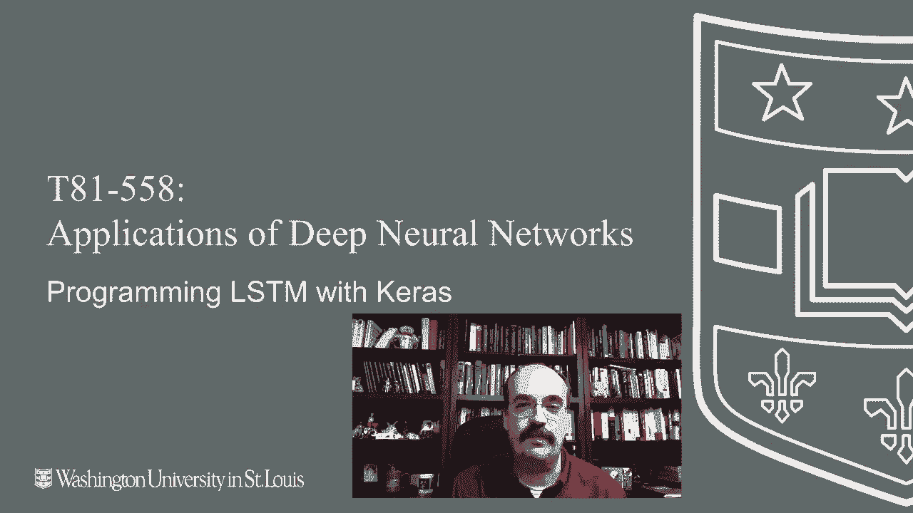
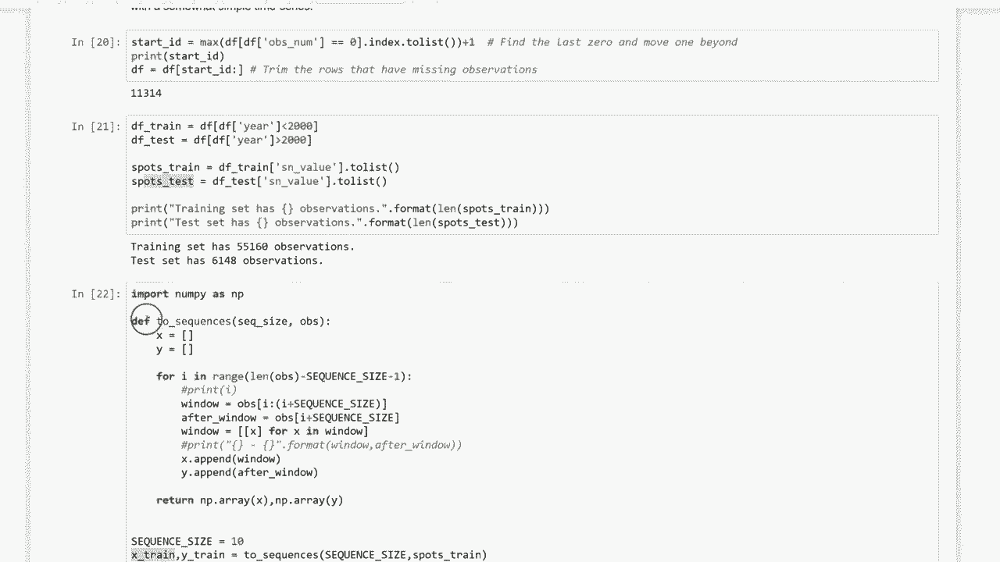

# T81-558 ｜ 深度神经网络应用-全案例实操系列(2021最新·完整版) - P53：L10.2- 使用Keras和TensorFlow编程LSTM - ShowMeAI - BV15f4y1w7b8

嗨，我是杰夫·希亚，欢迎来到华盛顿大学的深度神经网络应用。在这个视频中，我们将探讨用于时间序列的LSTM和GRU神经网络。想要获取我AI课程和项目的最新信息，请点击旁边的订阅铃铛，以便接收到每个新视频的通知。我们正在研究递归神经网络。递归神经网络。

这有很多不同类型的神经网络，我们将首先看其中一种经典类型，主要是因为它相对容易理解。然后我们将看更现代的类型，如LSTM和GRU。这些不同类型的递归神经网络之间确实存在一些相似之处。因此，递归神经网络通常有一些上下文神经元的概念。

上下文神经元代表一种短期记忆。它在对神经网络的调用之间保持一个值。所以当你试图用神经网络进行预测时，那就是一次对神经网络的调用。😊。

然后你会一次又一次地调用它，当你逐行预测时，上下文神经元开始时为零，但它们会随着后续输入到神经网络中而持有一个值，随着序列的处理而变化。因此，在我们看到这些输入神经元每个都有值的序列之前，这些上下文神经元在每个序列开始时为零，并且随着这些序列的处理，它们保持更新其值。

当你移动到下一个序列时，这个值总是会回到零。上下文在序列之间总是回到零，这是一种非常重要的特性。因此，这是下面两个具有上下文的隐藏神经元的例子。所以我们现在不会像之前那样简单地向前传递。我们将会接收一些反馈。

从我们输出的数据中获取一些反馈。所以你有输入。这是输入1，输入2。进入Hi 1和Hi 2。这些神经元将基于传入的加权和值输出一些结果，然后经过激活函数。它们将产生一些输出。在经典神经网络处理中。

那个输出会直接传到下一层或神经网络的输出端，如果这是最后一层。但在这种情况下，我们将把从隐藏神经元输出的相同值继续传递。那条虚线意味着我们将把它复制到上下文中。因此，通常每个上一层的神经元会有一个上下文神经元。

你只是简单地复制输出。没有权重，什么都没有。它只是一个复制。实线有权重。所以接下来发生的事情是，输入到这个第一个隐藏层hidden1不仅仅是来自前一层的内容，还会得到来自context1的输出，同时也会得到来自context2的输出。

至少在这个特定的情况下。这个神经元的设置，这个网络的设置。这两者都是加权的。所以它会学习如何处理这个值，这里没有权重。简单地说，无论输出什么，都将其复制到下一个层。因此，你始终保留来自隐藏神经元的先前输出值。

并且让它保持直到下一个调用，然后你把它复制回去。你让它形成下一个调用时对隐藏层的输入，并且它就成为输入的一部分。因此，实际上，它就像有三个输入神经元连接到hidden1，但其中两个是上下文层，正好是来自上一个的输出。

这个输出确实是持续存在的。它并不是仅仅影响下一个、下下一个，等等。由于复制到这个上下文中的值，它会被反馈到这里，反流。几乎就像是蝴蝶效应。它对这个神经元的输出产生影响，这个输出然后又被复制到这里，并且在每次调用这个神经网络时持续进行。

这就是上下文如何随着时间的推移影响输出的方式。这也是让神经网络能够处理时间序列的原因。而这些实线导致在神经网络中向后复制的事实，它们有权重，使得神经网络能够随着数据的输入，逐渐学习如何处理这些数据。

这就是时间序列神经网络。所以LSTM神经网络是实现这种记忆的一种方式。现在，我可以用一种几乎是外行的方式来描述这一点，如果我们有一个科学计算器。

我们甚至不会使用这个计算器的任何高级功能。我们主要关心的是记忆加和记忆清除。LSTM神经网络和门控递归GRU神经网络有门，这些是这种神经网络的真正创新。

它们可以让它记住东西，无论是长时间还是短时间。你要处理三个门：输入门、遗忘门和回忆门，有时叫输出门。你可以把这些门视为与神经网络或上下文的记忆有关。

你可以把它们想象成计算器上的记忆按钮。假设我们神经元的输出是5。我们有这三个门。这三个门会告诉你该怎么做。你应该记住它吗？这就像记忆加，因此我把它放进去。现在我们在上下文中有了这个五。

当它下次工作时，我们可能需要决定是否应该回忆起来。这就是MR按钮。这是输出或回忆门。如果你这样做，你的5就会回来。还有一个遗忘门。遗忘门意味着神经网络输入发生了一些事情。它决定需要丢弃记忆，你现在可以清除它。

如果你这样做，你甚至无法进行MR，因为没有记住任何东西。对于这些递归神经网络来说，能够忘记是很重要的。这是元素神经网络的一个限制。你必须慢慢地随着时间的推移而忘记。另一个限制是你不能长时间保留某些东西。

因此，这些新神经网络有门的事实，你可以记住某些东西并将其放入记忆中，然后随着时间的推移再忘记。正如奥特曼所说，对于人类而言，我们最大的优点和缺点之一是能够忘记。如果我们记住了一切，我们的头脑将变得过于混乱，无法正常运作。

重要的是要知道该忘记什么，并且只忘记不重要的东西。那么让我们看看LSTM神经网络。这是LSTM的图示。你有输出，本质上是当前时间、前一时间和下一时间的Y帽。现在，这不是三个不同的LSTM。这是同一个LSTM，而LSTM就像网络中的一个神经元。

你将拥有多个LSTM，就像你有多个隐藏神经元一样。你有输入。这是随时间变化的输入。因此，你只需要一个当前、前一和下一的单一输入值。随着时间的推移，每个相同的LSTM都会将Y帽传递给下一个。所以这是预测，但它也在随着时间保持上下文。

所有这些网络都有某种上下文。神经网络。经典的Elman和Jordan神经网络，或更现代的LSTM和GRU单元在内部。这就是LSTM的运作。你有这些门：遗忘门、输入门、输出门，还有各种阈值夹持函数，比如sigmoid和tanh。稍后你会看到这些，如果你愿意，可以查看这个图示，它基本上代表了与这些方程相同的内容。

我几乎喜欢用方程来思考这些，我会快速带你浏览这些方程。这基本上是在看一种线性代数计算。因此你有权重，那是遗忘门的权重、输入门的权重，每一层的偏差，所以你有偏差神经元和这个向量。

上一个输出和当前输入。这是你要乘以的权重向量。因此，你要做的第一件事是，顺便说一下，S表示sigmoid函数，10 H表示双曲正切。在我们谈论sigmoid和10 H之前，让我先给你展示一下。

注意这些形状。这是一个sigmoid函数。它的值从0到1，并且会夹住这些值。所以如果非常负，它会夹住到0。如果非常正，它会夹住到1。双曲正切。顺便说一句，这与三角学无关。机器学习研究仅仅是因为这些形状。

所以这是一个阶跃函数。另一种类型的阶跃函数。但注意，现在的范围是负1到1。所以，它有一个更大的范围。有时我们需要这些负值，我们会在通过这些方程时看到，我们确实需要这些负值。现在让我们来看看这些方程。我们首先要做的是计算遗忘门、输入门和最终的输出门的系数。

因为这三个值主要会是零或一，因为这些是sigmoid使用的地方。你希望它们是0或1，因为这些值，你希望它们开启或关闭。这是一个系数。因此，如果遗忘门计算为0，这有点反向，但零意味着我们应该遗忘，一意味着我们应该记住。

所以我们根据sigmoid函数计算遗忘门。它通过查看遗忘权重，将其转换为0到1范围。因此，遗忘的权重就是训练能力。随着神经网络的学习，这个值会改变。

通过乘以前一个输出和当前输入的向量，并添加偏置，这也是一个学习参数。通过调整这两个，我们学习何时遗忘。如果F变成0，我们就会遗忘。如果I变成1，我们就会记住。所以你有权重，这些与之前的功能完全相同，这些是你的两个学习参数。

这些会被调整，这就是它学习何时记住或何时输入的方式。C是你的上下文。C上方的小波浪号仅表示你的候选上下文。现在的上下文是它正在记住的值，记住的值是来自神经元的输出。神经元的输出可以是从负一到一。

你不能用sigmoid来做，因为负1到1会剪切掉一半的值，任何低于0的值。因此，我们使用双曲正切是因为双曲正切可以在负一和一之间流动。这样我们就拥有了更完整的值范围。但训练的工作方式与之前完全相同。我们有上下文的权重。

这就是它学习如何具体处理上下文的方式。我们还有一个偏置。这只是候选上下文。真正成为上下文的是这个。现在这是一个不同的格式，因为我们不在学习，这些是用于学习的。这只是一个开关门。注意你有遗忘门和输入门。

输入表示应该进入上下文的内容，遗忘意味着我们是否应该记住之前的上下文。加号将这两个结合在一起。因此，遗忘上下文。如果这是0乘以一个系数，如果是0的话，那么它将抹去之前的上下文，因为0乘以任何东西都是0，输入意味着如果我们在遗忘输入，这将消灭之前的上下文。

这就是为什么它像是内存加按钮，因为这是你的前一个上下文。抱歉，这个是你的前一个上下文。这是候选上下文。所以这是我们在这里计算的可能进入上下文的内容。如果我们应该放入某些东西。所以现在你已经创建了输出门。

你的最终输出本质上将来自于之前的上下文乘以你的输出。这就是LSTM的计算方式。还有另一种类型的递归神经网络，与此非常相似。

这称为GRU，门控递归单元。它的工作原理与此非常相似。让我放大一点。这是学术论文。这不是介绍GRU的学术论文，但它是对门控递归网络的实证评估。实证意味着实验性的。

所以他们并没有做任何数学证明来含糊其辞。他们只是字面上尝试测试数据，并展示GRU实际上能实现什么。在很多情况下，GRU和LSTM的功能非常相似，并且有着相似的准确性。这篇论文更侧重于评估处理时间，GRU没有那么多门，因此更简单。因此你会注意到在摘要中，他们说他们进行了评估。

此外，我们发现GRU与LSTM相当，并且他们也评估了之前的非递归神经网络。因此如果我们查看论文，我想展示的特别有趣的部分是你在这里有我们刚才看到的LSTM及其门。你可以看到顶部的输入门，F门和输出门。

所以在递归神经网络或GRU中，你只有两个门：R和Z，这使得它的算法更简单，并且几乎不需要另一个门。因此，它所需的计算时间更少，并且他们展示了如何计算这些门。但是在最后，论文展示了学习过程，实际上LSTM和GRU在某种程度上是等价的，并展示了实际的时间。

注意这里，GRU的处理时间比LSTM少得多。这就是他们的优势。你可以处理得更多，你的训练影响会消耗更少的时间。现在我们将看一个实际的LSTM例子。我们将看到两个例子。第一个例子非常简单。

这旨在向你展示这种递归类型的神经网络在最简单状态下可以做什么，而这一点是普通神经网络无法做到的。接下来的例子将会看一个实际的应用，我们将查看太阳黑子的时间序列数据，并观察这种递归神经网络如何预测时间序列中的某些东西，至少在一个非常基本的层面上。

预测太阳黑子活动。这展示了如何通过Keras的LSTM神经网络构建一个非常简单的tensorflow。我将继续运行这个程序。它需要一些时间来训练，但还算不错。所以它正在运行，你可以从星号中看到。这向神经网络展示了如何从时间序列中预测某些东西。

这个时间序列基本上可以想象成像是一个在房子前面的相机，就像一个针孔相机，它看到一辆车驶过，可能只看到了一点点车漆的颜色。所以在我们直视的同一位置，我们看到的是零。这意味着我们什么都没看到。但是在下一个时间切片中，我们看到了一辆车。

然后在下一个时间切片中，我们仍然可以看到这辆车，因为它正好在我们看到的针孔前面。现在在接下来的序列中我们再次看到零，因为基本上这辆车已经从我们的针孔中经过并继续前行。

这里是一些序列，一辆不同颜色的车经过，可能是一辆双色车。不管这两个颜色是什么，或许一个是红色，另一个是蓝色，类似这样的。如果我们想让这个更复杂，我们可能会有三个输入。我们会为每一个颜色制作某种RGB表示。但是。

我们处理的是一个非常非常简单的例子。我有这些训练集元素。我正在设置Y，在这个情况下，它在说，嘿。一辆单色的车经过，第二辆是双色车，然后是一辆三色车。然后我们又有一辆双色车的例子。

这是两个，另外一个例子是三个和一个。它在教神经网络，无论在序列中的哪个位置，它仍然是那辆有颜色的车，只是这辆车刚好进入了我们的时间切片，因为它比其他车晚出现。

但这仍然是同一辆颜色的车，和上面很早出现的这辆车是一样的。那么接下来我们要做的是把所有这些元素拿出来。顺便说一下，我们可以表示并且只有一个输入。我们可以把它表示为一个旧的神经网络，我们会有1，2，3，4，5，6。我们将会有六个输入。

但问题是这个一，我们需要去掉所有这些。如果我们想这么做，我们基本上会去掉所有这些方括号，使它们看起来像那样，它将只是经典的输入。我们不想这样做，我们把这些当作序列处理，即使它们是经典的输入。

这些都是输入1、输入2、输入3。如果你把在输入1上的某个东西移动到输入3，那将是完全不同的模式识别，对于神经网络来说，你不能随意地把这些移动到这里并让它仍然识别出来。在经典神经网络和LSTM中，你绝对不能。所以这个神经网络已经训练好了，我们在这里得到了输出，你可以看到训练的结果，我们训练了200个周期，运行了一段时间。

还不错。在我解释的过程中，它在后台运行。现在我们得到了结果。所以现在对于这个神经网络，我在这里有这个代码，我可以在上面尝试例子。让我说，这段代码的设计是我可以随意修改。所以这是一个实时演示，我不知道它将产生什么，希望它能产生一些看起来很聪明的东西，这就是想法。这是一个两色的车，恰好经过这里，我可以运行它，希望它会识别出来，结果确实如此。如果那辆双色车在这里出现，去掉了我不想要的多余价格，它仍然应该说是二，或者如果我忘记了一个逗号，我的电脑不再处于插入模式。让我们继续运行，这确实会让它混淆，如果你接近开头。所以这是二。如果我们把它移得更远，它仍然应该视为二。

这可能意味着它是一辆更长的车，或者可能意味着它是一辆行驶较慢的车。如果我们把所有的改成一，它应该能识别出这是一辆单色车，它确实如此。如果我不知道，这是一辆单色车，可能带有一点红色的涂料，也许一部分是蓝色。

2是红色。看看它在那里的表现。我不知道它会怎么做。我将它识别为一辆两厢车，但至少它不把它识别为三厢车或其他东西。所以这是学习序列。你可以在一个非常简单的例子中看到它是如何学习识别这些模式的。

它甚至可以非常短，并且能够识别它。这就是LSTM的强大之处。它能够识别这些模式，确实是随着时间的推移。接下来我们将看看太阳黑子示例。现在你可以从这个网站获取每日太阳黑子数据文件，我已经将它们加载到我的实例中，但如果你想运行这个特定的示例，你需要下载这些文件。让我们继续读取这个数据。

这基本上显示了年份，而且回溯得相当远，所以1818年第一月第一天，它给你提供了这个值，顺便说一下，这个值只是编码年份日期的一种方式，它给出了太阳黑子值，负一意味着我们没有数据，还有观察数量。如果我们运行它并且去掉缺少观察的数据行，我们会有11000多条记录，我们也可以直接取。

我们将做的是取2000年前的训练集。我们要评估的测试集是2000年后的所有数据。我们为每个数据集创建一个训练集。所以我们为训练集和测试集分别创建一个pandas集合，用于太阳黑子的值。这就是我们要预测的实际太阳黑子数量。

我们打印出每个观察的数量。所以训练数据绝对更大，你几乎有55000个，测试集略多于6000个值。现在我们需要做的是将其转换为序列。这可能是稍微棘手的部分。所以这会将太阳黑子数据转换成一个立方体，用于训练LSTM，为此我们需要使用这个两个序列的函数。这给你序列大小和观察值。所以序列大小将是我们定义的。

所以序列大小将是10，你取数据并剪掉10个观察值，然后向前移动一点，剪掉下一个10。下一个10是一个滑动窗口，构建出所有的立方体行，但观察值是在后面的。所以在这里，我们将其转换为这个序列。我们通过获取从1到1加上I加上序列大小的观察值来取窗口。

我们正在循环整个观察范围。所以不论观察的长度是多少，直到减去序列大小，这样我们就可以在仍有足够数据构建出完整序列时停止。我们基本上会构建这个。

这看起来真的像是X训练，我在这里打印出它们的形状，形状有55000行，有10，这是序列。但它只有一列，因为它只是我们试图预测的时间值，即太阳黑子的数量。我们只打印出X训练。这就是它的样子。

你可以看到个别的太阳黑子值在这里移动。这是一个三维数据结构。所以你有255，2，55到这里。这是一行。你有所有的太阳黑子值，10个在一起。没有足够的展示10个。这就是为什么你有三个点。现在我们将尝试构建模型并拟合它。

当我们运行这个时，它将训练1000个周期。这需要一点时间。我们确实开启了早停机制，因此不会真正花费那么多时间。这可能是一个GPU实例训练会快得多的情况。

但是我们将在最后一节课中看到一个例子，当时我们进行高性能计算，并利用GPU实例等其他工具。因此，我们有6131个样本正在训练。我们报告验证损失。注意，在让它运行一段时间后，损失迅速下降，它不会达到1000个周期的全部时间，会提前停止。不过我会让这个过程在时间快进中运行一下。好的，早停机制已经生效。

你可以看到在16个Ex之后这一点开始生效，我们现在已经训练好了神经网络并准备就绪，可以看到RMSsC。所以它预测了大约22个太阳黑子，这给了你一个整体准确性的概念。这不是一个特别先进的网络，但它确实展示了如何表示输入数据，将其分解成那两组序列，正是我给你的那两个序列函数是实现这一点的关键部分。感谢你观看这个视频。下一期视频见。

我们将看看如何将LSTMs和CNNNs结合使用。

要为图像加上说明，这个内容经常变化，所以请订阅频道，以便及时了解这门课程和人工智能的其他主题。
