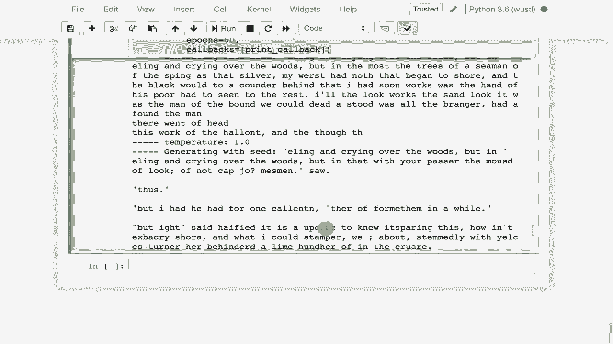

# T81-558 ｜ 深度神经网络应用-全案例实操系列(2021最新·完整版) - P54：L10.3- 使用Keras和TensorFlow生成文本 

嗨，我是杰夫·希顿。欢迎来到华盛顿大学的深度神经网络应用模块。在这一模块中，我们将看看如何使用LSTM进行文本生成。我们将看到如何从文本文件创建奇思妙想的😊随机生成。

它会为你生成莎士比亚风格的文本。更有趣的是，你可以给它源代码，它会生成合理有效的，虽然不能编译的C源代码，这些是基于它所训练的C代码生成的。现在，这种LSTM的奇思妙想用法在过去几年中确实得到了不少关注。

这引出了下一部分，我们将使用同样的技术为图片生成字幕。要获取我最新的AI课程和项目，点击订阅并点击旁边的铃铛，以便在每个新视频发布时收到通知。在这一部分和下一部分中，我们都将利用这项技术，在那里我们会做字幕生成，基本上是神经网络，或者实际上是几个神经网络可以查看图像并为其生成字幕，比如你可能会看到一只狗在草地上奔跑，神经网络会字面上写出“狗在草地上奔跑”。在这一部分中，我们将采取婴儿步伐，看看如何训练LSTM在任何类型的文本上，并输出随机的无意义文本。

非常多以这种格式。现在这使用了所有相同的技术，并使我们能够做一些更有用的事情，即实际生成字幕，但这算是第一步。这在几年前非常受欢迎。

有一篇经典的博客文章，我想你会称之为“递归神经网络的非理性有效性”。我将很快给你展示这一点，因为这里的一些例子展示了不同类型的文本可以被生成。

这是安德烈·卡帕西的博客，当他还是斯坦福大学的学生时正在攻读博士学位，偶然间，他所研发的字幕技术也在下一部分中有着重要的地位。所以他尝试生成的第一件事情就是保罗·格雷厄姆的文章，你可以在这里阅读，基本上他创造了LSTM，它能够随机生成这样的文本。

现在的文本是无意义的，这让投资者感到惊讶，他们不会筹集资金。我并不是在与公司的时间相处，他们都是。如果你没有注意，这看起来像是合法的文本，它甚至插入了字幕。如果你想想这里到底发生了什么。

真正令人着迷的是，这个神经网络必须从零开始学习。它并不知道英语。它学会了如何放置撇号，学会了如何使用逗号，学会了在句子末尾使用句号。它学会了在句子开头使用大写字母。

因此，它自学了很多语法。它通过阅读文本学习这些语法，而不是通过将语法规则硬编码到程序中。十年前，自然语言处理中的语法规则和解析树的硬编码非常常见。但随着神经网络和深度神经网络，以及我们正在处理的循环神经网络的出现。

还有更好的方法来做到这一点。我们也会看到神经网络生成莎士比亚的作品。现在非常有趣的是，如果你以前读过莎士比亚，这是戏剧，这是演员们说不同的角色。这非常像莎士比亚的样子。你有一个名字，你有那个人接下来要说的话的下一个名字。

它会预测接下来会说什么。循环神经网络能够弄清楚莎士比亚戏剧的总体格式，并将其写出来。这并不是真正的莎士比亚，但它的样子有点像莎士比亚。我想我现在应该变成这里面，它没有弄清楚英语的某些东西，所有的一词变成了“成为”，接近一天时的“小”。我是说，这就是无意义，但它正确地将这些单词串在一起。

它正确使用冠词。它通常能够弄清楚动词的一致性和其他方面。它通常能正确标点句子。所以这是生成莎士比亚的内容。维基百科生成的内容是。如果你曾经查看过维基百科页面的源代码，它显示你媒体维基标记。所以如果你曾想在维基百科上写一篇文章。

你会用这种形式书写。你放入双括号，这意味着链接，因此这链接到维基百科某处的约翰·克莱尔文章。所以它模拟了维基百科的形式，这非常酷，并且它也开始弄清楚URL的样子。在阅读这些内容之前，它对URL一无所知，而这甚至不是Yahoo上的真实页面，如果你尝试访问，即使在生成时也是如此。

这会给你一个错误。它本质上是记录神经网络的幻觉。我相信这是安德烈在这里称之为的。它弄清楚了维基百科符号的其他有趣部分，我觉得这个非常有趣。如果你曾经处理过学术论文，特别是为了发表和学术期刊，以及会议，我相信你已经处理过LaTeX，LaTeX对于富含数学的文本非常有效。

这里的递归神经网络在一堆 LaTeX 文档上进行了训练，然后被要求生成自己的 LaTeX。就像如果你阅读博客文章可以获得更多细节一样，它大多数情况下是可以编译的。虽然有一些错误需要作者修复，但它能够生成非常像数学的 LaTeX，甚至还有图表。

所以这一切都是从它所阅读的文本中产生的幻觉。这几乎就像一个孩子拼凑单词并开始理解英语。这就是正在发生的事情。在接下来的部分中，我们将看到如何使用相同的技术真正生成真实的英语。

如果你以前没有见过，这就是 LaTeX 源代码的样子。这基本上生成了上面的大部分内容。这可能是它的简化形式。我觉得这个非常迷人。他们用 C 语言编写了源代码，并在大量 C 源代码上训练了递归神经网络。

然后他们告诉它自己梦见 C 源代码。如果你以前没有接触过 C，实际上它的整体语法与 Java 非常相似，令人惊讶的是递归神经网络吸收了多少，看，它的缩进都是正确的。

我是说，这真的很酷，它在声明变量，它在进行检查。现在它确实倾向于使用一些从未定义的局部变量。所以这是个问题，但它正在学习如何正确使用指针语法。它在所有正确的位置放置了分号，当需要时使用括号，对于需要多行的内容使用括号，对于单行则不使用。

这几乎是令人毛骨悚然的，它对源代码的理解达到了什么程度，它在注释中加入了随机文本，这种方式类似于先前生成莎士比亚的程序。它正在学习生成随机内容。

英语文本用于评论。那么现在我们来看看如何生成这样的文本。这些只是我的导入。我将继续执行这个。没有什么特别的事情发生。我将读取一个文本文件。也就是一本完整的书。我们将只用一本书来训练它。所以它不会完美，但会产生一些有趣的东西。

我们将使用《金银岛》这本书。所以《金银岛》是在很久以前写的。这本书的特别之处在于，它是一本儿童书，但几乎为此后的海盗故事奠定了基础。我的意思是，独腿海盗、肩膀上有鹦鹉的海盗，"X" 标记着地点。

所有这些都来自《金银岛》。我小时候读过这本书。这是一本非常有趣的书，而我并不是一个喜欢读小说的人，强烈推荐给对海盗感兴趣的人。但我们来看看能否用神经网络生成海盗故事。我将读取它的文本。你可以看到它来自古腾堡计划。

其中包含大量的英语。也许还有其他语言，我没有跟上古腾堡项目。他们有这本书。在线文本。所以这对于自然语言处理项目非常棒。我将使用您在上面看到的原始文本，并对其进行一些转换。我会删除任何非ASCII字符。范围是0到127。顺便提一下。

我所做的一切都非常基于英语。但我见过LSTM被应用于其他语言，比如中文、日文和其他亚洲语言。所以如果您对这种文本生成感兴趣，几乎可以在任何内容上生成。您在前面的部分中看到。

我只是展示了一个例子，而不是实际的代码，而是链接到某人的例子，该例子使用Gs生成中文字体。所以我会引入这个，获取处理后的文本，运行这一部分，它告诉我语料库的长度。这是《孤岛惊魂》文档的长度。总共有60个不同的字符，尤其是因为我剔除了很多非ASCII字符。

顺便说一下，这一切都非常不错。😊 这段代码基于Kira的一个示例。我对其进行了少许更改，但如果您需要，我在上面有原始示例的链接。基本上，您可以在几乎任何文本上运行这段代码，我在《孤岛惊魂》上运行了它。原始代码实际上是查看哲学家尼采并生成额外的文本。

看起来是来自尼采的。所以当您运行这一部分时，它使用的最大长度是40，这是您的序列大小。我们将抓取这个文本的40个字符块，然后给它下一个字符。所以在那之后的第40个字符，它将用来训练模型。

给定这40个字符，尝试生成下一个字符，这就是我们实际生成文本的方式。然后我们将选择40个真实文本字符作为种子开始。接着，它会生成第41个字符，然后我们给它39个种子字符和第41个字符。

生成的第41个字符，然后它生成下一个字符，因此它会不断生成更多，最终我们会超出种子，得到的都是生成的文本，因为它生成了第一个字符，然后是第二个、第三个、第四个，依此类推。我们将看到实际的代码，但基本上这是遍历整个文件，将其分成40个字符的块，第41个作为y步长，这意味着对每个抓取的40个字符块向前移动三个字符，如果您在这里输入1。

它会抓取尽可能多的序列，因为它只会将其移动一个字符，您将得到更多冗余序列，因为如果您向前移动一个字符，您将获得39个相同的字符。

向前移动一个。因此我们将运行这个，它将《金银岛》减少为 132000 个这样的序列。如果你打印出其中一个，可以看到这很好地展示了项目 Gutenberg 的电子书《金银岛》，然后看到它向右移动了三个。

所以这些都是输入，然后它将被训练以预测下一个字符是什么。现在我们将进行向量化。这将其转换为实际的 x 和 y，接下来会用到，运行需要一点时间，但还不错。我们实际上使用的是索引。所以如果我们看一下这些形状，所有这些序列，40 是输入向量，60 是输出的虚拟变量。

所以这个输出基本上将是这 60 个字符的虚拟变量。记得我说过可能会在《金银岛》中出现 60 个不同的字符。这基本上是生成这些字符的。然后 Y 形状非常简单。它是 132000，但这些都是相同的虚拟变量。这些都是预期字符。所以所有在训练数据中出现的 60 个字符以及输出字符都表示为虚拟变量。这就是这些变得有点浪费的地方。我是说，如果我有完整的 255 ASI 集，那将是 255 个虚拟变量，这简直疯狂，尤其是使用 Unicode，看看这些虚拟变量。

这些基本上是输出。所以一个是真的，其余都是假的，这表示这个特定的字符是下一个预期的字符，LSTM 模型本身相对简单。我直接从示例中获取超参数，在 Car 中我们有一个 LSTM 层，包含 128 个神经元，我实际上没有使用 dropout 或其他类似的东西，我见过一些例子确实使用了这些，示例使用 RMS 进行了训练，你可能可以。

使用 Adam 也是如此。我将继续运行这个，让它开始训练神经网络，同时我解释一些内容，因为运行需要一点时间。你可能想在 Google Colab 或类似的地方在 GPU 上运行这个。

好的，这里是总结，这在很大程度上呼应了我们刚才提到的内容。尽管有这些星号，它实际上已经通过了这些。这是样本函数。这实际上是生成文本的。因此，你传递的 pres 是输出神经元。这将在《金银岛》中是 60 个值。

这将是 60 个概率。所以这 60 个输出神经元中值最高的就是具有最高可能性的字符。然而，我们并不是简单地这样做，我们将这些输出神经元规范化为 softm，使它们的概率相加为 10，然后我们有一个叫温度的东西。现在温度就是安德烈在他之前展示给你看的博客文章中提到的东西，本质上是 1。

将是最保守的。它几乎会选择概率最高的字符，零则会稍微更随机，我们将看到它产生的示例，零会有更多的语法错误，但会生成更有趣的文本，我们将看看其中的一些例子，你实际上可以将其设置得更高，甚至高于1。

0为使其更保守，这本质上是一个softmax函数，它基本上是在做一个求和，并确保所有这些概率加起来确实等于1。0这是文本生成器，所以我们在每个epoch结束时将其作为回调挂接上。这是非常有用的，因为这个神经网络训练需要一些时间，我想我们训练了六个epoch。

我们可以看到它在最后生成的效果。因此，基本上我们为这些温度展示它。这是0.2，比较宽松，到1.2则相对保守，非常保守，我们基本上生成种子。因此，种子来自我们处理过的文本《金银岛》，这个种子将用于启动生成，换句话说，这40个字符是用于生成下一个字符的第一个字符，然后它会继续下去。

然后我们将为接下来的400个字符生成内容，并将其构建为输入序列供神经网络使用，在我们进行预测时，我们将生成的内容加到我们预测的下一个字符上，因此我们不断添加更多的字符，最终种子会从边缘滑落，因为第一个字符被移除，因为一旦我们在末尾添加一个生成的字符。

我们必须从开始的部分弹出一些内容，以保持在400范围内，然后我们像以前一样打印文本。所以这实际上会输出训练神经网络时的文本，我们把刚才看到的函数作为一个lambda回调，这样在Keras运行时就可以调用它，然后我们基本上像之前看到的那样拟合它，因为我们有那个回调。

这就是输出的样子。这是第一次epoch，你可以看到它在这里进行训练，这里是生成的文本，这可能获取了一些媒体维基的信息，但可以在“声音的船长”找到。现在请记住，神经网络是在第一次epoch上，它的训练效果不是很好，但看看，它已经搞清楚了名词前通常会有的“the”这类事物。这是使用非常低的温度，所以这将是质量较低或最不保守的。如果我们去最保守的1.0。

2。信息可以在以下位置找到，尽管目前的效果仍然不佳，因为它实际上刚刚开始。我们已经进行了第二个周期和第三个周期，它继续训练，并随着进程不断展示结果。它将在60时结束，因此五个中的60我们不会让这个东西完全运行，但我们可以看到它正在生成自己的海盗故事。这听起来像是海盗的谈话，实际上我不认为这在语法上是正确的。这听起来像是关于你的故事，我并不擅长用海盗口音说话。在这里，你可以看到它实际上是作为查询神经网络时输出的。这是文本生成的一个很好的例子。除了显示它确实能够掌握英语及其相关内容之外，这并没有特别的用处。在下一部分中，我们将看到如何从图像生成标题。感谢观看本视频以及下一个视频。

我们将探讨如何使用相同的技术来标记图片并生成描述该图片内容的标题。
