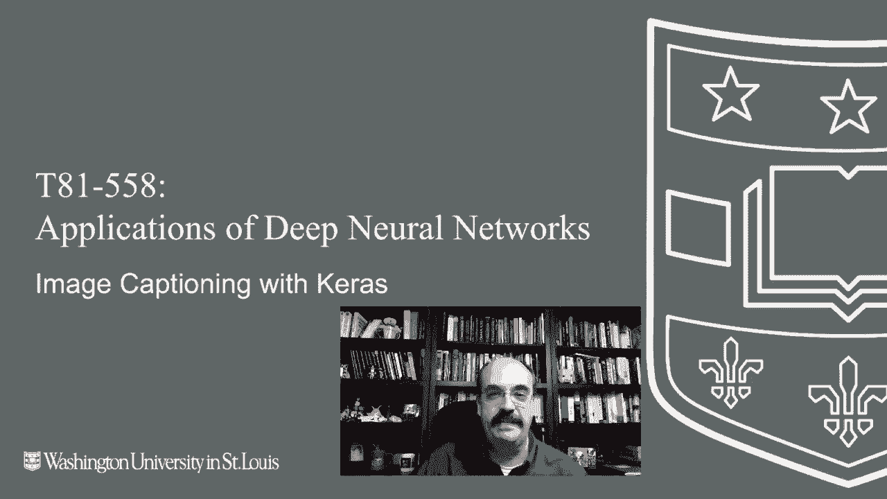
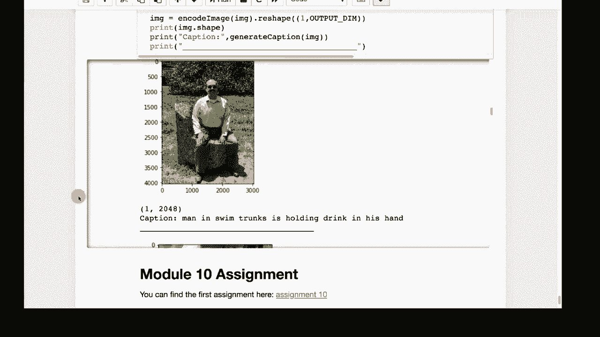

# T81-558 ｜ 深度神经网络应用-全案例实操系列(2021最新·完整版) - P55：L10.4- 使用Keras和TensorFlow进行图像描述生成 

嗨，这是杰夫·希顿。欢迎来到华盛顿大学深度神经网络的应用。在这个视频中，我们将探讨卷积神经网络与LSTM的有趣结合，这使我们能够为图像添加描述，以便看到图像中的多个元素并用一句话来描述它。要获取我最新的AI课程和项目，请点击旁边的铃铛订阅，以便收到每个新视频的通知。图像描述生成。

至少我第一次看到的是安德烈·卡帕西的论文。我们在上一节中提到过这个人，一些LSTM文本生成的内容来自于他。他在这方面也做了一些非常有趣的工作。所以这位研究者非常有趣，现在为特斯拉工作。

他为我们现在处理的一些计算机视觉软件创建了大量代码。这实际上是他论文中的一幅图像，或者至少是他网站上的一幅图像，展示了描述生成的效果。😊。

通常在生成描述之前，我们会尝试将某物分类为猫。然而，这里还有一个滑板，以及其他一些部分，比如门。后来我们进入了多图像分类，所以我们会说猫和滑板，就像是黄色。现在我们想要实际将文本生成与图像分类结合起来，能够为这些图像写描述。我们将使用重度迁移学习，因为从头开始训练这个东西会耗费很长时间，即使使用迁移学习。

我们将使用相对较小的图像集，它不会完美，但会生成一些具有相当好意义的描述。它们不会完美。当我们使用我在这个课程的GitHub上存放的个人家庭照片时，我们会看到这一点。

你在这个课程中见过很多这样的例子，其中一些来自狗Hickory，它们是非常好的测试，因为它们完全不在Imagenet中，而且都是我选择的照片，因为我认为从机器学习的角度来看，它们很有趣，有些可能并不容易被这些神经网络分类。现在我们将从Inception V3和GloVe进行迁移。Inception V3是众多经过Imagenet训练的神经网络之一，MobileNet我们在这个课程中也用过几次。现在我已设置为可以使用MobileNet而不是Inception，但在这个案例中Inception表现更好。我会在到达那部分时详细说明实际的区别，GloVe是自然语言处理的嵌入。

我们将在下一个模块中学习更多关于这些内容的知识，当我们进入自然语言处理时。这基本上就是它的工作方式。实际上，这与我们在上一章中进行的文本生成非常相似。但现在我们不仅仅是生成随机的无意义句子，而是实际上要生成有意义的句子。

你可以理解我们为什么从前面的部分开始，并学习如何仅教授神经网络。语法的基础以及如何将内容组合在一起。实际上，我们只是在引导它们了解语法知识。我们并不是在真正教它们语法。相信我，早期的自然语言处理痴迷于教神经网络所有关于语法规则的知识，并将语法规则编码化。

相信我，这非常困难。现在，想法是使用大数据，大量文本，让神经网络自己学习语言。这就是它的工作方式。以前，我们在生成无意义句子时会输入大约20个字符。现在我们不再基于字符，而是基于词。

我们可以基于字符做字幕。这可能需要更多的训练，而这就是我目前正在使用的技术。如果你想尝试基于字符的方法，我绝对鼓励你。我也很好奇你会得到什么结果。你可以使用这段代码作为起点。

但是由于现在是基于词的，我们将呈现一个向量。这将输入到神经网络中，单个元素不是字符，而是单词，我们有一个特殊的标记词叫做“start”，这就是一切的起点。因此，与之前给种子不同，因为我们需要生成整个字幕。

我们真的无法给它种子，因为我们不知道字幕是如何开始的。所有字幕都以单词“start”开头，而这甚至不是实际的单词“start”。这只是我们使用的一个标记。然后我们最初只发送“start”，但这是诀窍。神经网络可以接受许多不同的输入和多个内容。

所以我们的输入实际上与前面的部分非常相似，但我们也输入了整张图像。所以有两个输入进来，我们会看到Kira的功能性API与序列相比在这里绝对是必要的。

所以我们使用模型和Kira的功能性API来处理Resnet以及目前课程中的其他几个部分。但我们肯定会使用模型和功能性API，因为这是一个相当复杂的神经网络，我们给它一张图片，然后像在前面的部分一样逐步构建这个网络。

所以我们从开始部分开始。一张狗在草地上奔跑的照片。那实际上是我的狗。然后神经网络会接收这两者，并返回概率。然后它会说，好吧。我想下一步可能是“跑”。现在，如果我们在这里输入“a”和“狗”，那么“开始一只狗跑”将是最高概率。现在。

这真的很长，因为这组虚拟变量包含了这个词汇表中的每一个单词。我们稍后会看到词汇表的大小，但有很多虚拟变量。所以这是我们要构建的整体结构，我们将训练这个神经网络，显然使用迁移学习，这样我们就不必从头开始训练。

那么你应该总是使用迁移学习，如果可以的话。我不会实际运行这段代码。根据我的记忆，大约需要两个小时或三小时来训练这个神经网络。所以我已经把它全部运行过了，Github上上传的版本应该是预先运行过的。

现在你可能会看到一些不同的标题。如果你将这段视频中的内容与实际网站进行比较，因为如果我重新运行，这一切都是随机的。所以你绝对可以得到不同的结果。随着学期的进展，我会倾向于重新运行这些，因为不同版本的Tensorflow会出现。所以你会看到不同的结果。这些是你需要的所有导入，唯一有点有趣的是这些是开始和“in”标记。

所以我们在这里用开始标记启动它，并不断添加额外的单词。如果我们仅输入“开始”，它会希望给我们一个，然后我们再输入“开始”和“a”，它会希望给我们“狗”，然后我们给出“开始”、“a”和“狗”，它会希望给我们“跑”，然后继续。

最终它会给我们一个“in”标记。所以要么我们在这里撞墙而没有空间，要么我们得到一个“in”标记。这就是神经网络的输出可以是非常不固定长度的原因。如果你需要一个神经网络生成一个句子或提供一些不固定长度的内容，这就是你通常需要做的。你需要逐步构建，让神经网络为你不断添加新的元素。Epochs指的是我们将训练它的周期数，我们不使用提前停止或其他任何东西。如果你想尝试mobilenet，只需将这里的值设为false，这样效果不好。

我有我的小时和分钟字符串，因为我们会计时这些事情花费了多长时间，绝对要使用coab。GPU是你的朋友，如果你有自己的更快的GPU，绝对要使用它。你需要下载一些数据集。所以在这里我有路径内容在我的驱动器上。现在，如果你将你的东西放在不同的位置，可能需要更改这个路径，但你需要为该文件夹中的每一个目录创建目录。

你可以从源代码中看到，它们的名称都是这个，然后你需要创建一个数据目录，输出文件将创建在这里。这些文件应该直接来自标题。因此，解压这两个文件并放到那里。顺便说一下，获取 flicker8k 数据集可能有点棘手。可以在这里阅读相关文章。

关于这个问题有一些版权问题。因此，这很复杂。并不是说很难获得。我无法将其放入我的 GitHub 存储库，因为它不是我的。所以如果你点击那个链接，你可以准确找到如何获取它的方法。因此，我们将清理这个数据集，并开始处理它，顺便说一句。

这个数据来自 Flickr。它有 8000 张图像及其对应的标题。因此，这正是我们需要的，我们需要将其拆分，而我们在这里所做的就是清理描述。我们基本上将其转换为小写，并去掉标点符号。这些是我们正在移除的某些标点符号。我们基本上是在移除。

这里是一些非常简短的词。我们正在移除那些没有字母组成的词，并逐渐确定长度。因此，我们需要知道最大标题长度，因为这将是我们的序列长度。然后我们逐渐构建这些词的字典。接着，我们可以打印出我们收集到的内容。因此，查找的实质是独特词汇的数量以及我们字典中的词汇数量和最大长度。

最大标题长度。然后我们加载 GloVe 嵌入。GloVe 嵌入基本上是词汇中每个词的向量。这些词汇中的每个词都将有一个相应的向量，这些就是我们放入神经网络进行预测的特征，而不是直接进行。

说索引号码或虚拟变量。这比为每个词汇使用一个虚拟变量要好得多，因为词汇中有很多词，这将会产生大量的额外数据。我们确实在神经网络的输出中使用了词汇的虚拟变量。

但我们不会在输入中使用。另一个优点是，这些词的向量，相似的词，向量在欧几里得空间中会更接近。因此，利用线性代数，你基本上是在计算两个向量之间的距离。两个相似的词在空间中会相当接近。我们读取所有的图像名称。

我们基本上准备加载所有内容。训练集中有 6000 张图像，测试集中有 1000 张。然后我们构建所有这些描述。因此，将从开始标记开始。接着会有标题的实际词汇，并以停止结束。这就是我们基本上如何开始和结束标题生成过程的方法，正如我们在之前的图表中所看到的那样。

现在，我这里有代码可以使用inception或mobilenet。这输出维度中的这个数字，确实是原因所在。所以这会转换每一张图片。使用inception，如果你直接使用inception，它会返回1000个概率，因为imagenet中有1000张图片，每一张图片。

它会给你这个图像是其中之一的概率。我们去掉了那一层，下面是一个2048维的密集连接层。我们基本上像之前在迁移学习中的特征工程中看到的那样使用这些输出。我们将其用作特征工程。因此，这个从inception中输出的2048维向量，上面的一些层被去掉了。

这就是我们在这里做的。我们去掉了两个层。这些本质上成为了这些图像的工程特征。再说一次，就像使用glove一样，2048维的相似图像在向量空间中应该更接近。注意这里输出维度有多少。因为mobile net试图与移动设备和功耗非常兼容，所以那里没有密集连接的层。

所以当你去掉那些顶层时，你的维度数量会激增，而你有50。这对于特征工程来说并不是理想的，因为这会是一个非常稀疏的向量。至少我在许多实例中检查时，会发现很多维度为0，结果不会那么好，使用2048维的结果会更好。

不过你可以进行实验，代码应该都能正常工作。这些是你需要更改的关键常量。你需要改变高度和宽度，因为不同的迁移神经网络是为不同的图像大小训练的，它会打印出摘要。

这相当长。它是我们迁移的一个长神经网络。我们将创建训练集。因此，对于每张图像，我们需要对其进行编码。我们基本上是将图像编码为输出维度的大小。现在就是这样。你无法改变那个常量和输出大小。

所以我们本质上是在处理图像。我们将其调整为标准大小。我们不担心保持宽高比。迁移的神经网络往往会解决这个问题。我们进行迁移神经网络需要的任何预处理。我们在这里扩展维度。我们基本上是将这些图像加载时的长字符串处理。

并将其放回到图像应该真正处于的网格中。在这里，我们实际上执行任何预处理，而不是在这里。那基本上是转换为数组，然后我们调用mobilenet或inception进行预测。那是如何变成2048维向量的。然后我们将其重塑为正确的大小。

本质上是为了预测或输入到神经网络中。这是我们生成训练集的地方。这是我们反复调用的地方，这可能需要一些时间。因此，在加载后我们实际上会将训练集进行序列化，所以我们正在加载所有这些JpeEgs或PGs，或者那些图像数据，并将它们转化为这个东西压缩成的2048个向量。

所以这大量的图像处理不一定需要花费巨大的时间，但可能会花一些时间，这就是我们处理标题的地方，我们将它们整理成相似的结构。现在我们有30000个标题，因为每张图像最多提供五个不同的标题，这就是数据的方式。因此，每张图像实际上都有多个标题，这样挺不错的。我们将去掉一些。

不经常出现的单词。因此我们的词汇量降到了1651。这帮助了很多。我们建立了两个索引。每一个我们处理的1651个单词，这也添加到标记中。我们有一个根据索引号返回单词的索引，还有一个根据单词返回索引的类似的索引。因此，你有一个双向的字典来查找这些单词。

我们会将最大长度加上两个，以考虑这个开始和结束标记。然后这就是使用数据生成器的实际样子。我们将开始，只需开始。它应该，所以我们多次调用那个神经网络。调用它会开始添加一个。所以这就是训练集的实际样子。

所以只是一张图片和一个标题。这里的想法是这个训练集将是巨大的。因此对于每张图像，这只是一个图像。这是我的狗在草地上跑的情景。它不在数据集中，但我用它作为例子。对于这一张，我们将有五个不同的标题。我们可能会有像“狗在草地上跑”这样的标题。

狗跑动的所有这些不同变体可能是什么样的标题。但对于每一个，这里只展示一个标题。我们需要生成它的所有阶段。我们需要生成这个图像并开始返回“狗”，然后用这个图像开始返回“狗”。开始“狗”，返回“跑”。在这个训练集中有很多数据。

所以我们将使用一种叫做生成器的东西，以使其在RA要求方面不那么疯狂。然后你将得到你的第二张图片，因为数据集中有56000个这样的。所以每一个，你必须真的在训练集中将图像复制五次，以对应每个标题的五个版本。然后每个标题还会有一些额外的条目。

所以你需要为每一个中间位置复制那张图片。这是大量的数据。所以我们使用数据生成器。数据生成器是我们将要使用的。不会像之前那样生成这个大矩阵来传入。基本上，这里发生的事情是它在遍历所有的键。

这些基本上是我们拥有的所有图像。然后对于每一个图像，我们循环遍历所有描述。因此有五个描述。然后我们生成。这些是我们需要为每张图片生成一个、为每个描述生成一个的维度的百分比。然后是这些词的每种组合，以便我们捕捉到所有的中间形式。

我们还考虑到每批次希望有多少张照片，这是一个训练超参数。这个大的循环并不是直接运行并生成的。如果这样做，它会倾倒大量数据。这就是Python中yield命令的作用。这基本上是一个动态集合，你正在构建，每次你触发yield时。

它基本上让这个循环保持在冷冻干燥模式。所以它只是冻结它，并让程序继续进行它的工作。然后下次这个被调用时，它会回到这里，并从上次循环的确切位置重新开始并返回。返回它。这些是GloVe嵌入，以便我们可以将这些单词转换为每个单词的200个值。

你必须设置那个常量。你不能改变它，因为它是由**GloVe**固定的。然后我们基本上只是构建所有那些我们拥有的标题词的输入，并将它们全部查找。你可以看到这个的基本形状。所以我们使用了一个嵌入层。我们有1652个单词，每个单词都有200个元素。

这200个元素是GloVe将每个单词转化为的向量，因此相似的单词在向量空间中会更接近。这使用了一种叫做**Akira**的嵌入层。我们将在下一个模块中学习更多关于这个的知识，当你学习NLP时。这些非常好。这让你在内部进行整个查找。

这就是神经网络的样子。😊 输入1是你的图像，输入2是你将每次发送的逐渐增加的标题。这就是嵌入层的作用。它使用词汇量大小，并利用我们创建的嵌入矩阵，这个矩阵基本上成为那个层的权重，我们稍后会看到我们在这里创建它时并没有转移它。

它用随机权重初始化，但基本上是一个这种大小的矩阵，以便为你执行那些查找。它会查找每个单词并填入正确的200个值。我们有一些丢弃层，并且我们有256的LSTM，这实际上非常类似于我们在前一部分用于文本生成的LSTM层。我们基本上将这些添加到神经网络中，我们有一个最终的256密集层，最后的输出层将是词汇大小，因为你有虚拟变量输出。

本质上，我们创建一个模型，这使用的是Keras功能性API，以便我们可以有输入。我们可以有多个输入，输入一个和多个输入，当我谈论它时，比如说可能有三张图片进来，或者一张图片和一个标题，或者三张图片加一个标题，随你如何设置。

这是我刚才描述的我们网络的摘要。这非常重要。这是我们基本上从GloVe获取嵌入矩阵并将其直接放入神经网络权重中的地方。所以我们覆盖了神经网络的权重。它为我们提供了一个查找，当它看到单词5时，例如，它会去到列行。

根据矩阵的方向，将其放入特征向量。我们可以为分类交叉熵构建整个神经网络，因为这是一个分类神经网络。我们现在将以批量大小为三进行训练。这是我从一些原始论文中获得的。我们基本上正在进行这个。因此，我们有10个训练周期。

我们将在这个学习率下进行20个训练周期，然后是最后一个周期。我们正在减少学习率。我们也可以为此使用调度程序，但这相当简单。现在我们保存神经网络。如果我们看到它已经存在，我们只需加载它。我们不重建它，因为这部分会花费一些时间。

现在，当我们需要实际生成标题时，这就是将要执行的函数。这实际上与我们在前面部分生成随机文本的函数有些相似。它将构建一个序列，长度达到最大值，基本上就是从起始标签开始。它会用零填充序列，因为必须到达末尾。

我们将请求一个预测。我们的最大值获取这些预测中概率最高的那个，因为那就是我们要添加的单词。然后我们加一个空格。如果我们得到了停止标记，那么我们就停止并继续。最后，我们将其分离并返回一个文本字符串，告诉我们标题基本上是什么。

现在如果我们调用这个并评估它。这是一些实际结果。你可以看到这两个人一起骑自行车。它说，穿白衬衫的男人站在一个戴蓝色帽子的女人旁边。好吧，接近。它对正在发生的事情有个不错的想法。如果我们查看更多这些，这里还有另外一个。

有一只狗被网球轰炸。狗在追逐一个球。好吧，是的。它有点跳跃着去追。可以接受。有一只狗在混凝土上或者可能是在雪上。两只狗在草地上奔跑。好吧，现在是一只狗。黑白狗在雪中奔跑。这是我看到的三个中最准确的一个。

所以这很好。再说一次，这些并不完美。需要投入更多训练，可能还要更大的数据集，才能让这些更好。看起来有两个家伙走在地上，旁边有一些奇怪的涂鸦。穿黑色外套的人站在穿黑色夹克的女人旁边，距离相当近。

它没有搞清楚性别，但在一个男孩身上搞对了性别。两个孩子在蹦床上玩。穿红色衬衫的小男孩正在从秋千上跳下来。我可以理解。也许那儿有个秋千。但我重新运行了几次，它确实注意到了蹦床。所以它能看见这些东西，真不错，有时有两个穿比基尼的女人在海岸线附近。

一群年轻人。好吧，我相信他们正在爬上岩石进入水中。所以你可以看到它正在弄清楚，看到岩石，看到了水。很有趣的是它把语法弄对了，进入水中。所以我想它在东西前加了冠词，做得很好。

这是只狗，狗在草地上跑。所以好吧，这些照片是这样的。现在。它并没有用这些进行训练。这些来自同一组。这是测试集。如果你在我一些照片上评估它们，这些来自GitHub，它的表现不太好。现在，这有点残酷。

但这就是你测试这些东西并展示局限性的方法。我站在这里，这是佛罗里达的一所大学。其实这是我获得博士学位的大学。那是个塔迪斯（TARDIS）。如果你看过《神秘博士》，那就是里面的东西。但这只是一个电话亭。

可能没有塔迪斯，只有电话亭在训练集中。所以穿黑色衬衫的人。其实是蓝色衬衫，但我把责任推给了相机。还有牛仔裤，我的牛仔裤可见。所以在街上看起来很酷。好吧，它可能认为这些事情通常发生在街上。但实际上是在建筑物内部，但这实际上还不错。

这是我坐在那里的样子，穿黑色衬衫的人。甚至一点也不接近。我只在被迫出席时才会系领带。我现在不喝酒。这是我母亲的狗。两只狗在草地上打斗。我不知道那只狗，也许正在经历双重人格。我注意到在Flickr数据集中，很多照片都有人的动作。这儿没有人。

这是我和妻子参观的一家民宿，我们刚拍了张照片。所以这完全是一幅风景照。没有工作人员。这儿有台阶。也许这是我、我的妻子和穿红色衬衫的狗。这里说的是我的妻子，她不是男人。她是个女人，坐在凳子上，穿着他的鞋子。

远远不够。这是我坐着的样子。我喜欢这块石头。它在华盛顿大学。我称它为 GitHub 岩石，因为它看起来很像 GitHub 的那些绿色方块。穿着泳裤的人。我并不是穿着泳裤在战争鞋中间。我可能会因为手里拿着饮料而失去工作。是的，它真的让我想要得到。

我并不是穿着泳裤、手里拿着饮料在大学的中间，所以无论如何。这只是尝试在一些图片上，所以在这门课程和其他主题及人工智能方面保持最新。
