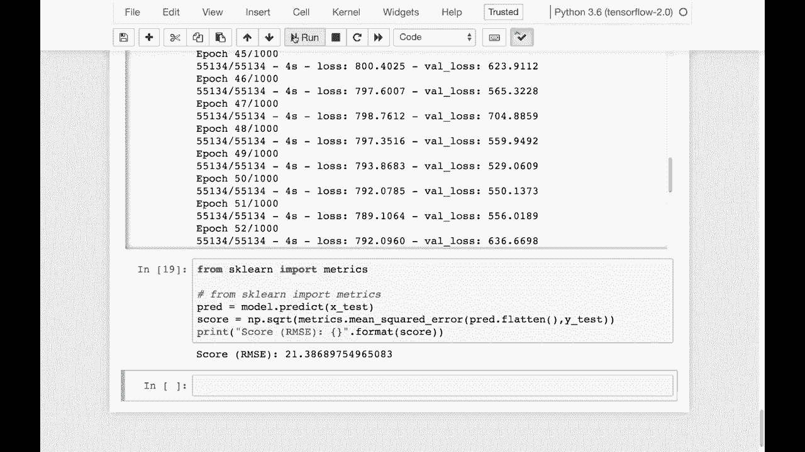

# T81-558 ｜ 深度神经网络应用-全案例实操系列(2021最新·完整版) - P56：L10.5- Keras中的时间卷积神经网络 

嗨，我是杰夫·伊顿，欢迎来到华盛顿大学的深度神经网络应用课程。你知道吗？ LSTM、GU 和一般的递归神经网络在时间序列预测中确实失去了某些青睐，尽管这些是最初的深度学习，甚至传统的元素和乔丹网络被引入用于时间序列。但你猜怎么着，卷积神经网络也能处理这些事情。

有关我的 AI 课程和项目的最新信息，请点击旁边铃铛的订阅，以便在每个新视频发布时收到通知。你通常会将卷积神经网络视为图像，或者至少你几年前是这样想的。

现在，CNN 被应用于各种各样的事物。特别是时间序列，很多最新研究确实使 CNN 在一些复杂的时间序列和自然语言处理任务中占据优势。所以我将向你展示如何使用时间卷积神经网络，Keras 在这方面并没有我希望的那么先进的预构建库，其中最好的一个链接在这里。

但目前在 Tensorflow 2.0 上不可用。我怀疑在学期开始时会得到纠正。所以当我们达到学期的这个节点时，我会给你更新。对于这一部分，我们将使用我之前给你提供的关于时间序列的两个示例。

所以，这里我有的时间序列玩具数据，以及日斑的示例。我们会展示我们在 LSTM 中做的这两个，几乎可以使用完全相同的代码。只需将 CNN 替换为 LSTN。数据实际上以我之前告诉你的设置3D张量输入的格式进入，仍然适用。我们在这里设置3D张量。这是同样的示例。

这是关于潜在汽车的训练，正前方只看着一小束激光。所以我们可以看到，颜色1的汽车在这里。因此，Y 被分类为1。颜色2的汽车在这里，被分类为2。如果你想了解更多细节，我在模块10的第二部分讨论了这个数据集。

这只是一个玩具数据集，用于真正展示如何使用 LSTM，但在这种情况下，我们替换掉了 LSTM。我们使用的是 con1D。这本质上是内置于 Keras 的时间卷积。更高级的版本，我会在我们达到学期的这个节点时更新你该库的进展，是使用一种叫做残差的东西。

这非常接近我们在 Resnet 中使用的内容。现在，在整个学期中，我们将使用 con1D。我不会在最后一分钟更换，因为我总是在学期开始时锁定版本。相信我，Tensorflow 和 Kias 在一个学期内可能会有很大变化。

这些东西以光速移动。所以让我继续运行。它将像LSTM一样训练。我的想法是，我可以在这些中的任何一个地方放一辆车。它会学习到，好的，这两个在一起，或者甚至三个在一起。也许是一辆长车可以被识别为二或三等。

不管是什么颜色，完全没有RGB编码。只是一个是一个颜色，两个是另一个颜色。同样，这只是一个玩具示例。看起来它已经训练好了。好吧，让我们试一下。我把车子放在了向量的边缘上，但我们还是运行一下。它仍然表示这是某种类型的车。如果我移动车子，或许它就会改变。

早些时候拍的照片就在这里。它应该仍然返回一个，工作方式与之前的示例非常相似，之前使用的是LSTM。如果你想要Sunspot数据的完整描述，请参考该模块的第二部分。但本质上这是每月的日冕数。

我们试图预测这些，因为它会上下波动。我在这里有数据文件的链接，因为数据文件是由政府提供的。因此，你需要下载并将其复制到你的文件夹中。我把它放在数据目录下，但你可以放在任何地方。我现在就运行这个，已经加载好了。

这就是Spot数据的样子。我们主要处理年份和月份，查看Spot值。在这些早期年份，它们不一定总是有值。这里我们修剪掉那些缺失观测值的早期年份。我们将其分为测试集和训练集，2000年前的都是训练集。

2000年后的数据是测试集。我们将这些数据转换为序列，和之前做的一样，这只是时间序列编码。因此，我们处理序列大小为25。所以我们将其分成25组，然后尝试预测第26个。这有很多不同的组。

我们可以从数据中提取的信息。我们可以查看Xtrain的样子，所以它包含那些序列。25。这是最初的日冕数，所以253、240，所有这些日冕，然后y只是一个数组，表示在训练序列之后的日冕数。这是我们构建模型和训练的地方。这使用了提前停止功能。我会快进这部分。

所以让我们在训练集上运行RMSE。然后在测试集上运行RC，看看表现如何，21的RC实际上相当不错。这是日冕数，这些数值在几百左右。所以准确性是合理的。这个内容经常变化，所以请订阅频道以保持对该课程及其他人工智能主题的最新了解。

