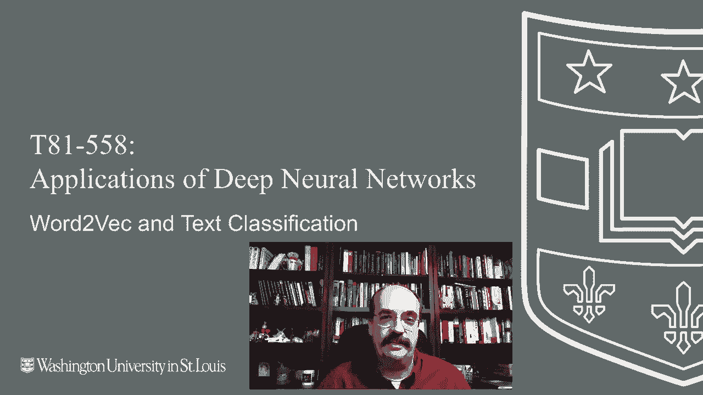
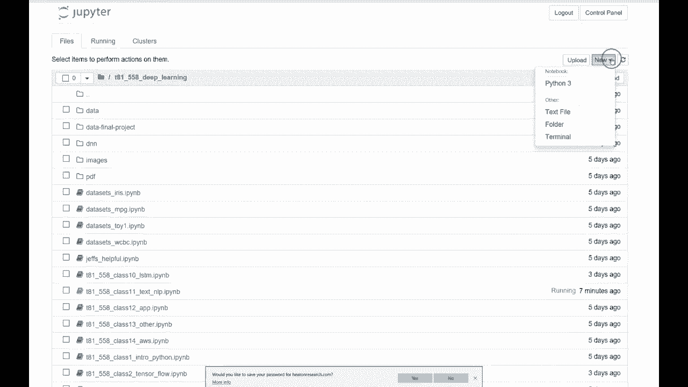
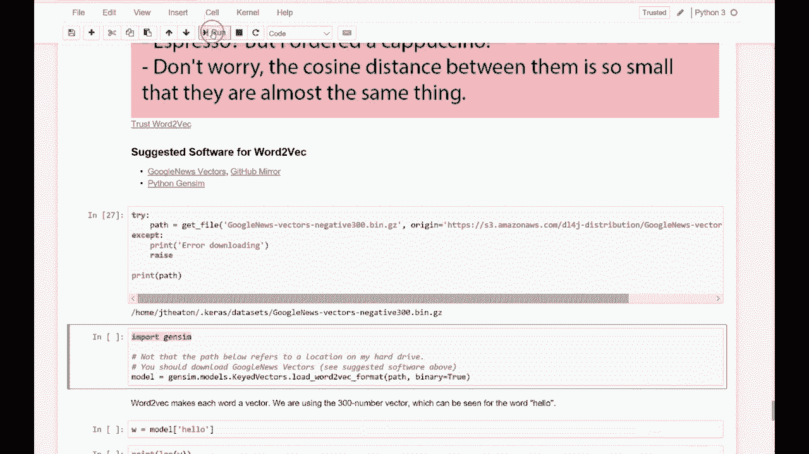
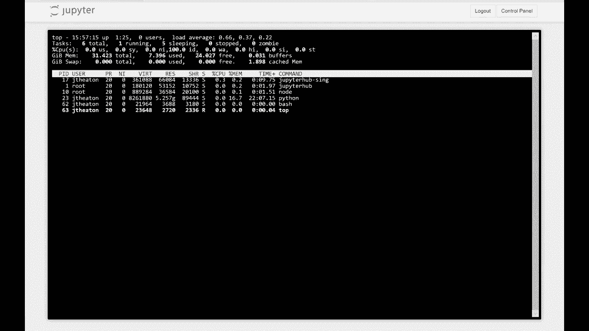
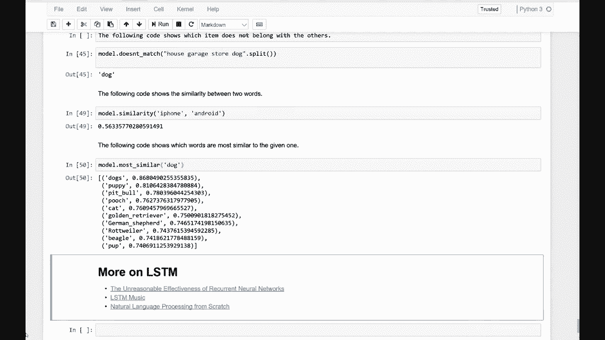

# T81-558 ｜ 深度神经网络应用-全案例实操系列(2021最新·完整版) - P58：L11.2- Word2Vec和文本分类 

嗨，我是Jeffheine，欢迎来到华盛顿大学的深度神经网络应用课程。在这个视频中，我们将探讨Word to V，这是一种预训练模型。你可以从谷歌和其他来源获取它，帮助你进行自然语言处理。关于我最新的AI课程和项目，请点击订阅并按旁边的铃铛以接收每个新视频的通知。

Word to V是一种非常有趣的技术，它解决了如何将单词转换为向量的问题。我们之前看到的编码基本上是使用一些虚拟变量和索引。你将每个单词转换为一个单词编号。这是端到端神经网络的一种有效方式，而且效果很好。

但随着词汇量的不断增大，这种方法就不太有效了。Word to V是一种将单词转换为向量的方法，而向量和线性代数之间可以进行各种运算。你可以对Word to V进行这些运算，它可以实现一些非常有趣的事情。Word to V基本上将相似的单词放在向量空间中彼此靠近。

我看到了这个。

我在推特上发了一条消息，我觉得很有趣，关于Word to V的卡布奇诺和浓缩咖啡。那位女士说的是浓缩咖啡，但我点的是卡布奇诺，而小机器人则说：“别担心，它们之间的余弦距离非常小，几乎是一样的。”所以在这方面你确实要小心，不过这两个词非常相似，它们在Word to V的映射上也会非常接近。我给了这个特定卡通的原始来源链接。我建议用于Word to V的软件是GitHub的新闻向量。这需要大量内存，我使用的是完整的大型谷歌字典，带有大的编码。这是我在一个Kaggle比赛中使用的技术，在那场比赛中你会被给出两个问题，核心挑战是你需要判断这两句话是否相同。我在那个挑战中大量使用了这项技术。

最终，我进入了前7%。所以效果相当不错。它让我在这场比赛中取得了相对较高的名次。我们将使用大的谷歌新闻向量，如果你点击这个链接，它会带你到这个的GitHub镜像。这是一个相当大的文件，我们使用300维的向量，来自谷歌新闻的训练。

如果你尝试下载，它们不会让你直接下载，因为文件实在太大了，达到了1.53GB。所以，是的，这就是它的大小。我们需要下载这个压缩文件，然后将其表示为RA。我使用的是相当大的文件，如果你的电脑有16GB的内存，这个可能会工作，我用了32GB以确保安全。

让我继续回到我的，我将继续并展示它的样子。内存方面，所以我将创建一个新的终端。这是我实例上的Linux终端。它只是你典型的Linux命令提示符，我将运行一个叫做top的命令，如果你在Linux中从未见过top，它有点像进程管理器，我不会详细介绍这里发生的一切，但请特别注意内存，内存以千字节显示，你可以按住shift和E，然后它会切换，现在我们是在千兆字节。如果你进行大量高性能计算，你会经常使用这个top命令，如果你在Linux环境中工作。这是我有的可用内存量。这是我通过AWS使用的30GB机器，规模还不错，你可以在AWS上获得更大的机器，内存绝对可以更大，但32GB对我来说足够，这正是我喜欢的。

使用AWS实例进行这个。我不需要购买一台大型电脑并让它放在我的桌子下快速贬值，直到将来某天我带它去技术回收日。我不常需要32GB的电脑，但当我需要时，可以从亚马逊租用，费用不到一美元一个小时，所以我们将看看当我们开始加载时，这个费用如何减少。你可以在这里运行的这个命令会为你下载它，我已经在我的实例上下载了这个文件，所以我不需要重新下载。

这部分根据你的互联网速度，进展相当快。不过，这里需要稍微长一点时间，因为我们正在导入Jenison，这是我喜欢用于Python的word tove处理程序，它相当不错，我将继续运行它，它会把word tove加载到内存中，这需要一点时间，我会继续进行。

运行那个单元，然后我将翻回这里，你会看到我的内存开始下降。所以是30.3，在这个过程中，它基本上在加载，如果我只有6GB或8GB，我知道会耗尽，32GB可能有点多，我可能可以在16GB的实例上运行，但我们看看它会下降到什么程度。我将让它运行，并可能稍微加快一点，好吧，似乎完成了，或者至少占用内存的部分完成了。我们剩下24，所以是的，我之前在我的8GB实例上尝试过，这并不是很好，所以现在它已加载完成。我想指出这个特别的警告，慢版本基本上意味着我的包并不都是最新的，这一点是相当真实的，因为我运行的是一个较旧的版本，但并不是最旧的版本。

我使用的Tensorflow版本是为课堂准备的，并且在整个过程中保持不变。因此，由于依赖于该版本的Tensorflow和最新版本的Gsum，它无法像想要的那样快速访问其数据，这可能是加载时间稍长的原因，但不会影响我们这里要讨论的示例。所以首先让我给你展示一下这些向量的样子。

我们只使用了单词hello，所以加载的模型就是一个字典。我们将展示hello的条目，它已经加载到W中，我将打印它的长度。它是300。因此，可以理解为什么这么大，如果我打印出模型中每个单词的长度都是300，这里就是hello的样子，这是一组包含所有这些数字的向量。

定义在高维空间中，因此在300维空间中有一个点。hello这个词恰好在附近，或其他与hello紧密相关的词。因此，这个模型占用数千兆字节的空间，这仅仅是hello的300个浮点数，字典中可能还有数万个单词，全部来自谷歌新闻。所以让我向你展示一下如何对其进行某种线性代数操作。

你有猫和狗，如果我们运行这个，它会查找这两个向量，我只需计算它们之间的距离并打印出来。如果我放入像cat和car这样的词，距离就会大得多。你需要小心的是词汇和意思的文本分析，Cat和car仅相差两个字母。所以有时你会用它们之间的距离比较两个单词。

所以它们是怎样的？比如我的名字，Jeff和Jeffrey很接近，因为JEFF是开头，而你只需在结尾加上REY。这是一种常见的文本分析类型。但是Cat和car在拼写上很接近，但在意义上却非常不同。所以我们可以回到这个点，并且我们可以尝试之前的例子，这里她点了一杯卡布奇诺，所以猫和狗之间的距离，机器人可能有点夸大了，因为他说它们实际上是同一种东西。我不知道两个非常相似的饮料，比如可乐和百事可乐，没那么相似，这很有趣，可乐和苏打水类似。因此这些词在谷歌新闻中可能并没有出现过那么频繁。

作为与相似事物紧密相连的事物，你可以在这里尝试不同的词汇。你可以加载我提供的代码并进行实验，我们可以做国王和女王，这又引出了我的下一个示例，更相似，但这里你可以对它进行数学运算，这非常有趣。这是一个经常被引用的例子，你可以进行女王等于国王减去男性加上女性的运算。因此，如果你取一个国王的概念，减去男性后，它变成了类似于君主的东西，但再加上女性，它基本上变成了国王，或者抱歉，女王。所以如果我们运行这个并请求与这个方程最相似的，它会返回女王、君主或许是公主。所以这实际上非常酷，它能够执行这样的表达式，这对自然语言非常有用。

处理这些向量可以为这些词提供输入。它仍然需要大量内存，因此你需要处理每个词的300个输入，但这比我见过的65000个词的字典要好得多，然后有65000个虚拟变量。

所以这是另一种编码类型，你可以利用它，展示一些其他的工作效果，这很有趣。以下代码显示了哪些项目与其他项目不属于同类，我有早餐、晚餐和午餐，以及谷物，而谷物是你可以早餐吃的东西。

它并不真正像其他那些，它能识别出来。你可以在这里放入任何你想放的东西，汽车、卡车、男人、猫，它会说猫、房子、杂货店和狗。我从未尝试过这些。我们看看它是否有效。做得好。好的。它让我对它的信心稍微降低了一点，和可乐与百事可乐一起。

但我敢打赌，由于它们是不同的公司，这就是它的本质。Google新闻可能主要有这些样本，那里被更多地称为公司，这显示了两个词之间的相似度更像是一个百分比。

所以我们可以这样做。它们的差异更多。所以显然，它确实把这些视为公司。我们做颜色，如果我们做像iPhone和Android这样的东西，因为它们非常不同，你可以看出Google制作了这个。我想你可以找到一些最相似的词之间的关系，比如狗、小狗、猫。

Google，Tever Rotweiler，以及所有这些。然后我还有一些链接，你可能想进一步探索LSTM。这是不可思议的有效性。这非常有趣。它学习生成，所以你在特定作者的作品上训练LSTM，它学习生成听起来惊人地像该作者可能生成的文本，LSTM音乐生成了一些YouTube视频中生成的音乐。

然后是一个较早的论文，涉及我在那里的研究，试图从头开始进行自然语言处理。所以忘记 Wordnet 和我们为帮助自然语言处理创建的所有其他东西。

这基本上向你展示了如何从头开始进行这个操作。好的，这是我在这个模块中要分享的所有内容。感谢观看这个视频，在下一个视频中我们将继续这些内容。

我们学习使用的各种软件包。利用间谍和单词转为 V，并与 Kis 一起进行自然语言处理。此内容经常变化，因此请订阅频道以保持对本课程和其他人工智能主题的最新了解。
