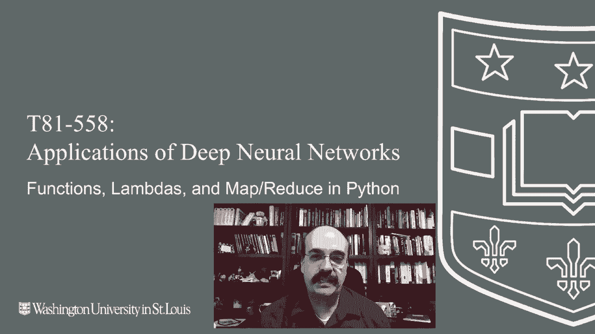
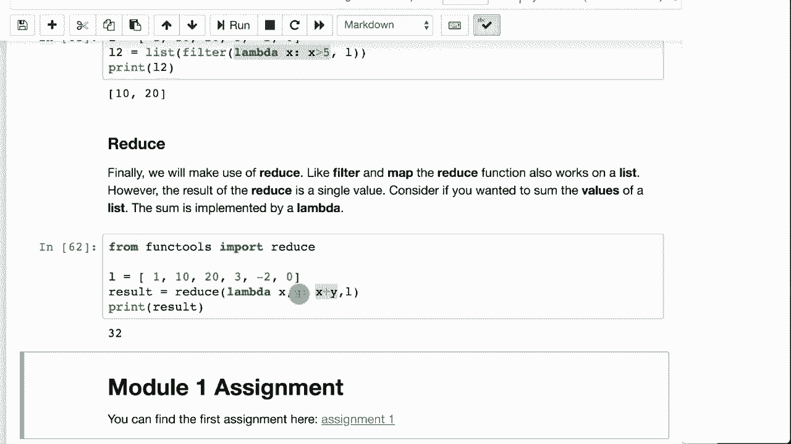

# T81-558 ｜ 深度神经网络应用-全案例实操系列(2021最新·完整版) - P6：L1.5- Python 函数、Lambda 和 Map／Reduce - ShowMeAI - BV15f4y1w7b8

嗨，我是杰夫·赫顿，欢迎来到华盛顿大学的深度神经网络应用视频。在这个视频中，我们将看看如何使用函数，甚至是Lambdas，这使你可以将一个函数传递给另一个函数。这是Python编程语言的一项非常强大的特性，让我们可以用数据处理做出非常有趣的事情，特别是在下一个模块当我们开始使用pandas时，我们将看到如何使用像map这样的东西。

reduce、filter以及在集合上进行的基本操作，利用可以传入的Lambda函数。有关我最新的AI课程和项目，点击订阅，并点击旁边的铃铛以便接收每个新视频的通知。函数在许多不同的编程语言中非常常见，它们允许你处理代码。

并将其打包为一个函数，而不是在程序源代码中到处重复。这里我创建了一个名为say hello的函数，这就是在Python中定义它们的方式。你在函数定义中不需要任何东西来说明你是否会返回某个值。Python通过你是否返回某个值来知道它是一个函数，或者通过你不返回某个值来知道它是一个过程。

而一个过程通常被称为不返回值的函数。这是一个过程，所以它不返回任何东西，它接受几个值，参数，发言者，问候的人和问候语。现在注意到上面的equal hello。这意味着它有一个默认值，因此如果你不提供问候语。

然后它默认将其设置为“你好”。我们可以运行这个。它调用了三次。第一次，它用一个发言者和一个要问候的人调用它。第二次，它用一个发言者和一个要问候的人调用，并且改变了问候语，所以变成了“再见”。你也可以使用命名参数，这在你有很多参数时非常有用，这样就不会让人感到困惑。

你可以说，发言者是杰夫，同意的人是约翰和格林，你可以随意混合顺序。这并不特别重要。如果我们运行这个，你会看到它说“你好，约翰，我是杰夫。再见，约翰，我是杰夫。”对于最后一个也是同样的情况。现在是函数。一个真正的返回某个值的函数，这里你会看到我基本上传入了一个字符串。

这段代码的作用是剥离，所以Str会去除字符串开头和结尾的空白。字符串基本上是一个数组。因此，字符串的第一个字符是字符串的第0个元素。我将其转换为大写。然后我说，嘿，我想要从1到末尾的其余部分，因为如果我说1到2，它会只获取字符串的一部分，所以如果我们这样做。

它定义了函数，现在你可以很容易地调用它。我传入带有空格的 hello，它返回给我大写的 hello。Python 的 map 函数非常有用，这源于函数式编程中的 map。Map 来自于 Hadoop 的名声。现在这并不涉及大数据或类似的东西。

这就是简单的 map 函数。map 接受一个值列表，并对每个值应用一个函数。所以在这里我将运行它。list 将输出从 map 转换为一个列表，以便可以显示。我们给它处理字符串，这是我们在所有值上应用的函数。

在这个列表中。所以它将给我返回一个列表。map 总是返回一个列表，包含所有来自你调用 map 的函数的值。与我们在 Python 中的 comprehension 非常相似。所以在这里我们将把它看作是一个 comprehension，基本上做相同的事情。

所以在这里我们调用处理字符串为 X 和 L。现在，comprehension 是一种 Python 特有的东西，而 map 在许多编程语言中都很常见。我倾向于使用 comprehension，但其他人会使用 map，因为他们可以编写代码，使其能被不仅仅是 Python 程序员理解。

因为这个理解在这里所做的并不一定明确，除非你已经使用过 Python。Filter 是另一个函数式的。你可以处理的一种运算符。filter 接受一个列表，并将其过滤为一个可能更小的列表。可以是与输入列表相同大小的列表，但这定义了一个函数，问它是否大于五？

然后我们取这个列表，其中一些值不大于五，我们处理这个列表，因此只有 10 和 20 大于五。其余的都被过滤掉。所以 filter 可以是一个非常方便的方式。基本上，应用一个函数检查项目是否应该包含在列表中。Lambda 非常方便，它是一种函数，属于匿名函数。

通常 lambda 只有一行，但它们当然可以更长。lambda 基本上创建一个函数，一种表达式，你可以直接赋值给变量。所以在这里我将运行这个，而不是写这个冗长的函数，虽然两行不算太长，但仍然。我们简单地将其写为 lambda，因此 Lambda 替代了大于五的函数。

它没有名字，字面上只是直接传递到 filter 函数中。所以如果你要写非常短的函数以传递给诸如 map 和 reduce 以及 filter 的东西。这可以是编写这些函数的很好方式，然后再 reduce。因此这些其他像 filter 和 map 的东西。你有一个列表输入，一个列表输出。

这是一个将列表减少为单一值的示例。所以它将列表简化为一个单一值。这展示了如何进行简单的求和。😊，所以这是`reduce`的工作方式。你在lambda中有两个值，第一个是累加器，来自于前面的值。然后是你要加到这个累加器上的值。

感谢观看本模块关于Python编程语言的内容。在下一个模块中，我们将看到如何开始使用Python附带的Pandas库，它可以让你为表格神经网络准备数据。这部分内容经常更新，所以请订阅频道，以便及时了解本课程及其他人工智能主题。
