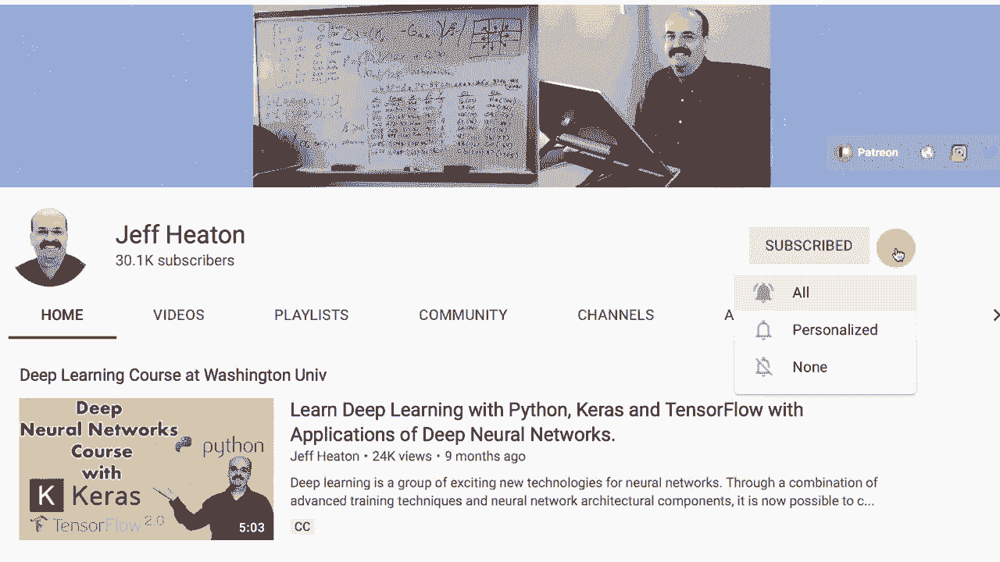
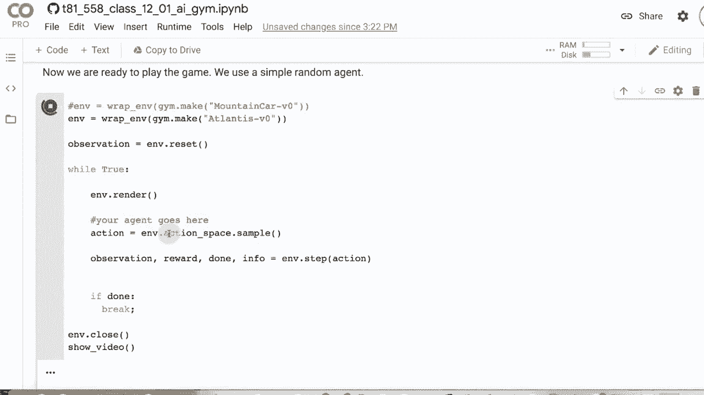

# T81-558 ｜ 深度神经网络应用-全案例实操系列(2021最新·完整版) - P62：L12.1- OpenAI Gym介绍 

嗨，我是Jeffy。欢迎来到华盛顿大学的深度神经网络应用模块。在这个模块中，我们将看看AI Gym。所以AI Gym是一个😊基准平台，让你在Python中评估你的强化学习程序，与著名游戏如Atari游戏等进行对比。所以我们将看到如何实际与这个接口，并使用它来观看游戏在屏幕上播放，或者以离线方式训练，看看我关于kgel神经网络和其他AI主题的所有视频。

点击订阅按钮和旁边的铃铛，并选择全部以接收每个新视频的通知。那么让我们来看看OpenAI Gym。在这个模块和接下来的五个部分中，我们将讨论强化学习。强化学习与监督学习或无监督学习不同，它有时被称为自我监督。你将给计算机提供某种游戏。

并且这不一定是游戏。它可以是任何有明确规则且可以在计算机中完全模拟的东西。所以基本上是一个游戏，但要将其用于其他类型的学习，你需要以某种方式表达你的问题，使规则明确，以便在进行过程中有一种增量的进展。每局游戏可以称为一个回合，你经历一系列步骤，在每一步，计算机可以采取特定的动作，然后在结束时。

它的性能被评估，成功了还是失败了，每一步都有所评估。根据表现给予奖励，机器重复进行这个过程，并且能够学习并变得非常擅长。这在围棋和国际象棋中被用来开发出超强的计算机，能够下得比教它的任何人都要好，它基本上是通过与自己下棋来做到这一点，因为规则非常明确。

它变得越来越好。令人惊讶的是，它不需要任何关于国际象棋的先前知识。所以那些谈论著名开局的国际象棋书籍，几乎就像是一个来自另一个平行地球的外星人，自主发展了国际象棋，但这两个星球没有分享任何国际象棋的技巧。

所以这些来自平行世界的极高级棋手来到地球下棋，他们遵循完全不同的规则。我认为这也是击败这些高度优化机器的复杂性的一部分。

所以让我们看看OpenAI实验室。OpenAI实验室基本上是一堆游戏。甚至是Atari游戏都设置好，让你的程序可以与它们竞争。这就是OpenAI Gym。你可以看到他们有Atari游戏，这些游戏是通过Atari运行的。

这个在Mac和Linux上效果很好，在Windows上，你可以让它工作。但在Windows上让Atari模拟器工作有一些复杂性。你看到的经典游戏，比如这个杆车和摆锤，运行得很好，我们将开始使用杆车和山地车。

这些都是一些相当经典的游戏，例如，让我给你展示一下它们的样子。如果你点击环境，你会看到这些是经典的控制游戏。我们特别要处理的游戏是cartpo和山地车。山地车有两个版本，这在我们看到如何实际与这些互动时变得很重要。

这里有一辆山地车，它基本上有一个布尔油门。要么你把脚踩在刹车上到底，要么踩在油门上到底。山地车的目的是尽量到达这个旗帜。

车的发动机根本没有足够的动力去做到这一点。即使你全力踩下去，它也是如此。因此我们基本上必须……你在这个游戏中有三个控制：向前、向后和刹车。所以推上去，它大概能到这里，然后就会滑回去。它的动量不足。因此，它需要尽可能快地向后滑回到这里。

用力推上去，然后用力推上去，最终通过前后摇摆，你会获得足够的动量让它上坡。因此，这需要一点AI来学习如何做到这一点。我还会给你展示一个我写的算法，基本上是一些if语句，能够解决这个问题。无论你往哪个方向走，如果你在上坡，就始终让油门全力以赴向上走。

你可以部分踩下油门或部分松开。我认为这并没有什么帮助。我觉得你几乎需要全力踩下去才能上坡。这只是试图保持平衡，所以你有这种拉力。想象一下，如果你拿一根米尺或一根码尺，试图在手上平衡，然后在房间里走动，而不让它掉下来。

这基本上是它试图做的事情。所以让我们回到这里，到这一部分的注释中，在Google Collab中实际上现在我们正在打开它在Collab中打开它。让我们看看如何实际利用AI gym。我这里有一些基本信息，但我们要做的第一件事是导入AI gym和我向你展示的每个游戏基本上都称为一个环境，而我刚刚定义的这个函数本质上是查询环境，你需要打开环境，然后你需要打开该环境的规范。

我在这里所做的是你可以为我们将要处理的每个环境运行它，并且我还将向您展示它适用于几个Atari游戏。如果你为mountain car运行它，它告诉你动作空间，这种类型的动作空间是离散的。这意味着你可以做三种离散的事情来运行那辆山车。

你可以倒着走，你可以踩刹车。我觉得你在踩刹车。它可能在空转，我不确定，你可以向前走。我告诉你，我处理几乎所有这些环境时，我通常会查看该环境的源代码和Github，以真正理解它们是如何工作的。现在是观察空间。所以你有动作空间。这些都是你可以做的事情，然后观察空间基本上是世界如何改变的。现在有两个框值框基本上意味着连续的，所以有两个连续的变量返回，并且这两个基本上告诉你汽车的位置左右，所以它在山上上升到哪里，以及在哪一边，所以本质上是屏幕上的X，然后另一个值是它的速度是多快，这取决于它移动的方向，这就是整个。

Unniverse只需要这两个值最大的情节步骤。所以每一集都是这场比赛的一场比赛，如果汽车没有在200步之内解决问题，那么这一集就会结束。我们放弃了。想象一下一步像一帧，想象你在玩一个视频游戏，你知道一个视频游戏，你的渲染引擎可能每秒钟发射30帧，这就是电影的情况，每一步都是一帧，所以它最多会有200个那些不确定的步骤。我特别不喜欢这个命名。这些大多数情节或环境都是随机的。所以你的车不像那辆车的物理计算完全可预测。现在你可以种子，你可以把一个种子放进去，这就是不确定性的意思，如果你种子，那意味着它将是确定性的，但如果你不种子，它就有些随机。所以这就是。

本质上，这意味着我所处理的大多数环境都是非确定性的，因此如果你给它设定种子，它们就会是相同的。这一点很重要，如果你训练了一个神经网络来玩山地车，而你用不同的种子让它玩，它可能会输，因为它面临随机情况。它已经学习了一些关于如何玩游戏的基本理念。

但是如果我不知道，你看世界上最好的赛车手，没有保证他们每次都会赢，因为有很多随机因素，这些随机因素只是他们无法控制的事情，超出每场比赛的范围，他们可能不会赢。现在每一步都是同样的道理。

你会得到一个奖励，所以你本质上给它一个动作，它会给你反馈观察结果，那么下一步的世界看起来是怎样的，然后你再给它另一个动作，它会告诉你世界的样子。奖励阈值本质上就是你的基本奖励，所以如果你得到负奖励。

110你没有做得很好。现在山地车在奖励上非常吝啬。你只有在获胜时才能获得奖励，这使得训练有些困难。想象一下，如果你要建造这座建筑，而在每一步都没有任何反馈。你建造完整个建筑，然后告诉你它的好坏。

这非常令人沮丧，但神经网络实际上可以优化一些可以赢得山地车的策略，我们将在下节课中看到一个例子。现在我也可以查询环境以获取小车平衡的情况。所以这是一个试图平衡杆子和小车的情况，该动作空间是离散的。

所以你不能停止，你在一个方向上移动，或者另一个方向，而你的观察空间有四个值。我不得不查看代码才能弄清楚这些是什么，但本质上是小车的位置，你只在两个维度上移动小车，小车的速度有多快，因为当你从这两个离散值中施加更大的力量时。

驾驶时，你加速，杆子的角度是多少，杆子的末端速度是多少，这就是物理。通常你会想到摆的速度，我的意思是，它本质上是一个倒立摆。末端的速度是多少。你可以把小车推向左边或右边。

所以我们处理的这两个值是离散的，意味着只有两个设置。还有一个变量，两个可能的设置或者连续的，这就是箱子。所以有四个连续值。如果你在处理山地车的连续类型，它们都是箱子。所以动作空间只是加速器。

你可以给它正加速度或负加速度，以及连续范围或零，意味着什么都没有。出于某种原因，最大剧集步数是 999。而且这是一个双重负面非确定性。因此，它不是确定性的。然后奖励范围可以从负数到正数，奖励阈值是 90。别担心这个警告。我认为这实际上是 OpenAI Gym 中的一个错误。OpenAI Gym 维护得不多，上面有很多问题被发布。

但这仍然是一个很棒的工具包，用于突破。这是一个 Atari 游戏，我想展示他们为一些 Atari 游戏所做的事情，这真的很迷人。所以观察空间本质上是一个 210 乘以 160 乘以 3 的图像。因此本质上是一个红绿蓝图像，你在这里做的是使用图像，那么用户在看什么呢？他正在看屏幕，就像一个用户一样，这很酷，它只是看着那个图像并学习如何玩游戏，剧集步数可以持续很久，你知道的，1000 次。非确定性几乎总是为假，奖励范围可以是任何东西，阈值他们通常甚至不给你一个，我通常不使用范围和阈值。

Kd FYs 现在，我认为这真的很有趣。他们还给你提供了突破性内存。你看到的是 Atari 2600 的内存。Atari 2600 的内存是 128 字节，不是 K 不是 MB，当然也不是 GB。因此，这并不是很多内存。我是说，天哪，图像大小比这个游戏所需的内存还要大。我是说，一行是 210 乘以 3 字节。所以，这不算是很多内存。

但是通过查看这个游戏的内存，你可以大概知道发生了什么。而那些 128 字节在老式游戏中是用来做什么的。他们称之为内存映射，谁知道，只有 Atari 开发者知道。他们可能甚至没有使用全部的 128 个字节。仅仅通过查看内存来操控，你可以在玩游戏时获得信息。

你能够玩这个游戏。现在这两者，动作空间。所以输入是 4。这是你的摇杆。四个方向：上、下、左、右，因为你在移动那个小方块，试图击打球，而你不需要给球一个击打命令。

仅仅因为它击中了你的角色就会导致它弹出，而令人着迷的是，我们将看到如何开发一个代理，它能够学习玩这些雅达利游戏。我还想给你展示，因为我们在CoLab中，如果你在自己的本地计算机上运行，会发生什么，当你尝试渲染和播放这些游戏时，窗口会弹出，你将实际看到雅达利游戏。所以如果你想在CoLab中实际玩雅达利游戏，因为CoLab是一个虚拟环境，我会告诉你如何做到这一点。我们将运行这部分，它会进行pip安装，我们正在安装Python虚拟显示，这对CoLab很有用，我还用它生成一些我附加的展示视频，给你展示一些播放的东西，给你一个Python虚拟环境。

环境基本上会将其渲染为文件，然后我们可以将其转换为视频。让我们继续运行这些。所以基本上，你将玩吉他游戏并录制视频，你可以下载视频或在CoLab中观看，所以你不能实时观看，只能事后看到，但这也很好，这就是你在CoLab中能做的。这里的部分我提供了链接，因为我从一个非常方便的写作中获得了这些功能，该写作介绍了如何在CoLab中使用它，所以我将运行这些，只需定义它，以显示视频并为你设置，我们将播放《亚特兰蒂斯》版本零，所以我将继续运行。这里的基本情况是，它没有使用任何AI，而是从动作空间进行采样，基本上在随机行为中取样，看，这就是游戏，这并没有真正进行。

这是一个实时视频，记录了那个细胞运行时的简短片段。现在你可以反复观看，时长约为一分钟16秒，你可以看到玩家被击败得很惨。这里有一把枪，你可以发射一些宇宙飞船，但随着游戏的进行，宇宙飞船最终会将其摧毁。这里的想法是，要热爱1980年代的图形，这是一个水下城市，这里是水，哦，主炮被击毁了，所以当你失去生命时，这是对AIG的概述，我们将在接下来的每个模块中更多地使用它。

感谢观看这个视频，如果你对强化学习和为游戏训练的更多内容感兴趣，请订阅我的YouTube频道，非常感谢。
