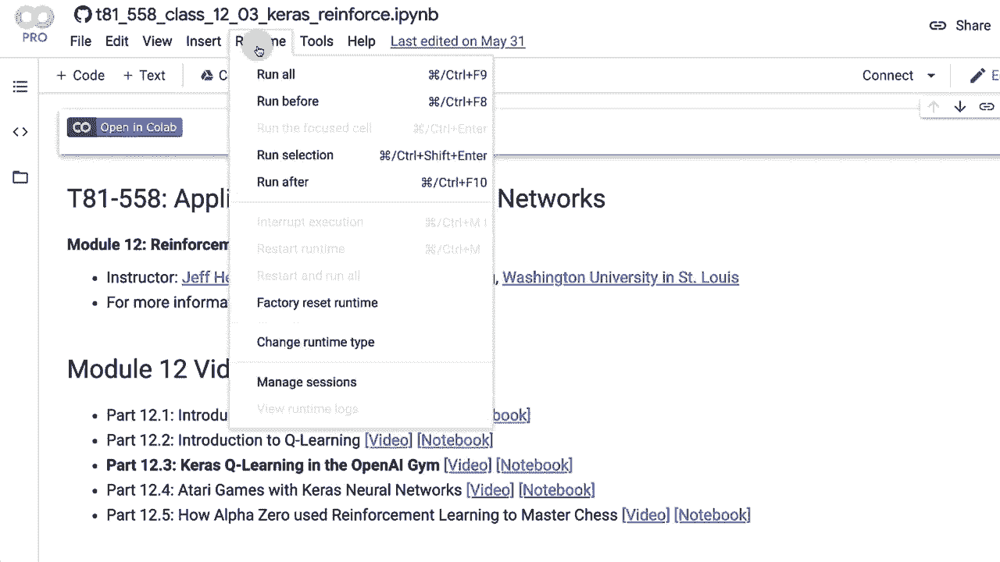

# T81-558 ｜ 深度神经网络应用-全案例实操系列(2021最新·完整版) - P64：L12.3- OpenAI Gym中的Keras Q-Learning 

嗨，我是杰夫·希顿，欢迎来到华盛顿大学的深度神经网络应用。在这一部分，我们将研究如何使用深度Q神经网络。所以这是一个深度强化神经网络，它允许计算机学习玩游戏。我们将从一个相对简单的例子开始，我们将看到使用TF agents的Polcart。

然后在下一部分，我们将其扩展为更复杂的内容。我们将使用一个雅达利游戏。接下来，我们实际上会创建一种金融模拟。所以做一些甚至不是视频游戏的事情。要查看我所有关于Cale神经网络和其他人工智能主题的视频，请点击订阅按钮和旁边的铃铛，选择全部以便收到每个新视频的通知。

现在我们将看看如何使用OpenAI Gym进行Q学习。这次我们将使用汽车。因此，我们将使用TF agents。实际上我们现在正在使用深度神经网络来建立你之前看到的Q表。基本上在Q学习中，你会建立一个表，列出世界上所有可能的状态。

然后是你下一步的预期奖励。现在我将要在Coab中运行这个，因为GPU对这个很有用。我会选择。😊。

运行时和全部运行，因为至少在当前版本下，希望在你运行时有所改善。实际上，使用当前版本2.2的Tensorflow和谷歌Coab中安装的其他一些东西时，会出现错误。

所以你可以看到，这部分程序正在运行，这正好让我得到了我想要的Tensorflow的正确版本。这部分正在进行一些安装，以放入我们需要的各种软件，比如TF agents，其他软件让我可以捕捉正在进行的游戏作为视频，这样我可以在Coab中播放。如果你在自己的电脑上本地运行，可以使用这个，或者你可以省略这部分，它会弹出一个窗口，展示游戏是如何进行的，所以你通常会在这里遇到这个错误，我想向你解释一下，因为这几天才开始发生这种情况，当时谷歌升级了一些东西。

Lb 和 TF 代理也是如此。如果你遇到这个错误，基本上让我再解释一件事，如果你收到这样的错误，这个错误并没有告诉我太多。如果你谷歌一下，他们基本上会说重新安装 proto buff，但实际上这并不是所需的。因此这让我花了大约一个小时，我之所以搞清楚这一点，主要是通过逐一运行这些代码，然后查看哪个代码实际上引发了错误，当我单独运行它时。

我实际上找到了真正发生的错误，基本上是说由于我安装了上面所有的包，我需要重启我的运行环境，而我现在正这样做。现在我基本上可以执行一个运行并全部运行，它将顺利完成。

这是一个小小的技巧，如果你没有遇到错误，你可能不需要这样做，不用担心。自从我录制这个视频以来，他们已经修复了这个问题。现在在运行时，这需要一些时间。并且请注意，即使我重启了环境，它也显示“已经是最新版本”，这是我上次安装的版本。

所以如果我离开这个环境几个小时，Coab 会超时并带走我的环境，那么我就得从头开始重新运行它。但即使我重启了环境，我通过安装这些包对硬盘的更改仍然保持不变。这就是它的工作原理。现在这应该已经通过之前出错的部分了。

我当然希望在 Google Coab 和 Tensorflow 之间，他们经常让我回到起点。但这也是我制作这些视频的部分原因，展示给你们看这些东西是如何一起工作的。相信我，机器学习以光速变化，我一周前有效的代码可能现在还有效，也可能已经无效了。因此，这就是为什么你总是要检查我的 Github 仓库以获取这些内容的最新版本。

所以当我们逐步讲解我即将说明的这些代码时，它是训练的。这一切已经完全完成了。所以我将让你继续进行训练并运行，同时我解释一下这里发生了什么。这些都是你需要的导入内容。你只需使用这些即可。

这些是超参数。其中一些很重要，而有些则不那么重要。迭代次数是非常重要的。这是你将训练多长时间。在这个情况下，你实际上并没有使用提前停止，你只是选择迭代的次数。

我并没有设置这个以便它可以重启，这可能是一个非常好的改进，因为如果你在做一些非常复杂的事情，你可能会训练 20000 次，然后意识到我想再训练 20000 次。这是非常重要的，这将决定你项目的成功或失败，你需要足够的迭代。我收集步骤。这并不是那么重要。

至少我没有发现这个问题。这是你运行多少次回合以获取一些初始数据。用于训练神经网络的每次迭代的收集步骤。实际上这非常重要。对于像这样的简单模型，我设置为1，但你可能想在Atari上设置这个。我想我把它设置为大约10。训练时间会长得多，但你会得到更好的结果。

通常情况下，每次迭代的收集步骤和迭代次数本身是增加这些的唯一缺点，这会使训练时间变得很长。我通常会把它设置在1到10之间，不会设置得太高。

这是你的缓冲区大小。因此，基本上它是通过回合运行，并存储每局游戏的信息。最初在开始之前填充10个。这实际上是你愿意在这里存储的步骤数量。

这是批处理大小，这在机器学习中相当典型。你可能会发现稍微小一点的大小能获得更好的结果。你的学习率非常关键。我通常会将大部分调优时间用于调整学习率、每次迭代的收集数量和迭代次数。

基本上，你希望这个数字尽可能大。如果设置得太大，它会很快变得不稳定，负十次方的值对这个来说工作得相当好，但如果你发现它不稳定，可以改为负四、负五，依此类推。但如果你设置得像负三或负二，可能就无法达到，不过在那个范围内，它会训练得更快，并且需要的迭代次数更少。

这是我们希望日志报告的频率，这不会对你的训练产生太大影响，但它可以让你了解发生了什么。评估回合的数量也就是你希望基于多少个完整游戏回合进行评估，1个是个不错的数字，然后你希望多频繁进行评估，别设置得太低，因为这确实需要时间。

进行这些评估时，我们会看到在 Atari 游戏中，我让它进行得更远一些再进行评估，以保持效率。我们将要使用的环境是 cartpole，它基本上是在试图移动一个平衡杆的手推车，你不希望杆子倒下，所以基本上是要计算重力和角动量。我喜欢这里的代码，这让你能够渲染环境的样子，这是一种很好的可视化方式。这里是手推车，这里是杆子，杆子通过铰链连接到手推车，我打印出一些基本数据，因此你可以看到观察到的值基本上有四个，分别是手推车的速度、杆子的角度、杆子的角速度，以及杆子的位置，这样组合起来就是第四个观察值。奖励非常简单，只是一个基于如何的数字值。

你保持杆子直立的时间越长，这就描述了保持的值。让我们看看。我会提到这一点。你会看到我们处理 T F pi 环境和 T F Tensorflow 环境。有两种环境类型可以处理。通常你在处理 Python 环境，但 Tensorflow 环境完全是用 Tensorflow 编写的。

这意味着你可以将其与神经网络的整个执行树一起编译，它们会变得非常高效。然而，通常情况下，至少在这个例子中，Atari 游戏都是用 Python 编写的。或者至少是用其他非 Tensorflow 的语言编写的。所以我们几乎必须使用 Python 环境。我发现自己通常是在使用 Python 环境。

我并没有频繁使用 Tensorflow 环境。我敢打赌你会更快。😊。请访问这里。虽然有时候我更喜欢直接投入计算，因为我编程的越多与 Tensorflow 相关，如果我想尝试其他东西，比如 pytorch 并进行替换，就会有更多与特定平台相关的遗留代码。

在 Python 中操作让我保持相对中立。所以在这里有一些设计考虑，代理。我们将使用 DQN 来处理这个。DQN 在你的动作空间是布尔值或离散时表现很好。在这种情况下，你要么朝一个方向施加力，要么朝另一个方向，左或右。真或假。这不是施加多少力。如果你确实需要一个连续或数值的动作空间。

然后我推荐DDPG。抱歉，DDPG。这是我们将在模块的第五部分看到的内容，而不是下一部分。因为这让我们拥有连续的动作空间，而对于我正在运行的金融模拟，我希望是连续的，能够告诉我应该将收入的多少百分比投资于某个特定方向。因此，我们创建的代理的Q网络是基础的深度神经网络，然后我们将Q网络放入DQN网络。大部分代码供你自行使用。

你可以直接以这种形式使用它，因为它会根据环境所说的动作和观察空间进行调整。这些策略在代理内部使用，以确定你接下来要做什么。我们将在这里使用随机策略，以便能够填充那个初始缓冲区，以便神经网络可以开始训练。度量和评估方面，我喜欢计算平均回报，这来自TF代理示例，但这。

基本上是查看从每个episode中获得的奖励回报并进行求和。因此，这实际上是一个函数，整个拼车示例来自TF代理示例，然后我将其扩展以在下一部分中玩Atari游戏，但基本上只是查看在10个episode中他们的平均回报。我发现这是一种很好的衡量方式，因为代理操作的世界是随机的，所以每个episode的运行不会相同，并且随着这些随机性得到的平均值让你了解它的表现如何。你可以看到这里的注释，它在TF代理示例中，TF代理确实有一些内置的度量供你使用，我绝对鼓励你查看这些。我们计算随机策略的平均回报，仅仅是为了显示它有效的重放。

Buffer，这非常重要，基本上你是在通过这一切训练一个神经网络，这让你能够存储你正在训练神经网络的数据。因为神经网络的实际工作方式是你有一个状态，而在传统的强化学习中，每种状态的所有可能性都可以导致某个动作，我们只是为每个这些动作训练神经网络，以预测Q值和可能的奖励。因此，你将状态输入神经网络，它会返回所有动作的奖励。现在，这里是使用一个表格，所以表格的问题是你必须为每一个可能的状态都有一行，然后查找找到它。现在使用神经网络时，状态输入到输入神经元，然后神经网络通过神经网络的“魔法”为你预测你应该采取的动作，因此它给出所有可能的Q值。

而估计Q值最高的动作，你将选择那个动作。通常作为你要选择的行动。现在神经网络需要被训练。这就是重放缓冲区的作用，当你经历多个回合时。你将所有这些状态放入这里，看看你的奖励实际上是什么，这就成为重放缓冲区。

训练数据，因为你实际上会看到神经网络所做的奖励，这会添加额外的行。因此，神经网络帮助你达到某个状态。但接下来那个状态，你让神经网络告诉你该怎么做。但奖励是你根据那个奖励训练神经网络，以便它可以预测下一步应该采取什么。所以它不断获得这种强化，神经网络帮助你在游戏中逐渐达到这些状态，但你实际上是从视频游戏中馈送奖励。

得分还是被击杀，这些都要考虑到那些Q值中。这就是你教神经网络做的事情，因为这比使用表格更有效。你无法为每一种可能的组合创建一个表格。神经网络学习概括这个理论上的巨大高维表格，并基本上为你预测那些Q值。数据收集。这就是你生成那1000步的地方，以便获取一组随机数据。这就是我们基本上所做的。

我们有一个收集步骤，这是由主函数调用的，收集数据。这是直接来自示例和TF代理的。我们所做的就是计算时间步。我们希望预测多远，我们在那个时间步采取行动，然后我们获取所有数据，这些数据用于从那个步骤到达下一个动作的轨迹，并将其添加到训练批次中。

这就是我们如何逐步构建这些行，神经网络实际上是在学习训练，然后我们按照请求的步数进行处理。这实际上是我在TF代理代码中发现的一个bug，我就这样留着它，但他们确实在上面有一个超参数，允许你指定步数，而在这里却忽略它，仅做100。我实际上在下一个Atari示例中修复了这个问题，因为这很重要。然后我们将其转换为数据集，我们基本上准备好了。现在我们在训练代理，我早些时候启动了这个，并且幸运的是它完成了，这很好。我们基本上在这里经历一个循环，设置我们希望经过的迭代次数，所以从上面是20000，这是逐步构建我们拥有的数据集，以便我们继续根据实际看到的奖励训练神经网络。如果我们达到想要的日志间隔，那么我们就继续。

并打印出一些进度信息。如果我们达到了评估间隔，那么我们使用我之前给你展示的平均回报函数进行评估。在这里，你可以看到随着训练，平均回报趋向于不断增加。我认为最大可以达到200。现在，为了看到它实际运行，我们有视频代码。

我们之前见过这个。所以它逐渐增加，几乎达到最大值后停止。如果你想看到它实际运作，可以发现它在平衡那个杆子，做得相当不错，同时又在视野中移动。这比看起来要难得多。如果你尝试用随机方法运行，它会很快失效。

一旦重心消失，它就会停止，因为它会下落。没有理由继续。好的，这就是Q学习的基本介绍。😊。

感谢观看我的视频，接下来的部分我们将看看如何将相同的技术应用于一款Atari游戏。如果你对这类内容感兴趣，请订阅我的频道，非常感谢。
