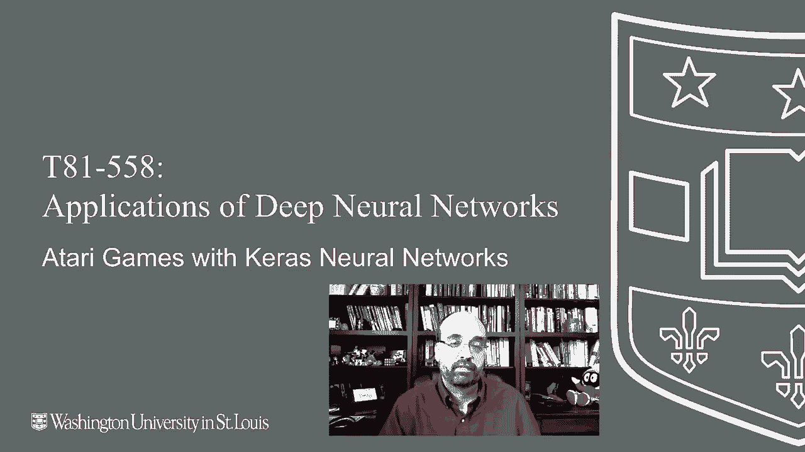
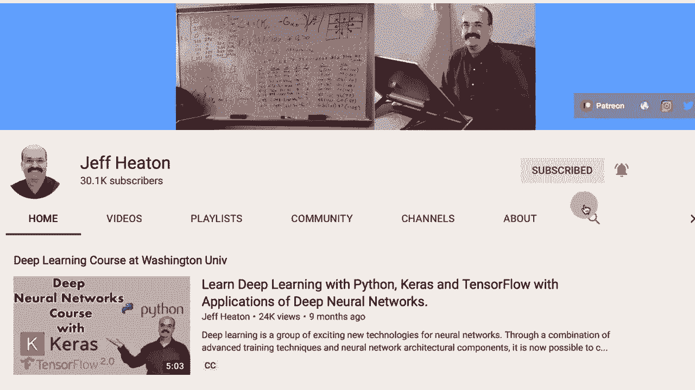
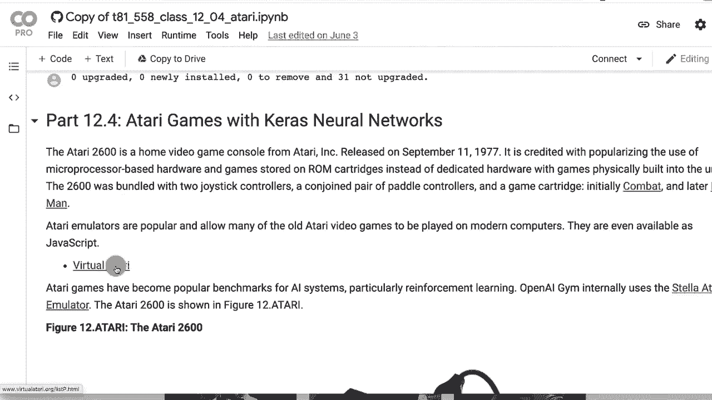
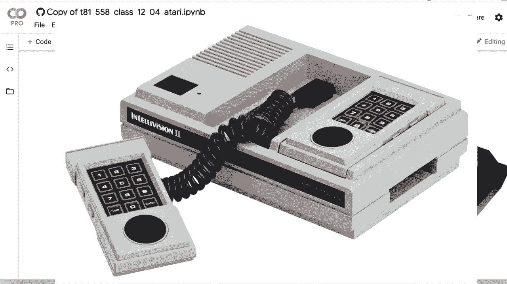
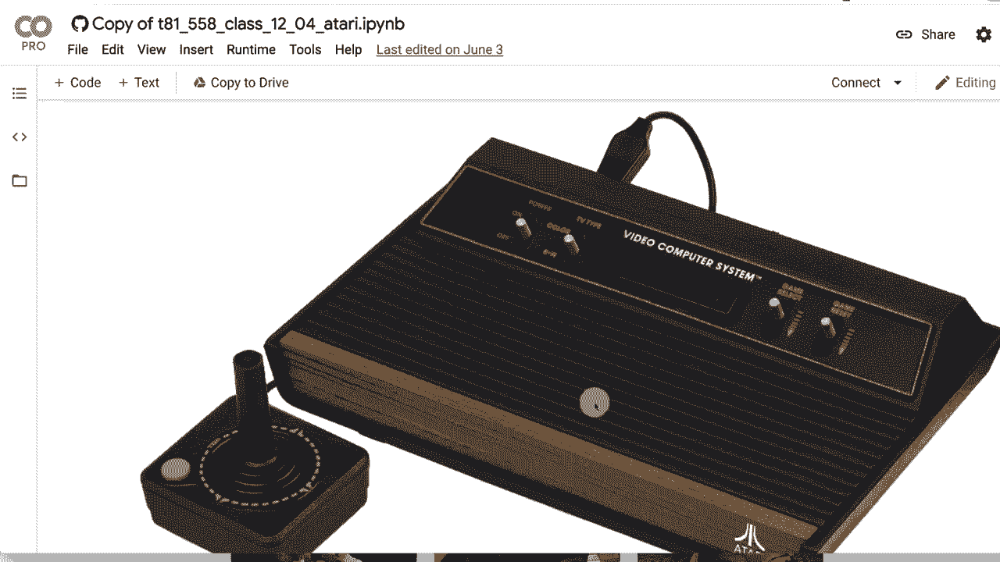
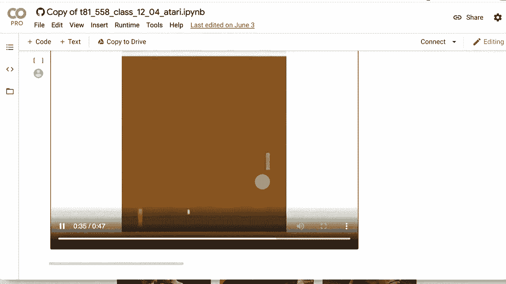
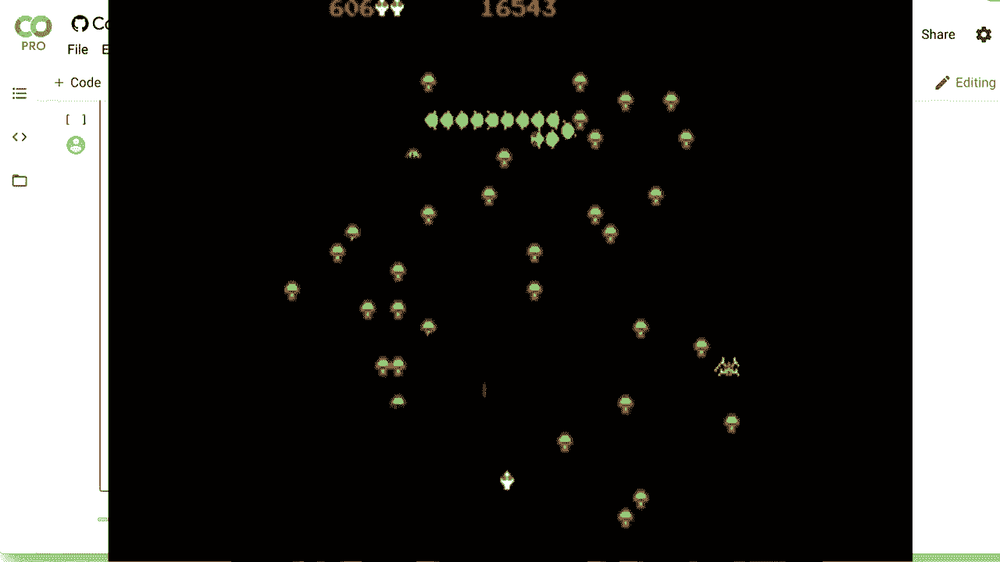

# T81-558 ｜ 深度神经网络应用-全案例实操系列(2021最新·完整版) - P65：L12.4- 使用Keras TF- Agents的Atari游戏 

嗨，我是Jeff Heaton。欢迎来到华盛顿大学的深度神经网络应用课程。在这个视频中，我们将继续学习深度强化学习，我们将看到如何将基于TF agents的程序应用于Atari。我们将看看如何玩pong游戏。然而。

相同的技术几乎可以用于任何Atari游戏。接下来，我们将看看一些不是游戏的内容，以及如何将深度强化学习应用于金融模拟。要查看我关于Cale神经网络和其他人工智能主题的所有视频，请点击订阅按钮和旁边的铃铛，并选择所有以便接收每个新视频的通知。

所以让我们看看深度强化学习的一个最常见用途。至少是大多数人会接触的例子，即使他们不实际将其应用于自己的问题。这就是Atari游戏。现在，在下一个模块中，我将向你展示如何将其实际调整为你自己设计的问题。😊

并将创建一些在强化学习中不是开放AI的东西。但现在，让我们做一个必要的Atari示例。现在我几乎是从零开始构建大部分内容，市面上没有很多TF agent的Atari游戏示例。所以我花了相当多的时间来使其正常工作，去打开这个在Google CoLab上，因为我想使用GPU，所以要非常小心。

如果不使用GPU，速度会非常慢。现在我建议你进行全部运行，因为这里有很多代码，你可能会遇到错误。希望在你观看这个视频时他们能解决这个问题，但在当时你基本上会在安装所有必要软件的部分遇到错误，我会随着情况变化更新这个内容，因为机器学习的内容不断变化，然后一旦你下到这里尝试做所有操作。

这些导入，如果你在这个导入块中遇到错误，进行运行时重启，然后再次运行所有代码。重新启动运行时不会删除之前的安装。基本上，出现该错误的原因是，一旦你安装了TF agents，它会更新你电脑上安装的协议缓冲区版本，而Tensorflow本身需要重新启动Python环境，否则会在那时出现错误。

希望随着时间的推移，Google Coab。我真的希望他们能默认安装**Tf agents**。我想他们会的，这是谷歌的产品，只是一个相对较新的产品。那么让我们谈谈如何做到这一点。我们仍将使用DQN深度Q学习网络。这一切都是基于虚拟**Atari**，这是一个完全不相关的机器学习项目。

这只是一个模拟器，你可以玩旧的**Atari 2600**。

游戏现在我有点老了，但这其实在我的时代之前。这是2600s。这就是**Atari 2600**，在我年轻的时候出现。但这是当时的老游戏系统。我曾经在这个系统上玩过**Pac-Man**，那真的很有趣。我更喜欢大约在这个时期推出的另一个系统，叫做**Intellivision**，它比**Atari 2600**晚一点。

当然，我绝对真爱的就是**Commodore 64**。所以这是**Atari 2600**的规格。它并不是一台先进的机器。你的游戏场分辨率是40乘192像素。现在，他们通过一些创造性的编码来扩展这个分辨率，但你基本上可以将其直接输入到卷积神经网络中。

**Atari**中的内存量并不大。所以它是以千字节为单位进行测量的。

实际上，这并不是兆字节，我想它甚至小于一个千字节，因此你可以将游戏运行的活动内存推送到卷积神经网络中，160乘192是我认为你通常处理的分辨率，但你实际上可以查看游戏的即时内存，并将其用于状态空间，里面有很多信息，代理可以学习作弊，因为有些内存可能被对手的动作占用，所以计算机控制的NPC在游戏中。所以我们做所有的导入超参数，我调优了很多以适应**Pong**，还对**Breakout**和**Space Invaders**做了一些实验，你必须调整这些值以使它们适应你要进行的任何游戏的迭代次数。

这里几乎处理了25万个样本。所以我通常会整夜运行这个程序。训练需要一段时间，即使使用GPU。我每次迭代也进行10次收集步骤。重放缓冲区大小没有太大差别，但这个学习率，这个10的值和迭代次数，这些是我真正调优以期获得更好结果的参数。

我没有调整神经网络的形状，这也可以帮助你。调整不同的超参数确实需要很多时间，不仅仅是你的时间，还有计算时间。所以在Atari环境中，我们使用乒乓球，你可以看到我在这里玩的一些其他游戏。乒乓球相对简单，基本上是两个球拍在相互弹球。

现在，乒乓球是在我之前的时代。我从来没有真正玩过乒乓球。那应该是1970年代，稍早于我进入电子游戏的时期，我是在80年代中期开始接触这些东西的。所以帧跳过率，你不会查看Atari中每一帧的画面。这只是为了让计算时间变得合理，如果你处理每一帧，处理时间会非常长。TF agents提供了一个包装器来加载Atari游戏，我绝对推荐你这样做，因为它内置了一些必要或不必要的预处理。

但这确实有助于你的神经网络快速学习，因为问题在于，颜色信息真的能告诉你很多吗？这是一个将上下移动的面板，电脑NPC，顺便说一下是电脑控制的玩家。

NPC是非玩家角色，我想我从MMOG中得到了这个，OOGs这是对手的分数。这是你的分数，严格来说，神经网络在查看一切。我不知道它是否从分数中获得了很多，但这也可能是它使用的东西，可能在看到自己输的时候更努力。

我不知道我在开玩笑，它可能不会，它可能会学习到那些分数其实并不重要。所以我们加载了Atari环境，我们使用一个单独的环境进行训练和评估，这样如果你在那里面运行一个评估步骤，就不会改变训练的状态，这可能会让人困惑。

哦，这就像几乎有一次酒精失忆一样。你会跳过时间，但你不知道发生了什么。可能这不是一个很好的例子。但对我来说，这是一个视觉化的方式。现在，代理，这个我从TF agent的示例中得来的。这只是一个围绕正常代理的包装器。你可以看到我们在划分每个状态值。

但通过255。你在做的基本上是将0到255的RGB值转换为0到1之间的浮点值，神经网络对这个处理得更好。大多数示例都是这样做的。我通常在处理图像数据时这样做。不要将0到255的值输入卷积神经网络。

它可以应对得很好，但它确实更喜欢那些较小的值。这些信息很重要。这些实际上是超参数。我没有对这些进行太多调优。我只是取了示例值。但这里是完全连接层。所以这些是稠密层。

大多数卷积神经网络在最后都有稠密层。所以我们只有一层512。你可以添加多个层，如果你愿意。然后是卷积层。这里的通道数是32，以步幅4扫描8x8。这是基本的卷积信息。然后有几个这样的层。

我并没有真正提供一种方式来放置最大池化层，至少我没有看到，但这相对有效。我没有对其进行太多调优，实际上根本没有。然后你构建我们上面提到的 Atari Q 网络。这是神经网络的封装器。我有更多的文本描述我做了什么，因为这个示例我确实是从头开始构建的，除了我找到的 Q 网络封装器。我们将使用 RMS prop 优化器。

学习率和其他参数在这里非常重要。这些是你需要调优的超参数。我们使用全局步骤，以便我们有一个计数器来记录训练进展。在这里我们创建 DQN 代理。DQN 在你拥有时表现良好。

动作空间或离散动作空间，其中有单独的值，而不是一些连续的数值范围。在下一部分，下一个视频中，我们将看到如何处理连续范围的动作空间。你使用与 DQN 神经网络非常接近的一个变种。我使用的评估方式与 TF 代理中获得的相同。这是一个我复制的函数，基本上它的作用是进行10步评估，并计算10步的平均奖励。

Atari 游戏是随机的。它们有随机数。同样的策略在连续两局游戏中不一定有效。但他们认为如果你玩超过10局游戏，那将会是一个合理的重放缓冲区。我们使用的几乎是与我在其他 Tensorflow T 代理示例中使用的相同类型的重放缓冲区。在 Atari 中，你不需要做任何特别疯狂的事情，我使用的正是我在几个示例中用过的随机集合代码。

到目前为止的示例，以及我从 TF 代理示例中获得的代码，对于这个非常有效。这正是我在之前示例中使用的训练代理代码。在这里真的没有什么需要改变的。它是相当基础的。进行一些初始设置，然后我们将循环遍历迭代次数，这就是每次迭代的步骤。

所以将这个设置为10。每次迭代，我们将收集10步，并利用这些数据训练神经网络，以构建我们随机采样的数据，这里你可以看到它正在努力训练，现在是负20，负21。

我觉得这其实是你可能做得最糟糕的，如果你在乒乓球上表现不好，什么都没击中，就像冲锋队员一样。你根本没能把球送过去，反而是对方把球直接打回给你。

所以当我学习并在这个过程中时，我非常沮丧，无论我尝试什么，我的得分总是像负21一样，一直往下。四个小时后，还是负21。但当我开始调整一些东西时，我能够使这个表现显著改善，你可以看到这是一次不错的训练。我对此相当满意，它得分超过了零，你可以做得比这好多了。

这是我这里的一个相当平均的运行，我会给你展示我的表现。它得分，表现比随机代理好得多，但如果你想花很多时间优化超参数和进行可视化，你可以肯定地进行更好的调整。你可以看到不错的向上进展，可能更多的迭代会对我有帮助，然后你可以看到这里的视频，我让它播放，它不错但不算优秀。哦，我得了一分。

得分2，我领先，尽管我落后。所以它表现得不错。我从未真正深入玩过乒乓球，所以我不知道我会特别做得怎么样，但整体上肯定是输的。不过如果你尝试随机代理，哦，它正在追上，这太棒了，我领先了吗？是的。

所以这是。它绝对有一些技巧。它确实从这个游戏中学到了一些东西，并且现在领先。所以我不想看我录制的整整三分钟。谁知道呢？也许它真的会变得更好。但让我们看看随机代理，你会发现我花了一些时间优化的强化学习确实让它有所不同。我是说，它被击倒了。它得了一分。我是说，坏钟也一天对两次，对吧。

所以这就是游戏，它并没有花费太多时间。那是一个很好的例子。比如，在游戏结束之前，它能玩多久。我是说，当我在80年代去游戏厅时，我的2美元能用多少个季度，我妈妈给我的。

通常大约5分钟，我从来不太擅长视频游戏。真的很喜欢蜈蚣。这可能是我最喜欢的，龙之层可能是最糟糕的。你必须花，我认为，整整一美元，但我会在一分钟内就被杀掉。

感谢观看我的视频，接下来我们将探讨如何通过财务模拟做同样的事情。如果你觉得这类内容有趣，请订阅我的频道。非常感谢。
