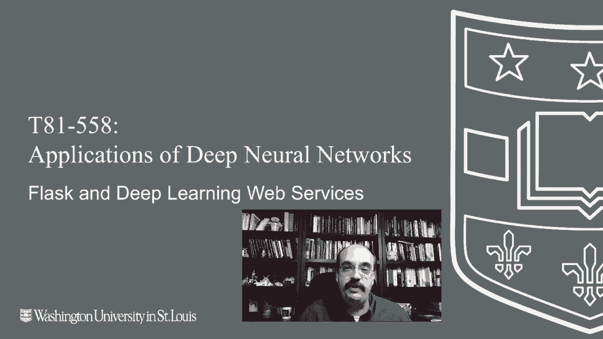
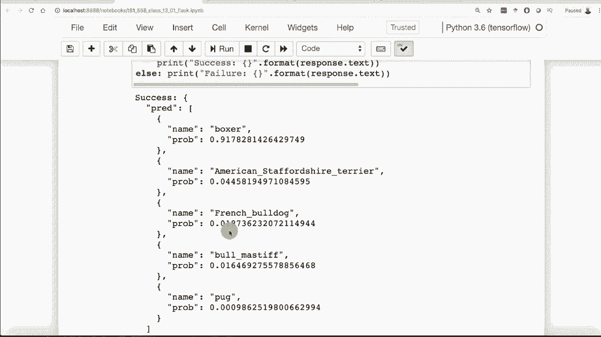

# T81-558 ｜ 深度神经网络应用-全案例实操系列(2021最新·完整版) - P67：L13.1- Flask与深度学习Keras／TensorFlow Web服务搭建 

嗨，我是Jeff Heaton，欢迎来到华盛顿大学的深度神经网络应用课程。在这个视频中，我们将看到如何使用Python中的Flask，这将允许你将用Keras创建的Psyit学习模型或神经网络部署到你自己的Web服务器，甚至是云端，获取我AI课程和项目的最新信息。

点击旁边的铃铛订阅，以便在每个新视频发布时收到通知。现在，Flask是那些在Jupyter Notebook中工作得不是特别好的东西，也不太适合Google Colab，因为Google Colab是基于Jupyter Notebook的。通常，你会通过命令提示符或类似的方式运行这些Flask应用。

这就是我们要做的案例。我将向你展示Flask的一个应用，我们实际上会在浏览器中运行它，但Flask的设计是为了接收浏览器的请求，而不是从浏览器中运行。所以Flask是一个Web服务器。基本上，它让你将Python应用程序转化为Web服务应用程序。在这个案例中，我们将创建一个API端点。所以应用程序编程接口API，我们将接收来自其他位置的请求。

这些可以是其他程序，也可以是网站本身。不论如何，你将获得一个HTTP请求。😊。

HTTP请求将会进来，你将用神经网络来处理它，并返回结果。现在，这展示了如何在Flask中做到这一点。Flask是一个开发平台，这意味着它并不真正适合生产环境。尽管如此，很多人确实在生产中使用Flask，但这并不是它的初衷。还有一个叫gunicorn的东西。

这是更适合生产环境的版本。所以如果你真的打算以某种方式部署它，我建议使用gunicorn，因为它能够很好地处理多个并发请求。所以如果你需要同时运行两个神经网络，因为你有两个不同客户的请求进来，你就不想等一个结束后再处理另一个，这样会因为Python固有的全局解释器锁而导致延迟。

如果你想阅读关于Flask快速入门的内容，我这里有一个链接。虽然这个并不是针对神经网络的。这是我们的第一个Flask应用。我将从Jupyter中运行它。这通常不是一个好主意，但它是一个很好的例子。如果我是一些疯狂的互联网频道，我可能会让事情失控。

我会说不要在家里尝试这个。但这样做你不会失去手指。我保证你创建一个新的 Flask 实例。这很重要。这意味着它将服务于 URL 的根。它将从本地主机运行。因此，如果你在生产环境中运行这个。

你可能有 W Wheton research co 或者你的名字。不管怎样，它应该在 80 而不是 9000 上运行。尽管通常你会将这些部署为 Docker 镜像。因此，通常你会在 9000 上继续，然后在运行时将其映射到你想要的实际端口。它将在这里运行。那么我们就运行它吧。现在注意小星星正在转动。

我可能应该等它完成。好吧，这会是个漫长的等待。它正坐在那里等待我们的连接。因此，这就是它不适合 Jupyter 笔记本的原因之一。我不能执行全部运行，只运行这里的所有单元，因为它会卡住并停在那里。

当你完成它后，只需点击框并停止。但我们继续看看实际运行的网络服务器。这里实际上是从这个标签发送了一个 HP 请求到那个标签，并得到了返回的结果。现在我们将看看如何将其实际部署到云端。

我真的可以将其作为可扩展的网络服务访问。但现在它仅在我的本地实例上运行。你可以看到日志正在进入。它只是说一个获取请求来了。除非你放了一个，我通常会在这里放一个收藏图标，以便浏览器不再烦我。但对于一个网络服务来说，这其实并不是必需的，因为在这一部分。

我们不会看到任何 Gi。稍后我们将创建一个网络应用程序，并反应来实际访问这个。但现在，这只是 API 端点。我们继续停止这个。现在我们将运行之前创建的每加仑多少英里的神经网络。我们将训练一个，将其保存到二进制文件 H5 文件中，然后加载它，我们将创建一个期望输入这样的 Flask 应用程序。

你提供气缸数量、排量和马力。它将预测那辆车的每加仑多少英里。现在，我将展示如何通过几种不同的方式访问这个网络服务。我们将看到如何在纯 Python 中访问它。

我们将看看如何从一个非常强大的工具 Postman 中访问它。让我直接复制并粘贴它，然后发送到网络服务。首先，让我们看看这个网络服务实际上是什么样子。现在，这是训练。通常你不会在网络服务中训练神经网络。永远不要说永远。

这是会有应用的，但通常你会在某个地方训练神经网络。然后将训练好的神经网络保存为H5文件或稍后协议缓冲区。我们也会看到这一点，实际上将其部署到云端或其他地方。这里你可以在Jupyter notebook中进行训练，没问题。这就像我们之前看到的。我实际上有autompg文件。

我们将加载它。我们将训练它。我们将训练它。我们处理马力中的缺失值。这一切只是训练。所以让我们继续训练。现在，如果你忘记停止上面的网络服务器。那将是一个无尽的星星，它训练完就结束了。所以我们现在基本上需要保存它。

这在这里完成。好吧，让我们做一个合理性检查，确保均方根误差在我们预期范围内，而我看到的并不好。3大约是你通常在这个上面得到的，但我不在乎，目标实际上是测试部署。

所以我们要把它保存到一个H5文件，放在我有的DNA文件夹里。那里保存了所有临时神经网络。不保存到tub里，所以你在那里不会看到任何东西。但这就是你放置所有神经网络的地方，至少在我的课程中是这样。

所以文件在那里。这也相当方便。所以我们将发帖并回到这里。我们将把这个发送到网络应用程序。那么，如果他们在这里放入一些不是数据集一部分的东西，比如车的颜色，那又怎样呢？车的颜色和每加仑多少英里无关，或者他们忘记告诉你一些非常重要的事情，比如重量。这些都是错误。还有如果重量超出这个范围会发生什么呢？

如果你给它一辆重50000的车，但它表现不佳怎么办？所以我们在这里进行数据的快速分析。让我运行一下。你看看它会产生什么。看看这个。这是一个不错的Python，还有这些字段的Json Matt。所以我们知道我们需要每一个字段。

这些是训练数据中的最小值和最大值。你不想超出训练数据集的大小。神经网络对此不太好。所以如果你给它一个气缸，它会变得全多项式化。你知道多项式在超出范围时是什么样子。它们很快就会变成正无穷和负无穷，取决于多项式。

神经网络做的事情很相似。所以你需要在神经网络的范围之外小心。这，我也用来测试它。所以让我们继续运行这个看看结果。所以这是我们将要测试的车。这就是我们的输出结果。我们希望能够通过网络应用程序得到相同的值。

我们将从命令提示符启动Web应用程序。但这就是它的样子。所以在这里是😊，预期的值。这是我们在源代码中生成的小地图。请注意，这里是路线。我们不把这个放在根目录。稍后，当我们创建一个完整的Web应用程序而不仅仅是API端点时。

我们将有几个这样的端点。一些将是Gi，一些将是后端API。这是计算每加仑多少英里。所以我们现在需要处理Json。Json本质上是JavaScript对象表示法。Python真正酷的地方在于它几乎使用与Json相同的语法。这基本上就是上面的Json。处理Json时唯一需要注意的是。

你不能在这里放单引号，Json要求使用双引号。因此，你可以在Python中创建地图和列表，本质上是JavaScript对象表示法，但这不是有效的Json。如果你使用单引号，我们加载模型。切勿在这里训练你的模型。这可能会花费太长时间。我的意思是，你不想在每次Web应用程序启动时重新训练模型。首先，神经网络是随机的。

每次你可能会得到不同的结果。这让你的客户困惑。为什么我每次得到的每加仑多少英里都不一样？哦，是的，我们一定是重启了服务器。不，不要这样做。相信我，我曾在寿险行业工作。我们的客户对此答案不会满意。现在。

当我们在API每加仑的请求中收到请求时，我通常把所有端点放在API下，并且我们只接受POST。我从中获取这个Json。我会保持一个错误列表，希望它能保持为空。但是现在我将逐个检查我在这里构建的预期地图，确保没有超出范围。

我还会寻找意外字段错误，如果缺少一个，我也会追踪这个。相信我。在你作为数据科学家或AI工程师部署这些应用程序时，尤其是在全球公司工作时，你会收到24小时的请求。你将会有IT专业人员，他们对数据科学或机器学习的了解不如你，接收请求。

如果你的程序因为某些客户发送的坏数字而崩溃，他们会打电话给你或打电话给你团队中的其他人。良好的错误信息是对抗深夜呼叫和手机电话的最佳解药。相信我，我在职业生涯中接到过许多这样的电话。

如果处理当晚生产支持的人在第30行看到越界的Ray，Python就会崩溃。他们会打电话给你，如果这是那些不喜欢Python、认为JS主宰世界的人，他们会特别尖刻。所以你会接到电话，你必须去调试它。

另一方面，如果你的程序产生了这个好的错误，提示说未定义字段，b bla blah，他们可以查看传入的Json消息，并进行处理。24小时错误支持的人可以处理这些，相信我，这通常是个好事，他们的时区通常和客户的时区匹配。因此，除非你希望错误传播看起来不专业，否则要尽量避免Python的硬错误，所以你要始终进行检查，这是一种良好的生产实践。

我检查我有多少个错误，如果有错误，我将把它们作为另一个Json消息返回。因此，你总是想在这里放一个ID。我只是放了一个网格。我们稍后看看那是什么样子，但每个事务都需要有一个全局唯一的ID，至少我认为这是个好主意。在这里，我们所做的就是创建一个非常简单的nuy数组，1行7列，这里有七个输入。

这实际上是，代替拥有一个CSV文件，我们是在动态创建这个，并输入所有这些值。所以这是第0行，因为只有一行，所有这些列。我知道这是我训练它们的顺序，这对应于我们在Jupyter笔记本中运行的最后一个示例。我填写所有这些值，调用模型预测，提取每加仑多少英里，并形成我的响应。

这将是I，注意这几乎是json。这是Python对象表示法，非常类似于JavaScript对象表示法。这一切都会被接收，你将把结果发送回用户，或者将其发送到其他机器。现在用户不会看到这个。

这可能会立即被放到一个网页应用程序中。这本质上就是软件即服务。因此现在让我们启动它，并尝试调用它。现在。这是我的Jupyter笔记本终端。我们让它保持运行。我再打开一个，并让它变大。我们有足够的屏幕空间。

所有的Python脚本都在我班级的一个名为Py的目录中。我们将运行MPG服务器。这些其他服务器会随着课程的进展而运行。现在这已经在运行了。你可能会遇到一些像这样的防火墙错误。Windows也会有类似的情况。我在使用Mac。😊 所以这个已经启动并运行。那么让我们用Postman来测试一下。现在。

Postman是一个很棒的小工具。我给你一个截图，基本上显示了你要发送的内容。因此，让我们将其更改为API MPG。你可以按照我在笔记本中的截图正确设置这个。我将移到这里的主体部分。现在我之前将其设置为图像。所以让我们将其设置为原始数据。更改为Json。我们回到这里。

这是我们想要发送的内容。这字面上就是跨网络传输的内容。我们输入这些然后点击发送，注意这个特定汽车的每加仑英里数是23。我们可以把它变成四缸车，看看会有什么变化。它会改变。我们可以做一些不好的事情，比如完全去掉重量。

然后你会得到其中一个错误。缺少值重量。总是给出描述性错误。不要给出微软式的错误，只是一串数字。好吧，现在。神经网络都是关于图像的。所以我必须向你展示如何将其中之一作为图像处理。让我们回到笔记本。我还会向你展示如何仅从Python完成其中之一。

所以我们将使用请求对象，让我们能够进行HP。注意，这就像我在Postman中所做的一样。所以现在我们将程序化地在Postman之外进行操作。现在我可以做无尽的事情。我可以教你如何用PHP做这个。我可以教你如何用Json做各种不同语言的操作。前提是我知道这种语言。

但让我们先运行它，你会看到结果返回是每加仑23英里。就像之前一样。那是我之前告诉你的唯一标识符。那么现在让我们将其作为图像处理。图像稍微复杂一点，但也没多少。所有内容都是相似的。我们将使用图像服务器。我们将字面上通过HTTP发布图像。

这样我们就在网站上接收它。所以在网站上。我确实在这里放入这一部分，这些是它接受的唯一有效格式。其实，我可能还可以把它缩小。我是说，真的，PG、Jpeg和J的格式。现在还有人用gs吗？我把图像的高度放了进去。

现在我们在Jupyter Notebook中训练这个神经网络。这是mobilenet。所以我们使用mobilenet。这是一个我们之前讨论过的预训练神经网络。它是一个非常常见的，只需在谷歌上搜索mobilenet，了解更多信息。它能够识别10种不同的图像。我在这里所做的基本上是启动mobilenet。

我实际上并没有加载一个已保存的神经网络。这实际上是在Kis内部，所以我们不需要训练这个网络。这是迁移学习。它已经为我们准备好了。路由将是API图像。我们将检查确保实际发布了图像。如果没有，我们就会出现错误。这是一个多部分上传。因此，如果你曾经做过HTTP编程。

网页编程时，每当你上传一个文件到一个网络应用程序，这就被称为多部分。这就是它所做的方法。我们使用完全相同的方式。我们确保它是被接受的文件格式之一。这是我们确保名称与我们认为的安全名称匹配的方式。你可以看到一些被注释掉的内容，如果你记录条目，那只是我调试时的情况。这部分相当重要。

这就是我如何将多部分上传桥接到神经网络实际上可以处理的 nuy 缓冲区。 然后我们将其调整为适当的大小，进行抗锯齿剪裁。 这还假设这些图像没有 alpha 通道。 如果你上传一个 alpha 通道，它将出现问题。

我稍后会告诉你如何处理这个问题。 我们会进行预处理，然后进行预测并解码预测结果。 我们将获取第一个项目，第一个名称，并返回一个包含所有预期概率的 Json。

在 Json 中，你会看到消息，稍后会显示，然后我们返回响应。 所以让我们让这个家伙开始运行。 我将退出 MPG 服务器，并运行图像服务器。 和 MPG 服务器一样的操作。 始终对防火墙说是。 除非是病毒在询问你，然后就说不。

问题是很难知道的。所以我们继续。 我将其更改为 API 图像。 我们将使用表单数据。 从我测试时就已经在这里了。 基本上，我使用的是你在 JP 的课堂页面中看到的我的狗的照片，它在图像目录中，我将继续运行这个，确保将其指定为进行多部分上传的文件，我们会点击发送，之前我展示过的预览，它认为他是一只拳击犬。

他是一只英国斗牛犬。 这不是我的神经网络，而是 Mobilenet 的创造者的错。 虽然拳击犬是斗牛犬，但他并不是这些犬种中的任何一种，他绝对不是法国斗牛犬。 他非常反感被误认为是较小的法国斗牛犬。 他是一只纯种的英国斗牛犬，没错，他绝对不是巨型的牛头犬。 所以基本上你就是这样做的。 你也可以用 Python 或任何编程语言发送这个图像请求，正如我所说的，这是相对简单的。

要做到这一点，你将把它发布到图像。这是关键部分，这就是你如何通过 Python 推送一个 JpeEg 并发送它，它被命名为图像，这是关键，因为这是我程序在接收端所期望的标签。所以让我们继续运行这个，类似的操作。因此，这就是你对 API 的介绍，我们将看看如何将这些 API 连接到其他事物，以及如何将它们放入云中以实现高可扩展性。 这个内容经常变化，所以请订阅频道，以保持对本课程和其他人工智能主题的最新了解。

