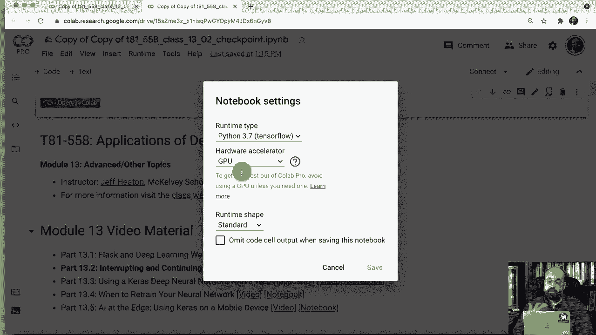

# T81-558 ｜ 深度神经网络应用-全案例实操系列(2021最新·完整版) - P68：L13.2- 在Python TensorFlow Keras中恢复训练和检查点 - ShowMeAI - BV15f4y1w7b8

嗨，我是杰夫·希顿，欢迎来到华盛顿大学的深度神经网络应用。在这个演示中，我将向你展示如何在Kis中进行检查点和继续模型。

🎼所以，我要做的第一件事是为这个课程笔记准备，这只是在我的Github仓库中。我在描述中有一个链接，你可以直接访问它。我将点击打开和collab。现在，当你训练大型复杂模型时，你通常会想要停止并重新开始训练，因为它们可能会持续几天。你不可避免地会被打断，不一定是故意的，但你需要一种继续的方式，这就是我将在本演示中展示的。继续放大一下，现在我们在collab中运行，我会将其复制到我的G驱动器，尽管我并不打算真正使用G驱动器上的实际文件。我会确保运行时类型是GPU，确实如此，即使你会看到我在运行coEpro，我会运行这个介绍性代码，它只是让你入门，这也定义了一个小函数，告诉你某事经过的时间以人类可读的形式。这个代码我。

这里是我在运行更大复杂项目时使用的代码，实际上这个代码基于NviDdia的styleganN2 ADA，他们有一些很好的代码来创建标签逐步递增的输出目录，并且还将标准输出捕获到日志文件中。因此，如果你使用过style GAN2，你之前可能见过一些这个代码，基本上它的工作方式是有这个logger函数，实际上是一个logger类。

这用于包装你的代码，以便任何输出到标准输出的内容也会记录到日志文件中。因此，这是一种方便的低级日志记录方式。如果你想要更高的生产级别，你可能会想使用Python的log或其他可用的库。但我会运行这个以便定义。好的，我们进入下一部分。

这里是我将存储检查点文件的地方。所以我在Kis上放置了一个回调，它将在每个周期结束时等待一定的步骤，实际上，它将保存你的神经网络的完整副本以及训练状态，以便你可以恢复训练，因为如果你不捕获训练状态以及神经网络，那么你的训练恢复将是低效的，想象一下你在大学学期中间，而生活发生了一些事情，你不得不退学，但你会回来，回来时你是想从深造课程的开始开始，还是想从你停止的地方开始，这就像你的训练目标，你的训练目标就像大学，你不想重复那些学期，因为这对你没有任何好处，你的脑海中仍然有所有的知识，就像神经网络一样，所以这就是为什么你想保存训练状态的原因，这就像你在大学的成绩单。

还有神经网络，这是它所学习的智慧，就像成绩单一样。你只会捕获那些课程到学期。因此，学期就像周期，在每个周期结束时，它将保存训练状态和神经网络的状态，你将失去在周期中间发生的任何事情，直到下一个周期。

这有点不同，但基本上就是这样。我将运行这段代码，它将存储在这个数据目录中，这只是一个位置。在我的coabab实例上，重启后它就会消失，但这只是一个示例。你可能会将其移动到其他地方，这只是批量大小。

我们进行的是分类，正在做经典的手写数字分类，因此我们教它对这些手写数字进行分类，有10个数字，所以有10个类别，结果将被保存，这就是我运行的实验的名称001测试训练，这只是一个不断增加的数字，用于将它们区分开，这样你可以快速回到以前的运行，由于我们将训练状态保存在JSON文件中，你将能够查看这些个别运行，这在研究类型的项目中非常有用，因此我们将定义这个名为my model checkpoint的类，这将作为你的检查点，在每个周期结束时调用它，并将存储你的神经网络和训练参数。

我们希望在每个epoC结束时调用这个，我们首先要调用我们所基于的前一个类。那就是模型检查点，由Kiris提供，所以你要确保内置的内容仍然被调用，这实际上保存了你的模型状态。我们要做的额外工作是保存优化器状态，所以我会获取文件路径，以便我知道存储模型的HD5名称，它是以二进制格式存储的，但我希望训练状态与模型同名，只是扩展名不同，将是PKL文件，因为我们要将其序列化，我会打开pickle文件，本质上向pickle文件写入一个字典。

这里面包含了所有信息，所以优化器基本上是我将调用模型正在使用的任何优化器，像是atom或其他形式的梯度提升算法，这就是它的优化方式，随机梯度下降也是另一种可能性。我们必须保存我们所处的epoch，因为我们也将进行学习率衰减，因此随着训练，学习率逐渐下降。你不希望在重新启动训练时改变这个，并且这是存储为pickle文件的。让我们继续运行，这样它就被定义了。这是衰减调度器，这是一个相当标准的衰减调度器，因此这是你的初始学习率1乘以10的负三次方，我们以75%的比例衰减，步长为10，它将逐渐衰减这个速率。

向下呈指数级，我们会继续运行，这样它就被定义了。这是构建模型的代码，这与你在本课程中之前看到的非常相似。这只是一个卷积神经网络。模型格式对这个例子并不重要。我们主要关心的是如何继续训练。

现在我们也要调用这个训练模型。这有点复杂，因为我们可能会恢复训练。我们将传入模型。第一次启动时的初始epoch将始终为零，因为你应该从零开始。然后Max Epos将是你希望训练的程度。所以当你第一次训练时。

我们将训练三个epoch。但你也可以随时中断。计算机可能会断电。狗可能会绊倒你的电源线。任何可能导致你失败的情况。你还可以在AWS上购买现货实例，这比正常的云实例便宜得多。但诀窍是，当有更高支付的客户出现时，亚马逊可以中断你。

所以在生产类型的情况下，这个检查点是非常重要的。所以我们创建检查点。它会有这个名称，因此模型纪元会嵌入其中，还有我们的损失，以便我们跟踪每个的有效性，我们将创建一个学习率计划。

这就是我们的两个回调，检查点和调度程序。我们将像对待其他训练操作那样调用 fit。在最后，我们将对其进行评估并打印出结果。我们还将跟踪这花了多少时间并打印出来，所以让我们运行这些东西，以便它可用。这是我们将实际运行的地方，所以我将继续启动它，因为这需要一点时间，不过不久。

我们将训练三次纪元，这并不算很多。我只是想在这里进行一次初步训练。我可以以某种方式强制中断，但这样做没问题，它在继续，你可以看到我们处于三次纪元中的第一纪元。这对于我们之前的内容来说都是标准操作，只是你现在会看到它在说将模型保存到这里，并且它还在说正在保存优化器。

如果我能拼写优化器，那对 pickle 文件和这两个文件会很好。你会想要这些文件名，并确保你正在运行 GPU 加速，否则这个训练过程会花费相当长的时间。它已经完成了，所以你有这两个文件名，你会想要这些，你会复制它们，这就是你拥有的两个文件。我不知道为什么它会智能地超链接它们，点击时会出现404错误，但如果我们列出目录，你将看到基本上这是它创建的目录。如果我们实际查看那个目录，你会看到所有文件，包括 log Txt 文件，它和你上面的控制台是一样的，这样你就有了记录，还有这些各种检查点，最后三个检查点中，第三个纪元的最后两个是你想要继续的，而顺便提一下，那就是 getconfig。

我们调用正在保存的优化器，这样我们就能继续使用优化器。你基本上可以看到它打印出的内容。现在让我们继续训练。这些名称可能与我之前的不同，所以我复制了它们，让我上去复制最后两个名称，我只是复制粘贴，这样就减少了我犯一些愚蠢错误的可能性。

我将删除这一点，我们将继续定义这两个，现在我们要运行这段代码。你会注意到我有加载模型数据，这正在加载这两个路径。你将这两个路径传递给它，它用一个非常简单的加载模型命令加载模型，然后打开pickle文件并提取其中的周期数量和训练选项。如果你要做更复杂的事情，需要存储的不仅仅是学习率，你会想要在此基础上进行添加。

我所使用的学习率完全由周期驱动。所以只要周期被保存，就可以继续进行。注意我们是如何编译它的，这有点不同。我正在从Aom创建一个新的优化器，因此我可能正在更改在调用构建模型时存在的优化器。

这构建了一个空的未训练模型。所以我在更换优化器，并从我们保存的那些选项中读取其配置。这将产生一些影响，我们稍后会看到。主要是我将不得不重新编译它。所以如果我运行这段代码，确保它正在进行，因为我想这是最后一步。你会注意到，我在这里调用它，训练模型。

我传入的初始周期是我加载的那个，最大周期是6。所以我们保存了一些更多的内容。再说一次，我在这里的编译步骤，是用新的优化器重新编译模型，这可能不是必要的，具体取决于你所使用的优化器，但编译模型并不会删除你的权重。

实际上是定义优化器并构建将要执行的整个图。你可以看到这已经完成。所以注意关键点，周期从四开始，结束于六。注意准确度，开始时是98，所以这是启动时的准确度，而之前的是94%准确度，因此不需要从头开始，你可以看到它实际上是从这里继续的。这就是你如何继续训练，或者也许你决定将神经网络送回进行额外的训练，这就是你该怎么做。谢谢观看这个视频，如果你对人工智能以及这个课程的更多内容感兴趣，请订阅频道。

感谢观看。
