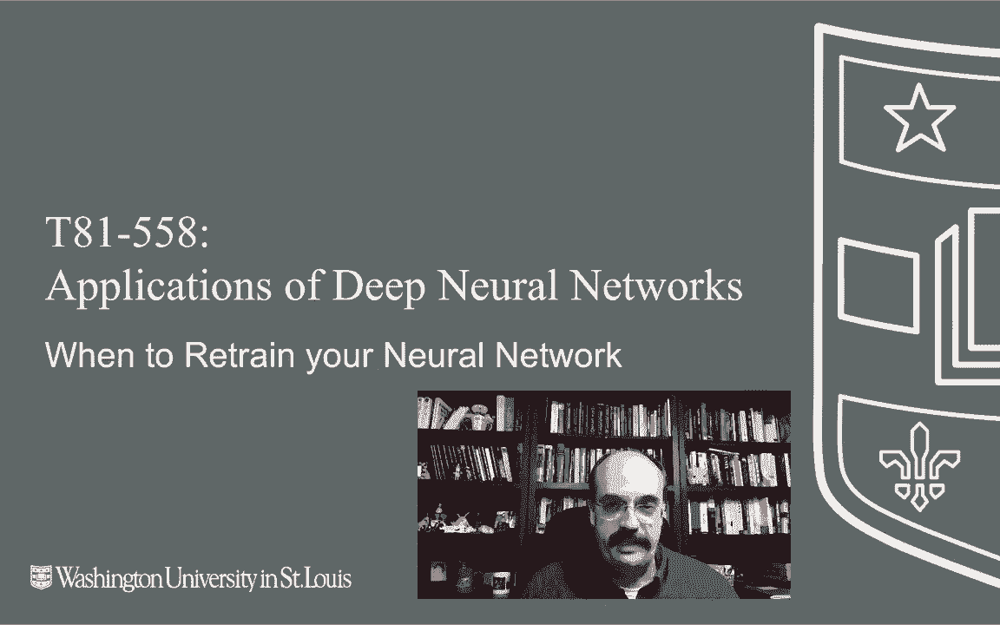
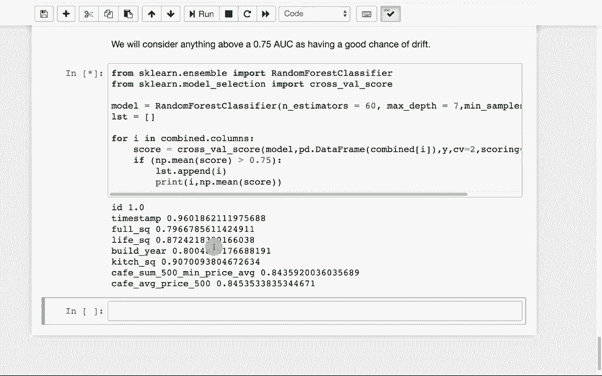

# T81-558 ｜ 深度神经网络应用-全案例实操系列(2021最新·完整版) - P70：L13.4- 何时重新训练您的神经网络 - ShowMeAI - BV15f4y1w7b8

嗨，我是杰夫·希顿。欢迎来到华盛顿大学的深度神经网络应用课程。在这个视频中，我们将看看你已投入生产的神经网络是否仍然高效。

我们将讨论模型漂移以及如何应对它。有关我最新的人工智能课程和项目，请点击铃铛旁的订阅，以便在每个新视频发布时收到通知，继续我们在本模块中关于部署的主题。我们将探讨何时应该重新训练神经网络。现在，如果你仅有像汽车每加仑英里数（Miles per gallon）或Iis等这些样本数据集，下载后进行处理。

😊。

你不会真的知道何时需要重新训练模型。例如，我们曾多次使用的每加仑英里数数据集，其中有关于汽车的统计数据，帮助你确定每加仑的行驶里程。该数据集的大部分数据来自1970年代末和1980年代初。是的，你几乎可以肯定需要使用现代数据来重新训练该模型，但对于该封闭数据集来说。

模型的性能已经达到了极限。问题在于，随着时间的推移，你的数据分布发生了变化，而你试图获得真实分数的新数据是不同的。这是一个非常普遍的问题，你需要在开发将在实际业务中持续应用的模型时处理。我在寿险行业工作，给你举个例子。

例如，我们正在试图确定个人的寿险风险。基本上，这是他们的死亡风险，我们通常称之为死亡率风险。如果这个人就像你提供的输入数据那样，算是比较普通的，不吸烟，身高、体重或体型都在平均范围内，那么你的神经网络会倾向于给出对这个人相对普通的预测。然而，随着健康趋势的变化，平均水平也在不断变化。

死亡率正在改善，越来越多的人倾向于活到老年。老年人的标准仍然与一段时间以来的范围相对一致，但越来越多的人活到这个范围的高端，吸烟率也在下降。所有这些因素随着时间的推移而变化，这影响了所谓的“真实情况”，你的神经网络的预测也随之调整。因此，随着真实情况的变化，你可能需要用更新的数据重新训练你的神经网络。

F年看看你如何确定何时发生这种情况。现在，当你在一个封闭的数据集中看到这一点时。也就是说，在一个你获取数据后再也不会看到新数据的数据集。这在商业中并不是一个现实的情况，尤其是在现实世界中。通常你建立模型是因为你预期会有新数据，如果你不预期有新数据。

那么你为什么要建立这个模型呢？预测封闭数据集是有趣的，但缺乏很多实际应用。现在，只有在你拥有一个明确的测试和训练集时，你才会在封闭数据上使用这些技术。

我们看到的一些数据集，尤其是一些学术数据集。它们定义了你的训练集和测试集的样子。所以你要观察你的训练和测试之间是否发生了任何变化。这通常在KLE中完成。让我们看看这个图表。

这是我给出的一个图表。我给出了来源，它来自于一篇专门研究数据和协方差变化的论文。这些是这种现象的两个名称，虽然有些不同，但绿色的部分是学习到的函数。因此这使用的是一个非常线性的模型。

因此，在这个非常线性的模型中你会有很多偏差，但没关系，真实的函数。所以它真正应该学习的是这个红色的部分。但看看随时间的推移发生了什么。不幸的是，测试样本出现在时间上比蓝色训练样本稍晚。所以你是在蓝点上学习这个函数。但现实是，甚至真实函数在这里的代表性也很少。

你在这里几乎没有任何代表性。因此你将学习这个非常线性的函数。现在这里确实有一些噪声。几乎没有一个点完全符合线性函数。但尽管如此，这仍在尽量最小化你的残差，使得每个点与线之间的距离大致平均，在线上方的点和下方的点之间。但是当你到达这里时。

你会发现这个函数的不同部分。出于某种原因，时间上通常是某个变量你没有捕获或者无法捕获。现在的趋势更多地朝这个方向发展，所以你可能需要收集更多数据，重新调整并使用非线性模型，以便将这种曲率融入模型中，从而获得更多的预测数据。因为如果你看看这条红线现在的走势，谁知道它是否会继续下降。

也许它会重新呈现这个形状。如果是这样，那么我们的第一个模型也许并不算太差。但你可能需要关注这个时间段内新的片段，因为真实情况已经发生了变化。那么我们如何衡量这种漂移呢？我给你提供了一系列不同的技术，但我不会在课程中逐一介绍这些。

但只是给你一个初步的文献综述，这些是一些可能值得关注的文献。这是一篇特别好的论文，尝试查看所有这些内容并总结出它们的共同点。

现在来看这个，因为我在课堂上做一个示例时真的很困难，我们获取训练集，然后收集新数据，考虑用 autompG 数据来做这个，我们可能会进入这个。所以我们将使用 Cagel 数据，分析并看看一些预测变量的分布在训练集和测试集之间如何变化，这在你参加 Cagel 竞赛时成为一个重要考虑因素。

我们将使用 sharebank 俄罗斯住房市场数据集，只是为了向你展示 kgle 实际上是在看你能否预测俄罗斯波动市场中的实际价格波动。如果你查看数据，他们给你提供了很多输入值。

它们在滚动。因此，这些就是分布中的所有列。我们将关注这些列。Hred 总列。所以你要处理的列很多。我总是喜欢查看概述，看看评估是什么。

他们使用 RMSLE RMS 对数误差。这是回归误差。它并不是一个常见的误差。我实际上必须去 Cagel 论坛查找这个。比赛中的链接实际上导致了一个 404 页面未找到。根据 Cagel 的定义，这个 RMSL 对低估的估计的惩罚大于对高估的惩罚。

所以它就像 RMS 更多是对数尺度，然后实际上不会太多处理它，因为我们只是看训练和测试之间的差异。因此，我们甚至不会真正关注目标。对于我将给你的示例来说，这个评估实际上并不重要。现在你必须下载这个数据，因为它来自 Cale。

我不能直接将其构建到课程的 GitHub 中。所以我将运行这个。我已经有我的。

训练和测试已加载。我实际上是直接从我的数学下载目录中提取的。这对我来说是一个临时位置，但它完成了我想做的事情。在这个特定的 kggle 上有很多预处理数据的示例，我做了一个相对基本的预处理。如果它是对象类型，那就意味着它是某种类别。因此，我将用众数或最常见的值填充缺失值。如果是整数或浮点数，我们将用中位数填充。中位数在均值上更好，因为中位数对异常值的敏感性较低。

然后我们将对所有类别进行标记和编码。因此我们并不创建虚拟变量，而是进行标签编码，以便最终得到一个整数值，指明它们的位置。我不会深入讨论为什么实际上选择了这个，但这些是这个特定竞赛中使用的常见编码。

我相信他们回避了虚拟变量，因为维度实在太多了。所以我们将运行这些函数以定义，然后进行数据预处理。我们将丢弃目标，因为此时我们并不想进行预测。接下来，我们将计算称为混沌统计量的东西。现在，当我第一次听到这个时。

我把混沌统计量想象成COS，但这是混沌Ks统计量，它基本上是在查看两个事物之间的分布有多相似。所以让我们做一个合理性检查。如果我仅运行这个，我在问厨房平方英尺与厨房平方英尺之间的混沌统计量是多少。那么它自身之间的混沌统计量是多少。P值必须低于某个阈值。

所以这并不低于0.05，这非常高。这意味着这两个分布之间几乎没有差异。是的，因为它们是相同的。然后这里的统计量。负零数学专业的学生总是喜欢负零，但计算机科学家却有它。所以这是0，两者之间没有差异，P值非常高。

这意味着在这种情况下无法拒绝零假设。现在让我们看看同一列，但我们查看训练集与测试集中的列。现在混沌统计量略有不同，我们的P值非常低，统计量显示它们之间有0.25的差异。因此，厨房平方英尺的分布在训练集和测试集之间有很大不同，这很有趣。

接下来我们要做的基本上是在所有列上运行这个，所以我们将对所有内容运行混沌统计量，只报告P值低于0.05且混沌统计量大于0.1的情况。现在这个统计量在某种程度上与测量单位有关，所以你必须相对于你实际测量的所有其他值来看这些，随着它的运行，如果我缩小字体大小可以看到这效果更好，但阅读起来就困难了，但这表明。

所有列以及那些差异显著的列。接下来，我们要看看如何检测漂移。现在，这是一种我在许多kaggle竞赛中看到的非常有趣的技术。我们要做的就是简单地将训练测试集采样成更小的集合。

我们将这些数据集进行处理，实际上添加一个在这里的另一列，告诉我们它们来自哪里。我们将看看能否拟合一个模型，这里是随机森林，可以在所有数据重新混合后进行预测。

它能否预测某个单独项是来自测试集还是训练集。如果这些值确实是均匀随机采样的，那么训练集和测试集之间就没有区别。我们只是那样划分的，如果你能预测出某一行来自哪里，那么在分布上就存在差异，这确实有助于锁定。

实际上这个设置来自哪里。让我们继续执行这个操作，这样我们就可以看到它的样子。我们将给这两个数据集贴上标签。我们将把它们组合在一起并重新随机化。现在我们需要分出 X 和 Y，以便准备训练。这是一个分类问题。所以我们使用曲线下面积。我们考虑任何超过 0.75 的值。那并不是一个真正好的 AU。

但这已经足够好，能够突破并确定它到底是什么。我们将使用每一列，以便我们可以以不同的方式评估错误。我们可以看到每一列在实际预测中有多好。所以我们逐列使用这些列来形成预测。当我们开始运行这个时。

我们将看到一些真的有很大差异的东西。现在有些东西确实很有道理。你不会用 I 来预测，因为 I 是不断增加的。所以是的，训练集和测试集之间会有很大差异。时间也是一样的，尤其是如果它们是在不同的时间段内采集的。

因此，时间戳的不同意味着它具有可预测性，这意味着它可能不是在整个时间范围内均匀采样的，我们看到这里的其他值也很容易预测，尤其是在训练集和测试集之间，这在某种程度上可以提供非常有用的信息。

但如果你在收集新数据时，这也非常有用。你不需要结果。你不需要新数据的目标，可以将其与原始数据集进行比较，看看随机森林是否能够预测它是旧数据还是新数据。

如果随机森林可以以不错的准确率预测，比如这里的 87 AUC。那么基础数据可能已经发生了变化，你需要重新训练你的模型。这种内容变化频繁。所以订阅这个频道以保持更新，了解这个课程和人工智能的其他主题。

