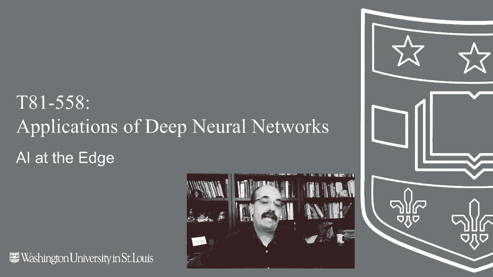
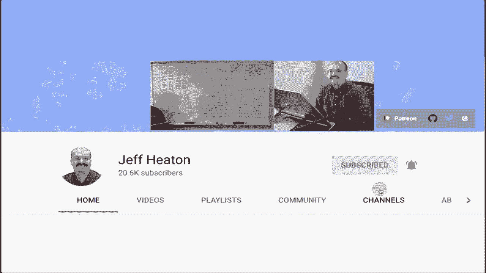
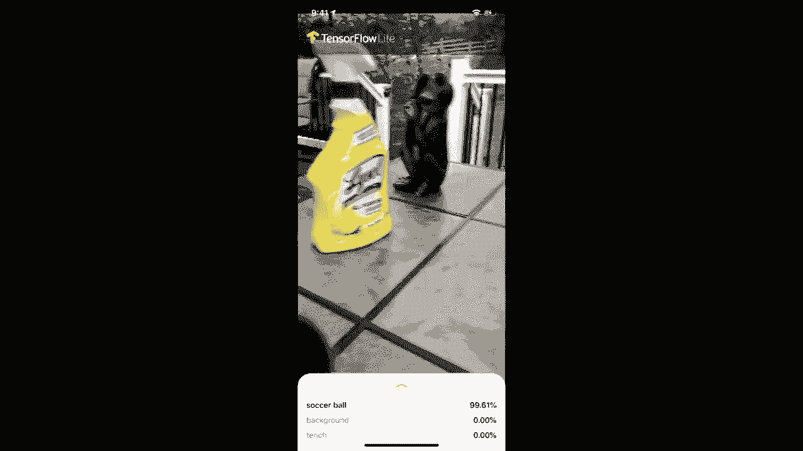
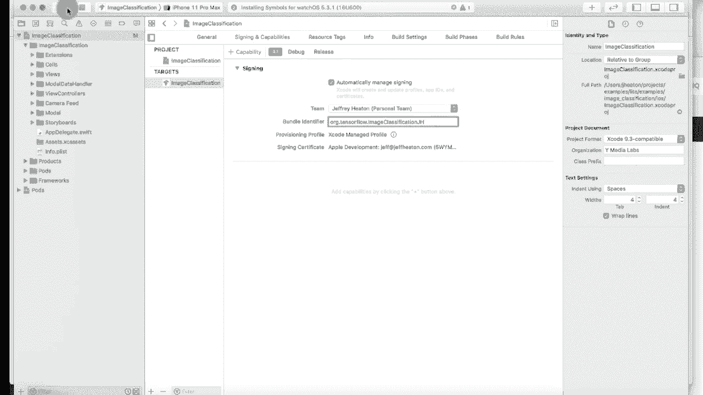
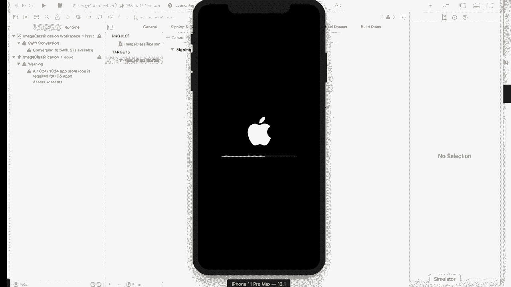
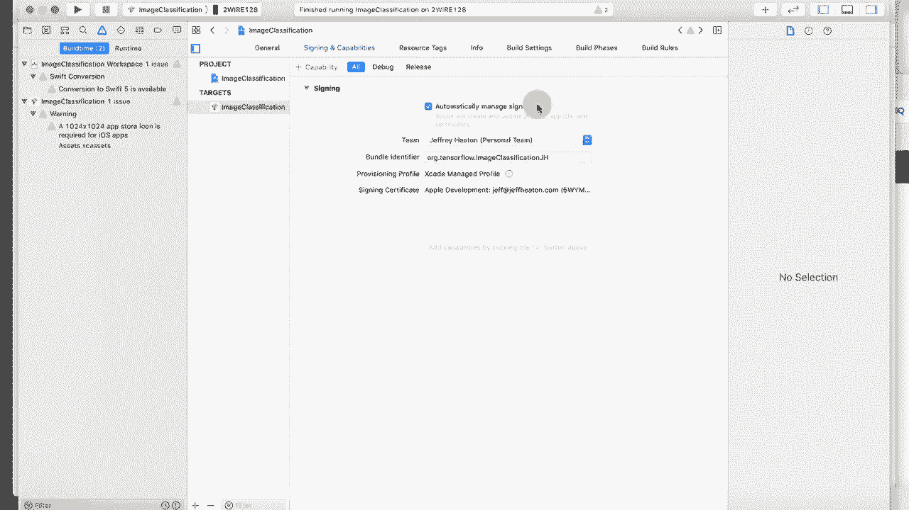
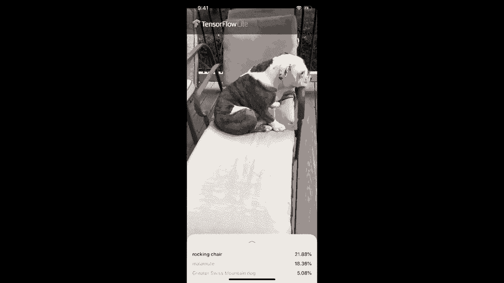

# T81-558 ｜ 深度神经网络应用-全案例实操系列(2021最新·完整版) - P71：L13.5- 用于IOS开发的TensorFlow Lite - ShowMeAI - BV15f4y1w7b8

嗨，我是杰夫·哈顿，欢迎来到华盛顿大学的深度神经网络应用课程。在这个视频中，我将谈论如何在边缘设备上创建神经网络，也就是在 iOS 设备上。在这种情况下，这意味着神经网络的评分或使用实际上将在移动设备上进行。请查看我所有关于 Cale 的视频。

有关神经网络和其他 AI 主题，请点击订阅按钮及其旁边的铃铛，选择全部，以便接收每个新视频的通知。这通常被称为边缘人工智能，因为你会想到云，然后想到围绕云边缘的设备，比如手机和其他类似设备。

这个想法是，我们可能不希望在云端进行神经网络的评分，因为你可能会用手机查看你的照片或其他想保留在手机上的东西，出于隐私限制或传输限制的原因。

你不一定希望云端做所有事情。在这个视频中，我将谈论如何在 iOS 设备上使用 Tensorflow Lite。我相信我会收到关于 Android 和其他内容的请求，但我并不专门从事移动应用开发。

所以我可能会只坚持使用 iOS，除非我收到很多其他平台的请求。但为了这门课程的目的，我们将只使用一个移动设备。我将使用跨平台版本的 Tensorflow，即 Tensorflow Lite，它在许多这些设备上可用。因此，如果 iOS 不是你的首选，这会增加你将这些知识转移到其他平台的机会。

现实情况是，如果你正在创建一种非常受欢迎的应用程序，你可能会将其移植到 iOS 和 Android。我不记得微软目前是否有第三个平台，或者他们是否终于放弃了这个，或者他们现在的状态如何。但这两个是主要的平台，Android 和 iOS，而我恰好拥有 iOS 硬件。

所以我将做这个。我们将创建的应用程序可以识别一些东西。我们稍后会深入了解。好的，现在让我们构建一个 iOS 应用程序。正如我所说，你可以用其他方式做这件事，你也可以为 Android 做这个。此外，我使用的是 Tensorflow Lite，因为这门课程主要集中在 Tensorflow 上。同时，Tensorflow Lite 是跨平台的，你可以在 Android 上使用。因此，如果你想在 Android 上做这件事也并非完全无望，你只需要学习其具体细节，但代码大体上是相同的，神经网络代码是一样的，但实际的应用开发内容，比如访问相机等，将会完全不同。所以他们有一个示例应用程序，你现在看到的就是它。

他们展示了一些iOS特定的代码，比如如何实际访问相机并逐个获取图像。我们将把这些图像发送给TensorFlow Lite，以便对它们进行分类，同时我们还在传递一个已经在图像上训练好的神经网络。

你很少在手机上进行实际训练，那里真的没有什么可以帮助你实际做到这一点的东西，你需要自己进行一些自定义编码，但实际上你不会在手机上训练，你只是使用手机进行分类。如果你真的在上面训练，你会消耗掉所有的电力，因为你的代码并没有经过优化。现在我在这里展示的基本上是他们的一些其他代码。

实际上是在查询神经网络模型，模型数据。这实际上是在查询它。所以我首先告诉你，这是Swift，我对Swift代码并不熟悉。因此，我完全使用Google提供的TensorFlow Lite应用程序，正如他们在示例中所提供的。这在一个包含许多其他示例的代码库中。我们要在这里进行。

实际的TensorFlow示例，你可以看到它是更大TensorFlow示例集的一部分。这个链接直接带我们进入iOS的图像分类。像你在这里看到的，你可以在此基础上深入。检查时，我们将不得不真正查看整个TensorFlow示例集。

这包含了相当多的内容。现在这里是你需要的前提条件，你需要一个拥有该版本或更高版本iOS的设备，这不应该太难，除非你正在处理一些非常旧的设备。你需要Xcode 10.0及以上，开发iOS应用你必须使用Mac，我已经安装了，所以我不打算展示如何安装Xcode，这很简单。你需要一个有效的苹果开发者账号。

这与你用来访问iTunes商店和其他类似服务的实际苹果ID相关。如果你付费，这实际上是一个相对较小的费用，我认为是每年100左右的费用，让你能将应用发布到商店，但在这个例子中不需要。

运行我之前给你展示过的那个应用程序，我不是一个付费的苹果开发者，原因是我并不真的需要那个能力，我不在苹果商店出售商品，至少在此时将来，谁知道呢。你确实需要Xcode命令行工具，我想我已经安装了这些，但我会运行那个命令以确保我里面没有这些。

运行与这些和CocoaPods相关的代码，CocoaPods有点像用于Cocoa应用的Pip，它将为我们安装TensorFlow Lite。所以你必须安装，让我们运行Xcode选择，以确保我们有这些。我已经安装了这些，正如你所看到的，所以继续运行，看你是否需要。现在我们要安装CocoaPods。

如我所说，CocoaPods有点像Pip，它将让你实际为Swift安装TensorFlow Lite包。让我们复制它，然后运行。我不想执行他们提供的bash命令，所以直接运行，不用bash。你确实需要输入密码，这需要一些安装时间，我会快进。现在已安装。这里的备注非常重要，这意味着你无法在模拟器上运行，你必须在实际的iOS设备上运行，因为它需要一个摄像头。

好的，现在我们要克隆那个仓库。我们将经历整个构建和运行部分。确保不要复制bash部分。我通常会将这些检出到我刚移动到的项目目录中，它将拉取所有的TensorFlow示例。

好吧，既然这些都完成了。我将分两个部分进行操作。他们有两个命令在这里合并在一起。首先。我将执行C命令，并移动到这些示例的适当部分。好的，现在我们在实际的iOS示例中。现在我将执行pod install。

这将安装TensorFlow Lite。这有点像Python中的Pip安装。好的，安装完成。现在我们将切换到Xcode来进行接下来的几个步骤。😊 好的，让我们进行第一步。进入Xcode。在你设置开发团队之前，如他们所说的。

你需要在两个层面上完成这个。首先，你必须告诉Xcode你有一个Apple开发者账号。为此，你进入偏好设置并点击账户。现在我这里没有任何账户。这是因为我删除了我的账户，以便演示这个。但你点击加号，我们将使用一个Apple ID。所以我的Apple开发者账号与我在iTunes上购买物品的普通Apple ID绑定。

所以我将点击继续。然后它要我输入这个，也就是我的电子邮件地址。这是我主要用于此的电子邮件地址。所以我已经把它屏蔽掉了。接着点击下一步。它想知道你的密码。显然。我把它屏蔽了，但它也会屏蔽。想知道它是否会让我进行两步验证。

对我来说没有双因素认证。所以，完成了。所以我将关闭这个窗口。接下来你要做的是打开项目的配置。现在你只需双击它，它就会打开。去签名和功能。这里实质上需要一个开发团队，而那就是我。

这是杰夫·希顿的个人团队。现在，这实际上是他们在谷歌的指引中告诉你的下一步，这个标识符必须是完全独特的。所以，我将切换过去做这个。所以让我去这里，这里是他们建议添加你的名字缩写。所以我们放上JH再试一次。哦，现在我们很高兴。

所以让我们。让我们这么做。现在，他们在说明中说的下一件事。这里是连接一个iOS设备，继续运行它。所以让我拿我的iPhone。好的。你可以告诉我的iPhone已连接，因为它想要运行iTunes。我不想运行它。我们回到Xcode。现在我们尝试运行它。我通常。

现在我不常用Xcode，我必须承认我觉得它非常繁琐，但我猜大的。

箭头是运行某个东西的。顺便说一下，它在模拟器中运行。这是你不想要的。所以让我来告诉你。如何正确做到这一点。

如果你运行那个，只需继续并停止它。应该能关闭模拟器。现在，2。正确运行这个。你想点击这里。那是，我的。这是我用来测试的iPhone。现在我应该能够点击大箭头，希望这能成功。好的，它需要这个密码。让我来提供一下。好的。

我发誓每次使用Xcode时，我都觉得这是一个我可悲地失败的智力测试。但是。我觉得所有在苹果工作的优秀用户界面设计师在做Xcode时都只是。休假。但是你在这里需要做的是输入你的用户ID。你不能选择允许。你必须总是选择为什么他们甚至会把那个按钮放在那里。谁知道呢。

如果你们两个尝试允许，它会一次又一次地问你，就像我之前做的那样。现在，它启动你的应用程序。现在，这又是一个你必须做的小事。现在。我明白这个应用程序安全性是个大问题。所以你基本上必须。告诉你的iPhone信任它。让我给你展示步骤。

所以他们甚至在这里给你提供了做这个的说明，你实际上要去设置。设备管理，允许它。好的，我现在告诉它信任那个应用程序。所以，它在信任。然后我应该能够再次运行它。但应用程序已经安装在我的。

iPhone。😊，好的，现在我切换到我的iPhone。我们需要做的第一件事是实际去设置。然后在常规标签下，有很多东西。在这里你想去设备管理。AppleDevelop。基本上之前这里有信任这个应用程序的选项，而不是删除这个应用程序。所以你可能会看到信任这个应用程序，我已经信任过它。我其实是单独录制这一部分。一旦你完成所有这些，你就在这里，可以看到TF分类。现在让我们先试验一下。

所以我们现在通过我的iPhone看世界，实际上它认为我是一种面具或浴帽，就这样。但我们会试试我这里的一些物品，它很容易就识别了咖啡杯。它识别出了足球。那是著名的红色订书机。那是波比滑雪。是的，真可悲。灰烬，停车计，油泵，好吧，它无法识别肥皂瓶，还有我这里这个非常奇怪的青蛙。

它的思维方式就像一个螺丝刀。青蛙实际上在拿着一个手机， Nope，它也没有搞明白这一点。那么，让我们看看还有哪些东西可以进行分类？

这是一个椅子。摇椅，我想如果你真的想的话，可以摇晃一下。波比滑雪，让我们看看它是否能识别Hickory。摇椅，摇椅，美国斯塔福德犬，法国斗牛犬，Hickory。我觉得你是法国的。没有对法国的偏见，但他是一个英语斗牛犬。哦，Hickory，我很抱歉。

我保证我会重新编程以识别英语斗牛犬。

感谢观看这个视频，这就是如何在iOS上使用TensorFlow开发一个简单应用程序的过程。如果你想将这些知识应用于其他平台， definitely 查看TensorFlow light网页，它会引导你到那些其他平台。
