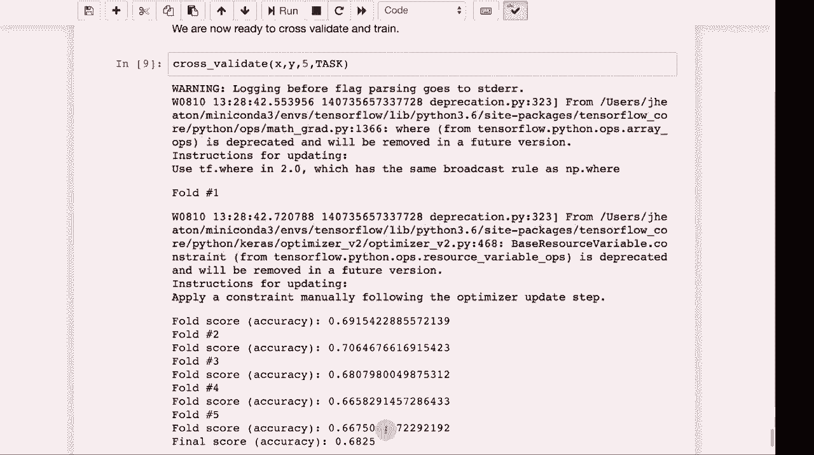

# T81-558 ｜ 深度神经网络应用-全案例实操系列(2021最新·完整版) - P72：L14.1- 用于Keras和TensorFlow的自动机器学习(AutoML) 

嗨，我是杰夫·伊顿，欢迎来到华盛顿大学的深度神经网络应用课程。那么，现在是按一下简单按钮的时候了，你可能会问我为什么把这个放在课程结束时或接近课程结束时。但我们将看一下Automl，这是最新的自动机器学习，关于我的AI课程和项目，请点击旁边的铃铛订阅，以便通知你每个新视频。现在我们来看看automl。

所以作为数据科学家，我经常被各种职业的人问到。你难道不是在试图让我失业，或者你在试图用人工智能取代我的工作？实际上，答案通常是否定的，我们在尝试给他们更好的增强工具，以帮助他们更好地完成工作。

但是如果我说是的，我正在试图让你失业，好吧。如果这让你感觉好一些，数据科学家们也在尽快尝试让自己失业。这就是Automl，我会给你所有这些超参数和你需要的其他东西。

调整你的模型，以便获得最佳性能。我给你所有这些数据类型，你必须使用虚拟变量和其他编码将数据转换为神经网络可以处理的形式，Automl会迅速完成这一切。

你给它一些数据，它就会自行决定如何编码一切。它会立即确定使用哪种神经网络，然后从那里开始。它主要使用机器学习来构建机器学习。这并不是世界上最复杂的事情，往往是依靠蛮力。

但有很多商业产品非常昂贵。你可以用这些东西的年费为每个用户购买高档跑车。所以我会在商业方面谈谈其中的一些。我们还将看到如何在本模块中实现一个非常简单的automl。

这是我创建的一个东西。它是我在kgular工具中拥有的一部分，这里会看到一些更简化的版本，但它可以处理原始数据，试图找出要做什么。至于😊，Autm。有Rapid Minr，有data coup。有data robot。有H2无驾驶。

老实说，我已经与这些都合作和评估过。我会在2019年给你我的看法。这变化迅速。Automl很庞大。有许多初创公司想要进入这个领域，从车库里成立的几个人的初创企业到相当大的第二轮和第三轮初创公司，正在做这些事情。Rapid miner是较老的一家，存在了很长时间。

我相信这三者中都有快速挖掘。我将实际展示它的免费版本。虽然这不是我最喜欢的，但它是存在的，而且你可以获得它的免费版本。如果你对某些自动机器学习感兴趣，可以看看数据合并（Data co），这是一个将自动机器学习作为其一部分的平台，你可以很好地使用它。

他们称之为低代码无代码，因此你并不需要进行很多编码，公民数据科学家（citizen data scientists）是指那些技术水平不高但仍希望进行数据科学相关工作的人。数据合并对他们来说非常好。数据合并真的努力想做到几乎所有事情，我认为这可能是他们的一个缺陷，因为他们试图成为自动机器学习，但并不是最好的自动机器学习。

他们试图进行数据预处理，但并不是最好的数据预处理。所以有很多公司专注于数据合并涉及的所有部分。在我看来，数据机器人（Data robot）是真正的自动机器学习的先驱之一，它们是由Kle Masters创办的，而那时候你并没有很多Kaggle大师，现在许多人都是大师，他们凭借Kaggle的奖金创办了公司，真酷！所以我对最后这两个公司，特别是数据机器人和H2O无驱动技术（driverless）非常喜欢，我认为这是两种最佳技术。

目前有一些解决方案用于Autom。就个人而言，它们相对来说都很贵。对于财富500强公司来说，可能还好，但这些都是商业闭源产品。谷歌也有云解决方案，Autom让我给你展示一下其中一个的样子。

所以我们将使用快速挖掘（rapid miner）。我选择快速挖掘并不是因为我特别喜欢它。还行，但他们有免费版本，而我将启动它，快速挖掘本身也挺贵。如果你付费的话，顺便说一下，你的快速挖掘工作室教育许可证将在65天后到期。我会续费我的许可证。所以，看看快速挖掘工作室要多少钱。

我认为每个用户每年5到10美元，快速挖掘服务器本地部署是每年36美元，这些程序并不便宜。而且还有一个聊天机器人，可以和你聊聊花大钱的事。如果你想和聊天机器人聊聊。那么，让我说，稍后提醒我。我们将要做的是点击这个自动模型。

所以我们选择自动模型，我需要将我的数据实际上传。所以我将进行本地仓库的导入新数据。数据在我的电脑上加载。我们将使用我的示例数据集。使用相同的数据作为另一个例子。这些都是我们要让数据符合预期格式的数据。

我们将尝试预测产品。所以我们会进行分类。在这里你选择，哦，它只是想知道不同的格式。所以没问题。我们导入数据。我们想预测产品。显示给你分布。我们点击下一步。它建议不使用I，这是相当聪明的。是的，I并不是那么有用。

我们将使用所有这些不同的机器学习模型类型。我们会运行它。实际上它现在是在疯狂地尝试找到最佳模型和最佳编码。让你知道它看到了什么。你可以在这里看到准确率百分比。还不错。它的准确率大约在70%。

我总是针对当前学期的Kaggle竞赛的一个子集运行这个程序，这样我可以看看当前的数据集是否有任何预测能力。也就是说，输入是否有可能预测目标。好了，完成了。

你可以看到不同的模型。看起来最佳准确率是通过深度学习获得的。是的，深度学习。所以它还显示了运行时间。这些中的一些训练所需的时间更长。所以你通常想在计算复杂性与其他因素之间平衡这两者。现在，一旦你有了它，你可以进入深度学习模型，查看模型。

这显示了它创建超参数的统计信息。这真是太酷了。你可以进入模拟器，它会告诉你这里的相关性。所以收入与预测产品B之间的相关性是相当负的。你可以看看。😊。这些数据真的可以让你对数据有一些解释。这是一个商业自动机器学习包。

现在我们来看看如何在Python中创建一个简单的自动机器学习系统。这是我的简单automl系统。我给你提供了一个相当简单的类。我非常喜欢这个类。我自己写的。它基本上允许你抽象来自网络或本地的Cv文件之间的差异。所以我会先运行它，以便定义它，因为我们将需要它，这一切都能运作。

这个automl，我给你提供的至少是分析。它通过流式传输工作，即使数据非常庞大，它也能处理大量记录并进行所需计算。这些是你可以提供的一些配置项，其中大部分你可以简单地保持不变。所以我会运行这个，只是为了把automl系统放进来。这段代码基于你提供的大小生成一个神经网络。

所以它会创建分类或回归，而这个则有助于交叉验证。😊。这是我们在本课程早些时候看到的相同代码，我们正在设置分类。所以请注意，如果你正在分类，它确实会将你的输出的虚拟变量转换为实际索引，因为那是你评估它所需的，我们还确保评估准确性，如果我们正在分类RMSs，如果没有，我们只构建自动样本并报告最终的准确性。

我们将继续运行它，以便加载。我给你几个不同的数据集，可以在上面运行automl，部分用于分类，部分用于回归。老实说，除了在这里指定之外，你不必太考虑这个。所以我将对我之前的那个简单数据集进行运行，它将作为类别进行运行，并尝试进行自动机器学习，就像Rapid Miner在做的那样。所以我做的第一部分分析数据集，并创建一个名为control csv的文件，我将向你展示control csv。

😊，这很重要，所以这是控制CSV。它实际上给你一个ID，建议我们对ID进行Z评分。它没有足够聪明地意识到有太多独特值。我将更改ID以忽略，我们不想对I做任何操作。它决定将其作为分类变量，这很好，它显示了各个类别的分布区域，也将被视为分类收入。它选择对这些进行Z评分，这很好。Subs也是虚拟分类Z评分，Z评分那些都很好。年龄有趣的是，它选择虚拟变量，仅仅是因为年龄不多，它认为这是一个类别，让我们对其进行Z评分，我认为这是个更好的决定。人口密度绝对是Z评分，最终的输出产品将被视为类别，所以我将继续保存，以便我们现在有一个修改后的控制文件版本，而下一部分基本上只是重新加载。

控制文件会根据控制文件转换输入数据。所以我们将运行它。它相当快速。它只是处理并转换，给出转换后的输出CV。让我们快速看一下这个文件。这有点乱。我是说，工作被替换为所有这些虚拟变量。你有各种各样的虚拟变量。

你有一些Z评分。但这不酷吗？这是你的特征向量，你通常会为之苦苦挣扎，试图自己创建，自动机器学习基本上就是为你搞定这一切。现在我们实际上将尝试将其拟合到一个，我们将预处理它，以便将其转化为X和Y，它确实做到了。

我检查确保没有缺失变量。没有缺失，我们将进行交叉验证。它将通过所有五个折叠进行训练和验证，我们将了解这个神经网络能够产生的结果。实际上还没有。一些准确性注意到第一个折叠并没有比Rapid Miner落后太多，我的版本是免费的F2大约在70左右。

所以我们的准确率仅比**RapidMiner**低几个百分点，最终准确率略低于70，所以非常接近，低于**RapidMiner**几分，但它是免费的，并且与**RapidMiner**的免费版本不同，你可以根据需要使用任意数量的玫瑰，但你仍然需要在内存中训练神经网络，因为这些内容经常变化，所以请订阅频道，以便随时了解本课程及其他人工智能主题的最新动态。

