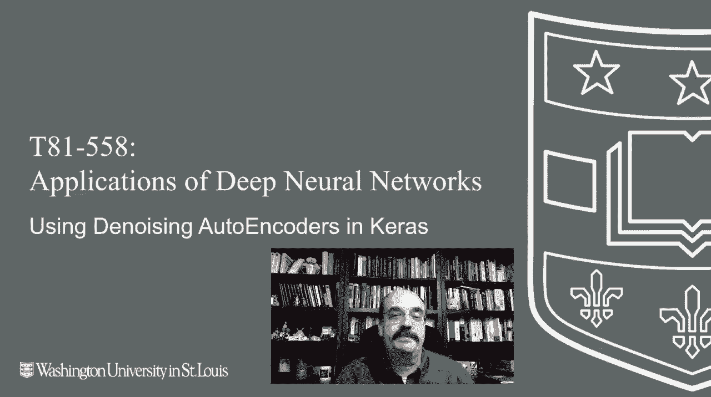
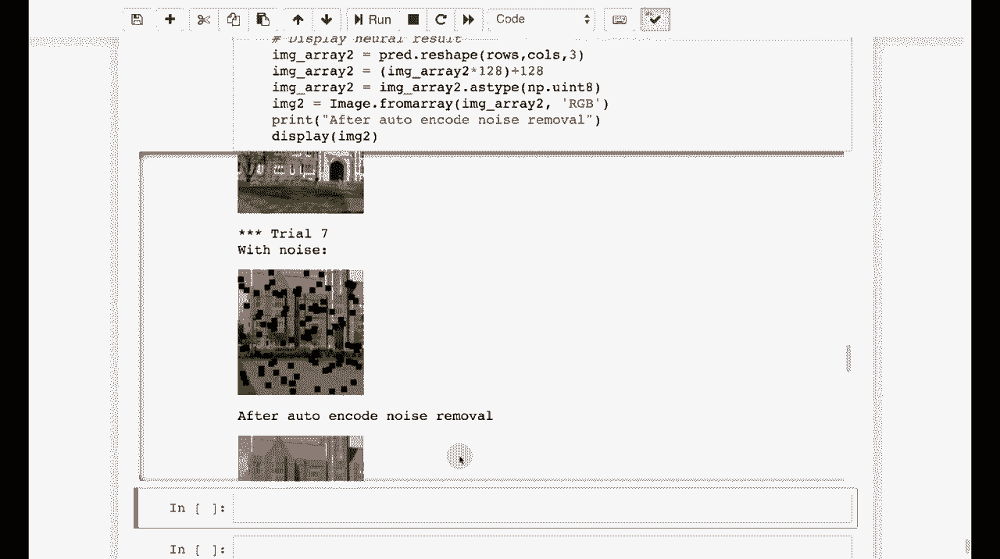

# T81-558 ｜ 深度神经网络应用-全案例实操系列(2021最新·完整版) - P73：L14.2- 在Keras中使用去噪自动编码器 

嗨，我是杰夫·希顿，欢迎来到华盛顿大学的深度神经网络应用课程。在这个视频中，我们将看看自编码器，或具体来说是去噪自编码器。这些是可以用于重建被噪声模糊的数据的自编码器，获取我最新的AI课程和项目。

点击订阅并点击旁边的铃铛以获取每个新视频的通知。对于自编码器，我们首先将关注函数逼近。我们之前做过函数逼近，基本上是回归，但我将定义一个函数来进行逼近并绘制图表。😊。

现在我要创建一个简单的神经网络，基本上是正弦函数。我们将尝试预测正弦波。如果我运行它，它将进行训练。我们本质上只是训练它处理传入的正弦函数，快进一下。好的，它完成了。你可以看到它跟踪得相当不错。

现在我在期望值中加入了一些噪声，以使其不完全完美。你也可以看到实际值和预测值非常接近。接下来，我们将进行多输出回归。多输出回归对于自编码器至关重要。本质上，发生的事情是你有输入，就像之前的输入1、输入2、输入3、输入4。

但你可以拥有多个输出神经元。现在谈谈自编码器。通常，输入的数量与输出的数量相匹配。我们就直接运行这个。😊。它试图同时对正弦和余弦进行训练。我将快进直到它完成。好的，它完成了，均方根误差看起来不错。

你可以看到一些预测值和期望值。所以它在同时学习正弦和余弦。这是非常令人惊讶的。不过，其实并不太惊人。我是说，神经网络的多输出回归是相当常见的事情。尽管在其他类型的机器学习模型中不常见。现在，我们来做一个简单的自编码器。

注意这个自编码器，我们有五个输入和五个输出。你拥有的输入数量应该与输出数量相同。而我们本质上在做的事情，这有点迷人。这就是自编码器的作用。我们在这里输入。😊，基本上是随机数字。我们正在训练它。

期待我们得到的输出与最初输入的数字相同。这教会神经网络只使用这两个隐藏层。这两个隐藏神经元实际上将所有输入压缩成仅两个数值。因此，我们将训练之前相同的形状1。它训练得非常快。你可以看到我基本上输入了0，1，2，3，4，5，8，9。它基本上返回了接近相同的结果，0，1，2，3，4，5，6，7，8。并且很快就得到了那个，正确的。通常，这些自编码器用于图像。

所以，让我们加载一些可以利用的图像。我在这里基本上向你展示了我们是如何创建一个自编码器来编码华盛顿大学的这张图像。现在，如果你看这个定义。😊，它实际上是通过一个隐藏层进行高度压缩。因此，它教会自编码器如此高度压缩，以至于仅一个数值就能表示它。

当然，上下的隐藏层会对图像有一些了解。因此，你基本上可以将其压缩得如此小，仍然能够获得有意义的输出。让我们加载一些图像并进行标准化。我们将确保所有图像大小相同。我们还可以进行其他标准化。我们还可以确保光照量一致。

但目前它并没有做到。现在我们将尝试进行预测。因此，我们基本上循环这些128乘128的图像。😊。我们正在将它们压缩到这个大小，并将该值作为输入和输出。尝试让神经网络的输出看起来与训练数据一样。

这里我将快速前进。在这里，你可以看到它能够根据这些输入的向量重建图像。现在，让我们看一下去噪自编码器。这些非常有趣，所以。我们来运行一个，看看我们可以给图像添加噪声。我只是放了一些随机的框在那里。我们基本上现在可以进行训练。通常，自编码器。

你输入数据，期待得到相同的输出。但在这里，我们将输入被这些方框遮挡的图像，并期待尽可能接近原始图像。这教会自编码器去除噪声。我们可以运行它并观察输出。这些图像慢慢闪过。它们的所有像素都被框去除了。

但它们依然表现得很好。然后我们将基于这些我们创建的噪声图像训练神经网络，并进行10次随机试验。你可以看到，有噪声和没有噪声的情况下。它在去除噪声方面做得相当不错。

你会注意到一些失真。如果你放大框的位置。但这就是它的工作方式。你可以看到，它确实能够很好地去除噪声。这是一个自去噪。这是一个自去噪自编码器。现在，自编码器可以做各种各样的事情。我们将看到。😊。

在下一部分，我们将探讨如何利用它们来检测异常。因此，输入与我们之前见过的内容不同。这些内容经常变化，因此请订阅频道以获取本课程及其他人工智能主题的最新信息。

