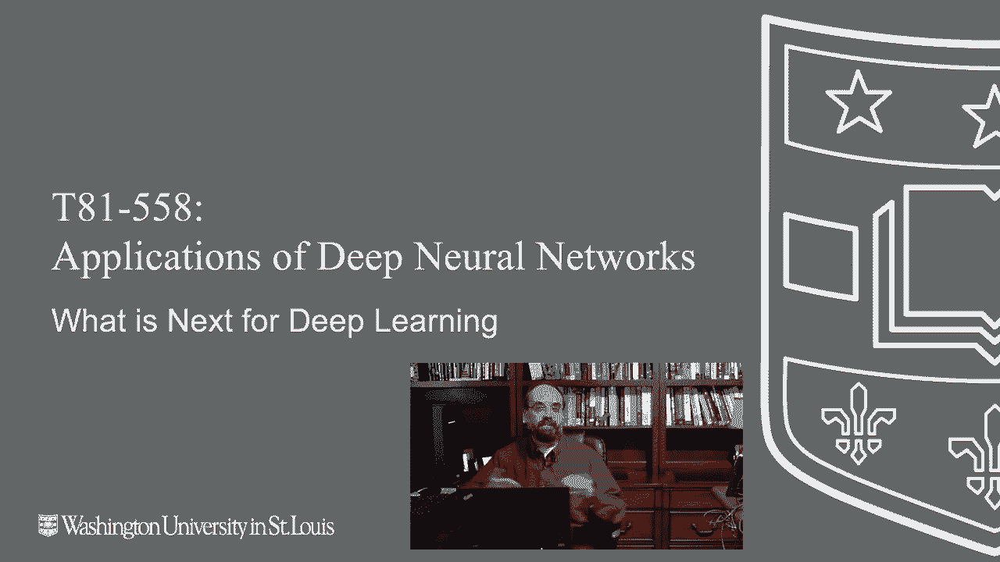
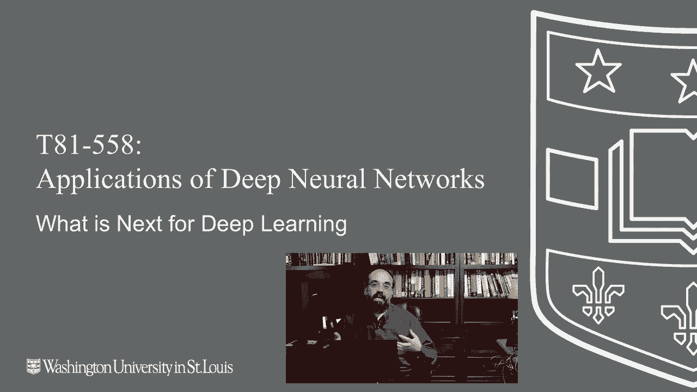
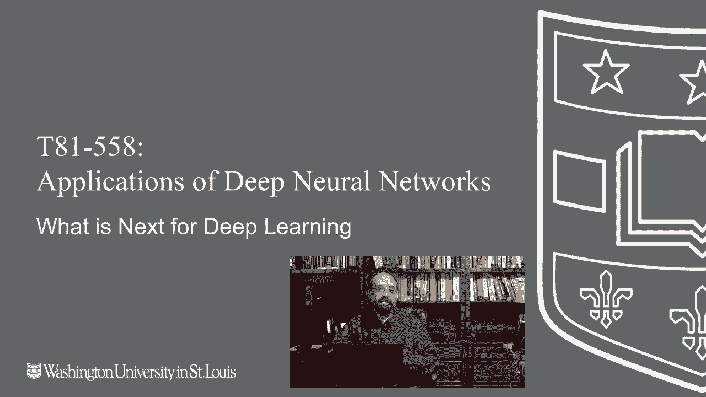

# T81-558 ｜ 深度神经网络应用-全案例实操系列(2021最新·完整版) - P76：L14.5- 新深度学习技术介绍 - ShowMeAI - BV15f4y1w7b8

嗨，我是杰夫·希顿，欢迎来到华盛顿大学的深度神经网络应用课程。恭喜你，你已经完成了这门课程的最后模块，在这个视频中，我将讨论接下来该做什么，你现在该如何利用你所学到的深度学习的精彩知识。

🎼首先，我非常鼓励你订阅我的YouTube频道。我知道每个YouTuber总是这么说，但在这种情况下，你已经完成了这门课程。你可以看到我发布的视频，这些视频确实以这门课程材料为基础。我将展示这些相同技术的更高级应用，并且我还会添加新视频，以替换课程的部分内容。

这是这门课程。因此，每当我更换一个视频时，你会收到更新通知，让你知道其中之一已经改变，你可以看到在我看来深度学习的新技术，我决定将其添加到课程的一部分中。

你可以在GitHub上关注我，或者直接在YouTube频道上关注我，任一都可以，嘿，两个都行。让我知道我何时进行更改或添加额外内容，我总是有我的所谓新技术雷达，而这一部分我每年至少重新录制一次。

这门课程运行两个学期，所以每隔一个学期我会尝试更新一下下一步是什么，以及我雷达上的技术，因为这些东西总是在变化，哪怕是两年，甚至一年，在深度学习中都是一个永恒的概念，因此目前在我雷达上的技术。

你在这里看到的变压器，更先进的迁移学习增强和强化学习，尤其是在TF代理之外。因此，在这门课程中，我对变压器的覆盖不够。这绝对是一项你想要熟悉的技术，尤其是如果你对自然语言处理感兴趣。

尽管它开始在计算机视觉领域取得了一些进展。变压器的真正标志是序列到序列。因此，模型接受一个序列并输出另一个序列。所以序列是这些可变长度的向量，可能是字符，可能是单词，可能是一系列图像，视频输入输出随着计算能力的不断增强而变得更强大。

我真的认为我们会看到视频对视频的转换。😊，变压器，深度伪造。虽然它们并不是完全使用变压器技术，但可以认为是那类技术。所以你基本上可以给这个变压器一份英语句子列表，一份法语句子列表。它将学习如何进行翻译。

更高级的迁移学习，因此本课程目前涉及迁移学习，这是一项非常非常重要的主题。通常至少在这门课程中，我谈论的是将一个神经网络引入，然后稍作微调，并在此基础上添加一些主题，特别是如何找到已经学习过的预训练神经网络，这样你就不必重新经历这个过程。

训练的费用，因为一些最先进的神经网络是在1024个GPU的GPU阵列上训练的。我前几天看到一个，训练这个东西要花25万美元。我是说，拜托。你想站在那些巨人的肩膀上，但特别有两个事情我建议你看看：一个是Hugging Face，这些是你可以使用的预训练模型，可以直接导入Python进行自然语言处理；另一个是在GC的NVIDIA GPU云中也包含了很多迁移学习，你可以用于各种用途，我在想象一种类似Jarvis的东西。

你知道的，钢铁侠，这个机器人会增加一些类似他的东西，因为有几个神经网络可以串联起来做一个个人助理。这种增强技术极大推动了计算机视觉的发展，你可以使用Keras中的生成器，基本上可以处理图像。

翻转它们，旋转它们，改变颜色，做各种事情来给你额外的训练数据，这在实际的训练集中并不存在。最近发布了一些东西，我实际上已经纳入了下学期的NVIDIA风格G2 AD，它使用增强技术为鉴别器提供更多的图像，以便在生成器学习创建假图像时使用，然后是强化学习，但超越TF代理，TF代理是我在这门课程中教授强化学习所使用的，我之所以选择它，主要是因为它与TensorFlow无缝连接。

我非常喜欢稳定基线，当你查看TF代理通常会出错的所有内容，比如他们的Atari示例，以及实验性示例。这些可能会或可能不会工作，稳定基线真的可以直接使用，给你一个很好的入门示例。

这里是如何玩Atari游戏的，这里是如何做其他事情的。接口要简单得多，不用暴露很多内部工作原理，而在这样一门入门课程中，我可能不想深入探讨，所以这也是我脑海中关于新技术的另一个考虑，编程语言。

现在这是一个关于Python没有很多竞争的领域。这门课程是基于Python的，Python在机器学习和深度学习方面确实占据了主导地位。数据科学也是如此，尽管在远处有其他语言在侵蚀Python的领域，请相信我。

我做这个已经很久了，Python 会落下。会有另一种语言变成时尚语言，而 Python 自从上升到现在的水平后。它会成为所谓的新 COBOL，正如 Java 目前享有的那样。所以还有其他语言。如果我必须说一种的话。

让我最感兴趣的是用 Go 替代 Python 在机器学习中的实际应用。Go 语言。但所有这些其他语言都在紧逼 Python，比如 Julia，甚至 Swift。信不信由你，我主要把它看作是一种移动语言。但我认为那里肯定有兴趣。我会说，Python 仍然会是核心的机器学习语言，持续一段时间，而在机器学习领域，这段时间大约是六个月。

两年，我不知道。所以你可能想考虑的其他语言是。iOS 应用开发，Defite Swift。Swift 是 iOS 应用编写的语言，Android 应用开发，Kotlin。我想这就是发音，Java。我对 Java 比对 Kotlin 更熟悉。基本上。

Kotlin 是建立在 Java 之上的一层，使其更现代化且减少打字。网页开发。Node.js 和 JavaScript。现在，你可以使用 Python 和 Django 进行网页开发，我之前使用过，但你无法逃避 JavaScript。JavaScript 是前端，你需要使用它，还有其他语言，比如 Ruby，可以让你稍微逃避一下。

但是，Java 有许多方言。Mac 应用开发。使用 Swift 或与 Electron 或 React Native 搭配的 JavaScript。如果你想创建一个真正的 Mac 应用，你会看到越来越少的应用。现在主要是移动或网页应用，但。有时你确实想要一个实际的应用，Windows 应用开发 C# 或使用 Electron 或 React Native 的 JavaScript。

你在这里看到了一种模式吗，Linux 应用开发。CC++ 搭配 TCL 或者使用 Electron 或 React Native 的 JavaScript。如果你使用过 VS Code，你就使用过 Electron。VS Code 在 Mac、Windows 和 Linux 上均可用。如果你想在这三种环境上创建应用，这是一个很好的方式。

因为你基本上可以只用 JavaScript。所以我会说在所有这些语言中，我对除了 Python 之外最感兴趣的是 JavaScript。这是我在 JavaScript 之外工作最多的语言，然后是 Python 之外的。😊然后还有 Node.js，本质上就是编译后的服务器端 JavaScript，这就是我对编程语言的看法，当我们开始 2021 年时，关于 PyTorch，这门课程是用 TensorFlow 和 Keras 教的，相信我，这是机器学习界的一个宗教辩论，我不妨问你有没有上帝，或者你投票给民主党还是共和党，自由派还是保守派。

这可能更符合美国的情况。而且在这个问题上我得到的回复相对较少。我经常收到邮件询问为什么不切换到 Pytorch，有些人甚至相当刻薄。因此人们对此非常激动。我创建这个 Kira 的 Tensorflow 课程的主要原因是。

其中有两个原因。首先，Pytorch 在我 2016 年创建这个课程时并不存在。我甚至没有听说过它。我听说过 torch，但那根本不是同一回事。另一个是，我喜欢 Pytorch，但它确实需要更多的输入，感觉就像机器学习框架中的 Java，这可能会让我受到一些批评和评论。但说实话，你必须为它添加更多的基础设施，并执行训练循环。

你可以做所有这些事情。然而，使用 Java 时，额外的层次让你的手指很痛，而 Pytorch 让你能够真正微调你所做的事情。这就是为什么 Pytorch 在研究领域取得了显著的进展。我认为这两者将继续竞争。而对我来说，切换到 Pytorch 意味着我觉得其中一个已经落后了，或者另一个。然而，当我在 2008 年首次接触机器学习时。

我当时非常坚定地选择 Java，后来我完全转向了 Python 等其他语言，接下来我建议你看看 Google Collab Pro。我有先进的 GPU，我也在云上使用 O。

但我仍然经常使用 Google Collab，因为 Google Collab Pro 让我可以使用 V100 NviDdia GPU。如果只是运行几个小时的任务，我常常喜欢这种灵活性，而不是打扰我的 R T X GPU，这可能正在进行长时间的训练任务，或者我可能只是想要这种灵活性。

谈到 Google Collab Pro，所以我非常喜欢 Google Collab Pro。我与 Google 完全没有关系。接下来你可能还想看看 Tensorflow 认证。我给你提供了一个链接，这样你就有东西可以展示了。向雇主展示你已经学习并掌握了这项技术，然后 Coursera 提到的其他可以放在你简历上的事情，现在你的简历上可以添加这些内容。

你的 LinkedIn 个人资料基本上需要建立起来。我想说的另一件事是，作为一个偶尔雇佣刚入职的大公司的人的人，获取实习机会，获得实际知识，参与项目，寻找你感兴趣的 Kaggle 竞赛，把你的作品推送到 GitHub，并获得一些领域知识。

有成千上万的人参加了Coursera的数据科学课程，他们中的许多人知道很多很多的东西。我和他们中的很多人交谈过，但许多人有时缺乏真正的世界经验。对我来说，真正有分量的是那些自己承担项目的人。Kaggle。

如果你想不到其他内容，可以研究一下这个领域，并学习如何将这些理论真正应用于现实数据。好的，我希望你真的喜欢这个课程。我知道我很享受准备这些视频和与你们的互动。

😊，Zoom用于Washo学生，其他互联网社区请留言。在这里给我评论，你想看到什么，我是不是疯了，是否应该将这个课程改为Pytorch，你最喜欢哪些新技术？在评论中告诉我，并一定要订阅频道。

在GitHub和Twitter上关注我，跟踪我正在进行的所有有趣的事情，至少对我来说是这样。感谢你跟随这个课程，不论你在深度学习和机器学习旅程中的下一步是什么。
