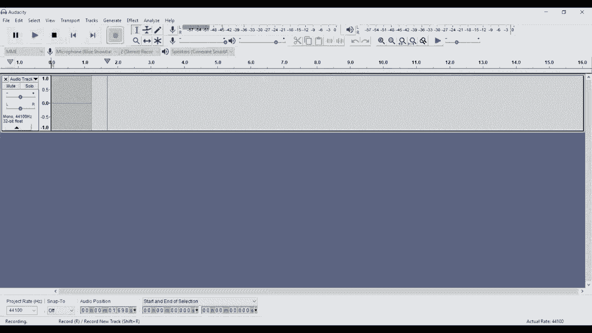
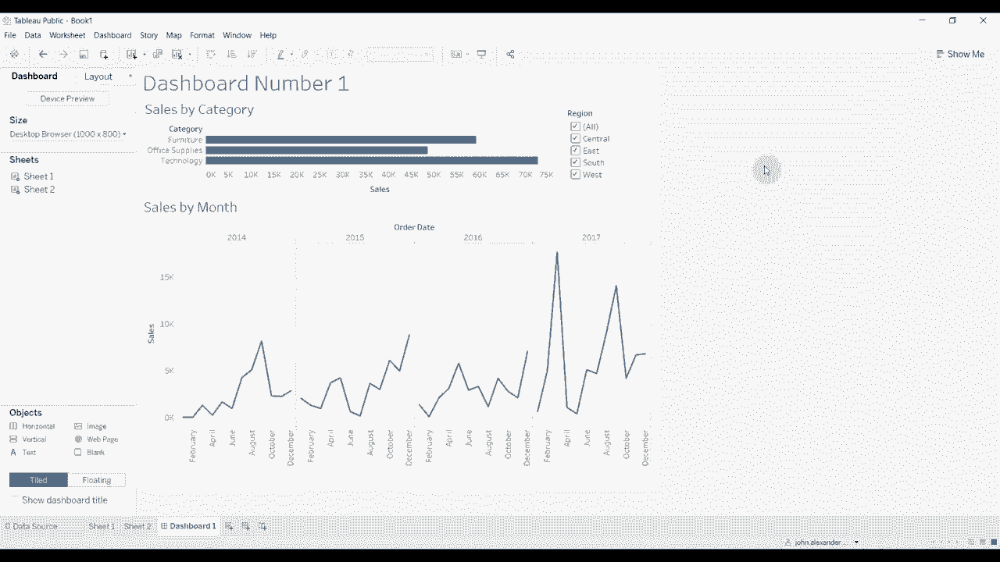

# Tebleau操作详解，照着实例学做图！数据科学家的必备可视化工具，简单快速做出精美图表！＜实战教程系列＞ - P1：1）Tableau基础知识 - ShowMeAI - BV1iq4y1P77U

嗨，大家好，欢迎收看《Tableau两分钟》。今天，我们将做一些与我们通常做的有所不同的事情，我们将走过Tableau的基础知识。也就是说，你可以从第一次打开程序开始，一直到创建一个非常基本的仪表板。

真的，给你一个概述，让你在观看这个频道或其他频道的其他视频时，有一个框架来挂钩新信息。😊，所以当你打开Tableau时，首先看到的是这个屏幕。

这给你一些选项，可以在左侧连接数据，具体取决于你使用的Tableau版本，无论你是使用Tableau Public、Tableau Professional还是Tableau Personal。这些会有所不同。显然，Tableau Public的选项最有限。

特别是在连接可能在服务器上的数据时。你还可以看到你最近打开的任何文件。如果你之前在使用其他Tableau文件，它们会在中间的大视图中列出缩略图，我没有任何。😊，你可能会看到一些。你可能不会。

这取决于你之前打开程序的次数和你所做的事情。连接数据的最简单方法是通过Microsoft Excel或文本文件连接数据。你可以在顶部使用这两个选项。我们将使用Microsoft Excel连接一些数据。文本文件的过程非常。

非常相似。我将选择。这个表格超市销售数据集。我们接下来会打开它，你会看到当我们打开它时，这会带我们到一个新页面，在那里我们可以定义想要导入到工作簿中的数据。左侧有三个工作表。这些是在这个超市工作簿中的示例工作簿中的三个工作表。

我们将把订单拖到这个面板上。这将把订单表中的所有数据导入到我们的工作簿中。如果我们愿意，我们也可以拖动人员，然后我们可以将其用作连接。人员实际上有地区的数量。

还有负责领导该地区的人。你可以通过点击这里的连接来看到这一点。我们可以定义如何连接。我们甚至可以在其中添加。退货。如果我们想这么做。再次，这是通过这个订单ID号进行连接。

这两个类别是自动设置的，因为这是一个示例数据集，旨在易于使用。这些设置是自动完成的。如果你想更改这些字段中的一个，你可以在这里看到你如何更改连接的字段。这些连接就像SQL连接一样运作。所以你有内连接、左连接、右连接和全连接。

如果你刚刚开始，不用太担心这个。但我想让你知道，这种灵活性是存在的。一旦我们有了所有这些数据，我们可能想要探索它。所以我们要做的第一件事是下到这里，点击“转到工作表”，我们将点击工作表 1。这个视图是我们将创建每个单独可视化的地方。

在构建任何类型的 Tableau 工作簿或 Tableau 仪表板时，这里将会进行大量的重工作。很多工作都是在这个特定的工作表中完成的。所以我们来快速浏览一下屏幕上的不同区域。在左侧，我们有数据集中所有的数据项。

它们被分为两个类别。我们有维度，还有度量。维度是通常是分类的项目。例如，类别将是我们超市数据集中产品的类别。度量通常是数字，它们是我们会进行加、减、除等运算的东西。

这些通常是我们想要显示的内容。我们想要显示这些内容相对于某些事物的变化，对吧？所以我们想知道，我们可能想知道在特定产品类别中销售了多少金额。你会注意到，当你将鼠标悬停在这些项目上时，它们会显示不同的颜色。

这些可着色的颜色在我们拖动到工作表时会保留。蓝色的项目是离散的。绿色的项目是连续的。大多数情况下，它们与维度和度量的设置方式相一致，但并不总是如此。所以你必须注意这一点。你可以对连续的项目做的事情与离散的项目不同。

所以它们都有各自的位置。但它们的运作方式略有不同。从字段列表中移出，我们有几个不同的东西，我们称之为架子。所以我们有页面架、过滤器架、列架、行架，以及被称为马克斯卡片的架子。

其中有几个不同的架子。所以我们有颜色架、细节架等等。然后显然，我们的可视化在这里，它会随着我们将内容从字段中拖出而逐渐建立。我们将在继续过程中讨论每个架的功能。

在这个过程中，当我们进行这个练习时，首先要做的就是创建一个非常简单的可视化。所以让我们选择两个不同的项目。我们将产品类别拖到行架上。现在你可以看到我们的行由产品类别定义，共有三类：办公用品和技术。然后让我们选择销售。

现在让我们点击并按住，将销售拖到列架上。你可以看到，现在 Tableau 自动为我们创建了一个柱状图。😊这很好，在这种情况下效果非常好。Tableau 通常对你想用特定维度和度量创建的可视化类型很聪明。如果你想改变图表类型，可以点击这里的“展示我”选项。

点击这些选项中的任何一个，尝试查看不同类型的可视化下数据的显示方式，比如试试高亮表、堆叠柱状图、气泡图或树图。实际上，针对这组数据，最佳选择是柱状图。所以我们现在就这样保留它，并且要添加一个过滤器。

过滤器的工作方式是过滤器限制流入可视化的数据量，因此我们可以查看这个，而不是查看所有区域。例如，我们可以只查看一个特定区域。为了做到这一点，取出过滤器，将其拖到过滤器架上。然后会弹出一个窗口，让我们选择想要查看哪些区域。

目前我们将选择全部。然后我们只需点击确认。你会看到数据没有变化，因为我们将它们全部包含在我们的区域内。如果我们想要改变这一点，可以点击区域，点击编辑过滤器，可能排除南部和西部的地区。我把这个移开，以便你可以看到，当我们点击时，观察这些柱状图。

这些柱状图和比例在这种情况下会改变，因为我们有更少的数据点，抱歉，销售数量减少，因为我们只查看四个区域中的两个。你还可以在这个可视化中显示它。所以如果我们继续点击显示过滤器，那么你可以看到右侧。

我们得到了这个过滤框，你可以点击不同的选项进行过滤。观察可视化是如何随着变化而变化的。所以如果你需要多次更改，这非常有用，并且希望数据在表格上更新，想要一种简单的方式而不必点击所有不同的子菜单来编辑过滤器。完成后，我们可能想将这里的可视化添加到仪表板上。

所以要创建一个新的工作表或创建一个新的仪表板，我们在这里有这些选项。我们可以创建一个新的工作表，创建一个新的仪表板，或者创建一个新的故事。故事我们今天不讨论。它们稍微复杂一点，可能深入一些。我们真正想关注的是Tableau的基本功能。

这是将工作表构建成仪表板的过程。所以我们有我们的第一个工作表。我们刚刚创建它。😊所以让我们继续创建一个仪表板。现在，如你所见，仪表板视图略有不同。首先，我们有这个标签，仪表板标签。在这里我们可以定义仪表板的大小。我们可以将工作表添加到我们的仪表板。

我们可以添加一些对象，帮助我们定义布局。我们可以展示我们希望如何布局，并选择是否显示标题。然后我们有第二个标签，即布局标签。这是我们能够微调仪表板中内容布局的地方。

所以你会看到我们已经在这里有一些容器。其实我们不需要这些容器，我马上就会删除它们。但你可以看到，随着我们添加工作表，它们会出现在这个层级中，我们可以移动它们，以使我们的仪表板尽可能美观。所以一开始，正如我所说，我们只是清理这个内容。所以我们已经清空了所有东西。

你可以看出我们已经清空了所有东西，因为我们在这里有这个放置工作表的选项。我们将取出我们创建的第一个工作表，并将其拖到仪表板上。你可以看到这做了几件事。首先，它连同标题、条形和其他内容一起放置了工作表。

它还放置了我们的过滤器。我们的区域过滤器在这里，因为该区域过滤器在工作表上显示。因此它会在仪表板上显示。如果你想删除其中任何一个，你可以删除它们，所以我们可以将它们都删除。通过点击删除按钮。然后我们又回到一个空的仪表板。你还可以拖动它。

但当你拖动时按住shift键，这会创建所谓的浮动布局。因此在此之前，这个工作表被锁定到仪表板的全尺寸，所有进入的内容会相互拼接。如果你想象一下瓷砖在浴室地板上的布局。

我们会以那样的方式对齐，类似于对网格的捕捉或其他图像处理程序中的功能。这改变了布局，现在所有内容都是浮动的，所以我可以将其移动到我想要的任何地方。这是我通常开始所有仪表板时的方式，所有内容都是浮动的。这样。

我可以大致整理出我想要的位置。如果我想把它们放入网格中，我可以在开始添加有趣的元素到我的仪表板时逐步建立网格，并决定哪些元素我想保留，哪些我想去掉。

一旦你所有的元素都在浮动布局中，有时候会变得相当具有挑战性，特别是当布局复杂时，很难将东西放在确切的位置，或者重新排列元素，或者说，嘿，我想知道如果我把这个部分移到这里，或者移到另一边会是什么样子。因此，最好先将所有内容整齐地布局。

我将做的另一件事是改变这个大小。现在，我们有一个范围。所以它有一个最小大小和一个最大大小，并且它会根据屏幕浮动。我喜欢将其设置为特定的大小。所以我们将其设置为固定大小。然后我们将其设置为一个浏览器大小的窗口。

你可以看到，当我们调整仪表板大小时，仪表板中的所有元素都按比例调整大小。它工作了。在某些情况下，它在我们的过滤器中没有工作。所以我们需要将其延伸一点。这是需要注意的事情。先选择大小，然后开始安排仪表板中的所有项目是值得的。

如果你在所有元素布局完成后，选择大小或尝试大幅更改大小，这将会非常困难来维护。因此，这个仪表板目前不是特别有趣，对吧，因为我们现在只有一个元素。我们想要添加的是第二个元素，这将使我们能够查看这两个事物之间的相互作用。

现在我们正在查看按类别的销售情况。我们可能还想查看按时间的销售情况。为了添加这个，我们将继续使用按钮来创建一个新的工作表。我将拖动这个工作表以在仪表板后面重新排列项目。这样做的原因是我希望所有的工作表都井然有序，以便我可以在仪表板上看到第一个工作表。

仪表板上的第二个工作表。如果我在同一个工作簿中创建第二个仪表板，我会做同样的事情。所以我会再添加一个工作表，再加一个工作表，然后再添加一个仪表板到右侧。你可以看到我们有第二个空白工作表。我们来拖动销售数据。这次。

我们将把销售数据放到行架上。你可以看到它被自动创建为柱状图，因为这是一种最佳的销售展示方式。但是，我们要做的是将订单日期拖到我们的列架上。我想指出两件事。第一，它将我们的图表类型从柱状图更改为折线图，因为当我们有日期时，折线图更合理，而订单日期的数据类型是日期。

你可以从旁边的小日历图标看到这一点。其次，订单日期已作为年份显示。我们有关于订单日期的更多详细信息。订单日期一直延伸到具体的日期。但当你拖出来时，它会默认显示为年份。我们可以通过点击加号来展开它。

它从年到季度再到月份，最终到达天。如果我们不想要某个部分，可以通过拖拽将其移除。稍后我们会做到这一点，但我们也可以通过点击加号来收缩它。抱歉，是点击减号，这会把所有内容收拢到一起。现在。

我喜欢以月份级别显示。我认为这对于这组数据来说很有意义，但我不喜欢我们在每个季度之间分隔的方式。所以我将把季度去掉。现在我们有订单日期的年份和月份，没有季度。如你所见，我们按月份显示了过去四年的数据。很好。

看起来不错。我喜欢这个。让我们把它添加到仪表板上。所以我回到我们的仪表板。😊你看，我们这里有第二个工作表。当你将鼠标悬停在上面时，它会给你一个预览，非常有帮助。我将把它拖出来。我会按住Shift，然后把它放到我的仪表板上。然后我会将其扩展得大一些。

现在你可以看到，我们有销售额，以及按类别划分的销售额和按时间划分的销售额在同一图表上。现在，这两个数据目前是相互独立的。这显示的是所有时间的销售额，而这是显示的，抱歉。

这是显示每个类别在我们拥有的所有时间内的销售额，而这是显示所有类别按月份的销售额。好信息。但是如果这两个可以互相互动，那就更好了，这样我们能更好地了解发生了什么。

所以第一件事是，当我们更改这个区域过滤器时，它会改变这个工作表，但不会改变与这个工作表相关的任何内容。为了修复这个问题，我们要回到我们的柱状图。我刚刚点击了底部的工作表。我们要上去调整过滤器。然后应用到工作表。

我们有几个选项。现在，这将使我们的区域过滤器应用到所有工作表中，我们可以选择哪些工作表。对于所有工作表，有两个选项：使用此数据源的所有项目或使用相关数据源的所有项目，显然包括此数据源。现在，我们暂时将使用所有项目，使用此数据源。

相关数据源有点复杂。我们今天不会深入探讨这个，但只需知道你可以在所有相关的数据集上应用过滤器。几个方面会有所变化。首先，如果你将鼠标悬停在上面，它会显示它也适用于第二个工作表，即我们用折线图创建的工作表。

你还可以看到过滤器旁边有一个小数据库图标。因此，这个过滤器现在将适用于多个工作表，或者说我们的两个工作表。如果我们点击工作表2，可以看到左上角有这个过滤器。如果我们返回仪表板并开始更改内容，你会看到现在的变化。

当我们将所有过滤器去掉时，它们都会清空。因此，这两个东西是并行变化的。这太好了。我们还可以考虑添加一些上下文过滤器。探索数据的一种非常有用的方法是能够看到一些有趣的东西，然后点击它。

例如，我们在2014年9月似乎有一个高峰。在2017年3月和2017年9月也有高峰。如果我能看到这个高峰在产品类别之间的分布，那不是很好吗？只需点击一下。Tableau允许你这样做。这个看起来像漏斗的小图标。

点击那个。这会将第二个工作表设置为仪表板上所有其他工作表的过滤器。当我们点击它时，我现在可以点击2017年9月，你可以看到在类别之间的销售如何变化，仅查看九月。我们也可以只查看三月。你可以看到这些变化。我们再次查看2014年9月。

如果你想选择特定年份，可以看到它的变化。你可以点击整年。所以我们可以点击2017年，点击2016年，点击不同的选项。我可以控制点击多个月份，看到每次点击时，这个可视化图像在顶部会发生变化。

当我只想关注高亮的数据点时，我可以点击其他地方，清除所有内容。然后我们回到总数。如果我们能在工作表1上做到同样的事情，那就太好了。如果我想查看技术或家具的趋势，目前是做不到的。

我只能看到总趋势。所以，我们再次点击使用过滤器。你可以看到当我们点击每个产品类别时，这个时间序列图在底部发生了变化。再一次，如果我们想更改这个时间序列图以反映这两个类别的情况，我们可以点击两个类别。

现在，我们可以对这个特定的仪表板进行一些其他改进。所以让我们先把它缩小一点。也许再大一点。好了。往下移动一点。我们可能需要某种标题。我们可以通过取这个文本对象来创建它。再一次，拖上去。

我按住 Shift，这样我就可以获得一个浮动框。它会给我一个输入文本的选项。我们暂时输入一个通用标题。如果我想编辑它，可以双击它。我可以更改字体大小。让它变得大一些。

拖到顶部的最外侧。这样我就有了一个漂亮的大标题。我们还要确保给我们的可视化添加一些描述性标题。所以我刚刚双击了工作表 1。你可以看到，当一个工作表出现在仪表板上时，它的默认标题是工作表名称。有时这很有帮助，有时则不是。因此通常，我们想要更改它或添加一些内容。

在这种情况下，工作表 1 是按类别的销售数据。所以我们就叫它“按类别的销售”。并应用它。然后点击“确定”，你可以看到我们现在有了一个描述性标题用于我们的第一个可视化。让我们双击第二个。这是按月份的销售数据。现在我们有了一个描述性可视化，抱歉。

为我们的第二个可视化创建一个描述性标题。从根本上说，我们所拥有的是一个非常简单的销售仪表板，实际上我们只用了几分钟。使用一些基本的 Tableau 原则。掌握这些信息后，我希望你能去探索 Tableau。显然，我们还有很多更高级的视频。

如果你想了解如何做某些事情，如何将大量信息放入仪表板，如何处理不同的数据源。那么请查看我们的频道，订阅我们的频道。我们有关于所有这些内容的信息，还有一个链接到我们刚创建的这个工作簿。

以及数据集，视频描述中的这个示例数据集。所以请下载这些内容并查看。如果你想要更多信息。😊。显然，正如我所说，如果你喜欢你所听到的，请点击“喜欢”，或者如果你有任何问题，请在评论中留言，我们期待在未来的其他视频中见到你。

😊。

