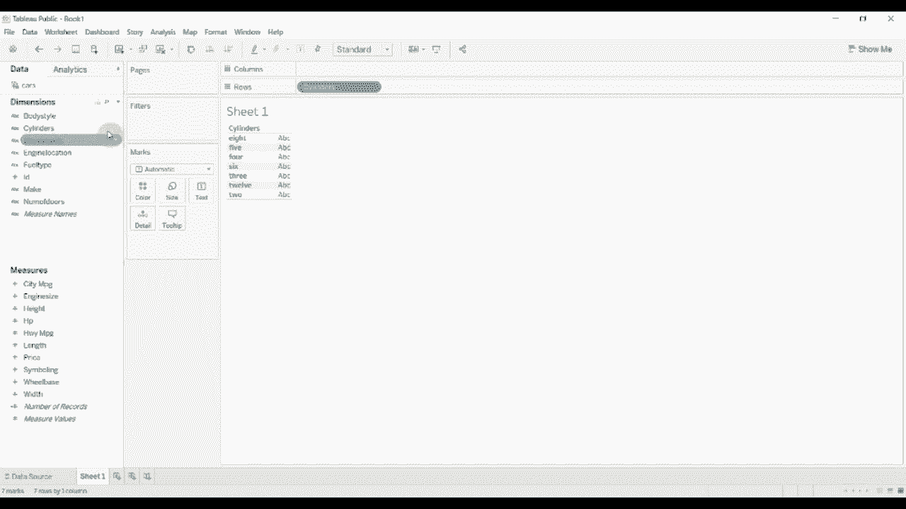
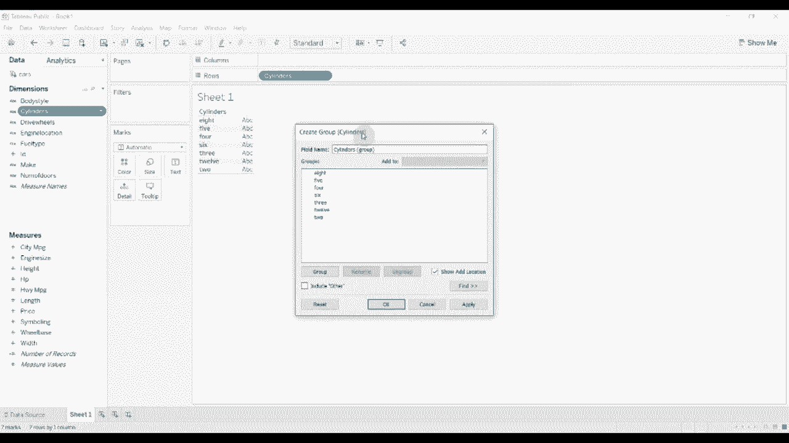
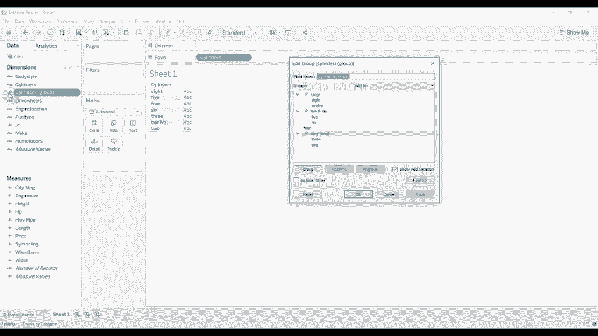
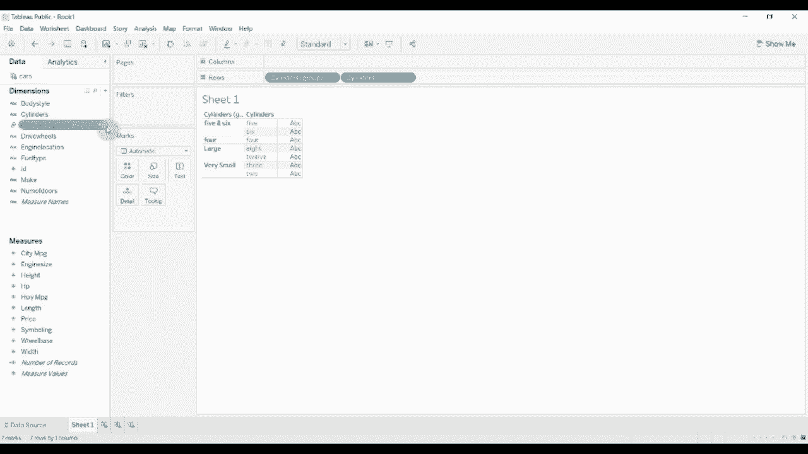
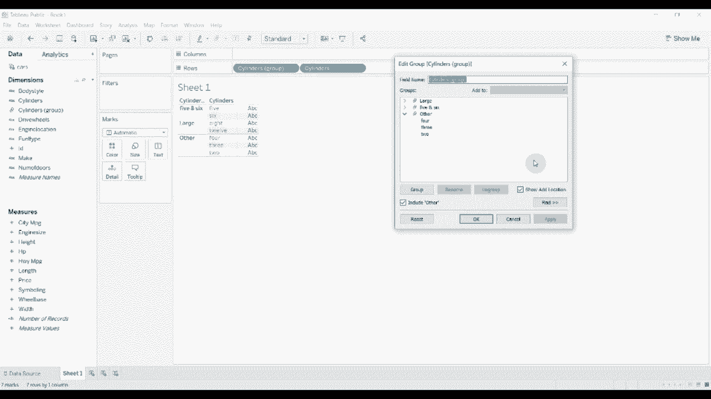
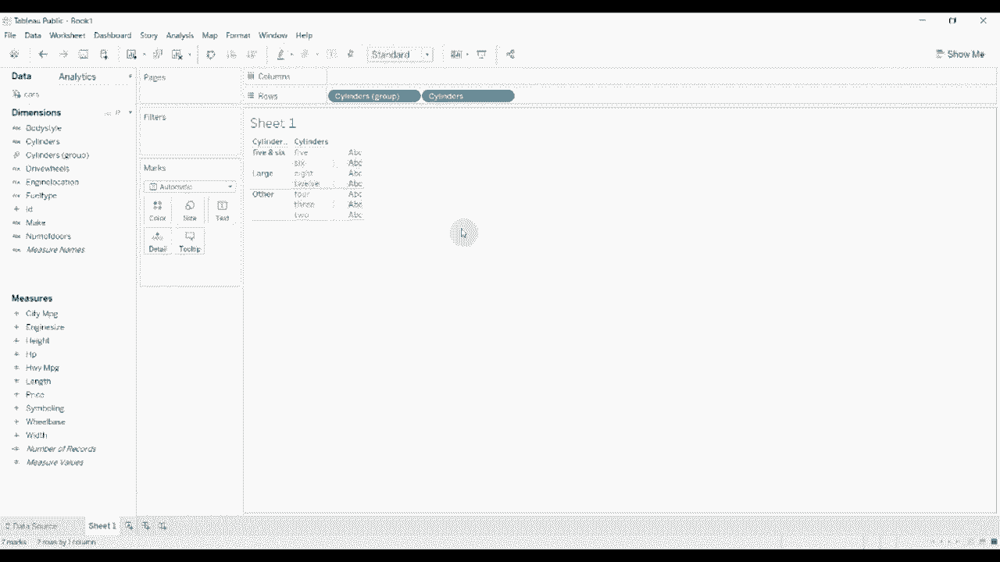

# Tebleau操作详解，照着实例学做图！数据科学家的必备可视化工具，简单快速做出精美图表！＜实战教程系列＞ - P13：13）创建和组 

大家好，欢迎来到《两分钟内掌握Tableau》的另一集。今天，我们将向你展示如何使用组将维度组合在一起，或者将维度内的层级组合在一起，以创建一种更高层次的类别。因此，我已经连接到了一个原因数据集。这只是一些关于不同类型汽车的信息。

我们要做的是将这个气缸😊维度分组。我将把其中一些组合在一起，使它们更有用。

要创建一个组，你只需点击这个小下拉箭头，选择创建，然后选择组。

一旦你有了这些，我们就可以开始将它们分类。因此，也许我们想把所有大型引擎放在一起。我们将12缸和8缸放在一起。我们称之为具有大量气缸的大型引擎。然后我们会把5和6抓在一起。然后我们会把3和2抓在一起，称它们为非常小的引擎。

你会看到我将四个单独列为自己的类别。因此我们继续应用它。你可以看到它弹出为默认名称，仅为维度的名称，后面加上组。然后它旁边有一个小纸张图标，告诉我们这是为其他维度计算的组。所以请继续点击应用，然后我们将其拖动。

现在你可以看到我们已经基于某些内容创建了组。

这些是基于我们将它们放入的组。现在，还有其他一些事情我们可以做。值得注意的是，这些组并不一定是动态的。因此，如果我们有另一组气缸，举例来说，我们这里没有10缸引擎，只包含12缸和8缸。

所以如果我们有一个10缸引擎，它将作为数据集中的新行弹出，我们必须去手动将其分配到一个组中。

最好在创建组之前确保所有潜在值都已表示，但即使没有也非常有用。现在，我们可以做的另一件事是包括另一个类别。我们开始时没有“其他”类别，只有四个单独存在。但如果我们包括“其他”，然后取消分组。

你可以看到，但是当我们取消分组时，它们并没有落入一个仅有单独项目的桶中。它们被归类在这个其他类别中。因此，我们可以有大型引擎、5缸和6缸引擎，然后是其他。就是这样。这就是它的工作原理。所以现在你可以看到，四个不再单独存在，2和3也不再单独存在。

它们在一个单独的组中。如果我们选择排除其他类别，您会发现我们只得到4、3和2这三个单独的类别。是否这样做取决于您使用该分组字段的上下文。这在某些时候很有帮助，特别是当您不想要单独项时。

然后在从数据库中提取时，它们会弹出。您只需将它们包含在其他类别中。这很有意义。只需保留该类别即可。好了，关于使用组的内容就到这里。它们的行为与其他维度一样。所以您可以自由拖动它们。

实际上可以用它们代替一个维度。所以感谢您观看本集的《Tableau两分钟》。如果您有任何问题，请在评论中留言。视频描述中有工作簿的链接和数据集。如果您喜欢我们分享的内容并想要更多Tableau技巧，请给我们点赞并订阅我们的频道。😊

