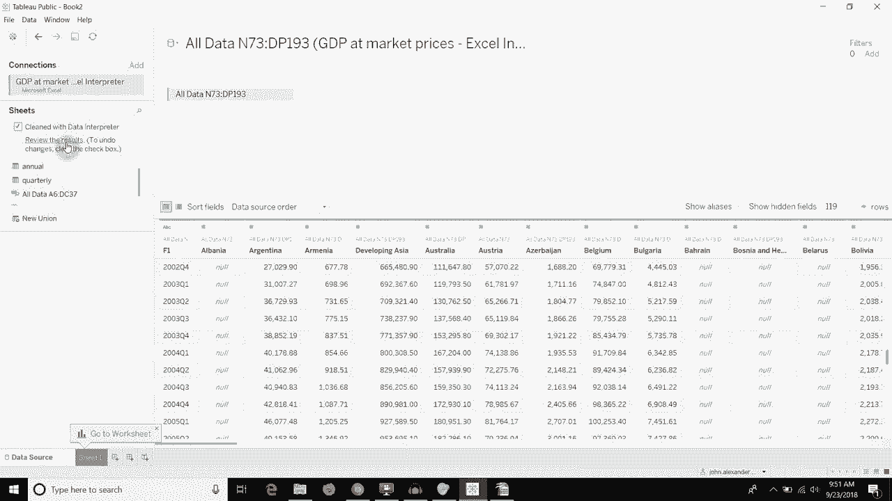

# Tebleau操作详解，照着实例学做图！数据科学家的必备可视化工具，简单快速做出精美图表！＜实战教程系列＞ - P17：17）数据解释器清理数据 

嗨，大家好，欢迎收看《双分钟Tableau》的新一集。今天，我们将讨论如何使用Excel数据解释器来清理一些你在工作簿或Cvs中可能有的数据，这些数据没有良好的表格格式。我指的是什么呢？好吧，这里有一个工作簿，我设置了这个问题给我们。

你会看到在这个选项卡上，所有内容都相对对齐，显然。除了这个额外的行。😊 在第二个选项卡上，它的对齐也很好，尽管我们缺少一个标题，并且有一行多余，但在这个所有数据选项卡上。你会看到顶部有一个间隙。然后是第一个表格。如果我们向右滚动。

你会看到在下面错位的其实是底部的第二个表格。所以如果我们把它作为一个直接的数据表读取，没错，你会有这一列。然后底部会是空白。然后一旦我们跨到这个N列。向下滚动，你会看到里面会有数据。

所以，这在传统的Tableau格式中不能直接连接。让我给你演示一下我们该如何修复它。这是一个Microsoft Excel文档。我将打开它。现在你会看到，如果我们导入前两个选项卡。😡。这是第二个选项卡，看起来不错。而第一个选项卡也看起来不错。

但是如果我们把所有数据选项卡拉进来。你会发现表面上看起来还不错。但如果我们向下滚动，你会看到有一堆空值。如果我们用空值横向滚动，你会看到我们的第二个表格出现在下面。现在，Tableau已经去掉了两个表格之间所有的空行。

对吧？你记得吗？在顶部有一些行。Tableau把它们去掉了，还有一些行在表格之间。所以如果我们往下看看，你可以看到在表格之间。Tableau已经决定这些不相关，这很好。但实际上。

我们希望它成为两个独立的表格。所以我们可以点击这个数据解释器选项卡。这样做会查看你的工作簿，试图找出表格的位置。所以你可以看到，现在我们的Excel工作簿不再只有三个选项卡。我们实际上多出了两个，这些都是在所有数据选项卡上的范围。

所有数据选项卡有点乱。所以让我们先把它拿掉，然后看看这个第一个所有数据选项卡。你可以看到现在只包含我们在选项卡顶部的年度数据。我们把它放回去，添加另一个。这一个。

包含我们在选项卡右下方的季度数据。这部分。抱歉，Excel，实际上是 Tableau 也允许你查看结果。因此，如果我们点击这个“查看结果”按钮，它将打开一个新的 Excel 工作簿。在我的情况下，它将使用 OpenOffice，因为我将其设置为默认。

它将提供数据解释器的结果。因此，你可以看到红色的是列标题，绿色的是数值。还有一些其他内容在这里。实际上，前两个选项卡并不重要。有趣的是这个“所有数据”选项卡。所以我们在这里可以看到。😊

它已经将这个第一行识别为列。其他内容都是绿色的。但实际上有趣的是，当你查看这个“所有数据子表”选项卡时，你可以看到这个第一张表周围有一个边框。如果我们向下滚动，第二张表周围也有一个边框。

它已将这些内容分解到我们的工作簿中的两个新选项卡上。第一个选项卡包含我们在顶部的所有内容。大致上，从 E6 开始在左上角。然后这是我们在右下表中的所有内容。它已将这些分开，以便我们可以分别处理。

另一个我喜欢的功能是，它将所有的 N 转换为 null 值。因此，某个特定字段将不会有 N A 文本值，而是 null 值。这样，我们可以使用其中一个，就像常规数据源一样。构建可视化。如果你有任何问题，请在评论中留言。

如果你喜欢听到的内容，请继续订阅我们的频道。否则，我们下次再见。
