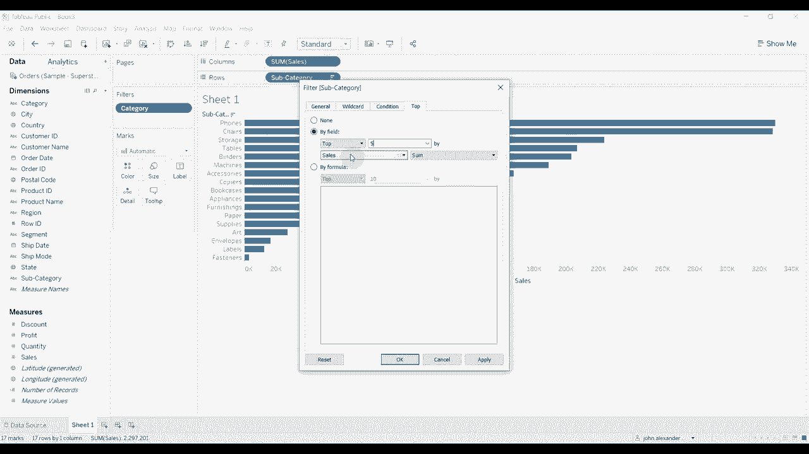

# Tebleau操作详解，照着实例学做图！数据科学家的必备可视化工具，简单快速做出精美图表！＜实战教程系列＞ - P2：2）上下文过滤器并提高仪表板性能 

大家好，欢迎来到另一集《Tableau 两分钟》。今天，我们将讨论上下文过滤器以及如何使用它们来改善仪表板的性能，以及它们如何影响特定表格上显示的内容。为此，我们将使用订单表连接到超市数据集。😊。

然后我们要去第一张表。我们将非常简单地演示这一点，只使用。我对类别感到抱歉。我们将把类别放在过滤器上。我们将选择所有这些。然后我们将子类别放在行上。 

然后我们将销售额放在过滤器上。这样我们有了一个不错的列表。我也喜欢对其进行排序。只需按销售总额降序排列，这样我们就能得到一个整洁的图表。现在，假设我们只想在可视化中显示前五个子类别。我们可以通过简单地应用一个过滤器来设置为按销售额前五名来轻松做到这一点。 

😊。

我们点击销售总额 O。现在你可以看到我们的前五个类别，但这有点挑战性。所以如果我们显示类别过滤器，你会看到所有子类别中有三个顶级类别。如果我们将它们进进出出，你会注意到我们的前五个不再是前五个。有时是前三个。 

我们甚至可以将其减少到前一个，因为它过滤掉了每个类别。但实际上并没有用其他类别的项目替换子类别的项目。这样做的原因是，因为 Tableau 处理前五个过滤器的方式是，它从数据库中获取所有数据，计算出前五个，在这种情况下是前五个子类别。 

然后在计算出前五个之后再应用过滤器。所以每次我们移除一个类别时，我们只是从前五个中移除那些项目。我们得到的前五个项目就是不包含该类别的结果，在这种情况下，只剩下前三个。上下文过滤器的作用是改变顺序。 

其他所有操作现在只会在我们将其转换为上下文过滤器后应用。所以你只需点击它，然后点击“添加到上下文”。我们现在所做的一切只会应用于已经通过该类别过滤器的数据。这在总体上意味着，当我们取消选中其中一个类别时。 

例如，如果我们取消选择家具，我们仍然有前五名，排除了家具类别的任何数据。因为家具数据没有通过我们的上下文筛选器，而我们的前五名仅基于剩余的数据进行计算。

为什么这特别重要呢？显然，这有助于前五名。但更重要的是，如果你在仪表板中使用这个，特别是在性能较差的仪表板中，因为每个筛选器现在只需在更少的值上进行计算，因为现在我们没有家具的数据流入，我们只有办公用品和技术。这将加快上下文筛选器后任何后续筛选器的处理速度。

这也将帮助加速任何计算或类似的事情。这会对你的可视化和仪表板的性能产生显著影响。另一件事是，它只会显示在其他筛选器中有意义的值。所以，如果我们现在查看子类别的筛选器，你会看到。

每当我们添加或移除内容时，只有有意义的值会出现在我们的子类别筛选器中。这就是本期《Tableau两分钟》的内容。赶快试试上下文筛选器，告诉我们它们对你来说效果如何。如果你有任何问题，请在评论中留言，像往常一样。

视频描述中有数据集和工作簿的链接，我们下次再见。😊！
