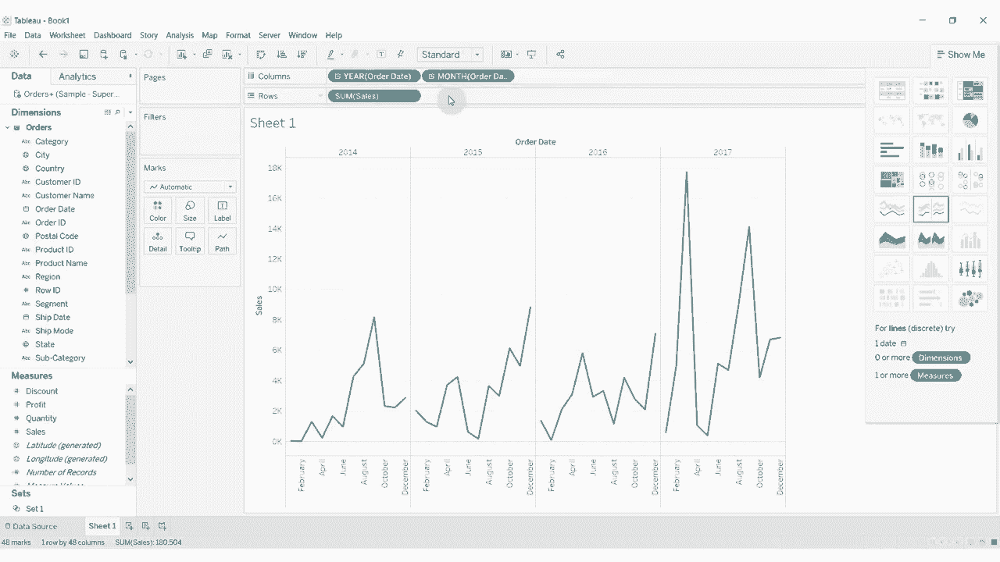
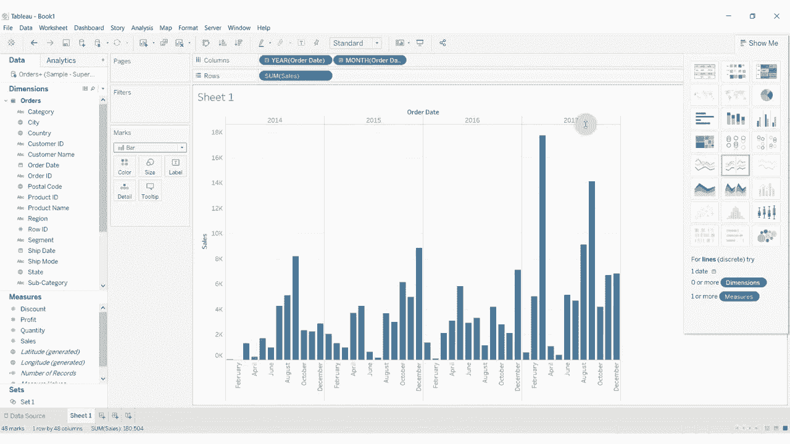
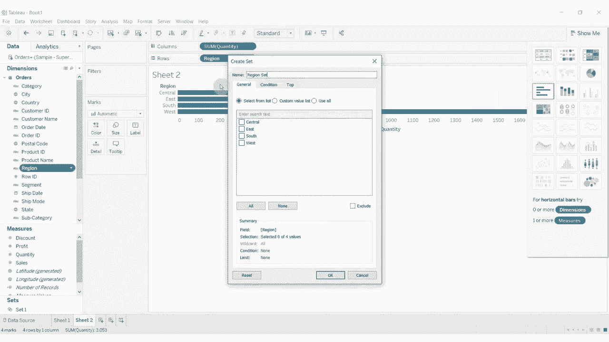

# Tebleau操作详解，照着实例学做图！数据科学家的必备可视化工具，简单快速做出精美图表！＜实战教程系列＞ - P20：20）集操作创建动态集 - ShowMeAI - BV1iq4y1P77U

嗨，大家好，欢迎来到另一期《Tableau 两分钟》。今天，我们将介绍 Tableau 2018.3 的一个新功能。那就是动态添加和移除集合中的项目，以及如何在可视化中使用它。因此，😊，之前你必须通过创建一个新的集合来定义集合。

右键点击字段，然后创建一个新集合。如果我们想根据产品子类别创建一个新集合。这都是你在 Tableau 中应该拥有的超级商店示例数据集的一部分。如果我们想创建一个集合，右键点击子类别，向下滑到集合。

然后我们将能够根据需要添加和移除集合中的项目，比如我们只想要集合中的这些顶部几个项目。然后我们就创建了集合。然而，在2018.3中，你可以动态添加和移除项目。那么你将如何在可视化中使用这个功能呢？我们要做的第一件事是创建两个不同的可视化。一个是使用订单日期的时间序列。在列架上。

然后我们将在这里拖出销售数据。我们将展开这个，以便获得一个不错的每月视图，然后我将其转换为柱状图，你会马上明白原因。因此，我已经将其转换为一个漂亮的柱状图，这只是2014年到2017年每月的销售情况。

接下来我要做的是添加一个稍微不同的视图。所以我们将把区域拖到行架上，这里有四个区域。然后我们将添加数量。这是总销售单位。我们将把数量的总和添加到这些区域中。然后在上面使用区域。

我们将继续创建一个集合。

我们将把它称为区域集合。我将让它保持为空。

目前，这个功能的真正强大之处在于我们创建仪表板并拖出这两个工作表时。因此，我将带出我们的时间序列。

我只是把它放在那里。

一路向下到底。我将把我们的区域拖到这里，我们将使用这个区域来改变底部图表中的内容，并向我们展示每个区域对该特定月份总销售的贡献比例。

所以我们要回到我们的时间序列图表。我们将把这个区域集合拖到颜色上。你会看到目前集合中没有任何内容。因此，一切看起来都是灰色的。

没问题。我们要添加项目到集合中，将会在这里到仪表板。我们将创建一个新动作，并添加更改集合值。我们希望这由表2驱动。我们希望在表1上操作。然后我们将使用区域集合。这告诉我们哪个数据源，这个顶部框。

我们将选择我们的订单，然后我们想要区域集合。我们想要做的是当我们清除选择时，想要从集合中移除所有值。这将意味着当我们点击一个区域时，它将在下面的图表中高亮。当我们取消点击，它将会。

从下面的图表中移除它。所以我们将返回到我们默认的灰色。完成后。当我们点击一个项目，然后点击集合1时，你可以看到它是如何改变下面的图表的。现在，有几件事我不太喜欢。

第一个是默认行为，正如你所看到的。我们必须在工具提示中点击某个东西才能做到这一点。我对此不太喜欢。所以我们会在稍后更改。第二件我不太喜欢的是，每当我们高亮这些多个东西时，它们又出现在顶部，而不是底部。

我想看到的是，我希望我的集合在底部，我的集合在顶部。所以我只是暂时保留这些高亮。然后我们将在这里进行更改，而我们要做的就是对蓝色进行排序，相对于灰色。

另一种方式，我应该点击哪里，它开始上升，然后点击下降，点击上升。现在你会看到集合中的内容。蓝色条在底部显示，而集合外的内容在顶部显示。我认为这更直观。既然我们在这里，让我们继续添加。

一个标签。到销售额，这会告诉我们总销售额是多少。

然后我们将回到这里，改变集合动作的工作方式。所以我们刚刚点击了出去，没有任何高亮。我们将返回到我们的动作仪表板。我将点击这里的集合动作进行编辑。然后不再是在菜单上运行动作。

我们必须对选定内容执行操作。我将回到这里，在清除选择时从集合中移除所有值。因此，现在我们有一个空集合。当我们向集合中添加值时，你会看到数字变化。所以如果我们想要所有数字，这里就是所有数字。如果你只想选择南部和西部，你可以仅选择南部和西部，南部和东部。

你可以选择南部和东部，你会看到数字也会动态变化。因此，每次我们点击这些集合之一时，我们都会获得集合中的数字和剩余的数字，集合外的数字。这是关于如何在可视化中使用动态集合的小介绍。如果你有任何问题，请在评论中留下。

如果你喜欢听到的内容，请继续点击订阅，以获取更多 Tableau 的技巧和窍门。像往常一样，视频描述中有数据集和工作簿的链接。😊我们下次再见！
