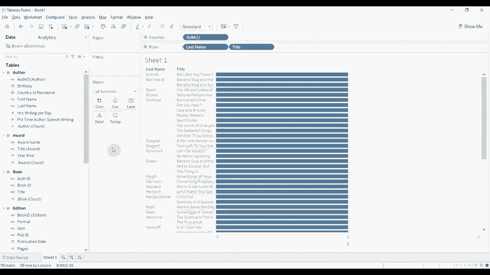

# Tebleau操作详解，照着实例学做图！数据科学家的必备可视化工具，简单快速做出精美图表！＜实战教程系列＞ - P21：21）关系、联接和合并 

嗨，大家好，欢迎来到《Tableau两分钟》节目。我知道自上次发布以来已经很久了，但我找到了更好的时间。希望在接下来的几周和几个月里，我们能做几个视频。不过我想首先介绍的是Tableau 2020中引入的新功能。

这就是对数据模型的改变，现在你可以创建关系，而不只是像写SQL脚本那样连接和联合你的数据。关系让事情变得超级灵活。所以我有点兴奋，😊想要深入了解它们。

那么我们为什么不谈谈你为什么想使用它们，以及它们为什么比旧方法稍微简单一点呢。这些连接不需要任何SQL知识就能很好地工作。你知道的，你可以在不知道是左连接还是右连接的情况下建立关系。因此，你将花更多时间去探索，而不是花费所有时间来准备数据。

可视化、共享等等。我们的工具还将帮助规避一些粒度问题，Tableau对你放置哪个表以及关系定义的顺序不那么敏感。因此，如果你没有把最细粒度的表作为所有其他表的连接对象，有时会导致行重复或其他错误；或者如果你有两个不同聚合级别的表在一起连接时，可能会造成奇怪的数据重复，你必须非常小心，花很多时间清理数据，才能避免这些问题。

我不知道你怎么样，但我花了很多时间清理我的数据并对齐，以确保在导入到Tableau时所有的聚合都是正确的。Tableau还引入了一个叫做智能聚合的概念，这意味着如果你使用来自多个源的数据，就减少了意外重复数据或错误答案的风险。

所以Tableau在后台所做的是，不再将所有内容预先打包成表，而是根据你在视图中带入的部分，针对每个可视化在不同级别上聚合数据。我们稍后会看一下这个。但首先，我们要看看关系。

因为你不需要在早期做出严格的选择来加入你的数据，这允许了这种灵活性。因此，在构建数据时我们将看到它的样子。我首先要做的是连接到这个书店数据集。这是 Tableau 的一个示例，说明你为什么可能想要使用关系而不是传统的连接等。

这是一个很好的数据集，因为我们可以整合很多东西。首先我们将拉入这个书籍表。😊这就像数据的基础表。通过这个基础表，我们将从这个表中构建关系，因此概念是我们有一些关于书籍的数据。

书籍可以有一本书显然是一种书，但一本书可以有多个版本，因此它可能有硬壳版和软壳版。此外，我们还有关于作者的信息，出版商是谁，是否有任何评分或奖项，我们也有一些关于这些书籍的销售数据。因此，我们添加了第一个表格，这里是书籍表。

我将要添加的另一个表是奖项表。😡当我们添加奖项表时，你会看到我们得到这个编辑关系对话框。我们可以选择书籍表中的字段和奖项表中应该匹配的字段。

定义这两个之间的关系。如果我们想的话，我们还可以添加更多字段，如果我们需要基于多个标准进行连接，我们也可以添加这些字段。我们也有这些性能选项。现在，性能选项类似于你在进行连接时可能会想到的。

但它们稍微不同。因此，首先，我们可以调整连接的基数。我认为关于这两个选项需要记住的是，如果你不确定是否应该更改，可能应该保持默认设置。默认设置在大多数情况下表现良好。如果你在合适的数据集上更改其中一些选项，你可能会获得一些小的性能提升。

但风险在于如果你在错误的数据集上这样做，它会给你错误的信息。因此，默认是多对多的。如果你的数据源中每个值只有一行，你可以将其设置为一。当你这样做时，Tableau 会预先汇总数据。

它在将数据拉入可视化之前将数据整合在一起。这有一些性能增强，对吧？这使得事情表现得稍微好一点，尤其是当你有一个大数据集时。但是如果你认为你有一行，但实际上有多于一行，这会在这个数据集中重复项目，从而导致问题。

对，你可能会得到一些计算和其他内容的错误答案。所以总结来说，如果你不绝对确定每个值在这个键中只有唯一行，应该保持为多对多。现在，关于引用完整性，默认值可能是最好的，但你有两个选项。

你可以选择一些记录匹配或所有记录匹配。😊 如果你选择一些记录匹配，Tableau 将会查看哪些匹配，对吧？在构建查询时，它会查看哪些关系匹配，哪些不匹配。如果选择所有记录匹配，你可以告诉 Tableau 我们已经知道所有记录都匹配，这在后台会有所帮助，对吧？这将使连接更简单，并可能加快你的可视化响应。

😡 对于小数据集，这不会有太大差别，但对于大数据集，这可能非常有帮助，但再次强调，如果你不确定，最好保持默认设置，因为如果你不保持默认或将其设为所有记录匹配。

但是所有记录并不匹配。你将会丢失数据。所以我们要做的是，我们已经走过这个对话框。我们继续添加作者表。你会看到奖项是基于标题连接的。

现在我们有一个与作者 I 相关的内容，所有选项都是相同的，对吧？所以我们将保持默认的多对多连接记录匹配和记录匹配。😊 现在，为什么我们不试试一个更具挑战性的呢？

我将添加信息表。到目前为止，当我们添加作者和奖项表时，连接的字段在两个表中有相同的名称。但是当我们添加作者表时，两个表中没有相同名称的字段。因此，它不确定该连接什么。我们会看到这个红色感叹号和三角形，它说我们必须选择匹配的字段以创建这个关系。

现在，Tableau 新版本的一个伟大之处在于我们可以创建所谓的关系计算。这意味着我们可以在编辑关系对话框中合并这两个字段，而不必在数据源中或找其他方法。如果你没有两个匹配的字段，Tableau 的灵活性就不大。

即使你在这两个字段中可能有相同的信息。现在，我从查看数据中知道，我会在视频描述中发布数据链接。😊 我知道这个书 I 字段是书 I 1 和书 I 2 的组合。所以我们将连接书 I 1 和书 I 2。为此。

我们将创建我们的关系计算。这只是一个常规的计算对话框。看，我们可以在这里侧边弹出所有的函数，我们将说book I 1加上Book ID 2。应用它。我们已经创建了连接。当你查看它时，你可以看到右边的数据，book I 1是两个字母，然后book I2是三个数字。

如果我们点击图书，并查看图书表。你可以看到，那又是那两个字母加上三个数字。所以现在这已成功连接了。现在更灵活了。说实话，T SQL比SQel 2容易得多。好吧。我们将在这里添加几个表，我将向你展示其他内容。

我们要做的第一件事就是添加版本表。注意你拖动的位置，对吧？不同的，它试图连接到不同的表。我们想连接到图书表。所以我们希望确保这个小橙色波浪线在我们放下时指向图书表，而不是其他表。😊再一次。

我们希望在book ID上连接。所以没问题。现在，我们有了版本表。我们将销售表连接到它。我们将把销售表拖到这里。😊销售表连接到版本表。哦，等一下。我把它连接到了错误的表。这可不太好。好了，搞定了。好的。

现在我们通过ISBN号码连接到版本表。如果你了解书籍，ISBN号码是用来识别特定版本的。因此，现在我们已经拖出Q1表，我们有一些销售信息，这些信息将很好地汇总在一起。但我们为每个季度有不同的销售表，所以我们有一个Q1，一个Q2，一个Q3。

还有一个用于Q4。😊 所以我将要做的是我们需要将这些合并在一起，对吗？所以联合是一个SQL概念。它在tableau中仍然存在。我们并没有完全抛弃它。联合的作用是将两个结构相同的表合并在一起。基本上就是将它们堆叠在一起，这样我们得到的不是一个表，而是。抱歉。

现在你有一张包含两个表所有信息的表，而不是两张表。现在，所有列都需要相同，并且它们都需要是相同的数据类型。所以有一些限制。但从根本上说，这就是我们要做的。这就是我们想用这些表做的，对吗，因为我们有Q1的销售数据。

我们有Q2、Q3和Q4的销售数据，我们想把它们放在一起，以便我们拥有完整的一年。因此我们将使用这个Q2数据。并创建两个表之间的联合。即一个表叠加在另一个表上。我们将拖动它，直到它正好位于Q1数据下方。我们看到这个小橙色的联合拨号框弹出。我们将在那里放下它。

然后你会看到我们的销售 Q1 数据现在有所变化。Excel Q2 数据消失了，但我们有这个图标。在左侧。如果我们悬停在上面，它会告诉我们这些数据内部发生了什么。因此，销售 Q1 是由两个表组成的。我们可以从这里的小片段看到。如果我们想要进一步挖掘。

正如所说，我们可以双击销售数据。这会深入挖掘，并向我们展示幕后发生的事情。因此，为了编辑联合，我们必须回到这里，点击，编辑联合。你可以看到这些是我们的两个表。如果我们想要添加更多表，没错。

我们可以添加 Q3 和 Q4 销售数据。点击，O。我们可以这样做。让我们从这里移除它们。好的，我们要跳出那里。我将关闭它。但如果我们也可以在这里添加它们，对吧？所以我们可以拖动它们，我可以把它放在这里。然后，我会回到这里，对吧？所以现在我添加了 Q1、Q2、Q3 和 Q4。

当我双击时，我进入内部，去这里编辑联合。你可以看到我所有四个表叠在一起。现在我将暂时移除这些表，因为其中一个在其他地方做了一些奇怪的事情。我之前只是测试过。

所以我们会回到那里。但这就是你如何将四个表连接在一起。这种对话框也是你如何将两个字段连接在一起。现在，我们定义了作者关系。通过使用这一行，右边，只需拖动并放入。但假设我们想要。

将其直接连接到书籍表。所以我所做的就是像我们之前对销售表所做的那样，双击书籍表。这就是传统 SQL 连接隐藏的地方。所以现在如果我拖出我的作者表，你会看到这个小符号，这个小符号告诉我，现在我们定义的是连接，而不是关系。如果你之前使用过 Tableau 的所有版本，没错。

你会对这个界面非常熟悉。😊 我们点击小的维恩图，这使我们能够定义想要进行的连接类型。它允许我们定义字段，如果有多个字段，我们可以在这里添加，等等等等。如果你对 SQL 不熟悉，你可能不太了解这些词的确切含义。

但这很简单，维恩图确实帮助你理清思路。这里有四种连接类型，你有一个内连接，在内连接中，我们将从书籍表中获取所有记录，以及与之匹配的作者表中的所有记录。

因此，书籍表中的一条记录必须在作者表中有匹配，才能包含在连接的输出中，没错，才能连接在一起，反之亦然。因此，作者表中的一条记录必须在书籍表中有匹配。

为了被包括在这个连接中。如果我们使用左连接。这将包括来自左表的任何内容，在这种情况下，左表字面上就是左侧的表。它将包括此表中的所有记录，以及任何与之匹配的作者表中的记录。

所以，作者表中与书籍表有匹配的任何内容都将被包含在内。作者表中没有匹配的内容将被排除。如果我们选择右连接，那也是同样的道理，但我们是朝另一个方向进行的。所以来自右边的所有内容，我们都会得到所有内容。抱歉，来自右表。

来自这个作者表，但仅包括那些匹配的书籍。它们在作者表中有匹配。然后我们的最终选项。全外连接，有时称为全连接，有时称为外连接，基本上它们都是相同的，确切地说，它们都是相同的。这将包括两个表中的所有记录，并尽可能将它们匹配，而在没有匹配的情况下则不会匹配。

它只会填充空值，所以你会从书籍表中得到每一条记录，从作者表中得到每一条记录，无论它们是否匹配。所以，让我们考虑一下这一点，嗯，让我们考虑在这两个表之间进行内连接。

所以我们有一本书，一位作者。它们连接得很好。我们只包括有作者的书籍。因为它必须在两个表中都有记录，对吧，对于我们的内连接。但如果我们有一本书有两个作者，会发生什么？那么这两个作者都会与这本书连接。对吧，所以我们会有一本书。然后，我们会有另一个记录，显示第二位作者的书。

所以我为第一订单有一本书的记录。为第二订单的作者也有一本书的记录。这可能会在书籍数据集中重复行。如果我们进行这个连接，并且在任何地方使用这个连接表，我们将不得不处理重复的问题。现在，有时这会成为障碍，有时则不会，具体取决于你想做的事情。但归根结底，重复是我们不太想要的。我们可以通过将此表从书籍数据源的连接中移除，避免这种情况，并保留它如上面所定义的关系。

既然关系如此灵活，为什么我们可能想要回到连接呢？为什么我们希望在这些表中的数据块内进行某些操作，而不是仅仅定义关系呢？关系很好，但。有时数据中可能有某些东西，或者这个关系的某些独特方面要求我们拥有通过连接获得的非常具体的控制和粒度。

我们可能会遇到某种情况。如果这两个表没有以特定方式连接在一起，其中一个不能正确聚合，或者其中一个计算不正确。所以，当我们与数据一起走过时，我们想意识到这一点，通常，如果你处理大量数据，你可能会事先意识到这些问题。

对，因为这并不是你需要处理它们的唯一地方。所以，值得铭记这一点。值得知道怎么做，但关系非常灵活，在数据模型方面是一个很大的进步。现在，对于那些来自旧版 Tableau 的人来说，😡，旧版 Tableau 只是几个月前才被推出。

不过在旧的数据模型中，我想在 2020.2 年有一些变化，我们想看看。首先，你会看到左侧不再按维度和度量组织，上方有维度面板，下方有度量面板，现在我们有单独的表以及来自每个单独表的字段。

所以我们在这里有来自作者表的所有字段。我们有维度，我们有一行，然后我们有每个表的度量。😊，所以，这在某种程度上改变了计算的行为。因此，如果我们要创建一个仅使用这个作者表的计算，对吧。

所以让我们创建一个计算，表示每位作者每天花费的写作时间百分比。好的，我们将使用每天写作的小时数。我们不会聚合它。我们只需将其除以 24。现在你看到，当你这样做时，这是一个行级计算。计算本身没有聚合，对吧，所以这是一个行级计算。

因为这是行级计算，并且只使用来自作者数据源的字段。它就坐落在这里的作者数据源中，并没有其他地方。不过，如果我们要创建一个结合两个不同字段的计算。例如，我们想获取一本书的销售价格，现在。

销售价格由两部分组成。它由价格组成，来自于加法表，然后我们减去折扣，折扣来自于销售表。所以如果我们要这样做。让我们来创建这个计算。大写字母在里面走错了。好吧，继续。

所以是价格减去折扣。因此，当我们创建那个计算并应用它时，你会看到它不会出现在两个数据源中的任何一个。它一直到底部，底部就是我们将要拥有的所有计算，这些计算涵盖多个表或多个项目，对吧？它们使用这些关系来创建计算。

我们想记住的事情之一是，当这些计算被计算时。当它们被运行时，当 Tableau 计算出答案时，它使用这两个表之间的内连接来使其工作。现在，如果。记住这一点是值得的，因为如果我们以某种方式聚合。

我们不会获得在这两个表之间没有匹配的记录。任何在这两个表之间没有关键的记录。对。因此，如果我们想要弄清楚每本书的销售价格。嗯，那些有附加记录的书，对吧？然后我们对这个销售价格求和。U。

我们只会因为它是联合进行的而获得记录，对吧，记住。因此我们需要在两个销售中都有记录。我们只会获得至少有一项商品已售出的附加记录。如果没有商品售出，它仍然有一个销售价格，因为它仍然在某个货架上待售。虽然没有售出，但它是待售的。但是因为我们在销售表中没有记录。

它没有提取附加表中该记录的价格，这意味着潜在地。我们不会获得所有的总销售价格，对吧，所以。确实值得思考，特别是如果你得到意外结果或数据中任何东西看起来奇怪，值得注意。现在，十次中有九次的比率。

这些事情不会回来咬你，但如果你看到一些奇怪的情况，肯定值得关注。所以还有其他几件事。对不起，还有一件事我们想看看。在旧世界中，当你创建一个常量时。当我在这里输入一时，它会放置那个一。

这个单独作为行级计算，因此它会在数据源的每一行中都放置它。以前这意味着如果你像这样求和，你会得到数据源中记录数量的总和，因为你知道，行级计算，正如我们所知，是对每一行都计算一次。

这个仍然是对每一行进行计算的。但是当我们使用基于关系的数据模型而不是基于连接的数据模型时，我们仅在可视化中提取与该可视化相关的数据。因此，当我在这里创建这个时，我们的数据源中只有一行。

因此，我们数据源中所有行的总和是1，因为我们引入的唯一数据点是这个常量。😊那么，如果我们引入，比如说我们引入作者。我要引入作者的姓氏。好了。现在你看到，我在数据源中的每一行仍然有一个，对吧。

这些作者现在在我的数据源中是单独的一行。这就是用于生成这个可视化的数据源。因此，每个作者的值都是一，或者这个常量在每个作者中显示。如果我们求和，我们将得到这个数据集中有多少个作者。现在。

记住这一点，每个作者的值都是一。使用这个常量，直到。我们提出标题。是的，标题。现在，Dantic cat。我。因为他们发布了多个标题，或者因为这个人发布了多个标题。对吧，你有1、2、3、4、5、6、7、8个他们发布的标题。

这个常量有八个值。在数据集中。所以不是只有一个。所以我们开始时只有数据源中的一行。总数就是一，只有一个。而后我们添加了作者，每个作者都有一个。而现在我们添加了标题，每个标题和每个作者都有一个，对吧。

所以我们有两个。对于这个作者，我们有8，正如我所说的，对于这个作者等等。所以关键是。常量不一定会按照你在旧世界中使用它们时的预期方式表现。再次问一下，为什么你可能在乎。真正的原因是，当你查看变通方法和技巧等时，很多都使用这些常量来表示某些东西。所以我们想要。

当我们使用这些变通方法时，请小心我们实际上得到的是我们期望的结果，知道吗。😊，如果我们知道如何排查这些数据源会很有帮助，我们会在未来的视频中更详细地深入这些计算，所以期待看到一些关于我们如何从关系和连接的角度排查数据源的信息，还有一些关于计算的视频将在不久的将来发布，但现在我非常感谢你观看，如果你喜欢这个内容，请点击订阅按钮，你将会获得更多关于 Tableau 和数据分析的内容。正如我所说，视频描述中有一个链接到这个数据集，所以如果你想下载 Tableau Public 并跟随，那太好了，那正是我使用的，完全免费，非常酷，我期待看到你在评论中的反馈，并期待下次和你交流。

😊。

