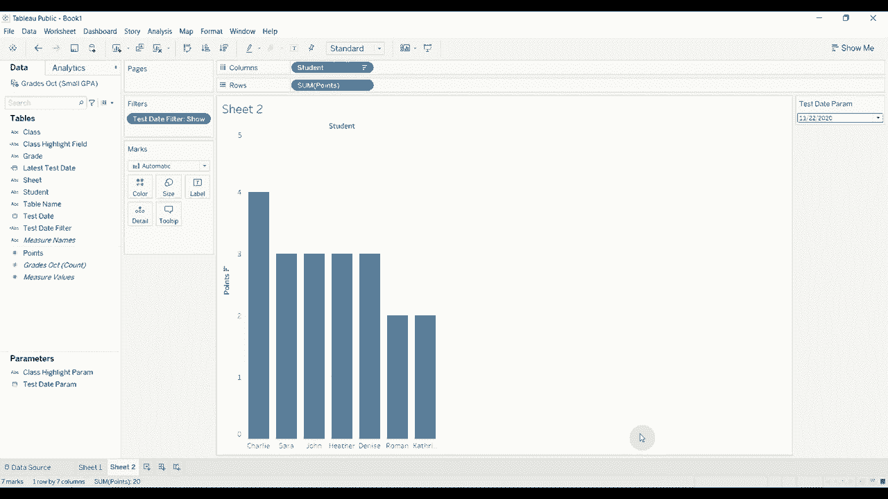

# Tebleau操作详解，照着实例学做图！数据科学家的必备可视化工具，简单快速做出精美图表！＜实战教程系列＞ - P22：22）以及为何动态参数 

大家好，欢迎来到另一集《两分钟内学会Tableau》。我非常兴奋能和你们讨论这一集，因为我认为我们今天要谈的内容可以大大提高互动性，让你的可视化变得更有趣。这一周，我们将讨论动态参数。😊。

参数在Tableau中已经存在很长时间了。2020.1的新特性是，现在这些参数可以在数据更新时自动更新。所以如果你有一个值列表，而不是静态的值列表，现在你可以根据数据中的内容填充该值列表。因此，如果你在一个新市场开设商店，或者有新的区域经理加入。

😡，该值将自动填充在列表中。只要它在数据中，我们就可以用它进行高亮、过滤等各种操作。你还可以做的是，如果你有一个工作簿总是想显示最近两个月的销售数据，或者最近八周的销售数据。

你可以使用这些动态参数来实现这一点。之前你可以通过一些变通方法做到这一点，但现在这样做要容易得多，而且更具动态性。如果我想查看最近打开工作簿时的最后八周销售数据，但后来可能想查看不同的内容。

比如说查看最近八周到两周前的销售数据。😊我可以通过参数进行更改。但如果之前将其硬编码到工作簿中，我就无法更改，所以这真是令人兴奋。😡。这两者都很简单，因为它们建立在已经存在的功能之上。那么我们来看看如何构建一个。对于第一个。

你可能不想做这个，因为每次参数更改时更新会很烦人。因此，我总是使用过滤器和值来确保我的列表是正确的。😡。所以让我们开始吧。我将连接到我在Excel中制作的一个简单数据集，叫做我的小GPA数据集。这包含一些数据。

不同测试和不同课程的学生成绩都是虚构的。如果你不来自美国，想理解这个评分系统的含义，基本上，A得四分，B得三分，C得两分，依此类推。这就是如何使用这些分数计算某人的GPA。因此，我们有两个不同的表格，我们将使用一个来稍后更新数据。我拖出了这个十月成绩单，你可以看到我们有一个测试日期。

一个学生，一个班级，一个成绩和得分。我们将快速构建一个条形图，显示学生的分数。所以这是总分数，我们可以对其进行排序，使其整齐，然后我将使用一个参数来高亮某个学生在某个班级中获得的分数。

所以我们要做的是。我们将创建一个参数。它将是一个列表，并且它将是字符串，我们将使用它。我们将使用班级。现在，你会注意到我在右侧有两个选项。我以前只有一个。它曾经是固定的，但现在我可以选择在工作簿打开时。

我希望我的班级值能更新。这就是我希望它加载这个列表中的内容。而我们将称这个类为**高亮段落**。我们会点击确定，好的，太棒了。然后我们将用它来创建一个高亮，因此我会先创建一个计算字段。然后我们会说。

如果班级等于**类高亮参数**，那么**高亮**。否则，不。好的。然后我们将把这个类高亮字段拖到我的颜色架上。我会把它添加到表格中。你可以看到，在橙色中，我们高亮了每个班级中所有人的得分。

我们有英语、数学和西班牙语。现在，让我们回到数据源。我们将拖出这个十一月的成绩，对吧。我们将进行联合操作。我还有另一个关于联合的视频。如果你有兴趣，可以看看。现在我们暂时就这样做。然后我们会返回到我们的表格。

你会看到，即使我们没有实际关闭并重新打开工作簿，我们在这里的列表中也有地理作为一个选项。所以这个列表根据我们添加的新数据进行了更新。所以优秀的功能意味着你不必每次更新工作簿中的数据或重新映射字段到你的参数时都回去不断更新参数，这样就给了你更多的灵活性。

好的，所以😡，我们做到了。让我们看看另一个，对吧。假设当我登录时，我正在为我的老师制作一个仪表板。我希望我的老师能看到每个测试每个人得到的所有分数。所以它将在这里打开一个新表格，我想它一次显示一个测试，并且总是显示最新的测试。

但我也想给他们选择不同日期和不同测试的选项，如果他们想这样做的话。😡，在不同的，知道的，某种不同的时间。所以让我们在这里打开一个空白工作表。我做的第一件事就是构建我的基本条形图，所以我们将学生拖到列上。我们将分数拖到行上，然后我们会对其进行排序，因为所有排序的数据总比未排序的数据好得多。

😡，我还将通过返回并删除我们这里的11月数据来为此做好准备，所以我们将删除11月。好了。然后返回到我们的工作表。好的，所以。😡，现在让我们尝试构建我们的参数。哦，抱歉，我们想要一个新参数。我希望这个是测试日期参数。今天我打字真糟糕，好的，到了。

我们还要把这个变成一个列表，这将是一个日期。😊。我们想在工作簿打开时添加值，对吧。因为我们总是想拥有最新的日期，并希望从测试日期中添加它们。现在。你看，这里是我的三个测试日期。我们想要更改的内容，以便始终突出显示最后一个日期的是这个字段，它在工作簿打开时显示值。

现在，目前它被硬编码为当前值。所以我们此刻无法更改它。它将始终是当前的相同值，即101。为了更改它，我们需要创建一个计算字段，这个计算字段需要满足一些标准。首先，它只能有一个值。无论可视化是什么，无论我们如何处理数据，它只能有一个值。😊。

而且它必须基于我们用来获取它的这个字段。所以在这种情况下，我们必须从测试日期中派生一个只有一个值的字段。我们将用一种称为细节级别计算的方法来做到这一点。这种细节级别计算非常简单。所以如果你不确定如何做。

这并没有太大关系。再说，网上有很多资源会建议你学习如何做，因为它们相当有帮助，所以我们将这个称为最后测试日期。我们将使用固定细节级别计算。我们要说最大测试日期，哎呀。好了，这样做的效果是，对于我们的整个数据集，因为这是固定的，我们没有在这里放任何分组字段或分割数据的方式。

我们要寻找最大测试日期。😊，所以我们就继续应用这个吧。所以我们创建了这个计算字段，就在这里弹出来了。现在。让我们把这个移到我们的字段中。在我们这里，我还要创建我们的过滤器。这将是我们的测试日期过滤器。我们要说，如果测试日期。

等式测试状态参数。然后显示。否则。隐藏。好吧。然后我们将应用这个。我们将其拖到过滤器架上。我们会说我只想看到我们标记为显示的部分。没错，所以根据这个逻辑，如果测试 A 等于参数，我们将显示它。然后在我们完成之前，让我们先测试一下，没错？这是正确更改的。

很棒，好的，喜欢这种方式的工作。现在，我们怎么去做呢？要添加新的数据，先去编辑参数。现在，你看到工作簿打开时的值设置为当前值。我们已经设置为每次工作簿打开时都会更新测试日期。我们希望当前值是，哎呀，抱歉。

我们希望工作簿打开时的值是最新的测试日期。这将使其与我们刚创建的字段相同。每次工作簿打开时，没错，所以让我们点击一下。你可以看到它已经更新为20号。但让我们看看当我们添加新数据时会发生什么。

好吧，我们可以移动那个。所以再回到数据源。我将取出11月的成绩。我将它们添加到我的联合中。太棒了，那里有它们。现在，当我们回到第2页时，你会看到这个已经更新。现在我们显示的是。😊，11，222020。这让你能够默认到最近的测试。

但是如果学生想看其他内容，他们也可以返回查看不同的测试。或者，如果老师想知道1116的结果，他们仍然可以回去查看。我们并没有强制他们在这个视图中只查看最新的测试，我们给了他们选择的机会，但我们设置了一个合理的默认值。非常酷，功能强大。

我很想看看你们在使用这些时会想到什么。😊，所以这就是本集的内容。我希望你觉得有帮助。如果你觉得有帮助，请点击订阅按钮。很高兴在这里看到你。我们有很多很棒的 Tableau 内容。我会在视频描述中放一个链接，包含我用这些做的数据，方便你下载 Tableau Public。

我真的鼓励你跟着做。这是一个很好的学习方式。😊，下次见！

